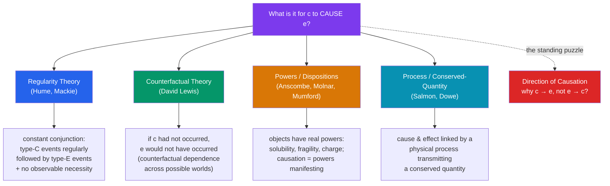

# 🎱 Causation

> [!abstract] TL;DR
> Causation is the relation by which one thing *brings about* another — the glue holding events together. **Hume** argued we never *observe* a necessary connection between cause and effect, only **constant conjunction** (one type of event regularly followed by another) plus our own habit of expectation; the "regularity theory" builds causation out of such patterns. The **counterfactual theory** (**David Lewis**) instead analyzes "*c* caused *e*" as "*if c had not occurred, e would not have occurred*." A third family posits real **causal powers / dispositions** in objects (fragility, solubility) as the truth-makers of causal claims. A standing puzzle for all of them is the **direction of causation**: why causes precede and explain effects, not vice versa.

## Intuition — analogy first

Watch one billiard ball strike another. What exactly do you *see*?

You see the white ball roll up, touch the red ball, and the red ball move off. You see one motion, then contact, then another motion. What you never *see* — no matter how closely you look — is the **making-happen** itself, the invisible force that *compels* the second motion. Hume's shock is that the "necessary connection" we're sure is there is nowhere in the visual data; all that's given is *this, then that*, over and over. Our conviction that the first *had* to produce the second, he says, is a feeling projected outward by minds that have seen the pattern a thousand times — as real to us as the balls, but sourced in the head, not the table.

Every theory of causation is a different answer to "so what, if anything, is the *extra* ingredient — beyond one-thing-then-another — that makes it genuine causation?"

---

## Rival Analyses of "c caused e"

## Key Concepts

### Hume: constant conjunction and the missing necessary connection

**David Hume** (*Enquiry*, 1748) launched the modern debate with an **empiricist audit**: every idea must trace to an impression, so where is the impression of *causal necessity*? Examining any single cause–effect pair, we find three things and no more: **contiguity** (cause and effect are spatially/temporally adjacent), **temporal priority** (cause precedes effect), and — crucially — **constant conjunction** (events *like* the cause have *always* been followed by events *like* the effect). We never perceive a fourth thing, a *necessary connection* or productive power. Hume's diagnosis: the idea of necessity is real but its source is **the mind** — after repeated exposure, observing the cause produces a *habitual expectation* of the effect, and we mistakenly project this felt determination onto the objects. This is the **regularity theory** in embryo: causation *in the world* is just lawlike regularity; the necessity is *in us*. (Hume's own two "definitions" of cause — one regularity-based, one mind-based — are still debated.)

### The regularity theory and its refinements

Baldly, the **regularity theory** says: *c* causes *e* iff *c*-type events are *constantly conjoined* with *e*-type events (they instantiate a genuine law). Its virtues are metaphysical modesty (no spooky necessities) and fit with empiricism. Its defects are notorious:
- **Accidental regularities**: every night the town siren is followed by the factory whistle, but neither causes the other — mere correlation, not causation.
- **Common causes**: a falling barometer is constantly conjoined with storms, but the barometer doesn't *cause* the storm; the pressure drop causes both. Regularities don't distinguish causes from **symptoms**.
- **Direction**: constant conjunction is symmetric-ish, but causation is not (see below).

**J.L. Mackie** refined it with **INUS conditions**: a cause is an *Insufficient but Non-redundant part of an Unnecessary but Sufficient* condition — capturing that a short circuit causes a fire only together with oxygen, flammable material, etc., and that fires have multiple possible sufficient clusters. This handles complexity but not the accidental/common-cause problems, which motivated the counterfactual turn.

### The counterfactual theory (David Lewis)

**David Lewis** (1973) offered the leading alternative: analyze causation in terms of **counterfactual dependence**. Roughly, *c* causes *e* iff, *had c not occurred, e would not have occurred*. He cashed out counterfactuals via **possible worlds**: "if not-*c*, then not-*e*" is true iff, in the *closest possible world* where *c* doesn't occur, *e* doesn't occur either. Causation proper is then the *ancestral* (the transitive chain) of such dependence. Advantages: it neatly excludes **common-cause** cases (had the barometer not fallen — holding the pressure fixed — the storm would still have come, so the barometer isn't a cause) and captures the intuitive "difference-making" core of causation.

Its famous nemesis is **causal preemption / overdetermination**. Suppose Billy and Suzy both throw rocks at a bottle; Suzy's hits first and shatters it. Suzy *caused* the shattering — but it is *false* that "had Suzy not thrown, the bottle would still be intact," because Billy's rock was right behind it. Counterfactual dependence fails though causation holds. Repairing this (via "influence," fragile events, or structural-equations frameworks) is a major industry in the literature.

### Causal powers and dispositions

A third tradition rejects Hume's premise that necessity is unobservable and posits **real causal powers** (or **dispositions**) in things: sugar is **soluble**, glass is **fragile**, an electron has **charge**. On this **dispositionalist** view (**G.E.M. Anscombe**, "Causality and Determination," 1971; **Nancy Cartwright**; **Stephen Mumford**, **George Molnar**), causation is powers *manifesting*: dissolving is solubility meeting water. Regularities are then *consequences* of powers, not the other way round, and the "necessity" Hume sought is grounded in the natures of properties. Attractions: it fits scientific practice (physics traffics in charges, masses, forces as genuine capacities), explains **single-case** causation (Anscombe's point that we can *see* a stone break a window without needing a regularity), and grounds laws in things' natures. Cost: it re-inflates the ontology with modal properties (powers "point beyond" their manifestations) that Humeans find obscure — the very connections Hume denied we observe.

| Theory | *c* causes *e* means… | Handles common causes? | Main problem |
|---|---|---|---|
| **Regularity** (Hume, Mackie) | *c*, *e* instantiate a constant conjunction / INUS condition | poorly | accidental regularities, symptoms |
| **Counterfactual** (Lewis) | had *c* not occurred, *e* would not have | well | preemption / overdetermination |
| **Powers/dispositions** (Anscombe) | *c* is a power of an object manifesting as *e* | well | modal "powers" seem un-Humean/obscure |
| **Process** (Salmon, Dowe) | a physical process transmits a conserved quantity from *c* to *e* | well | abstract/absence causation, "at a distance" |

### The direction of causation

A puzzle cutting across all theories: causation is **asymmetric** — the storm causes the falling barometer's later readings, not vice versa; the cause is "up to" the effect but not the reverse. Yet the fundamental laws of physics are largely **time-symmetric**, so where does the asymmetry come from? Candidate answers: (i) **temporal**: define causes as the *earlier* member — but this begs the question against backward causation and can't be the whole story if we want to *explain* time's arrow causally; (ii) **counterfactual/overdetermination asymmetry** (Lewis): effects overdetermine their causes but not vice versa, so counterfactuals "read" more naturally forward; (iii) **thermodynamic**: the causal arrow is grounded in the **entropy** gradient and the low-entropy past — tying the direction of causation to the [[Time_and_Existence|arrow of time]]. No account is uncontroversial, which is why direction remains the field's persistent open problem.

## Arguments & Examples

- **Hume's billiard-ball argument (worked).** Observe one collision: you register contiguity, succession, and (over many collisions) constant conjunction — but *no* impression of a power making the second ball move. Since every idea derives from an impression and there is no impression of necessary connection *in the objects*, the idea of necessity must originate *in the mind's habit*. Conclusion: causal necessity is a projection, and worldly causation reduces to regularity. This is the argument every later theory is reacting to.

- **The common-cause / barometer case (against regularity, for counterfactuals).** Falling barometers are constantly conjoined with storms, so the regularity theory wrongly counts the barometer as a cause of the storm. The counterfactual test corrects this: holding the atmospheric pressure fixed, *had the barometer not fallen, the storm would still have occurred* — no counterfactual dependence, hence no causation. A clean illustration of difference-making beating mere correlation.

- **The preemption case (against counterfactuals; Lewis's own worry).** Suzy's rock shatters the bottle a moment before Billy's would have. Suzy caused it, yet "had Suzy not thrown, the bottle would be intact" is *false* (Billy was backup). So causation without counterfactual dependence — the standard counterexample that forces refinements (stepwise dependence along the actual process, or Lewis's later "influence" account).

- **Anscombe on single-case causation (for powers).** We do not need to have seen a thousand window-breakings to know *this* stone broke *this* window; we perceive the causing in the single case. If causation required a backing regularity, single-case causal knowledge would be impossible — yet it is ubiquitous. This motivates locating causation in objects' powers rather than in cosmic-scale regularities.

## Common Pitfalls / Misconceptions

- **"Correlation is causation."** The regularity theory's failures (accidental conjunctions, common causes) are the philosophical statement of exactly why correlation underdetermines causation — a barometer tracks storms without causing them.
- **Reading Hume as denying causation exists.** Hume does *not* say nothing causes anything; he relocates *necessity* into the mind and reduces worldly causation to regularity. He is a *reductionist/projectivist* about causal necessity, not an eliminativist about cause and effect.
- **Thinking counterfactual dependence just *is* causation.** Preemption and overdetermination show they can come apart; Lewis himself treated causation as the *ancestral* of dependence and later switched to "influence." The simple biconditional is a starting point, not the finished theory.
- **Assuming causes must precede effects by definition.** Whether **backward** or **simultaneous** causation is possible is a substantive question; building temporal priority into the *definition* of cause prejudges it and leaves the *direction* of causation unexplained rather than explained.
- **Confusing causal powers with mere regularities.** A dispositionalist claims solubility is a *real* property that would manifest even if never triggered; that is a stronger, un-Humean commitment than saying "sugar-type things dissolve in water-type things."

## Related Concepts

- [[_MOC_Metaphysics]] — Section hub
- [[Free_Will_and_Determinism]] — Determinism is a thesis about causal necessitation; what freedom requires depends on which theory of causation is right
- [[Time_and_Existence]] — The direction of causation and the arrow of time are deeply entangled; both trace back to entropy and the low-entropy past
- [[Universals_and_Realism]] — Armstrong grounds causal laws in *relations among universals*; dispositionalists ground them in real property-powers — the causation debate inherits the universals debate
- [[What_Is_Metaphysics]] — Causation is a paradigm of the a priori analysis of a fundamental structural relation
- Cross-vault: [[_MOC_Epistemology]] (Hume's problem of induction, the twin of his problem of causation); [[_MOC_Physics_Master]] (time-symmetry of laws, conserved quantities); [[Bayesian_Networks]] / causal inference (DSA / statistics vaults)

## Review Questions

1. Reconstruct Hume's billiard-ball argument. What three features of a cause–effect pair *are* observable, and why does he conclude that "necessary connection" is not among them but is instead contributed by the mind?
2. State the counterfactual analysis of causation and show, using the falling-barometer common-cause case, why it improves on the plain regularity theory. Then present a preemption/overdetermination case and explain precisely why it is a counterexample.
3. What are causal powers or dispositions, and how does a dispositionalist reverse the explanatory order between causation and regularity? Use Anscombe's single-case point to motivate the view, and state its main cost relative to a Humean ontology.

## Sources

- Hume, D. (1748). *An Enquiry Concerning Human Understanding*, Sections IV–VII
- Lewis, D. (1973). "Causation." *Journal of Philosophy*, 70(17); reprinted with postscripts in *Philosophical Papers* Vol. II
- Anscombe, G.E.M. (1971). *Causality and Determination* (inaugural lecture). Cambridge University Press
- Mackie, J.L. (1974). *The Cement of the Universe: A Study of Causation*. Oxford University Press

#philosophy #metaphysics #causation #hume #counterfactuals
