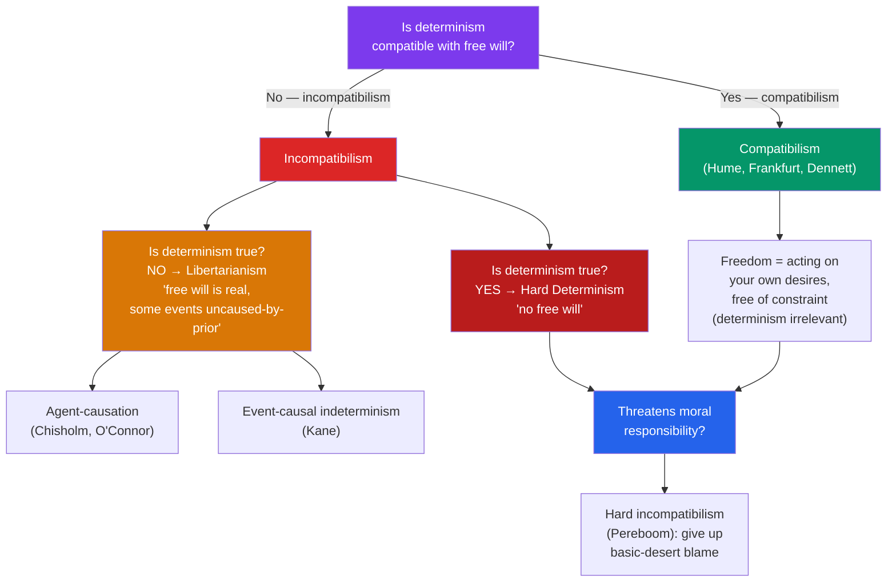

# ⚖️ Free Will and Determinism

> [!abstract] TL;DR
> **Determinism** is the thesis that every event, including every human choice, is fixed by prior states of the world together with the laws of nature. The free-will problem asks whether *genuine* freedom — the kind that grounds moral responsibility — can coexist with that thesis. **Hard determinists** say no: determinism is true, so free will is an illusion. **Libertarians** say no as well, but keep free will and reject determinism, positing indeterministic agency. **Compatibilists** (Hume, Frankfurt) say yes: freedom is acting from your own desires without external constraint, which determinism does not threaten. The **consequence argument** is incompatibilism's best weapon; **Frankfurt cases** are compatibilism's.

## Intuition — analogy first

Imagine a novel in which every sentence about a character is already printed before she "decides" anything.

If determinism is true, the state of the universe a billion years ago, plus the laws of physics, already "wrote" every move you will ever make — the way a novel's ending is fixed the moment it goes to print, even though the character experiences her choices as open. The hard determinist reads this and concludes the character is not really free. The libertarian insists real people are not printed characters — that at the moment of choice more than one continuation is genuinely possible. The compatibilist offers a subtler reading: the character is free *if the sentences flow from her own character and reasons* rather than being imposed from outside the story — and that can be true even in a fully written book.

The whole debate turns on which of these readings captures the freedom we actually care about — the kind that makes praise, blame, and punishment appropriate.

---

## The Landscape of Positions

## Key Concepts

### Determinism, indeterminism, and fatalism

**Determinism**: given the total state of the world at a time and the laws of nature, exactly one future is physically possible. **Indeterminism**: at least some events are not thus fixed (as quantum mechanics on some interpretations suggests). Crucially, indeterminism alone does not deliver free will — a choice that happens *randomly* is no more *yours* than one that is caused. **Fatalism** is different again: it says your future is fixed *no matter what you do*, whereas determinism says your choices are part of the causal chain that produces the future.

| Position | Determinism true? | Free will real? | Slogan |
|---|---|---|---|
| **Hard determinism** | Yes | No | "The chain has no gaps for freedom." |
| **Libertarianism** | No | Yes | "Some choices are genuinely open." |
| **Compatibilism** | Yes (or agnostic) | Yes | "Freedom is unconstrained self-determination." |
| **Hard incompatibilism** | Either way | No (in the desert sense) | "No free will even if indeterminism holds." |

### The two incompatibilist routes: hard determinism and libertarianism

**Hard determinists** (Baron d'Holbach; more recently Derk Pereboom in a broader form, and popular writers like Sam Harris) accept determinism and conclude that no one is ultimately the author of their actions. **Libertarians** keep free will and deny determinism. They split over the mechanism: **agent-causal** theorists (Roderick Chisholm, Timothy O'Connor) hold that the agent *herself* — not merely prior events — is an uncaused cause of her action; **event-causal** theorists (Robert Kane) locate freedom in undetermined "self-forming actions" where competing motives are resolved indeterministically. Both must answer the **luck objection**: if the outcome is not determined by the agent's prior state, isn't it just chance?

### Compatibilism: Hume and the "reconciling project"

**David Hume** called the debate merely verbal and offered the classic **compatibilist** move. Freedom (liberty) is not the absence of causation but the absence of *constraint*: "a power of acting or not acting, *according to the determinations of the will*." A prisoner in chains is unfree; a person who deliberates and acts on her own desires is free — even if those desires were themselves caused. Indeed Hume argued that *without* determinism there could be no responsibility at all, because a truly uncaused action would not flow from the agent's character and so could not reflect on her. Modern compatibilists (Frankfurt, Dennett, Fischer) refine "acting on one's own desires" into more demanding conditions.

### Frankfurt: hierarchical desires and Frankfurt cases

**Harry Frankfurt** made two lasting contributions. First, a theory of the will: a person acts freely when her **first-order desires** (wanting the cigarette) are governed by the **second-order volitions** she identifies with (wanting to want *not* to smoke). An addict who wishes she were not moved by her craving is unfree; one who endorses her desire is free. Freedom is structural harmony within the self, not a gap in causation.

Second, **Frankfurt cases**, which attack the assumption that responsibility requires *alternative possibilities* (the "could have done otherwise" principle). Suppose a neuroscientist, Black, will intervene to *force* Jones to choose *A* if Jones shows any sign of choosing *B* — but Jones chooses *A* on his own, so Black never acts. Jones could not have done otherwise, yet he seems fully responsible, because the choice came from him. If sound, this severs responsibility from alternative possibilities and undercuts a key incompatibilist assumption.

### The consequence argument

The strongest case for **incompatibilism** is **Peter van Inwagen's consequence argument**:

> If determinism is true, our acts are consequences of the laws of nature and events in the remote past. But it is not up to us what went on before we were born, and it is not up to us what the laws of nature are. Therefore the consequences of these things (including our present acts) are not up to us.

Formally it turns on a transfer-of-powerlessness principle: if you are powerless over *P*, and powerless over the fact that *P* entails *Q*, then you are powerless over *Q*. Compatibilists resist by questioning that transfer principle or the sense of "could" it uses (Lewis's "local miracle" reply).

### The stakes: moral responsibility

The whole quarrel matters because of **moral responsibility** — the appropriateness of praise, blame, punishment, and reward. Compatibilists say responsibility survives determinism because it only requires reasons-responsive, self-endorsed action. **Hard incompatibilists** like **Pereboom** argue that *basic-desert* responsibility (deserving blame simply for what you did) requires a kind of ultimate self-authorship no one has, whether the world is deterministic *or* indeterministic — but that a **forward-looking** responsibility (aimed at reform, protection, reconciliation) can be kept. **P.F. Strawson**'s influential move sidesteps metaphysics: our **reactive attitudes** (resentment, gratitude, indignation) are so deep in the fabric of human relationships that no theoretical thesis could — or should — lead us to abandon them wholesale.

## Arguments & Examples

- **The consequence argument (worked).** Premise 1: my raising my arm now is entailed by the past + laws. Premise 2: I have no power over the past. Premise 3: I have no power over the laws. Transfer principle: no power over the inputs, no power over what they entail. Conclusion: I have no power over raising my arm — it is not "up to me." The compatibilist's escape hatch is to deny the transfer principle or reinterpret "up to me."

- **Frankfurt's counterexample (worked).** The point of Black's non-intervening device is to make the actual sequence *identical* to a free action while removing all alternatives. Our intuition that Jones is responsible then shows responsibility tracks the *actual* source of the action, not the *availability of alternatives* — a direct blow to "freedom requires could-have-done-otherwise."

- **The willing vs unwilling addict (Frankfurt).** Two addicts take the same drug from the same craving. One endorses the craving; the other is horrified by it and wants to be rid of it. Same first-order desire, same causal history — yet we judge the second unfree and the first responsible. This shows freedom is about the *structure of the will*, not the mere presence of causes.

- **The luck objection to libertarianism.** Rewind the universe to the instant before Kane's "self-forming action." If nothing about the agent determines the outcome, then whether she chooses *A* or *B* differs only by chance across reruns — and a chance event seems no more *hers*, and no more free, than a determined one. Libertarians must explain how indeterminism adds control rather than mere randomness.

## Common Pitfalls / Misconceptions

- **Confusing determinism with fatalism.** Fatalism says your deliberation is *pointless* ("what will be, will be"). Determinism says the opposite — your deliberation is a real causal link in the chain that produces the outcome, so it matters enormously.
- **Thinking quantum indeterminism rescues free will.** Randomness at the sub-atomic level, even if it "scales up," gives you *uncaused* events, not *self-controlled* ones. Free will needs authorship, and chance is not authorship.
- **Assuming compatibilism denies determinism.** It does not. Compatibilism grants (or is neutral about) determinism and argues freedom is a *different property* — unconstrained, reasons-responsive agency — that determinism leaves untouched.
- **"Could have done otherwise" is obviously required for responsibility.** Frankfurt cases are a serious, widely discussed challenge to exactly this. Whether they succeed is contested, but the assumption can no longer be treated as self-evident.
- **Treating the debate as purely verbal.** Hume thought it was; most contemporary philosophers disagree. The parties differ substantively about which conditions ground desert, not merely about how to use the word "free."

## Related Concepts

- [[_MOC_Metaphysics]] — Section hub
- [[Causation]] — Determinism is a thesis *about* causation; the free-will debate depends on what causal necessity amounts to
- [[Personal_Identity]] — Who is the "self" whose desires and reasons ground compatibilist freedom?
- [[What_Is_Metaphysics]] — The a priori, modal reasoning ("could have done otherwise") used throughout this debate
- Cross-vault: [[_MOC_Ethics]] (moral responsibility, desert, punishment); [[_MOC_Philosophy_of_Mind]] (agency and mental causation)

## Review Questions

1. Distinguish hard determinism, libertarianism, and compatibilism by their answers to two yes/no questions: "Is determinism true?" and "Is free will real?" Why does indeterminism, on its own, fail to secure libertarian free will (the luck objection)?
2. Reconstruct van Inwagen's consequence argument, identifying the transfer-of-powerlessness principle it relies on. Explain one way a compatibilist might resist it.
3. Describe a Frankfurt case and explain precisely which incompatibilist assumption it targets. Using the willing/unwilling addict, explain Frankfurt's positive view that freedom is a matter of higher-order endorsement rather than open alternatives.

## Sources

- Hume, D. (1748). *An Enquiry Concerning Human Understanding*, Section VIII ("Of Liberty and Necessity")
- Frankfurt, H. (1969). "Alternate Possibilities and Moral Responsibility." *Journal of Philosophy*, 66(23); and (1971) "Freedom of the Will and the Concept of a Person." *Journal of Philosophy*, 68(1)
- van Inwagen, P. (1983). *An Essay on Free Will*. Oxford University Press
- Pereboom, D. (2001). *Living Without Free Will*. Cambridge University Press

#philosophy #metaphysics #free-will #determinism #moral-responsibility
