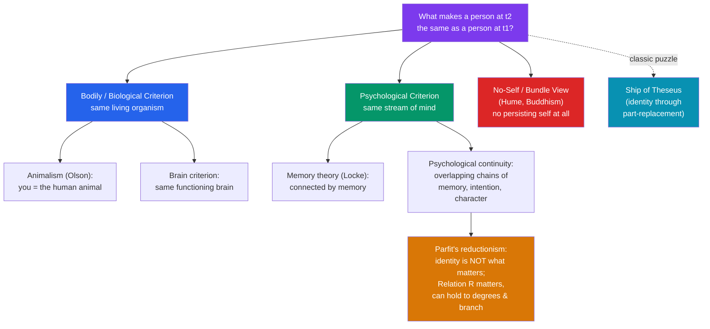

# 🧩 Personal Identity

> [!abstract] TL;DR
> Personal identity asks what makes a person at one time *the very same person* as someone at another time — the "child in the photo is *me*" relation. The **Ship of Theseus** poses the general puzzle of identity through part-replacement. **Locke** located personal identity in *psychological continuity* (chiefly memory), against those who ground it in *bodily* or *biological* continuity. **Derek Parfit** argued that identity is not what fundamentally matters: what matters is psychological connectedness and continuity, which can hold to varying degrees and can even branch — so survival can come apart from strict identity. The **no-self** view (Buddhism, Hume) denies there is any persisting self to be identified at all.

## Intuition — analogy first

Your favorite band has replaced every member since it formed. Is it still "the same band"?

There is no atom of the original left — different singer, different drummer, a new name-holder each decade — yet fans, contracts, and the Rock and Roll Hall of Fame all treat it as one continuing band. What holds it together is not shared *stuff* but overlapping chains: this lineup remembers and continues the last, which continued the one before. Now ask the same about *you*: nearly all your cells have been replaced, your beliefs and tastes have turned over, yet something makes you the continuation of the toddler in the photograph.

The philosophical question is *what* that something is — the same matter, the same living body, the same stream of memories and intentions — and whether, once we see how band-like we are, "am I strictly identical to that toddler?" is even the question worth caring about.

---

## Theories of What Persists

## Key Concepts

### The Ship of Theseus: the general puzzle

The ancient puzzle (reported by **Plutarch**) sets up the whole field. The Athenians preserve Theseus's ship by replacing each rotten plank as it decays. Over the years *every* plank is replaced. Is it the same ship? It has perfect spatiotemporal and functional continuity, so intuitively *yes*. **Thomas Hobbes**'s twist: suppose someone hoards the discarded planks and reassembles them. Now there are *two* ships with equal claim — the continuously-repaired one and the reassembled original. They cannot both be identical to the original, since identity is one-to-one. The lesson: our criteria for "same object over time" (continuity vs. original matter) can conflict, and personal identity inherits exactly this structure — the body is a ship of cells whose planks are all replaced.

### Numerical vs. qualitative identity

A crucial distinction. **Qualitative identity** is exact *similarity* (two new tennis balls are "identical"). **Numerical identity** is being *one and the same thing* (the ball you served with *is* the ball now in the net). Personal identity concerns *numerical* identity through time and change: you are numerically identical to your younger self even though you are qualitatively very different. Identity is also **transitive** and **one-one** — facts that generate the trouble in branching cases below.

### Locke: consciousness and memory

**John Locke** (*Essay*, 1694) decisively separated the *person* from the *human being* (the animal) and from the *soul*. A **person** is "a thinking intelligent being… that can consider itself as itself, the same thinking thing, in different times and places," and personal identity "reaches as far as this consciousness can be extended backwards." In short: **you are where your memories reach.** His thought experiments — the prince and the cobbler swapping consciousness, the "day man" and "night man" in one body — argue that sameness of person tracks sameness of *consciousness*, not sameness of substance. This is the founding statement of the **psychological criterion**.

### Fixing Locke: psychological continuity vs bodily continuity

Locke's memory theory faces sharp objections:
- **Reid's brave officer**: a man remembers, as an officer, being flogged as a boy; as an old general he remembers the officer but not the flogging. By Locke, the general *is* the officer, the officer *is* the boy, but the general *is not* the boy — violating the **transitivity** of identity.
- **Circularity (Butler)**: memory presupposes identity, since "remembering" already means recalling *one's own* past experience — so it cannot *constitute* identity without circularity.

The repair (Grice, Quinton, and especially **Sydney Shoemaker** and **Derek Parfit**) is **psychological continuity**: identity consists in *overlapping chains* of direct psychological connections (memories, intentions, beliefs, character traits), not a single memory reaching all the way back — just as the band persists through overlapping lineups. The rival **bodily/biological criterion** and its strongest modern form, **animalism** (**Eric Olson**: *you are essentially a human animal*, and thought is just one thing that animal does), insist that you go where your living body/organism goes, memory transplant or not.

| Criterion | You persist iff… | Key champion | Hard case for it |
|---|---|---|---|
| **Bodily** | same living body persists | common sense | brain/body transplants |
| **Animalism** | same human organism persists | Olson | I seem able to survive as a bare brain |
| **Memory** | later self remembers earlier | Locke | transitivity, circularity |
| **Psychological continuity** | overlapping chains of mental states | Shoemaker, Parfit | fission / branching |
| **No-self** | (there is no persisting self) | Hume, Buddhism | reidentification in practice |

### Parfit: identity is not what matters

**Derek Parfit** (*Reasons and Persons*, 1984) pressed psychological continuity to a radical conclusion via **fission**. Suppose your brain is divided and each half transplanted into a body; each resulting person is fully psychologically continuous with you. Both cannot be *you* (identity is one-one), yet each has as good a claim as you would have had in ordinary survival. Options — "you are neither," "you are one at random," "you are both" — are all bad. Parfit's response: **stop asking about identity.** What we *care about* in survival is not the further fact of strict numerical identity but **Relation R** — psychological connectedness and continuity, whatever its cause. Relation R can hold **in degrees** and can **branch**; identity cannot. So on his **reductionist** view, a person just *is* a suitably connected series of experiences and bodies — there is no separately existing "deep further fact" of the self, contrary to what he calls the **Non-Reductionist** or Cartesian ego view. His liberating moral: since what matters comes in degrees and my future self is only weakly connected to me, the boundary between "me" and "other people" is less deep than we think.

### The teletransporter

Parfit's signature thought experiment. A scanner records the exact state of every cell, destroys your body, and transmits the data to Mars, where a replicator builds an atom-for-atom duplicate who wakes up with all your memories and steps out. **Did you travel to Mars, or did you die and a copy replace you?** Now vary it: the **Branch-Line case** — the scanner *fails to destroy* the original, so you remain on Earth (with a damaged heart, days to live) while your replica walks around on Mars. Intuitively the Mars-person is *not you* now that you still exist — yet nothing about the Mars-person changed. Parfit concludes that whether it "counts as you" is an *empty question*; what is real and what matters (Relation R to the replica) is present regardless. Ordinary survival, he says, is *not much different* from teletransportation.

### The no-self view

The most deflationary answer denies the presupposition. **David Hume** (*Treatise*, 1739): introspect and you never catch a bare "self," only a **bundle** of perceptions — "I never can catch *myself*… without a perception." The self is a fiction we project onto the bundle. The **Buddhist** doctrine of *anattā* (non-self) is a fuller version: what we call a person is a stream of five aggregates (form, sensation, perception, mental formations, consciousness) with no permanent essence; grasping at a fixed self is a source of suffering. Parfit himself noted the convergence of his reductionism with the Buddhist view. The no-self view reframes the whole debate: perhaps there is nothing whose identity conditions we were seeking.

## Arguments & Examples

- **Reid's brave-officer regress (against pure memory theory).** Boy flogged → officer who remembers the flogging → general who remembers the officer but not the flogging. Memory links officer-to-boy and general-to-officer but not general-to-boy, so the memory criterion makes the general both identical and non-identical to the boy — violating transitivity. This is *why* the theory was reformulated as *overlapping continuity* rather than direct memory.

- **The fission argument (Parfit).** Premises: (1) each half-brain transplant would, done singly, preserve you; (2) doubling a survival-preserving process cannot *kill* you; (3) identity is one-one, so you cannot be both. From (1)–(3), a good outcome (double survival) is not a case of identity. Conclusion: what matters in survival is not identity but Relation R, which *can* take a one-many, branching form.

- **The Branch-Line teletransporter (empty-question argument).** With the original *not* destroyed, we confidently say the replica isn't you — even though the replica is intrinsically the same as in the ordinary case where we were tempted to say "you survived." Since no *further fact* distinguishes the cases beyond who-exists-where, "is the replica me?" has no deep answer. Identity questions can be *empty*.

- **Hume's introspective challenge (for no-self).** Try to observe the self that supposedly owns your experiences. You find warmth, light, a thought, a pain — always some *particular* perception, never the bare owner. If the self is never given in experience, the burden shifts to those who posit it as a further entity.

## Common Pitfalls / Misconceptions

- **Conflating numerical and qualitative identity.** "I'm not the same person I was at 15" is usually a *qualitative* claim (different values) and is fully compatible with being *numerically* the same person — which is what the metaphysical question is about.
- **Reading Locke as a bodily or soul theorist.** Locke explicitly says personal identity is *neither* sameness of body *nor* sameness of soul, but sameness of *consciousness* — a point his critics often miss.
- **Thinking the teletransporter is a physics question.** No empirical discovery settles whether the Mars-person "is you." Parfit's point is precisely that once all physical facts are fixed, the identity question may have *no further* fact to settle.
- **Assuming Relation R is a theory of identity.** It is Parfit's replacement *for* caring about identity. R can branch and come in degrees, so it is explicitly *not* an identity relation.
- **Treating no-self as obviously false because we reidentify people daily.** Practical reidentification (passports, memory, resemblance) is compatible with there being no *metaphysically deep* persisting self underneath the useful convention.

## Related Concepts

- [[_MOC_Metaphysics]] — Section hub
- [[Time_and_Existence]] — Persistence through time: are you an enduring thing wholly present at each moment, or a spacetime "worm" with temporal parts?
- [[What_Is_Metaphysics]] — Numerical identity, essence, and the appearance/reality distinction the puzzle relies on
- [[Free_Will_and_Determinism]] — The "self" whose desires ground compatibilist freedom is the same self whose persistence is questioned here
- Cross-vault: [[_MOC_Philosophy_of_Mind]] (consciousness, the mind–body relation); [[_MOC_Eastern_Philosophy]] (anattā / non-self)

## Review Questions

1. Explain the Ship of Theseus and Hobbes's reassembly variant. What general lesson about criteria for identity-over-time does it teach, and how does the human body instantiate the very same structure?
2. State Locke's memory theory, then present Reid's brave-officer objection. How does the shift to *psychological continuity* (overlapping chains) answer the transitivity worry while preserving Locke's core insight?
3. Describe the fission/teletransporter cases and reconstruct Parfit's conclusion that "identity is not what matters." What is Relation R, and how does his reductionism converge with the no-self view of Hume and Buddhism?

## Sources

- Locke, J. (1694). *An Essay Concerning Human Understanding*, Book II, ch. 27 ("Of Identity and Diversity")
- Parfit, D. (1984). *Reasons and Persons*, Part Three. Oxford University Press
- Olson, E. (1997). *The Human Animal: Personal Identity Without Psychology*. Oxford University Press
- Hume, D. (1739). *A Treatise of Human Nature*, Book I, Part IV, Section VI ("Of Personal Identity")

#philosophy #metaphysics #personal-identity #self #parfit
