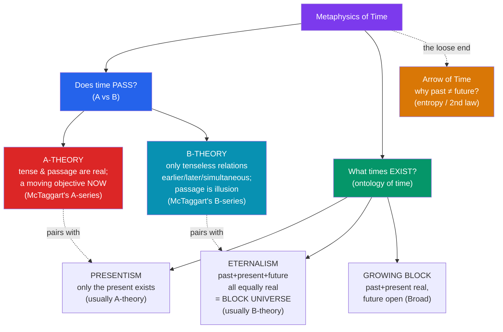

# ⏳ Time and Existence

> [!abstract] TL;DR
> The metaphysics of time asks whether time really *passes* and which times *exist*. The **A-theory** takes tense and passage as fundamental: there is an objective, moving "now," and being past / present / future are real properties. The **B-theory** says the only temporal facts are *tenseless* relations — *earlier than*, *later than*, *simultaneous with* — and passage is a mind-dependent illusion. Orthogonally, **presentism** holds that only present things exist, while **eternalism** holds that past, present, and future things are all equally real — the **block universe**. **McTaggart's** famous argument concludes that the A-series is contradictory and hence time is unreal. The **arrow of time** (why the past differs from the future) is the loose end everyone must explain.

## Intuition — analogy first

Compare two ways of thinking about a film: watching it in a cinema, versus holding the whole reel in your hand.

In the **cinema**, there is a privileged frame — the one lit up *now* — and the film genuinely *flows*: past frames are gone, future frames not yet arrived, and "now" sweeps forward. That is the **A-theory / presentist** picture: the present is metaphysically special, and time passes. But now hold the **film reel**: every frame exists equally, laid out along the strip; none is objectively "the current frame" — that status belongs to whichever the projector happens to be showing, which is a fact about the projector, not the film. All the ordering (frame 900 comes after frame 12) is baked in, tenselessly. That is the **B-theory / eternalist** picture — the **block universe**, in which your birth and death are just different locations along the reel, both fully real.

The deep question is which picture the physics and the logic of time actually support — and if it is the reel, why we nonetheless feel the film flowing.

---

## Two Axes of the Debate

## Key Concepts

### McTaggart's A-series and B-series

**J.M.E. McTaggart** (*The Unreality of Time*, 1908) gave the debate its vocabulary. Events can be ordered two ways. The **A-series** orders them by *tense*: future → present → past, a running characterization that *changes* as the "now" advances. The **B-series** orders them by fixed relations: event *e* is *earlier than* event *f*, permanently and tenselessly. McTaggart argued (i) that *change* — hence time itself — requires the A-series (the B-series alone is a static ordering, so nothing genuinely changes), but (ii) that the A-series is **contradictory**, so time is *unreal*. Almost no one accepts the final conclusion, but the split it names — **A-theorists** (tense is fundamental) vs **B-theorists** (relations are fundamental, tense reducible) — organizes the entire field.

### A-theory: passage is real

The **A-theory** takes our lived experience at face value: there is an objective present, the present *moves*, and "it is now 3pm" states a real, non-relational fact. Being *past*, *present*, or *future* are genuine, monadic properties that events *acquire and lose*. Versions include the **moving spotlight** (all times exist, but one is lit up as objectively present) and, more commonly, **presentism** (below). The A-theorist's strongest card is **experience and language**: we cannot even state what we want to say without tense, and the felt flow of time seems too central to be an illusion. Their burden is McTaggart's contradiction and, above all, the physics of **relativity**.

### The B-theory and the block universe

The **B-theory** holds that reality is a four-dimensional **block universe** in which all events tenselessly exist at their locations, and the only temporal facts are B-relations. The apparent "flow" of time is analogous to the apparent motion of "here" as you walk — a perspectival artifact, not a feature of the world. On the **tenseless (or "new") B-theory** (Mellor, Smart), sentences like "the meeting is *now*" are true *when uttered at the meeting*, but their truth-makers are purely tenseless facts about the utterance's date; tense is a feature of *language and perspective*, not of reality. The B-theory's great ally is **Einstein's special relativity**: the **relativity of simultaneity** means there is no observer-independent fact about which distant events are happening "now," which is exactly what an objective, universe-wide present would require. This is often taken as the strongest scientific argument for the block.

| | A-theory | B-theory |
|---|---|---|
| **Fundamental facts** | tensed (past/present/future) | tenseless (earlier/later) |
| **Does time pass?** | yes, objectively | no — passage is perspectival |
| **The "now"** | objective, moving | indexical, like "here" |
| **Natural ontology** | presentism / growing block | eternalism (block universe) |
| **Main ally** | experience, ordinary language | special relativity |
| **Main threat** | relativity of simultaneity | explaining why time *feels* dynamic |

### Presentism vs eternalism vs the growing block

This is the **ontological** axis — *which* times exist:
- **Presentism**: only present objects and events exist. Dinosaurs and Mars colonies are simply *not real*; "there were dinosaurs" is true but not made true by any existing dinosaurs. Fits the A-theory and common sense, but struggles with **truth-makers** for past-tense truths, with **cross-time relations** (how can Lincoln's assassination cause present effects if neither relatum coexists?), and again with relativity.
- **Eternalism**: past, present, and future objects all exist tenselessly, differing only in their temporal *location*, as spatially distant things differ in place. This is the **block universe** and the natural partner of the B-theory. Its cost is denying the metaphysical specialness of the present.
- **Growing block** (**C.D. Broad**): the past and present are real and fixed; the future is not yet real; reality *grows* as the present adds new slices. A compromise keeping an objective present *and* a real past — but it must explain how we know we are at the growing "edge" rather than in the frozen past.

### The arrow of time

Whatever your view, you must explain the **asymmetry** between past and future: we remember the past not the future, causes precede effects, and processes (ink diffusing, ice melting) run one way. The fundamental dynamical laws of physics are (almost entirely) **time-symmetric** — they do not distinguish past from future — so the arrow is usually located in the **Second Law of Thermodynamics**: **entropy** increases toward the future. This in turn is traced to a very low-entropy early universe (the **Past Hypothesis**, Boltzmann/Albert). Note the challenge for the B-theorist: if the block is static and passage unreal, the arrow must be a *structural asymmetry within* the block (an entropy gradient), not a *flow*.

### Whether time "flows"

The pivotal disagreement is whether **passage** is a real feature of the world or a projection of consciousness. A-theorists insist the flow is as real as anything could be — to deny it is to deny the most evident fact of experience. B-theorists reply that the "flow" is what a creature *inside* the block, laying down memories in an entropy gradient, would *inevitably feel*, even though nothing objectively moves — much as the sky seems to rotate around a stationary Earth. Deciding between them requires weighing the authority of first-person experience against the authority of relativistic physics: the field's central, unresolved tension.

## Arguments & Examples

- **McTaggart's paradox (worked).** Every event is past, present, *and* future — these are mutually incompatible A-properties, so ascribing all three seems contradictory. The natural reply — "it is future, *then* present, *then* past" — invokes a further time-series to house those tenses, which itself has the same trouble, launching an infinite regress (or a vicious circle). McTaggart concludes the A-series is incoherent; A-theorists reply that tensed facts simply *change* and no contradiction arises when each tense is held at its own time.

- **The relativity-of-simultaneity argument (for B-theory / eternalism; Putnam–Rietdijk).** In special relativity, two observers in relative motion disagree about which distant events are simultaneous, with *no fact of the matter* privileging either. So there is no universe-wide, observer-independent "now." But an objective moving present (A-theory) requires exactly such a global now. Therefore relativity tells against the A-theory and supports the tenseless block. Presentists respond by privileging a foliation of spacetime or reinterpreting the physics — at the cost of positing undetectable structure.

- **The truth-maker problem for presentism.** "Caesar crossed the Rubicon" is true. What *makes* it true, if — as presentism says — Caesar, the Rubicon, and the crossing *do not exist*? Eternalism answers easily (the crossing tenselessly exists, elsewhere in the block). Presentists must appeal to present-tensed surrogates (present traces, or primitive tensed "Lucretian" properties of the world) — widely felt to be strained. A clean illustration of ontology doing explanatory work.

- **The entropy-arrow example.** Break an egg and it never spontaneously reassembles, though the microphysical laws permit the reverse. The asymmetry isn't in the laws but in *initial conditions*: the universe began in an extraordinarily low-entropy state, so entropy has increased ever since, defining "later." This shows the arrow of time is (plausibly) thermodynamic and statistical, not a primitive metaphysical flow — a point that fits the block universe more comfortably than naive passage.

## Common Pitfalls / Misconceptions

- **Conflating the two axes.** A-vs-B is about *passage/tense*; presentism-vs-eternalism is about *what exists*. They usually pair (A with presentism, B with eternalism) but are logically distinct — the *moving spotlight* is an A-theory with an eternalist ontology.
- **Thinking eternalism means fatalism or "the future is already decided."** Eternalism says future events *exist* tenselessly; it does not say they are *causally necessitated*. An eternalist can be an indeterminist about the laws — existence is not the same as inevitability. (See [[Free_Will_and_Determinism]].)
- **Assuming relativity *proves* the block universe.** It powerfully pressures the A-theory, but sophisticated presentists reinterpret simultaneity or adopt a preferred frame. The inference from physics to metaphysics is strong but not a demonstration.
- **Reading McTaggart as merely a curiosity.** His conclusion (time is unreal) is rejected, but his *analytic apparatus* (A-series vs B-series) is indispensable and frames every subsequent debate. Dismiss the conclusion, keep the distinction.
- **Believing the fundamental laws explain time's arrow.** They are essentially time-symmetric. The arrow comes from thermodynamics and the low-entropy Past Hypothesis, not from the basic dynamics — a frequent confusion.

## Related Concepts

- [[_MOC_Metaphysics]] — Section hub
- [[Personal_Identity]] — Persistence through time: *endurantism* (wholly present at each moment, fits presentism) vs *perdurantism* (spacetime worms with temporal parts, fits the block)
- [[Causation]] — The direction of causation and the arrow of time are deeply entangled; counterfactual and regularity theories both presuppose temporal order
- [[What_Is_Metaphysics]] — Ontology (what exists) and the appearance/reality gap are both center-stage here
- Cross-vault: [[_MOC_Physics_Master]] — special relativity, the block universe, entropy, and the thermodynamic arrow of time; [[_MOC_Free_Will_and_Determinism|see Free Will]] on eternalism vs fatalism

## Review Questions

1. Distinguish the A-series from the B-series and reconstruct McTaggart's two-step argument for the unreality of time. Which step do most contemporary A-theorists reject, and how?
2. Explain the relativity-of-simultaneity argument for the B-theory and eternalism. Why is an *objective, universe-wide present* precisely what special relativity seems to forbid, and what is the presentist's best line of resistance?
3. State the truth-maker problem for presentism using a specific past-tense truth. How does eternalism dissolve it, and at what metaphysical cost? Separately, explain why the arrow of time is located in entropy rather than in the fundamental laws.

## Sources

- McTaggart, J.M.E. (1908). "The Unreality of Time." *Mind*, 17(68)
- Mellor, D.H. (1998). *Real Time II*. Routledge
- Putnam, H. (1967). "Time and Physical Geometry." *Journal of Philosophy*, 64(8)
- Albert, D.Z. (2000). *Time and Chance*. Harvard University Press

#philosophy #metaphysics #time #presentism #eternalism
