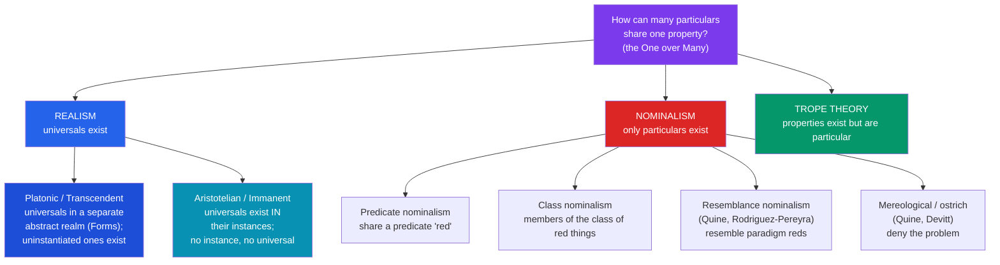

# 🔺 Universals and Realism

> [!abstract] TL;DR
> The **problem of universals** asks how numerically distinct things can share a single feature: this apple and that fire-truck are both *red* — is there one thing, **redness**, that they both "have," or only the two particular red things? **Realists** posit **universals** (Plato: they exist in a separate abstract realm; Aristotle: they exist *in* their instances). **Nominalists** deny universals: there are only particulars, and shared predicates are a matter of naming, resemblance, or class-membership. **Trope theory** offers a middle way: properties are real but *particular* (this apple's redness is a different entity from that truck's). The dispute is the paradigm case of **ontology** and bleeds into the status of **abstract objects** like numbers and sets.

## Intuition — analogy first

Two people wear the "same" shirt to a party. In one sense there are two shirts; in another, one design.

If we say they wore *the same shirt*, we obviously don't mean one physical garment teleporting between two backs — we mean one *pattern* that two distinct garments both realize. Now notice: the pattern isn't located where either shirt is, it has no weight, and it could be realized again next week by a third garment. Does that pattern *exist* — as a further item in the world's inventory, over and above the cloth — or is "same design" just a convenient way of talking about two garments that *resemble* each other?

That is the whole problem of universals in miniature. The realist takes the pattern seriously as a thing (a universal); the nominalist says there are only the garments and their resemblances, and "the pattern" is a shadow cast by our language.

---

## The Space of Answers

## Key Concepts

### The problem: One over Many

The core datum is **attribute agreement**: distinct particulars are, in some robust sense, *the same* in respect of a feature. The apple, the truck, and the sunset are all red. The **One-over-Many argument** (from Plato's *Republic* and *Parmenides*) runs: whenever many things are *F*, there is some one thing, F-ness, "over" them in virtue of which they are *F* and are called by the one name. A universal is, by definition, a **repeatable** entity — one thing wholly present in many places at once (redness is fully here in the apple and fully there in the truck), which is exactly what distinguishes it from a **particular**, which occupies one place at a time. Universals typically comprise **properties** (redness, mass) and **relations** (being taller than, being between).

### Platonic realism (transcendent universals)

**Plato** placed universals — the **Forms** — in a separate, non-spatiotemporal, eternal realm. Particular red things are red by *participating in* (or *imitating*) the Form of Red; the Form itself is the perfect, unchanging archetype. Key commitments: (1) Forms exist **independently** of their instances, so **uninstantiated universals** are fine — the Form of a perfect circle exists though no perfect circle is ever drawn; (2) Forms are the true objects of knowledge, since the sensible world only approximates them. Modern heirs include **Bertrand Russell** (who argued relations especially resist reduction to particulars) and mathematical Platonists. The great cost is *epistemic*: how can spatiotemporal minds access a causally inert, non-spatiotemporal realm? (Plato answered with recollection; the worry endures — see **Benacerraf's dilemma** for numbers.)

### Aristotelian realism (immanent universals)

**Aristotle** kept universals but pulled them down from the separate realm *into* the things themselves. A universal is real and repeatable but exists only *in re* — in its instances. There is no redness floating free of red things; destroy all red things and redness ceases to exist. This **immanent realism** ("Aristotelian" or "moderate" realism) avoids Plato's mysterious second world and the access problem, at the price of denying uninstantiated universals (a problem for properties that happen never to be instantiated, and for laws about them). **D.M. Armstrong**'s influential *scientific realism* about universals is a modern Aristotelian view: which universals exist is to be discovered by *total science*, not decided a priori, and only *sparse*, genuinely explanatory properties count as universals.

### Nominalism: only particulars

**Nominalists** deny universals altogether — the world contains only particular objects. The challenge is then to explain attribute agreement *without* a shared entity. The main strategies:

| Variant | Grounds "a and b are both F" in… | Champion | Chief objection |
|---|---|---|---|
| **Predicate nominalism** | both fall under the predicate "F" | (early behaviorist views) | reverses the order: they satisfy "red" *because* they are red |
| **Class nominalism** | both belong to the class of F-things | Lewis (with caveats) | coextensive-but-distinct properties (renate/cordate); accidental classes |
| **Resemblance nominalism** | both resemble the F paradigms | Price, Rodríguez-Pereyra | Russell's regress: *resemblance* itself looks like a shared universal |
| **Ostrich nominalism** | nothing — "a is F" needs no truthmaker beyond a | Quine, Devitt | accused of ignoring, not solving, the problem |

**Russell's regress** is the classic pressure on resemblance nominalism: if red things are grouped by their *resembling* one another, then all the resemblance-pairs resemble *each other* in being resemblances — so we need a universal *Resemblance*, and we are back to realism. Sophisticated resemblance nominalists (Rodríguez-Pereyra) reply that resemblance is an internal, primitive matter grounded in the resembling particulars, not a further universal.

### Trope theory: particularized properties

**Trope theory** (G.F. Stout; **D.C. Williams**, "the elements of being," 1953; **Keith Campbell**) accepts that properties are real but denies they are universals. A **trope** is a *particular* property-instance: *this* apple's redness is one trope, *that* truck's redness a numerically distinct trope. Attribute agreement is then explained by *exact resemblance among tropes* rather than by shared identity. Objects, in turn, are analyzed as **bundles of compresent tropes**. Attractions: tropes are causally located where the object is (this apple's *mass-trope* is what dents the scale), dissolving Plato's access problem; and one category (tropes) can do the work realists split between universals and particulars. Objection: it too faces a resemblance regress, and must explain what "bundles" compresent tropes into one object.

### Abstract objects

The universals debate is one theatre of a wider war over **abstract objects** — entities that are (typically) non-spatiotemporal and causally inert: **numbers, sets, propositions, and possibly universals themselves**. The **Quine–Putnam indispensability argument** presses even reluctant nominalists toward realism about *some* abstracta: our best science quantifies ineliminably over numbers, so — by Quine's own criterion of ontological commitment — we are committed to their existence. Hard-line nominalists respond with **fictionalism** (Field's *Science Without Numbers*: mathematics is a useful fiction, and science can in principle be rewritten without it). The recurring epistemic worry, **Benacerraf's dilemma**, sharpens Plato's: if abstract objects are causally isolated, how could we ever come to *know* anything about them?

## Arguments & Examples

- **The One-over-Many argument (for realism).** (1) The apple and the truck are *the same* in some respect — both red. (2) Sameness in a respect requires *one thing* they both have. (3) That one thing is not a particular (particulars aren't shared). ∴ There is a universal, redness, that both instantiate. The nominalist must reject premise (2): agreement in a respect, they insist, need not be grounded in a shared *entity*.

- **Russell's regress (against resemblance nominalism).** Group red things by mutual resemblance. Now the many resemblance-facts themselves *resemble one another* — they are all *resemblances*. To ground *that* agreement you invoke a resemblance among resemblances, and so on, or you concede one universal (Resemblance) after all. Either the nominalist accepts a regress or accepts a universal — a dilemma realists press hard.

- **The uninstantiated-property test (Plato vs Aristotle).** Consider a shade of blue no object has ever exhibited, or a mathematically perfect dodecahedron. The Platonist says its universal exists anyway (it's a genuine, knowable property); the Aristotelian must deny this, since for them *no instance means no universal*. Which verdict you prefer is a clean diagnostic for transcendent vs immanent realism.

- **The indispensability argument (for abstract objects).** (1) We ought to believe in whatever our best scientific theories quantify over. (2) Those theories quantify ineliminably over numbers and other mathematical objects. ∴ We ought to believe numbers exist. This turns the abstract-object question from armchair speculation into a claim hostage to the actual structure of physics — and is the strongest realist lever against nominalism about mathematics.

## Common Pitfalls / Misconceptions

- **Treating "realism" as a single view.** *Platonic* (transcendent) and *Aristotelian* (immanent) realism agree that universals exist but disagree fundamentally about *where* — a separate realm vs. in the instances — and hence about uninstantiated properties.
- **Assuming nominalism is anti-scientific or "simpler by default."** Nominalists still owe a positive account of attribute agreement, and most such accounts (classes, resemblances) incur their own costs and regresses. Parsimony in *entities* can be bought with complexity in *ideology*.
- **Confusing universals with concepts or words.** A universal (on realism) is a mind- and language-independent feature of reality; predicate nominalism's mistake, realists argue, is putting the *word* first — things are red *before* we have the word "red."
- **Thinking tropes are just "instances of universals."** A trope is *not* an instantiation of a prior universal; it is a self-standing particular property. Trope theory *replaces* universals, it does not presuppose them.
- **Equating "abstract" with "vague" or "imaginary."** In this context *abstract* is a precise technical notion — non-spatiotemporal and causally inert — not "fuzzy." Numbers are perfectly definite; they are abstract because they are nowhere and cause nothing.

## Related Concepts

- [[_MOC_Metaphysics]] — Section hub
- [[What_Is_Metaphysics]] — Ontology and ontological commitment; the universals debate is *the* worked example of "what exists?"
- [[Causation]] — Armstrong grounds laws of nature in relations *among universals*; nominalists must give a universals-free account of laws
- [[Time_and_Existence]] — Eternalism's ontology of times and events raises parallel questions about abstract vs concrete existence
- Cross-vault: [[The_Problem_of_Universals]] (Medieval philosophy — Boethius, Abelard, Ockham's razor and terminism); [[_MOC_Epistemology]] (how we could know abstract objects — Benacerraf); [[_MOC_Philosophy_of_Mathematics]]

## Review Questions

1. State the One-over-Many argument and explain exactly which premise the nominalist must reject. Why is a universal said to be "repeatable" or "wholly present in many places," and how does that distinguish it from a particular?
2. Compare Platonic (transcendent) and Aristotelian (immanent) realism. Use the case of an *uninstantiated* property to show precisely where they diverge, and state the main cost each view pays (the access problem vs. the loss of uninstantiated universals).
3. Explain trope theory and how it grounds attribute agreement without universals. Then present Russell's resemblance regress and assess whether it threatens trope theory and resemblance nominalism equally.

## Sources

- Plato, *Republic* (Book X) and *Parmenides*; Aristotle, *Categories* and *Metaphysics* Book VII
- Armstrong, D.M. (1989). *Universals: An Opinionated Introduction*. Westview Press
- Williams, D.C. (1953). "On the Elements of Being." *Review of Metaphysics*, 7
- Rodríguez-Pereyra, G. (2002). *Resemblance Nominalism: A Solution to the Problem of Universals*. Oxford University Press

#philosophy #metaphysics #universals #nominalism #abstract-objects
