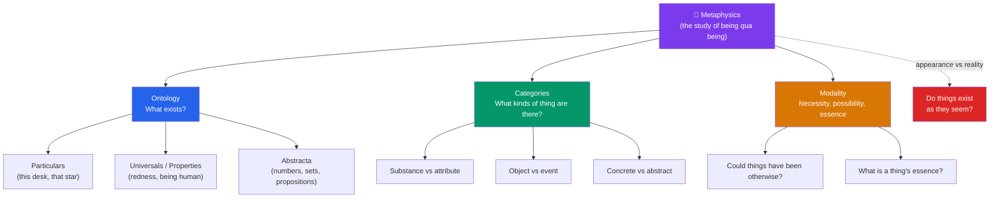

# 🦉 What Is Metaphysics

> [!abstract] TL;DR
> Metaphysics is the philosophical inquiry into the fundamental structure of reality — what exists, what it is to exist, and what the most general categories of being are. Its core sub-discipline, **ontology**, asks *what there is*. Aristotle called it "first philosophy" because every other inquiry presupposes answers to it. Its methods are largely *a priori* (reasoned rather than experimental), and it trades in the distinction between how things **appear** and how they **are**. The logical positivists tried to dismiss the whole enterprise as literally meaningless, but their criterion collapsed under its own weight, and analytic metaphysics revived vigorously from the 1970s onward.

## Intuition — analogy first

Think of the sciences as tenants and metaphysics as the building inspector who studies the foundations.

A physicist studies *which* particles exist and how they interact; a biologist studies *which* organisms exist and how they reproduce. But both take for granted that there *are* things, that those things *persist* through time, that some events *cause* others, and that objects *have properties*. Nobody running an experiment stops to ask "but what is it for a property to be *had* by an object?" — they just use the notion. Metaphysics is the discipline that goes down to the foundations and asks about the load-bearing structure that every upstairs tenant relies on but none of them examines.

This is why Aristotle placed it "after the *Physics*" (*ta meta ta physika*) yet regarded it as *prior* in the order of explanation: last in the order of learning, first in the order of being.

---

## The Shape of the Discipline

## Key Concepts

### Being *qua* being

**Aristotle** (*Metaphysics*, Book IV) defined the discipline as "the science that studies being *qua* being" — that is, being *as such*, not being-insofar-as-it-is-alive (biology) or being-insofar-as-it-moves (physics). Every special science carves off a region of reality; metaphysics studies what all regions have in common: their *being*. He also called it **theology** or **first philosophy**, and his catalogue of the ten **categories** (substance, quantity, quality, relation, place, time, position, state, action, passion) is the first systematic ontology in the Western tradition.

### Ontology — the question "what is there?"

Ontology is the inventory question. **Quine's** famous one-line answer — *"To be is to be the value of a bound variable"* — reframed it as: whatever your best-confirmed theory has to *quantify over* (say "there exists an *x* such that…") is what you are committed to existing. This gives a precise test for **ontological commitment**. Disputes then become: does our best physics really require numbers? Do our best moral theories require values? Different theories carry different ontological price tags.

| Term | Question it asks | Example dispute |
|---|---|---|
| **Ontology** | What exists? | Do numbers exist, or only numerals? |
| **Categories** | What *kinds* of being are there? | Are events a distinct category from objects? |
| **Modality** | What is possible / necessary / essential? | Could water have failed to be H₂O? |
| **Mereology** | How do parts compose wholes? | When do some things compose one further thing? |
| **Grounding** | What is fundamental vs derivative? | Is the mind grounded in the physical? |

### The *a priori* method

Metaphysics is done largely **a priori** — through argument, conceptual analysis, and thought experiment rather than through the laboratory. You cannot run an experiment to determine whether *properties* exist over and above the things that have them; you reason about what best explains the phenomena. This makes metaphysics continuous with logic and mathematics in method, even where its subject matter is the concrete world. Critics see this reliance on armchair reasoning as its weakness; defenders reply that even science rests on a priori commitments (e.g. that nature is uniform) it cannot itself establish.

### Appearance versus reality

A recurring engine of metaphysics is the gap between how the world **appears** and how it **is**. The stick looks bent in water but is straight; the table looks solid but is mostly empty space. **Parmenides** argued that change and plurality are illusions and only unchanging Being is real; **Kant** distinguished *phenomena* (things as they appear to us) from *noumena* (things in themselves, unknowable). **Bradley** and other idealists held everyday objects to be mere appearances of one underlying Absolute. Whether — and how far — reality departs from appearance is one of the discipline's oldest fault lines.

### The positivist attack and the revival

In the 1920s–30s the **logical positivists** (the Vienna Circle: Schlick, Carnap, and their fellow travellers) wielded the **verification principle**: a statement is *cognitively meaningful* only if it is either analytic (true by definition) or empirically verifiable. Metaphysical claims ("the Absolute is beyond time," "reality is fundamentally mental") are neither, so they were declared not *false* but literally **meaningless** — pseudo-statements. **A.J. Ayer's** *Language, Truth and Logic* (1936) is the manifesto in English.

The attack failed on its own terms. The verification principle is *itself* neither analytic nor empirically verifiable, so by its own standard it is meaningless — a self-refutation. Attempts to reformulate it either let metaphysics back in or ruled out ordinary science too. By the 1970s, work by **Quine**, **Kripke** (*Naming and Necessity*, reviving essence and necessity), **David Lewis**, and others had made **analytic metaphysics** one of the most active areas of philosophy again.

## Arguments & Examples

- **Aristotle's regress-of-explanation argument for first philosophy.** Every science borrows principles it does not prove (the biologist assumes there are causes; the physicist assumes there is change). If *every* principle were borrowed, nothing would ever be explained. So there must be a most general science that studies the principles common to all — being as such. This is the argument that there *has* to be a metaphysics.

- **The self-refutation of verificationism (thought experiment).** Apply the verification principle to itself. "Only the analytic and the empirically verifiable are meaningful" is not true by definition, and no experiment could confirm or refute it. So it fails its own test. The positivist cannot consistently both assert the principle and honor it — a decisive internal objection.

- **Kripke's necessary a posteriori.** "Water is H₂O" is discovered empirically (a posteriori) yet, if true, is *necessarily* true — water could not have been anything else. This example shattered the positivist assumption that the necessary and the a priori coincide, reopening space for substantive metaphysical claims about essence.

- **A Quinean inventory.** Ask "what does our best science commit us to?" Physics quantifies over electrons — so electrons exist. It also quantifies over real numbers in its equations — so, Quine argued, we are committed to numbers too. The example shows how ontology can be made rigorous rather than merely speculative.

## Common Pitfalls / Misconceptions

- **"Metaphysics means the supernatural / crystals and auras."** The bookshop sense is unrelated. Academic metaphysics is the rigorous study of existence, identity, time, causation, and properties — as likely to discuss electrons and sets as anything mystical.
- **"It's all unfalsifiable, so it's worthless."** Falsifiability is a criterion for *empirical science*, not for all meaningful inquiry — mathematics and logic are not falsifiable either. Metaphysical theories are assessed by other virtues: consistency, explanatory power, parsimony, and fit with science.
- **"Aristotle named it 'metaphysics.'"** He did not. The title comes from an editor (traditionally Andronicus of Rhodes) who shelved these books *after* the *Physics*; Aristotle called the subject "first philosophy" or "theology."
- **Confusing ontology with epistemology.** Ontology asks *what exists*; epistemology asks *how we know*. "Do numbers exist?" is ontological; "How could we know abstract objects?" is epistemological — related but distinct.

## Related Concepts

- [[_MOC_Metaphysics]] — Section hub for all metaphysics notes
- [[Universals_and_Realism]] — The ontology of properties; the flagship case study of what ontology looks like in practice
- [[Causation]] — One of the fundamental structural relations metaphysics analyzes
- [[Time_and_Existence]] — Whether past and future things are part of the inventory of what exists
- [[Free_Will_and_Determinism]] — A metaphysical dispute with direct ethical stakes
- Cross-vault: [[_MOC_Epistemology]] — The complementary question of how we could *know* any of this; [[The_Problem_of_Universals]] (Medieval philosophy)

## Review Questions

1. Explain Aristotle's phrase "the science of being *qua* being" and why he regarded metaphysics as *first* philosophy even though it is studied *after* the special sciences. How does the regress-of-explanation argument support the need for such a discipline?
2. State the verification principle and reconstruct the self-refutation objection to it. Why did the collapse of verificationism, together with Kripke's work, help revive analytic metaphysics?
3. Distinguish ontology from epistemology using the case of numbers. What is Quine's criterion of ontological commitment, and how does it turn "what exists?" into a tractable question?

## Sources

- Aristotle, *Metaphysics*, Books IV and VII (Zeta), trans. in Barnes (ed.), *The Complete Works of Aristotle* (Princeton, 1984)
- Ayer, A.J. (1936). *Language, Truth and Logic*. Gollancz
- Quine, W.V.O. (1948). "On What There Is." *Review of Metaphysics*, 2(5)
- van Inwagen, P. & Sullivan, M. (2023). "Metaphysics." *Stanford Encyclopedia of Philosophy*

#philosophy #metaphysics #ontology #being #a-priori
