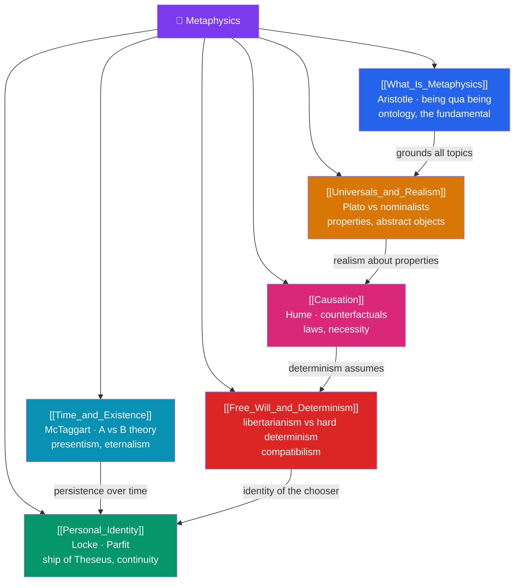

# 🗺️ Metaphysics — Map of Content

> [!abstract] What This Section Covers
> Metaphysics asks the most fundamental question of all — what is there, and what is it like at bottom? **What Is Metaphysics** frames the discipline of being and ontology and defends it against positivist dismissal; **Free Will and Determinism** stages the clash between libertarianism, hard determinism, and compatibilism over whether our choices are truly up to us; **Personal Identity** asks what makes you the same person over time, from the ship of Theseus to psychological versus bodily continuity and Parfit's reductionism; **Universals and Realism** revisits whether properties like redness exist as abstract objects or are mere names; **Time and Existence** pits the A-theory against the B-theory and presentism against eternalism; and **Causation** probes what it means for one event to bring about another, from Hume's regularities to counterfactual and law-based accounts. Six notes mapping the architecture of reality itself.

## Concept Map

## Learning Path

1. [[What_Is_Metaphysics]] — Being, existence, ontology, categories, and the defense of metaphysics against the empiricist and positivist challenge.
2. [[Universals_and_Realism]] — Realism, nominalism, and trope theory about properties; the ontology of abstract objects.
3. [[Causation]] — Hume's regularity view, counterfactual dependence (Lewis), causal powers, and laws of nature.
4. [[Time_and_Existence]] — McTaggart's paradox, the A- and B-theories, presentism vs eternalism, and the block universe.
5. [[Free_Will_and_Determinism]] — Determinism, libertarian free will, hard incompatibilism, and compatibilist responses.
6. [[Personal_Identity]] — The ship of Theseus, memory theory, psychological vs bodily continuity, and Parfit's "identity is not what matters."

## All Notes at a Glance

| Note | Difficulty | What You'll Learn |
|------|------------|-------------------|
| [[What_Is_Metaphysics]] | Intermediate | Being qua being, ontology, categories, existence, the anti-metaphysics of logical positivism |
| [[Free_Will_and_Determinism]] | Intermediate → Advanced | Determinism, libertarianism, compatibilism, the consequence argument, moral responsibility |
| [[Personal_Identity]] | Intermediate | Ship of Theseus, Locke's memory theory, psychological/bodily continuity, teleporter cases, Parfit |
| [[Universals_and_Realism]] | Advanced | Platonic realism, Aristotelian realism, nominalism, tropes, the one-over-many problem |
| [[Time_and_Existence]] | Advanced | A-theory vs B-theory, tense, presentism, eternalism, the block universe, time's arrow |
| [[Causation]] | Intermediate → Advanced | Regularity theory, counterfactuals, causal powers, overdetermination, laws of nature |

## Key Questions This Section Answers

- What does it mean to say something exists, and what are the ultimate categories of being?
- Are our choices free, or fixed by prior causes — and can they be both?
- What makes you the same person as the child in your old photographs?
- Do properties like "redness" exist over and above the red things themselves?
- Does time really flow, or is the passage of time an illusion?

## Related Sections

- [[_MOC_Philosophy_Master|↑ Philosophy Master MOC]]
- [[_MOC_Modern_Contemporary_Philosophy|← Nineteenth and Twentieth Century Philosophy]]
- [[_MOC_Epistemology|→ Epistemology]]
- Cross-vault: [[_MOC_Physics_Master]] (time, causation, block universe), [[The_Problem_of_Universals]] (Medieval)

#MOC #Philosophy #Metaphysics
