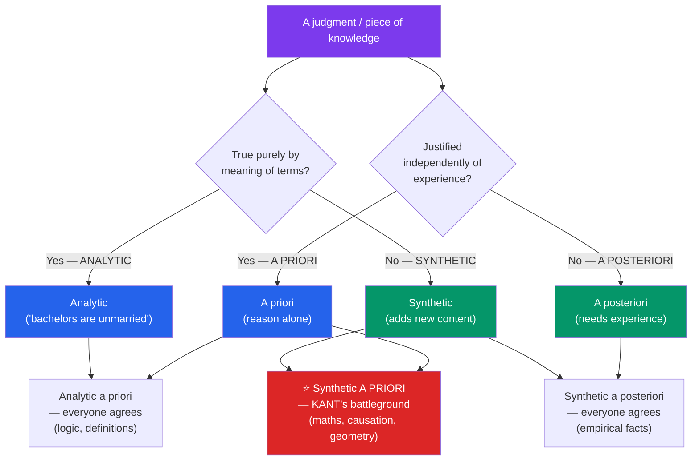

# ⚖️ Rationalism vs Empiricism

> [!abstract] TL;DR
> This is the classic dispute over the **sources** of knowledge. **Rationalists** (Descartes, Leibniz, Spinoza) hold that significant knowledge of the world can be gained by **reason alone**, independent of sense experience — knowledge that is **a priori** — and often posit **innate ideas**. **Empiricists** (Locke, Berkeley, Hume) counter that the mind is a **blank slate (*tabula rasa*)** and that all substantive knowledge derives from experience — it is **a posteriori**. The debate is sharpened by two cross-cutting distinctions: **analytic vs synthetic** (true by meaning vs true by fact) and a priori vs a posteriori (justified independently of vs. by experience). **Kant** forged a synthesis with his revolutionary category of the **synthetic a priori**; **W. V. O. Quine's** "Two Dogmas of Empiricism" (1951) then attacked the analytic/synthetic distinction itself, threatening the framework both sides assumed.

## Intuition — analogy first

Think of the mind as a factory that turns out finished beliefs, and ask: *what are the raw materials, and how much does the machinery add?*

The strict **empiricist** runs a pure assembly line: nothing comes out that did not first come in through the loading dock of the senses. The factory only sorts, combines, and packages deliveries; it manufactures no raw material of its own. If you find a belief on the shipping dock, you can always trace it back to some sensory delivery.

The **rationalist** insists the factory has its own on-site foundry. Some products — the truths of mathematics, logic, and metaphysics — are *forged in-house* from the structure of reason itself and would exist even if the loading dock were sealed shut. The senses supply occasions and materials, but the deepest, most certain goods are made, not imported.

**Kant's** insight is that this is a false either/or. The senses deliver raw material, *but the factory imposes a fixed set of molds* — space, time, causation — on everything that passes through. So experience is genuinely necessary (nothing without deliveries), yet the mind's own machinery shapes the product in advance, yielding truths that are both about the world *and* knowable prior to any particular experience.

---

## How It Works — Mapping the Distinctions

The whole debate can be plotted on these two axes. Everyone accepts the two "safe" corners — **analytic a priori** (definitions, logic) and **synthetic a posteriori** (ordinary empirical facts). *Analytic a posteriori* is generally held to be empty. The entire war is fought over the fourth cell: is there **synthetic a priori** knowledge — substantive truths about the world knowable by reason alone?

## Key Concepts

### The Two Central Distinctions

- **A priori vs a posteriori** is an *epistemological* distinction about the **source of justification**. A belief is *a priori* if it can be justified independently of any particular experience (that 7 + 5 = 12; that nothing is both red all over and green all over); *a posteriori* (empirical) if its justification requires experience (that water boils at 100 °C at sea level).
- **Analytic vs synthetic** is a *semantic* distinction about **what makes a proposition true**. An *analytic* truth is true in virtue of the meanings of its terms — its predicate is "contained in" its subject ("all bachelors are unmarried"); a *synthetic* truth adds content beyond the subject concept ("the cat is on the mat"). Kant introduced this terminology precisely to isolate the disputed cell.

These are *orthogonal*: the first is about how a belief is *known*, the second about how it is *made true*. Conflating them is the single most common error in the area.

### Rationalism: Reason and Innate Ideas

Rationalists advance some combination of three theses:

| Thesis | Claim | Example |
|---|---|---|
| **The Intuition/Deduction thesis** | Some truths are known by rational intuition and deduced from it | Descartes' *cogito*; Spinoza's *Ethics* in geometric order |
| **The Innate Knowledge thesis** | We are born with some knowledge, not derived from experience | Leibniz: the mind contains truths "as veins in marble" |
| **The Innate Concept thesis** | Some *concepts* are part of the mind's native equipment | Descartes: the idea of God, of substance, of perfection |

**Descartes** takes the *cogito* ("I think, therefore I am") as an indubitable a priori foundation surviving even the [[Skepticism|evil-demon doubt]], then argues from innate ideas outward. **Leibniz**, replying to Locke, offers the marble analogy: experience does not write on a blank tablet but *reveals* veins already in the stone — a nativism about knowledge, not just capacity.

### Empiricism: The Blank Slate

**John Locke** (*Essay Concerning Human Understanding*, 1689) opens with a sustained attack on innate ideas and asserts the mind is *white paper, void of all characters* — the **tabula rasa**. All ideas come from two fountains: **sensation** (outer experience) and **reflection** (inner awareness of the mind's operations). **George Berkeley** radicalises this into idealism (*esse est percipi* — to be is to be perceived). **David Hume** pushes empiricism to its skeptical limit: all contents of the mind are *impressions* and their fainter copies, *ideas*; any idea that cannot be traced to an impression is spurious. This yields **Hume's Fork**: every object of inquiry is either a *relation of ideas* (a priori, analytic, certain — mathematics) or a *matter of fact* (a posteriori, contingent — everything else). Hume then argues **causation** and the reliability of **induction** fit *neither* box comfortably — we never perceive a necessary connection, only constant conjunction — a result that jolted Kant.

### Kant's Synthesis: The Synthetic A Priori

**Immanuel Kant** (*Critique of Pure Reason*, 1781), famously "awoken from his dogmatic slumber" by Hume, argues both camps are half right. Experience is necessary — "all our knowledge *begins* with experience" — but it does not *all arise from* experience: the mind contributes **forms of intuition** (space and time) and **categories of the understanding** (substance, causation) that structure any possible experience. This makes room for the **synthetic a priori**: judgments that are substantive (synthetic) yet knowable independently of experience (a priori), because they state the conditions the mind imposes on *any* experience. His candidates: the truths of arithmetic and geometry, and the causal principle ("every event has a cause"). This is his **Copernican turn** — instead of the mind conforming to objects, objects (as we can know them) conform to the mind. See [[Kant_and_the_Copernican_Turn]] for the full argument.

### Quine's Demolition: "Two Dogmas of Empiricism"

**W. V. O. Quine** (1951) attacks the framework *both* traditions relied on. The **first dogma** is the belief in a clean **analytic/synthetic distinction**; Quine argues every attempt to define "analytic" (via synonymy, definition, or semantic rules) travels in a tight little circle of equally unexplained notions. The **second dogma** is **reductionism** — the idea that each statement has its own private range of confirming experiences. Against it Quine offers **confirmation holism**: statements face the "tribunal of experience" not one by one but as a *corporate body*; "our statements about the external world face experience as a whole." A recalcitrant observation can be accommodated by revising *any* part of the web, even a law of logic, so *no* statement is immune to revision (undercutting the a priori) and none is confirmed in isolation. If Quine is right, the tidy two-by-two grid above rests on a distinction that cannot be drawn — a radical, pragmatist empiricism.

## Arguments & Examples

**The poverty-of-the-stimulus style argument (for rationalism).** How do we grasp truths that go infinitely beyond any experience — that every natural number has a successor, that the sum of angles in a Euclidean triangle is exactly 180°? No finite set of observations could establish a *strictly universal, necessary* truth (Hume's own point about induction). Rationalists conclude the source cannot be experience alone. Chomsky's later nativism about grammar is a modern empirical descendant of this line.

**Hume's fork applied to causation.** Take "the sun will rise tomorrow." It is not a relation of ideas (its denial implies no contradiction), so it must be a matter of fact — but our only ground is that it has always risen, which *assumes* the future resembles the past, the very principle in question. So induction cannot be justified by reason *or*, without circularity, by experience. This is the sharpest empiricist result, and precisely the problem Kant's synthetic-a-priori causal principle was built to answer.

**A worked contrast of the four cells.**
- *Analytic a priori:* "All bachelors are unmarried." True by meaning, knowable from the armchair. (Uncontested.)
- *Synthetic a posteriori:* "There are eight planets." Adds content, known by observation. (Uncontested.)
- *Synthetic a priori (Kant's prize):* "7 + 5 = 12" — Kant argues the concept "12" is *not* contained in the concept of "7 + 5" (it is synthetic), yet is known without experiment (a priori). Empiricists (and later Frege/logicism) deny this, holding arithmetic is analytic; the disagreement here *is* the debate.
- *Analytic a posteriori:* generally regarded as empty.

## Common Pitfalls / Misconceptions

- **"A priori means innate."** No. A priori is about *justification* (independent of experience), not developmental *origin*. You may need experience to *acquire* the concepts in "7 + 5 = 12," yet the proposition's *justification* is a priori. Innateness is a distinct (psychological) thesis.
- **"Analytic = a priori and synthetic = a posteriori."** This collapses the two orthogonal axes and *begs the question against Kant*, whose entire thesis is that some judgments are synthetic *and* a priori. Keep the semantic and epistemic distinctions apart.
- **"Empiricists deny mathematics is knowledge."** They do not — they typically classify it as *analytic* (relations of ideas / true by definition), hence a priori but empty of worldly content. The dispute is over its *status*, not its truth.
- **"Rationalists reject the senses."** No serious rationalist denies we use the senses for ordinary facts; they claim *some* significant knowledge is *additionally* available to reason alone. It is a claim about scope, not a rejection of experience.
- **"Quine proved there is no a priori knowledge."** Quine *argued against* a sharp analytic/synthetic distinction and for holism; whether this defeats the a priori is contested (many hold analyticity can be rehabilitated). Treat "Two Dogmas" as a powerful challenge, not a settled refutation.

## Related Concepts

- [[_MOC_Epistemology|↑ Section MOC]]
- [[What_Is_Knowledge]] — This debate supplies the *sources* behind the justification condition of the JTB analysis.
- [[Theories_of_Justification]] — Rational intuition vs. sense experience are the raw materials foundationalism must certify as *basic beliefs*.
- [[Skepticism]] — Descartes' a priori *cogito* is the rationalist foundation offered against sensory doubt; Hume's empiricism generates the problem of induction.
- [[The_Gettier_Problem]] — The causal theory of knowing fails for *a priori* truths, showing how source-of-knowledge issues bear on the analysis of knowledge.
- Cross-section: [[Kant_and_the_Copernican_Turn]] — The full development of the synthetic a priori and the mind's constitution of experience.
- Cross-vault: [[Bayesian_Inference]] (AI/ML) — Priors as belief held *before* (prior to) evidence, a formal echo of the a priori / a posteriori split.

## Review Questions

1. Carefully distinguish the a priori/a posteriori distinction from the analytic/synthetic distinction, stating which is epistemological and which is semantic. Give a clear example for each of the three non-empty cells, and explain why the analytic a posteriori cell is usually held to be empty.
2. Explain Kant's category of the synthetic a priori using "7 + 5 = 12." Why does Kant claim this judgment is synthetic rather than analytic, and how does his "Copernican turn" make synthetic a priori knowledge possible? How would a logicist empiricist respond?
3. Summarise the two dogmas Quine attacks in "Two Dogmas of Empiricism" and state his positive doctrine of confirmation holism. If Quine is right that no statement is immune to revision, what happens to the traditional rationalist claim to a priori knowledge?

## Sources

- Locke, J. (1689). *An Essay Concerning Human Understanding* (esp. Book I on innate ideas, Book II on the origin of ideas)
- Hume, D. (1748). *An Enquiry Concerning Human Understanding* (esp. §IV on Hume's Fork and induction)
- Kant, I. (1781/1787). *Critique of Pure Reason* (Introduction and Transcendental Aesthetic; trans. Guyer & Wood, Cambridge, 1998)
- Quine, W. V. O. (1951). "Two Dogmas of Empiricism." *The Philosophical Review*, 60(1), 20–43

#philosophy #epistemology #rationalism #empiricism #a-priori
