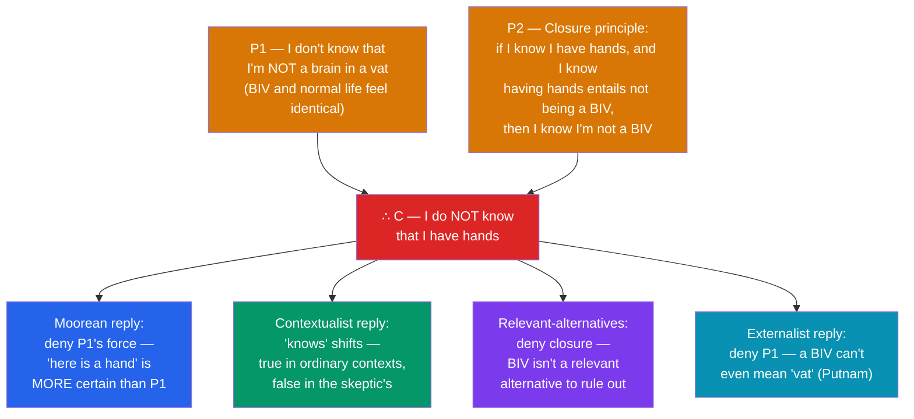

# 🌀 Skepticism

> [!abstract] TL;DR
> Philosophical skepticism argues that we do not — or cannot — **know** the things we ordinarily take ourselves to know, especially about the external world. **Descartes' method of doubt** drives the classic version: since dreaming and an all-powerful **evil demon** could make all my experiences exactly as they are while everything I believe is false, I cannot rule these scenarios out, so I do not *know* the ordinary claims they would falsify. The modern regimentation is the **closure-based argument** built around a **brain in a vat (BIV)**. Major responses reject one of its premises: **G. E. Moore** insists ordinary knowledge is more certain than any skeptical premise; **contextualism** (DeRose, Lewis) says "knows" shifts meaning with context; **relevant-alternatives** theory (Dretske) denies we must eliminate far-fetched possibilities; and **semantic externalism** (Putnam) argues a BIV could not even *think* it is a BIV.

## Intuition — analogy first

Imagine your entire life is a perfectly rendered video game, and you are a character inside it who has never once seen the code, the console, or the world outside the screen.

Everything you could ever check — the weight of a coffee cup, the reflection in a mirror, the results of a science experiment — is generated by the same system that generates the illusion. Any "test" you run to prove the world is real is itself part of the simulation and will happily return "yes, it's real." So there is no observation you could make *from inside* that distinguishes "I live in a real world" from "I am a character in a flawless game." The two hypotheses predict *identical* experiences.

That is the skeptic's leverage. Not the claim that you *are* in a simulation — the skeptic need not assert that — but the claim that you cannot *rule it out*, and that knowledge seems to require ruling out the ways you could be wrong. If ordinary knowledge demands eliminating all the alternatives, and one alternative is by construction un-eliminable, then either knowledge is impossible or our theory of knowledge is missing something.

---

## How It Works — The Closure Argument

The argument is **valid** and each premise is individually **plausible**, yet the conclusion is intolerable — a *paradox*. Every serious response must therefore reject exactly one premise (P1 or the closure principle P2) or bite the bullet and accept C. Which premise you deny defines your epistemological camp.

## Key Concepts

### Cartesian Skepticism and the Method of Doubt

In the *Meditations on First Philosophy* (1641), **René Descartes** subjects his beliefs to systematic doubt, discarding anything that admits of *any* possible doubt in order to find an indubitable foundation. He escalates through three waves:

1. **The illusion argument** — the senses sometimes deceive (a straight oar looks bent in water), so they are not wholly trustworthy. But this only undermines *distant or unusual* perceptions.
2. **The dream argument** — there is no *internal* mark that reliably distinguishes waking from dreaming; any experience I now have could be a vivid dream. This generalises the doubt to *all* sensory beliefs about the external world at once.
3. **The evil demon (*genius malignus*)** — suppose a being of utmost power devotes itself to deceiving me about everything, so that even the earth, sky, and my own body are illusions. This extends doubt as far as it can go, threatening even mathematics ("perhaps I err each time I add 2 and 3").

Descartes' *aim* is anti-skeptical: he seeks the one thing doubt cannot touch — the **cogito**, "I think, therefore I am" ([[Rationalism_vs_Empiricism|a paradigm a priori certainty]]) — and rebuild knowledge on it. But the *doubts* he raised proved far more durable and influential than his reconstruction, which leans on a much-criticised proof of a non-deceiving God.

### The Brain in a Vat

**Hilary Putnam** (*Reason, Truth and History*, 1981) modernised the demon as the **brain in a vat**: a brain kept alive in nutrient fluid, wired to a supercomputer feeding it electrical impulses that produce exactly the experiences of a normal embodied life. The BIV has all the same experiences as you and forms all the same beliefs, yet almost all of them are false. Because your evidence is, by construction, *identical* whether or not you are a BIV, you seemingly cannot tell which you are — the setup for premise P1.

### The Closure Principle

The argument's second premise is the **epistemic closure principle**: if S knows *p*, and S knows that *p entails q*, then S is in a position to know *q*. Applied here: I know that *having hands* entails *not being a handless brain in a vat*; so if I know I have hands, I know I'm not a BIV. Contraposed, my *inability* to know I'm not a BIV drains away my ordinary knowledge. Closure is extremely intuitive — it seems absurd to say "I know I have hands but I don't know I'm not a handless BIV" — which is what makes rejecting it (the relevant-alternatives move) so costly.

### The Main Responses

| Response | Premise rejected | Core move | Chief proponent |
|---|---|---|---|
| **Mooreanism** | P1 (via anti-skeptical *G*) | Ordinary knowledge outranks skeptical premises; run the argument in reverse | G. E. Moore |
| **Contextualism** | Neither strictly — "knows" is context-sensitive | Standards for "knows" rise in the skeptic's context; both sides speak truly | Keith DeRose, David Lewis |
| **Relevant Alternatives** | P2 (closure) | Knowledge requires ruling out only *relevant* alternatives; BIV isn't one | Fred Dretske, Robert Nozick |
| **Semantic Externalism** | P1 (its very intelligibility) | A lifelong BIV's word "vat" can't refer to real vats; "I am a BIV" is self-refuting | Hilary Putnam |

**Moore's "here is a hand."** In "Proof of an External World" (1939), G. E. Moore holds up a hand and argues: "Here is one hand, and here is another; therefore at least two external objects exist." His epistemological point (developed in "Four Forms of Scepticism") is a **shift of certainties**: he is *more* certain that he has hands than he could ever be of the skeptic's premise that he cannot know it — so the rational response is to reject that premise, not his ordinary knowledge. The skeptic and Moore agree the argument is valid; they disagree about which end is more credible.

**Contextualism.** DeRose and Lewis argue that "know" is like "flat" or "tall" — its truth-conditions vary with context. In everyday contexts the standards are low and "I know I have hands" is *true*; when the skeptic raises the BIV possibility, standards rise so high that "I know I have hands" becomes *false*. Both utterances are correct *in their contexts*, dissolving the paradox by denying there is a single fixed sense of "knows" the argument trades on.

**Relevant alternatives.** Dretske denies unrestricted closure: to know "that's a zebra" you must rule out relevant alternatives (a horse) but *not* every logically possible one (a cleverly painted mule). The BIV is not a *relevant* alternative in ordinary life, so failing to eliminate it does not defeat ordinary knowledge. The cost is abandoning the highly intuitive closure principle.

**Semantic externalism.** Putnam's own reply turns on the causal theory of reference: words get their meaning from causal contact with things. A brain *always* envatted has never causally interacted with real vats or brains, so its word "vat" refers (at most) to vat-images in the program, not real vats. Hence when the BIV thinks "I am a brain in a vat," it does not *mean* what we mean, and the thought is false or truth-valueless — so "I am a BIV" cannot be truly thought by a BIV. This attacks the very *statability* of the skeptical hypothesis from the inside.

## Arguments & Examples

**Why the dream argument generalises but the demon goes further.** The dream argument shows any *particular* sensory belief might be a dream, but a reply is available — coherence and continuity may distinguish waking life over time. The demon (and BIV) closes that escape: a sufficiently powerful deceiver can fake the *coherence* too, including your memories of "checking." This is why the demon/BIV is the strongest form and the one the closure argument uses.

**The underdetermination framing.** An alternative to closure states the problem as *underdetermination*: my evidence equally supports "normal world" and "BIV world," so it cannot justify preferring one. This targets *justification* rather than knowledge-entailments, and connects skepticism directly to the debates in [[Theories_of_Justification]] — a foundationalist and a coherentist will answer the underdetermination charge very differently.

**Local vs. global, and the value of the exercise.** *Global* skepticism (nothing can be known) is often thought self-undermining — if true, we couldn't know *it* — whereas *local* skepticisms (about the external world, other minds, induction, the past) are live and instructive. Even philosophers who reject the conclusion treat the argument as a *test*: any adequate theory of knowledge must explain *where* the skeptical argument goes wrong, and different theories locate the flaw in different premises.

## Common Pitfalls / Misconceptions

- **"The skeptic claims we're dreaming / are BIVs."** No. The skeptic need not assert any scenario is *actual*; the claim is only that we cannot *rule it out*, which is enough to threaten knowledge if knowledge requires ruling out error-possibilities.
- **"Moore refutes the skeptic by proving hands exist."** Moore's real contribution is not a knock-down proof but a *methodological* point about which claims are more certain. The skeptic can grant the argument is valid and simply deny Moore knows the premise — the dispute is about credibility, not logic.
- **"Descartes was a skeptic."** Descartes used skepticism as a *method* to reach certainty (the cogito, then God, then the world). He is the great *source* of modern skeptical arguments but not himself a skeptic about their conclusions.
- **"If I can't disprove the BIV hypothesis, I have no reason to believe the normal world."** Denying the skeptical conclusion doesn't require *disproof*; externalist and relevant-alternatives views hold you can *know* ordinary things without first eliminating the BIV scenario at all.
- **"Skepticism is idle — nobody lives it."** True as psychology, irrelevant as epistemology. That we *cannot help* believing in the external world (Hume's point) does not show the belief is *justified*; the argument demands a diagnosis, not a shrug.

## Related Concepts

- [[_MOC_Epistemology|↑ Section MOC]]
- [[What_Is_Knowledge]] — Skepticism attacks the *truth* and *justification* conditions of the JTB analysis: if deception can't be excluded, can they ever be met?
- [[Theories_of_Justification]] — Foundationalism, coherentism, and reliabilism each generate a different reply to the underdetermination version of skepticism.
- [[The_Gettier_Problem]] — Shares the modal machinery: closure, sensitivity, and safety appear in both the skeptical argument and the analysis of knowledge.
- [[Rationalism_vs_Empiricism]] — Descartes' cogito is the rationalist's indubitable a priori foundation offered against sensory doubt.
- Cross-section: [[Critical_Thinking_and_Reasoning]] — Evaluating a valid argument with an unacceptable conclusion (paradox resolution).
- Cross-vault: [[Bayesian_Inference]] (AI/ML) — Underdetermination as evidence failing to discriminate between hypotheses that predict the same data.

## Review Questions

1. Lay out the closure-based skeptical argument as two premises and a conclusion, using the brain-in-a-vat scenario. For *each* of the four main responses (Moore, contextualism, relevant-alternatives, semantic externalism), state which premise it rejects and how.
2. Reconstruct Descartes' three escalating doubts (illusion, dream, demon) and explain what each adds. Why is the evil demon a stronger skeptical device than the dream argument, and how does the brain-in-a-vat update it for a modern audience?
3. Explain Putnam's semantic-externalist argument that "I am a brain in a vat" cannot be true when thought by an envatted brain. What assumption about how words refer does the argument rely on, and what is the strongest objection to it?

## Sources

- Descartes, R. (1641). *Meditations on First Philosophy* (esp. Meditations I–II; e.g. trans. Cottingham, Cambridge University Press, 1996)
- Moore, G. E. (1939). "Proof of an External World." *Proceedings of the British Academy*, 25
- Putnam, H. (1981). *Reason, Truth and History*, Cambridge University Press (ch. 1, "Brains in a Vat")
- DeRose, K. (1995). "Solving the Skeptical Problem." *The Philosophical Review*, 104(1), 1–52

#philosophy #epistemology #skepticism #descartes #brain-in-a-vat
