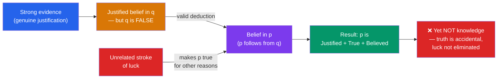

# 🧩 The Gettier Problem

> [!abstract] TL;DR
> In a three-page 1963 paper, **Edmund Gettier** presented cases in which a person has a **justified true belief (JTB)** that is nonetheless *not knowledge*, because the belief is true only by luck. The recipe is always the same: a justified belief that is actually **false** validly entails a further proposition that happens to be **true** for an unrelated reason. This showed that the classical JTB analysis states conditions that are individually necessary but **not jointly sufficient**, and launched a fifty-year search for a *fourth condition* — no-false-lemmas, defeasibility, causal connection, sensitivity, and safety being the main candidates. The deeper diagnosis is that knowledge requires the *elimination of epistemic luck*, which mere justification does not guarantee.

## Intuition — analogy first

Think of justification as a *weather forecast* and truth as the *actual weather*.

A meticulous forecaster reads every instrument, applies sound models, and confidently predicts rain tomorrow. Suppose it *does* rain — but not for any reason the forecast tracked; a freak, unpredicted system rolled in overnight while the forecasted system fizzled. The forecast was justified, and the outcome matched the prediction, yet the forecaster did not *know* it would rain. The match between prediction and reality was a coincidence: the reasoning that justified the belief and the fact that made it true came apart and only accidentally reconnected.

Gettier cases exploit exactly this gap. You do everything right epistemically, your belief turns out true, and still you fail to know — because the route from your evidence to the truth runs through a lucky detour rather than a reliable connection. Knowledge, it turns out, is not just being right with good reasons; it is being right *because of* your good reasons.

---

## How It Works — Anatomy of a Gettier Case

The engine of every classic case has two moving parts: (1) **justification is fallible** — you can be fully justified in a *false* belief; and (2) **justification is closed under known entailment** — if you justifiably believe *q* and competently deduce *p* from *q*, you are justified in believing *p*. Combine a justified-but-false belief with a valid deduction, then let the conclusion be *true* by unrelated luck, and you manufacture a JTB that is not knowledge.

## Key Concepts

### Gettier's Two Original Cases (1963)

Gettier framed both cases against a JTB analysis he attributed to **Roderick Chisholm** and **A. J. Ayer**.

**Case I — the job and the coins.** Smith and Jones apply for a job. Smith has strong evidence for the conjunctive proposition *(q)* "Jones will get the job, and Jones has ten coins in his pocket" — the company president assured him Jones would be hired, and Smith himself counted the coins in Jones's pocket. Smith competently deduces *(p)* "the man who will get the job has ten coins in his pocket." But *unknown to Smith*, **Smith** gets the job, and — by coincidence — Smith *also* has ten coins in his pocket. So *p* is true, Smith believes it, and he is justified in believing it. Yet he does not *know* *p*: his belief is true for entirely different reasons than the ones that justified it.

**Case II — the disjunction.** Smith is justified in believing *(q)* "Jones owns a Ford" (Jones has always driven one, just offered Smith a ride in one). From this Smith deduces *(p)* "Either Jones owns a Ford, or Brown is in Barcelona," picking a random city for the second disjunct — he has no idea where Brown is. As it happens, Jones does *not* own a Ford (the car was rented), but Brown *is*, by sheer coincidence, in Barcelona. So the disjunction *p* is true, believed, and justified — yet not known.

### The Structure Generalised: Epistemic Luck

The unifying diagnosis is **epistemic luck**: the belief is true, but its truth is accidental relative to the believer's evidence. Philosophers distinguish:

- **Veritic luck** — it is lucky *that the belief is true* given how it was formed (the Gettier-relevant kind, which is knowledge-destroying).
- **Benign / evidential luck** — luck in *acquiring* the evidence (e.g. luckily glancing out the window at the right moment), which is compatible with knowledge.

**Roderick Chisholm's sheep case** (a much-discussed variant, sometimes attributed to the same period) sharpens the point: you look at a field, see a sheep-shaped white object, and form the justified true belief "there is a sheep in the field." But the object you see is a *dog* disguised by distance as a sheep — while a *real* sheep stands hidden behind a hill. Your belief is true (there is a sheep) and justified (you had good perceptual grounds), yet you plainly do not know, because what you are looking at is not the sheep that makes it true.

### The Search for a Fourth Condition

Post-1963 epistemology largely became the project of adding a condition to JTB (or replacing justification) to screen out luck. The main proposals:

| Proposal | Core idea | Chief proponent | Fatal problem |
|---|---|---|---|
| **No False Lemmas (JTB+NFL)** | Knowledge must not be *inferred from any false premise* | Gilbert Harman; Michael Clark | Fake-barn cases involve no false lemma yet still fail |
| **Defeasibility theory** | There must be no *true defeater* — no truth that, if learned, would undercut the justification | Keith Lehrer & Thomas Paxson | Distinguishing "genuine" from "misleading" defeaters is intractable |
| **Causal theory** | The fact that *p* must *cause* S's belief that *p* | Alvin Goldman (1967) | Fails for a priori / mathematical / universal knowledge with no causal link |
| **Sensitivity** | *If p were false, S would not believe it* (a counterfactual) | Robert Nozick (1981) | Violates closure; misjudges some ordinary knowledge |
| **Safety** | *S could not easily have believed p falsely* — p is true in all *nearby* possible worlds | Ernest Sosa; Timothy Williamson; Duncan Pritchard | Handling of necessary truths and "close calls" is contested |

**No-false-lemmas** was the first and most intuitive fix and handles Gettier's own two cases (both route through the false *q*). But **Alvin Goldman's fake-barn case** defeats it: driving through a region unknowingly full of convincing *barn façades*, you look at the one real barn and believe "that's a barn." The belief is true, justified, and inferred from *no false premise* — yet the surrounding fakes mean you could so easily have been wrong that we withhold knowledge. This motivated the **modal conditions** (sensitivity, safety), which analyse knowledge in terms of what would happen in *nearby possible worlds* rather than the believer's premises.

### The Radical Response: Knowledge First

**Timothy Williamson** (*Knowledge and Its Limits*, 2000) argues the whole fifty-year repair programme is misguided. Knowledge, he holds, is a *primitive* mental state that resists analysis into belief + justification + truth + X. On this "knowledge-first" view, the persistent failure to complete the analysis is not a puzzle to be solved but *evidence that no reductive analysis exists* — Gettier merely exposed the futility of the analytic project.

## Arguments & Examples

**Why closure powers the cases.** Both original cases rely on the principle that competent deduction transmits justification. This is highly plausible in itself — if I am justified in believing *q* and I *know* *q* entails *p*, surely I am justified in believing *p*. Gettier's insight is that this same, seemingly innocent principle lets a justified *false* belief "launder" its justification onto a coincidentally *true* conclusion.

**The stopped-clock case (pre-figuring Gettier).** Bertrand Russell's example — reading the correct time off a clock that stopped exactly twelve hours earlier — is a Gettier-style case avant la lettre. The belief is true and justified (you had every reason to trust the clock) but not knowledge (it was stopped). Note it requires *no inference from a false lemma*, which is precisely why the simplest fix fails and modal theories are attractive: in a nearby world where you glanced a minute later, you would have believed a falsehood, so *safety* is violated.

**A worked contrast.**
- *Ordinary knowledge:* You read a working clock; had it read differently you would have believed differently, and it could not easily have malfunctioned. Sensitivity and safety both hold → knowledge.
- *Gettier / stopped clock:* The clock is stopped; you happen to look at the one moment it is right. Safety fails (a moment later you err) → true justified belief, but not knowledge.

## Common Pitfalls / Misconceptions

- **"Gettier showed justification is not needed."** The opposite — he showed it is *not sufficient*. All three JTB conditions remain plausibly *necessary*; what fails is their *joint sufficiency*. The response is to *add* to JTB (or upgrade justification), not to drop a condition.
- **"Gettier cases prove we can't know anything."** They are not a form of [[Skepticism]]. They target the *analysis* of knowledge, granting that we have plenty of knowledge; the question is what its correct definition is.
- **"Just forbid inference from false premises and you're done."** No-false-lemmas is refuted by fake-barn and stopped-clock cases, which contain no false lemma yet still fail to be knowledge. This is why the field moved to modal conditions.
- **"Any luck destroys knowledge."** Only *veritic* luck (luck in the belief's being *true*) is corrosive. You can luckily *acquire* good evidence and still know — much ordinary knowledge involves benign luck.
- **"Gettier's cases are contrived, so the problem is trivial."** Contrived, yes — but the phenomenon (justification and truth coming apart by luck) is perfectly general and recurs in realistic medical, legal, and perceptual settings. The contrivance isolates the structure; it does not create it.

## Related Concepts

- [[_MOC_Epistemology|↑ Section MOC]]
- [[What_Is_Knowledge]] — The JTB analysis Gettier refuted; read it first to see the three conditions his cases attack.
- [[Theories_of_Justification]] — Reliabilism, defeasibility, and virtue epistemology are in large part *responses* to Gettier's challenge.
- [[Skepticism]] — Shares the machinery of *closure* and *possible-worlds* reasoning (sensitivity, safety), but poses the opposite threat: not "what is knowledge?" but "do we have any?"
- [[Rationalism_vs_Empiricism]] — The causal theory's failure for a priori truths shows how the fourth-condition debate interacts with the sources of knowledge.
- Cross-section: [[Critical_Thinking_and_Reasoning]] — Valid deduction transmitting (and laundering) justification.
- Cross-vault: [[Bayesian_Inference]] (AI/ML) — Modelling justification as evidence that raises but does not guarantee the probability of truth.

## Review Questions

1. Reconstruct Gettier's Case I (the job and the coins) step by step, identifying (a) the justified but false proposition, (b) the valid deduction, and (c) the coincidence that makes the conclusion true. Explain precisely why the belief fails to be knowledge despite satisfying all three JTB conditions.
2. The "no false lemmas" condition handles Gettier's two original cases but not Goldman's fake-barn case. Explain why fake-barn defeats it, and show how a *safety* condition ("S could not easily have believed falsely") delivers the intuitively correct verdict in both fake-barn and the stopped-clock case.
3. Distinguish veritic luck from benign (evidential) luck with an example of each, and explain why only one of them is incompatible with knowledge. How does this distinction reframe the Gettier problem as a problem about *epistemic luck*?

## Sources

- Gettier, E. (1963). "Is Justified True Belief Knowledge?" *Analysis*, 23(6), 121–123
- Goldman, A. (1967). "A Causal Theory of Knowing." *The Journal of Philosophy*, 64(12), 357–372
- Nozick, R. (1981). *Philosophical Explanations*, Harvard University Press (esp. the tracking/sensitivity account of knowledge)
- Ichikawa, J. J. & Steup, M. (2018). "The Analysis of Knowledge." *Stanford Encyclopedia of Philosophy*

#philosophy #epistemology #gettier #jtb #epistemic-luck
