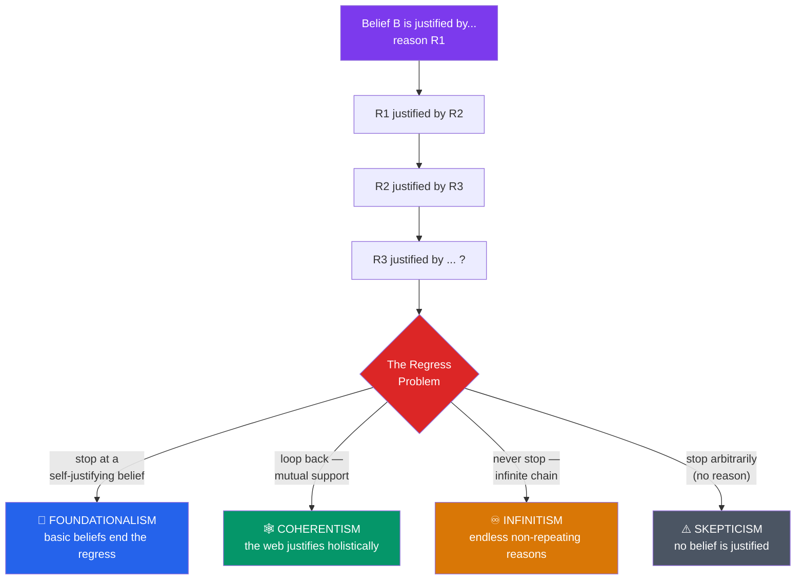

# 🏛️ Theories of Justification

> [!abstract] TL;DR
> A belief is justified when it is held for good reasons — but reasons rest on further beliefs, which need their own reasons, threatening an infinite **regress** (Agrippa's/Münchhausen trilemma: regress, circle, or arbitrary stop). Three structural responses answer it: **foundationalism** halts the regress at *basic beliefs* that are justified non-inferentially; **coherentism** rejects the linear picture entirely, holding that beliefs are justified by fitting into a mutually supporting *web*; and **infinitism** bites the bullet and accepts endless non-repeating chains. Cross-cutting this is the **internalism/externalism** debate over whether justifiers must be accessible to the believer — with **reliabilism** the leading externalist view: a belief is justified if produced by a truth-conducive process.

## Intuition — analogy first

Imagine you are constructing a building and someone keeps asking, "But what holds *that* up?"

Every floor rests on the one below. Ask what supports the top floor, and you point to the floor beneath — and beneath that, and beneath that. There are only three ways the interrogation can end. Either you reach **bedrock**: a foundation that does not itself rest on anything else (that is *foundationalism*). Or you discover the building is a self-supporting **geodesic dome** — no single foundation, but every strut braced by the others so the whole structure stands as one (that is *coherentism*). Or the tower descends **forever**, each floor genuinely supported by a new one below, with no bottom (that is *infinitism*).

The regress of reasons is exactly this "what holds it up?" pressed on beliefs instead of floors. A theory of justification is a proposal for how the questioning legitimately stops — or why it never needs to.

---

## How It Works — The Regress and Its Escapes

## Key Concepts

### The Regress Problem (Agrippa's Trilemma)

Attributed to the ancient Pyrrhonist **Agrippa** (via Sextus Empiricus) and revived as the **Münchhausen trilemma**, the argument runs: any justifying reason itself needs justification. There are only four fates for the chain of reasons, three of which look unacceptable:

| Horn | Description | Verdict |
|---|---|---|
| **Infinite regress** | Reasons continue without end | Seems impossible for finite minds to complete |
| **Circularity** | Reasons eventually justify each other | Begs the question — a belief helps justify itself |
| **Arbitrary stop** | Chain halts at an unjustified assumption | Dogmatic — the stopping point is unearned |
| **(Skepticism)** | Conclude *no* belief is justified | The unwelcome result the theories try to avoid |

Each mainstream theory of justification is best understood as accepting one horn and arguing it is not vicious.

### Foundationalism

**Foundationalism** holds that the regress terminates in **basic (foundational) beliefs** — beliefs justified *non-inferentially*, not by other beliefs. All other ("superstructure") beliefs derive their justification by inference from the base.

- **Classical / Cartesian foundationalism** (Descartes) demands that basic beliefs be *indubitable, infallible, or incorrigible* — e.g. "I think," or reports of one's own present sensations. This sets the bar very high and is widely thought too strong.
- **Modest / moderate foundationalism** (e.g. **Chisholm**, and in a fallibilist key many contemporaries) allows basic beliefs to be merely *prima facie* justified and defeasible — perceptual and introspective beliefs that carry default warrant absent defeaters.

The central challenge is explaining *what* justifies the basic beliefs without appealing to further beliefs — Sellars' "**Myth of the Given**" charges that an experience can either justify a belief (by being belief-like, hence needing its own justification) or be a bare non-cognitive cause (hence unable to justify), but not both.

### Coherentism

**Coherentism** denies the linear structure altogether. Justification is a property of a *system* of beliefs: a belief is justified to the extent that it *coheres* with — is mutually supported by, explanatorily integrated with, and free of conflict with — the rest of one's web. **Neurath's boat** is the emblem: we rebuild the ship of belief plank by plank while afloat, never able to dry-dock it on a foundation. **Laurence BonJour** gave a rigorous defense (*The Structure of Empirical Knowledge*, 1985), though he later abandoned coherentism.

Two standard objections:
- **The isolation (input) objection**: a set of beliefs could be perfectly coherent yet wholly detached from reality — a beautifully consistent delusion. Coherence seems to lack any tie to *truth* or to sensory *input*.
- **The alternative systems objection**: many equally coherent but mutually incompatible belief systems could exist; coherence alone cannot select the true one.

### Infinitism

**Infinitism** (chiefly **Peter Klein**) embraces the regress: justification requires an *infinite, non-repeating* chain of reasons. We do not need to *complete* the chain, only to be able to produce the next reason when challenged. It is a minority view but a serious attempt to show the infinite-regress horn is not vicious.

| Theory | Structure of justification | Accepts which horn | Signature worry |
|---|---|---|---|
| **Foundationalism** | Linear, terminating in basic beliefs | Arbitrary stop (reframed as *legitimate* stop) | What justifies the foundations? (Myth of the Given) |
| **Coherentism** | Holistic web, mutual support | Circularity (reframed as *holistic*, not vicious) | Isolation from reality; alternative coherent systems |
| **Infinitism** | Infinite non-repeating chain | Infinite regress (embraced) | Can finite minds have infinite reasons? |

### Internalism vs Externalism

A cross-cutting question: must the factors that justify a belief be *accessible to the believer*?

- **Internalism** says yes. On *accessibilism*, one must be able (by reflection) to access one's justifiers; on *mentalism* (Conee & Feldman), justification supervenes on internal mental states. Justification is something you can, in principle, "see" from the inside.
- **Externalism** says no. Justification can depend on facts outside the subject's awareness — reliability, causal connections, proper function. A belief can be justified even if the believer cannot cite why.

### Reliabilism

**Process reliabilism** (**Alvin Goldman**, "What Is Justified Belief?", 1979) is the leading externalist theory: *a belief is justified if it is produced by a reliable belief-forming process* — one that tends to yield a high ratio of true beliefs (perception, memory, sound inference), as opposed to unreliable ones (wishful thinking, guessing). It elegantly explains the justification of unreflective believers (young children, animals) but faces two famous problems:

- **The generality problem**: every belief token is produced by processes describable at many levels of generality ("vision" vs. "vision at dusk at 40m"), and reliability varies with the description — which one fixes justification?
- **The new evil demon problem** (Cohen, Lehrer): a victim whose experiences are demon-fed reasons exactly as we do; their processes are *unreliable* (systematically false outputs), yet intuitively their beliefs seem as *justified* as ours. This pressures the externalist link between justification and actual reliability.

**Virtue epistemology** (**Ernest Sosa**, **Linda Zagzebski**) refines the externalist strand: knowledge is *apt* belief — belief that is accurate *because* adroit, i.e. a success creditable to the agent's intellectual *competence* or *virtue*, not to luck. This reframes justification as a feature of the knower's character, and connects directly to the anti-luck program of [[The_Gettier_Problem]].

## Arguments & Examples

**Foundationalism at work.** You believe "there is a red mug on my desk." Challenged, you cite "it looks red and mug-shaped to me" — a report of your present visual experience. The foundationalist says this perceptual belief is *basic*: it is not inferred from anything more evident and can properly halt the regress. The regress stops not arbitrarily but at a belief that carries its own default warrant.

**Coherentism at work.** A detective's conclusion "the butler did it" is justified not by one indubitable clue but by how it *knits together* motive, the muddy footprint, the missing key, and the broken alibi into the most coherent overall picture. Remove any strand and the web loosens; no single premise is the "foundation," yet the whole is well supported.

**Reliabilism vs. internalism — the clairvoyant (BonJour's case).** Norman is a reliable clairvoyant: his clairvoyance always produces true beliefs, but he has *no evidence* he possesses the power and no reason to trust the belief that "the President is in New York" that pops into his head. Reliabilism must call this belief *justified* (reliable process, true output); most people's intuition says it is *not* justified because Norman has no internal access to any warrant. The case is a classic weapon *for* internalism and *against* pure reliabilism.

**Why justification matters for knowledge.** Recall from [[What_Is_Knowledge]] that JTB makes justification the third condition. Which theory of justification you adopt determines *which* true beliefs count as candidates for knowledge — and, as [[The_Gettier_Problem]] shows, even the best justification theory must still be supplemented to rule out lucky-but-justified true belief.

## Common Pitfalls / Misconceptions

- **"Foundationalism requires certainty."** Only *classical* (Cartesian) foundationalism does. Modest foundationalism accepts fallible, defeasible basic beliefs — you can be foundationally justified yet mistaken.
- **"Coherentism just means logical consistency."** Consistency is necessary but far from sufficient. Coherence involves explanatory connections, mutual support, and probabilistic fit — a consistent but disconnected list of beliefs is not coherent in the relevant sense.
- **"Circular reasoning refutes coherentism outright."** The coherentist replies that justification is *holistic*, not *linear* — the objection assumes the very one-directional model coherentism rejects. Whether that reply succeeds is contested, but the charge is not automatic.
- **"Reliabilism and internalism are rival answers to the same question."** They answer *different* questions: internalism/externalism is about *access to justifiers*; foundationalism/coherentism is about the *structure* of justification. You can be a foundationalist *and* an externalist (e.g. a reliabilist foundationalism), or a coherentist internalist.
- **"A reliable process guarantees truth."** Reliability is a *tendency* (high truth-ratio), not a guarantee. A reliable process can still yield the occasional false belief — which is why reliabilism is a *fallibilist* theory.

## Related Concepts

- [[_MOC_Epistemology|↑ Section MOC]]
- [[What_Is_Knowledge]] — Justification is the third and hardest condition of the JTB analysis this note dissects.
- [[The_Gettier_Problem]] — Shows even well-justified true belief can fail to be knowledge; drives the anti-luck refinements (safety, sensitivity, virtue).
- [[Skepticism]] — The skeptic exploits the regress: if justification can never be completed, perhaps nothing is justified.
- [[Rationalism_vs_Empiricism]] — Are the basic/foundational beliefs a priori (reason) or a posteriori (sense experience)?
- Cross-section: [[Critical_Thinking_and_Reasoning]] — Everyday argument evaluation as applied justification.
- Cross-vault: [[Bayesian_Inference]] (AI/ML) — Coherentist ideas formalized: probabilistic coherence and belief-updating without foundations.

## Review Questions

1. State Agrippa's trilemma (the regress, circularity, and arbitrary-stop horns) and explain which horn each of foundationalism, coherentism, and infinitism accepts, and why its proponents deny that horn is vicious.
2. Explain the difference between internalism and externalism about justification, then use BonJour's clairvoyant Norman to show why the case is thought to favor internalism over process reliabilism.
3. What is the isolation objection to coherentism, and how does it relate to the demand that a theory of justification connect belief to *truth*? Could a foundationalist face an analogous worry about basic beliefs?

## Sources

- Goldman, A. (1979). "What Is Justified Belief?" In G. Pappas (ed.), *Justification and Knowledge*. Reidel
- BonJour, L. (1985). *The Structure of Empirical Knowledge*. Harvard University Press
- Sellars, W. (1956). "Empiricism and the Philosophy of Mind." In *Minnesota Studies in the Philosophy of Science*, vol. 1
- Sosa, E. (2007). *A Virtue Epistemology: Apt Belief and Reflective Knowledge*. Oxford University Press

#philosophy #epistemology #justification #foundationalism #coherentism #reliabilism
