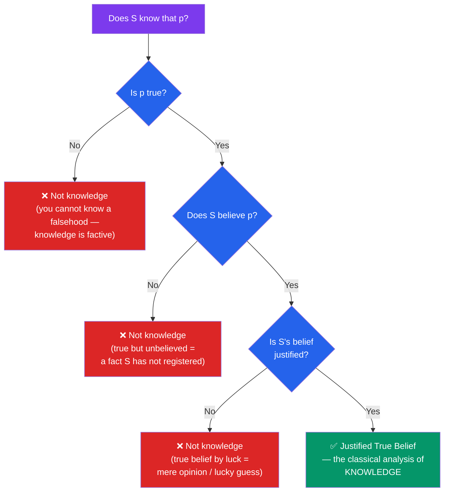

# 📖 What Is Knowledge?

> [!abstract] TL;DR
> The classical answer, traced to Plato's *Theaetetus*, analyses knowledge as **justified true belief (JTB)**: you know that *p* if and only if (1) *p* is true, (2) you believe *p*, and (3) your belief is justified. Each condition seems individually necessary — you cannot know a falsehood, cannot know what you do not believe, and a lucky guess is not knowledge. This analysis targets **propositional** knowledge ("knowing that"), which is distinct from **procedural** knowledge ("knowing how") and **knowledge by acquaintance**. The JTB analysis dominated for two millennia until Gettier showed the three conditions are not jointly *sufficient*.

## Intuition — analogy first

Think of a knowledge claim as a legal verdict rather than a hunch.

For a court to convict, three things must hold together: the defendant must actually be guilty (**truth**), the jury must be persuaded of guilt (**belief**), and the persuasion must rest on admissible evidence rather than a coin flip (**justification**). A jury that convicts a truly guilty person on a whim has reached the right answer for the wrong reasons — we do not credit them with *knowing* he did it; they got lucky. A jury persuaded by strong evidence to convict an innocent person believes something false — that is not knowledge either, however careful the reasoning.

Knowledge is the verdict where all three line up: the world cooperates (it is true), you are committed to it (you believe it), and you are entitled to that commitment (you are justified). Strip any one away and the claim to *know* collapses into mere true belief, mere opinion, or plain error.

---

## How It Works — The Tripartite Test

## Key Concepts

### The Tripartite (JTB) Analysis

The schema is stated as a set of **individually necessary and jointly sufficient** conditions:

> **S knows that p** if and only if:
> 1. **p is true** (the truth condition)
> 2. **S believes that p** (the belief condition)
> 3. **S is justified in believing that p** (the justification condition)

The pedigree runs to Plato's *Theaetetus*, where Socrates floats the definition of knowledge as "true judgement with an account (*logos*)," and to the *Meno*. Plato himself does not clearly endorse it — the *Theaetetus* ends in aporia — but the formula became the default analysis in 20th-century epistemology.

| Condition | What it rules out | Why it seems necessary |
|---|---|---|
| **Truth** | Knowing falsehoods | Knowledge is *factive*: "S knows p" entails p. "He knew the earth was flat" is a misuse; we say he *believed* it. |
| **Belief** | Knowing what you do not accept | You cannot know a fact you have never entertained or that you reject. Belief is your endorsement of the proposition. |
| **Justification** | Lucky guesses | A true belief formed by a coin flip, wishful thinking, or a broken clock is not knowledge, even when correct. Justification connects the belief to the truth non-accidentally. |

### Kinds of Knowledge

The JTB analysis is about **propositional knowledge** only. Philosophers distinguish at least three species:

| Type | Grammatical form | Object | Key figure |
|---|---|---|---|
| **Propositional** ("knowing-that") | *knows that p* | A true proposition ("that Paris is in France") | Target of JTB analysis |
| **Procedural** ("knowing-how") | *knows how to Φ* | A skill or ability (to ride a bike) | **Gilbert Ryle**, *The Concept of Mind* (1949) |
| **Acquaintance** ("knowing X") | *knows X* / is acquainted with | A direct object — a person, place, sensation | **Bertrand Russell**, "Knowledge by Acquaintance and Knowledge by Description" (1911) |

**Ryle's distinction** between knowing-how and knowing-that was aimed at *anti-intellectualism*: he argued that skills are not reducible to grasping propositions (the expert cyclist need not know the physics). **Stanley and Williamson** (2001) later pushed back, arguing knowledge-how *is* a species of knowledge-that (knowing how to Φ is knowing, of some way w, that w is a way to Φ). **Russell's** acquaintance/description contrast separates direct, non-inferential awareness (of a sense-datum, say) from knowledge routed through a definite description ("the tallest mountain").

### The Components Examined

- **Belief** is a *propositional attitude* — a mental state of holding a proposition true. It comes in degrees (credences), which complicates the binary "believes/does-not-believe" framing. A minority (radical externalists, and Williamson's "knowledge-first" program) deny that belief is even a component, treating knowledge as prior to belief.
- **Truth** makes knowledge *factive*. Which theory of truth (correspondence, coherence, deflationary) one adopts is a separate question in metaphysics; the JTB analysis is neutral on it.
- **Justification** is the most contested condition — the source of the entire literature surveyed in [[Theories_of_Justification]]. It is variously cashed out as good reasons, reliable process, epistemic virtue, or coherence.

### The Value Problem

Why prize knowledge over mere true belief? If a true belief and knowledge both get you to Larissa (Plato's example in the *Meno*), why is knowledge *better*? Plato's answer: true beliefs "run away" — they are unstable — whereas knowledge is "tied down" by an account and so is retained and reliably re-applied. Modern **virtue epistemology** (Sosa, Zagzebski) revives this: knowledge is valuable as an *achievement*, a success *creditable to* the agent's competence, not just a lucky match with the facts.

## Arguments & Examples

**The clock example (Russell, 1948).** You glance at a stopped clock that happens to read 2:00 at exactly 2:00. You form the true, seemingly justified belief that it is 2:00. Intuitively you do *not* know the time — the belief is true only by luck. This foreshadows Gettier and shows why the justification condition alone cannot secure the non-accidental link to truth.

**Truth is non-negotiable (factivity).** Compare:
- "Ptolemy knew the sun orbits the Earth." — We reject this sentence; we say he *believed* it. Because it is false, it cannot be known. This is a direct test of the truth condition in ordinary usage.
- "Ptolemy believed the sun orbits the Earth, and had reasons for it." — Perfectly acceptable. Justified *false* belief is possible; justified false *knowledge* is not.

**Belief without knowledge, knowledge without confident belief.**
- A committed flat-earther has belief and (in his eyes) justification, but no truth → no knowledge.
- An anxious student who has studied hard often *knows* the answer while sincerely doubting she does — showing belief can be present even when subjective confidence is low, and that knowledge need not feel like certainty.

**Knowing-how resists the JTB mould.** A world-class violinist knows *how* to produce vibrato but may be unable to state a single true proposition describing the muscle movements. If knowledge-how were just JTB about propositions, this would be impossible — motivating Ryle's separate category (and the ongoing Stanley–Williamson debate over whether it can be folded back in).

## Common Pitfalls / Misconceptions

- **"Knowledge requires certainty."** No. The JTB analysis demands justification, not *indubitability*. Most everyday knowledge (that you had breakfast, that Canberra is Australia's capital) is fallible and revisable yet still counts as knowledge. Conflating knowledge with certainty plays directly into the [[Skepticism|skeptic's]] hands.
- **"If it's justified, it must be true."** Justification is *fallible*. You can be fully justified in a false belief (the pre-Copernican astronomer). Justification raises the probability of truth; it does not guarantee it. This gap is exactly what [[The_Gettier_Problem|Gettier cases]] exploit.
- **"Belief and knowledge are opposites."** They are not rivals — knowledge *includes* belief. "I don't believe it, I know it" is rhetoric for high confidence, not a denial that knowing entails believing.
- **"JTB is the settled, correct definition."** It is the classical *starting point*, and it is almost universally regarded as *refuted* as a sufficient condition since 1963. Treat it as the thesis Gettier attacks, not the final word.
- **"All knowledge is propositional."** Overlooks knowing-how and acquaintance. The JTB analysis is silent about skills and direct awareness.

## Related Concepts

- [[_MOC_Epistemology|↑ Section MOC]]
- [[Theories_of_Justification]] — Unpacks the third and most contested JTB condition: what makes a belief *justified*?
- [[The_Gettier_Problem]] — The 1963 counterexamples proving JTB is not *sufficient*, and the search for a fourth condition.
- [[Rationalism_vs_Empiricism]] — Where do justified beliefs come from — reason or experience? The sources behind the justification condition.
- [[Skepticism]] — If the truth condition can never be secured against deception, can the JTB analysis ever be satisfied?
- Cross-section: [[Critical_Thinking_and_Reasoning]] — Argument evaluation as applied justification.
- Cross-vault: [[Bayesian_Inference]] (AI/ML) — Degrees of belief (credences) as a graded model of the belief condition.

## Review Questions

1. State the three conditions of the JTB analysis and, for each, give an example that satisfies the other two conditions but fails that one (e.g. a case that is believed and justified but not true). What does each failure show about why the condition is included?
2. Distinguish knowing-that, knowing-how, and knowledge by acquaintance, naming the philosopher associated with each distinction. Why did Ryle think knowing-how could not be reduced to knowing-that, and how did Stanley and Williamson respond?
3. Plato's *Meno* asks why knowledge is more valuable than mere true belief, given that both can be equally correct. Reconstruct Plato's "tied-down" answer and explain how virtue epistemology develops it.

## Sources

- Plato. *Theaetetus* and *Meno* (c. 369 BCE; e.g. trans. in *Plato: Complete Works*, ed. Cooper, Hackett, 1997)
- Gettier, E. (1963). "Is Justified True Belief Knowledge?" *Analysis*, 23(6), 121–123
- Ryle, G. (1949). *The Concept of Mind*. Hutchinson (esp. ch. 2, "Knowing How and Knowing That")
- Ichikawa, J. J. & Steup, M. (2018). "The Analysis of Knowledge." *Stanford Encyclopedia of Philosophy*

#philosophy #epistemology #knowledge #jtb #propositional-knowledge
