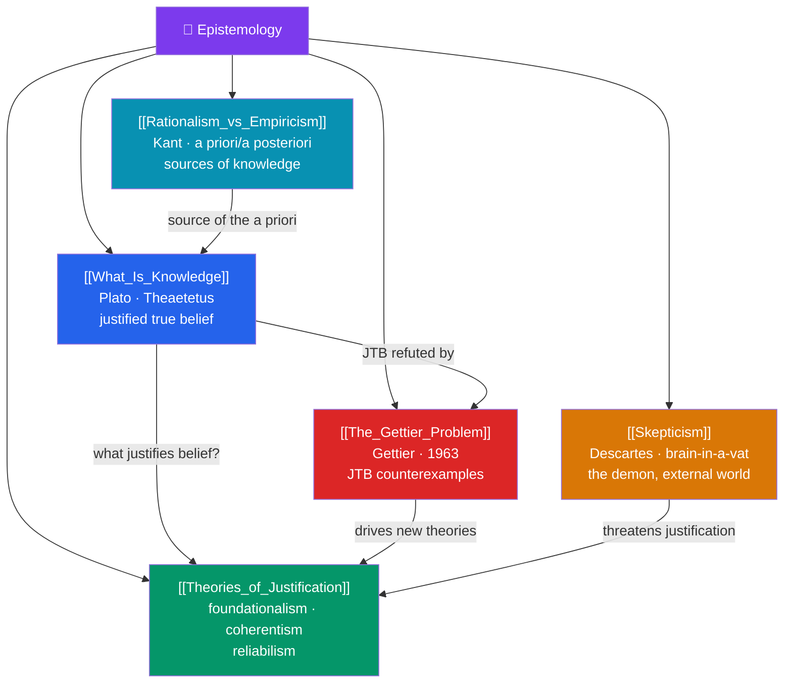

# 🗺️ Epistemology — Map of Content

> [!abstract] What This Section Covers
> Epistemology is the theory of knowledge — what it is, when it is justified, and whether we have any at all. **What Is Knowledge** examines the classical analysis of knowledge as justified true belief and why each condition seems necessary; **Theories of Justification** surveys how beliefs earn their warrant — foundationalism's basic beliefs, coherentism's web, and reliabilism's truth-tracking processes; **The Gettier Problem** presents Edmund Gettier's celebrated counterexamples that shattered the JTB analysis and the industry of repairs they spawned; **Skepticism** confronts the deepest challenge — Descartes' demon, the brain-in-a-vat, and whether we can know anything about the external world; and **Rationalism vs Empiricism** returns to the sources of knowledge, weighing a priori reason against a posteriori experience. Five notes on the reach and limits of what we can claim to know.

## Concept Map

## Learning Path

1. [[What_Is_Knowledge]] — The tripartite JTB analysis, the difference between knowing-that and knowing-how, and belief vs. knowledge.
2. [[Rationalism_vs_Empiricism]] — A priori vs a posteriori, the analytic/synthetic distinction, innate ideas, and the sources of justification.
3. [[Theories_of_Justification]] — Foundationalism and the regress problem, coherentism, internalism vs externalism, and reliabilism.
4. [[The_Gettier_Problem]] — Gettier's 1963 counterexamples, the no-false-lemmas fix, sensitivity, safety, and the "fourth condition."
5. [[Skepticism]] — Cartesian doubt, the evil demon, brain-in-a-vat, closure, and responses from Moore to contextualism.

## All Notes at a Glance

| Note | Difficulty | What You'll Learn |
|------|------------|-------------------|
| [[What_Is_Knowledge]] | Beginner → Intermediate | JTB analysis, propositional vs procedural knowledge, truth, belief, the value of knowledge |
| [[Theories_of_Justification]] | Intermediate → Advanced | Foundationalism, coherentism, the regress, internalism/externalism, reliabilism, virtue epistemology |
| [[The_Gettier_Problem]] | Intermediate | Gettier cases, epistemic luck, no-false-lemmas, sensitivity, safety, the analysis of knowledge |
| [[Skepticism]] | Intermediate → Advanced | Cartesian skepticism, brain-in-a-vat, the closure argument, Moore's proof, contextualism |
| [[Rationalism_vs_Empiricism]] | Intermediate | A priori/a posteriori, analytic/synthetic, innate ideas, Kant's synthesis, Quine's critique |

## Key Questions This Section Answers

- What must be true for you to *know* something, rather than merely believe it?
- How can a belief be justified without an infinite regress of reasons?
- Can you have a justified true belief that still fails to be knowledge?
- Could you tell whether you are a brain in a vat being fed false experiences?
- Does genuine knowledge come from reason, from experience, or from both?

## Related Sections

- [[_MOC_Philosophy_Master|↑ Philosophy Master MOC]]
- [[_MOC_Metaphysics|← Metaphysics]]
- [[_MOC_Ethics|→ Ethics]]
- Cross-section: [[Critical_Thinking_and_Reasoning]] (Introduction), [[_MOC_Philosophy_of_Science|Philosophy of Science]]
- Cross-vault: [[Bayesian_Inference]] (AI/ML)

#MOC #Philosophy #Epistemology
