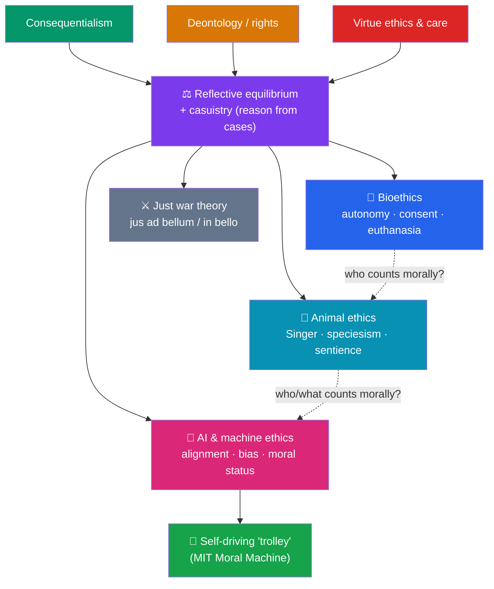

# 🌍 Applied Ethics

> [!abstract] TL;DR
> Applied ethics takes the abstract normative theories and puts them to work on concrete, contested, real-world problems. It rarely proceeds by simply *deducing* a verdict from one theory; it weighs competing principles against case judgments — a method called **reflective equilibrium**, supplemented by case-based **casuistry**. Four flagship domains: **bioethics** (the four principles — autonomy, beneficence, non-maleficence, justice — plus consent and euthanasia); **animal ethics** (Peter **Singer**'s *Animal Liberation*, the charge of **speciesism**, and Tom **Regan**'s animal rights); **AI and machine ethics** (value alignment, algorithmic bias, autonomous weapons, and the moral status of machines); and **just war theory** (*jus ad bellum* / *jus in bello*). The classic **trolley problem** returns, made literal, in the programming of **self-driving cars**.

## Intuition — analogy first

Think of the normative theories as **statute law**, and applied ethics as the **courtroom** where that law meets a messy case.

A statute ("do not kill," "maximize welfare") is written in the abstract, before anyone knows the facts of a particular dispute. But a judge faces *this* defendant, *these* circumstances, and often *two statutes that point in opposite directions*. The verdict is not read off mechanically; it is reached by interpreting the principles in light of the facts, drawing analogies to settled cases (**precedent**), and adjusting until principle and judgment cohere. When a novel case (a new technology, a new medical possibility) doesn't fit existing precedent cleanly, the law is *developed*, not merely applied.

Applied ethics works the same way. Utilitarianism and Kantian duty are the statutes; a dying patient's request, a factory farm, or a self-driving car's split-second choice is the case. The philosopher reasons from principles *and* from strong case intuitions, revising each in light of the other. This is why applied ethics is a genuine intellectual discipline and not a lookup table.

---

## How It Works — From Theory to the Clinic, the Farm, and the Machine

## Key Concepts

### From Theory to Cases — Reflective Equilibrium and Casuistry

Applied ethics seldom hands a case to a single theory and reads off the answer; theories conflict, and each faces counterexamples. Two methods dominate. **Reflective equilibrium** (John Rawls) adjusts general principles and particular case judgments against each other until they cohere — neither is sacrosanct. **Casuistry** reasons *from paradigm cases* outward by analogy (as in law and medical ethics), often reaching practical agreement even among people who disagree at the level of theory. This is why an ethics committee of a utilitarian, a Kantian, and a virtue ethicist can still converge on a policy.

### Bioethics — the Four Principles, Autonomy, and Euthanasia

The most influential framework is **Beauchamp and Childress's four principles** (*Principles of Biomedical Ethics*, 1979) — deliberately theory-neutral *prima facie* duties to be balanced case by case:

| Principle | What it requires | Typical tension |
|---|---|---|
| **Autonomy** | Respect competent patients' informed choices | vs paternalistic beneficence |
| **Beneficence** | Act for the patient's good | vs respecting a refusal of treatment |
| **Non-maleficence** | "First, do no harm" | vs risky but potentially curative interventions |
| **Justice** | Distribute benefits/burdens fairly | vs maximizing one patient's outcome |

**Euthanasia** is the paradigm bioethics dispute, structured by several distinctions: **voluntary / non-voluntary / involuntary**; **active** (administering a lethal agent) vs **passive** (withdrawing/withholding treatment); and **euthanasia** vs **physician-assisted suicide**. The core clash is between **autonomy and quality of life** (a competent person may judge their life no longer worth living) and the **sanctity of life** plus worries about a slippery slope to abuse. **James Rachels** ("Active and Passive Euthanasia," *NEJM* 1975) argued the active/passive distinction is *not* morally decisive: if the outcome and intention are the same, letting die can be no better than killing, and may be worse (it can prolong suffering).

### Animal Ethics — Singer, Speciesism, and Rights

**Peter Singer**'s *Animal Liberation* (1975) launched the modern movement from a **utilitarian** base. His premise is the **principle of equal consideration of interests**: if a being can *suffer*, its suffering must count equally with the like suffering of any other being. The morally relevant criterion is **sentience**, not species membership, intelligence, or language — echoing Bentham's "the question is not, *Can they reason?* … but, *Can they suffer?*" To weight a being's interests less *simply because* of its species is **speciesism**, a prejudice Singer argues is structurally like racism or sexism. His **argument from marginal cases** presses the point: whatever capacity we cite to exclude animals (rationality, autonomy) is also lacking in some humans (infants, the severely cognitively impaired) whom we would never treat as mere resources. A rival, **Tom Regan** (*The Case for Animal Rights*, 1983), rejects the utilitarian framing: mammals are **"subjects-of-a-life"** with **inherent value** and hence **rights**, so exploiting them is wrong even if it maximizes aggregate welfare.

### AI and Machine Ethics

A fast-growing domain with two distinct questions often run together:

- **Machines as moral *agents* / tools** — the ethics of *building and deploying* AI: the **value alignment problem** (ensuring systems pursue intended goals — see **specification gaming** and reward hacking), **algorithmic bias** (e.g., the **COMPAS** recidivism-risk controversy), transparency and accountability (the "black box"), the **responsibility gap** when no human directly makes a harmful decision, and **lethal autonomous weapons**.
- **Machines as moral *patients*** — the further, more speculative question of whether an AI could ever have **moral status** (interests that matter for its own sake), which would turn on contested facts about sentience and consciousness.

Machine ethics also asks whether moral reasoning can be *implemented* — "top-down" rule-encoding (a Kantian or Asimov-style constraint set) vs "bottom-up" learning of norms from data or feedback. See the cross-vault [[_MOC_AI_ML_Master]] for the technical side of alignment.

### The Trolley Problem in Self-Driving Cars

The classic **trolley problem** (see [[Consequentialism_and_Utilitarianism]]) becomes literal when an autonomous vehicle facing unavoidable harm must be *pre-programmed* to choose — swerve into one pedestrian to spare several, protect the occupant or the greater number, and so on. MIT's **Moral Machine** experiment (Awad et al., *Nature*, 2018) crowdsourced ~40 million such judgments across 233 countries, finding broad but *culturally variable* preferences (e.g., sparing the many, sparing the young). But there are crucial **disanalogies** from the thought experiment: the choice is made *in advance* by engineers and regulators (not by an agent in the moment), it is *statistical* rather than certain, and it raises a **responsibility gap** — who is accountable, the manufacturer, the programmer, the owner, or the regulator? Many ethicists argue the trolley framing is a *distraction* from the real, mundane safety-engineering that actually reduces harm.

### Just War Theory

The oldest applied-ethics tradition (Augustine, Aquinas, Grotius; modern locus classicus Michael **Walzer**, *Just and Unjust Wars*, 1977) evaluates armed conflict in three parts: **jus ad bellum** (when it is just to *go* to war: just cause, legitimate authority, right intention, proportionality, reasonable prospect of success, last resort); **jus in bello** (how war may justly be *fought*: **discrimination** / non-combatant immunity, and proportionality of means); and the newer **jus post bellum** (justice in ending war and building peace). A key structural feature is the **independence** of the two: a war can be unjustly *begun* yet fought by rules, or justly begun yet fought with atrocities.

## Arguments & Examples

**Singer's drowning-child argument, applied.** Singer extends utilitarian impartiality to global poverty: if you can prevent something very bad (a child drowning, a child dying of a preventable disease) at small cost to yourself, you ought to — and physical distance is not morally relevant. Applied, this implies affluent people are obligated to give substantially to effective aid, a demanding conclusion that anchors the **effective altruism** movement and connects directly to the *demandingness* objection to utilitarianism.

**Rachels' twin cases.** To show the active/passive distinction can't carry moral weight, Rachels imagines Smith, who *drowns* his young cousin for an inheritance, and Jones, who *would have* drowned the cousin but finds the child slips, hits his head, and simply *lets him die*. Both act from the same motive to the same end; almost no one thinks Jones is less blameworthy merely because he "only let it happen." If killing and letting-die can be morally equivalent, the neat active/passive line in euthanasia policy needs re-examination.

**Where domains converge on one question: *who counts?*** Bioethics (which humans, at which stages, have full moral status?), animal ethics (does sentience suffice?), and AI ethics (could an artefact ever count?) are all, at bottom, disputes about the **scope of the moral community**. Getting the *criterion* right — sentience, rationality, being a subject-of-a-life — does more work than choosing a normative theory, because it fixes *whose* interests the theory then aggregates or respects.

## Common Pitfalls / Misconceptions

- **"Applied ethics is just plugging facts into a formula."** Most hard cases involve *conflicting* principles with no master rule to rank them; the work is in the weighing, not a calculation.
- **The appeal to nature.** "It's natural to eat meat / natural to die without intervention" commits the naturalistic fallacy (see [[Metaethics]]): what *is* natural does not entail what we *ought* to do.
- **Treating the self-driving car as a literal trolley.** The disanalogies (advance programming, probabilities, diffuse responsibility) matter; importing the thought experiment wholesale distorts the real engineering and policy questions.
- **Conflating moral agency with moral patiency in AI.** "Can it be held responsible?" and "does it deserve protection?" are separate questions with separate criteria; running them together muddles the debate.
- **Stating slippery-slope claims as if proven.** In euthanasia and biotech, "this will inevitably lead to abuse" is an *empirical* prediction that needs evidence, not a self-evident premise.

## Related Concepts

- [[_MOC_Ethics|↑ Section MOC]]
- [[What_Is_Ethics]] — The branch structure that places "applied ethics" beside normative ethics and metaethics
- [[Consequentialism_and_Utilitarianism]] — The engine of Singer's animal ethics and of the self-driving-car "greater number" reasoning
- [[Deontology_and_Kantian_Ethics]] — Rights-based limits (Regan's animal rights, non-combatant immunity) that resist pure aggregation
- [[Virtue_Ethics]] — Care ethics and character-based approaches in clinical and professional ethics
- [[Metaethics]] — Why first-order moral disagreement in applied ethics need not imply there is "no fact of the matter"
- Cross-vault: [[_MOC_AI_ML_Master]] — the technical grounding of alignment, bias, and machine-learning systems whose ethics this note treats

## Review Questions

1. State **Peter Singer's** argument from the *principle of equal consideration of interests* to the wrongness of **speciesism**. Then explain the **argument from marginal cases** and how it blocks the appeal to rationality as a species-dividing line.
2. Explain **Rachels'** challenge to the **active/passive** distinction using the Smith-and-Jones cases. What follows for the ethics and policy of euthanasia if the distinction lacks moral significance?
3. Give **two morally relevant disanalogies** between the classic trolley problem and the "trolley problem" faced by a self-driving car. Why do these disanalogies make the **responsibility gap**, not the dilemma itself, the harder problem?

## Sources

- Beauchamp, T. & Childress, J. (1979). *Principles of Biomedical Ethics*. Oxford University Press.
- Singer, P. (1975). *Animal Liberation*. HarperCollins; Rachels, J. (1975). "Active and Passive Euthanasia." *New England Journal of Medicine* 292, 78–80.
- Walzer, M. (1977). *Just and Unjust Wars*. Basic Books.
- Awad, E. et al. (2018). "The Moral Machine experiment." *Nature* 563, 59–64.

#philosophy #ethics #applied-ethics #bioethics #animal-ethics
