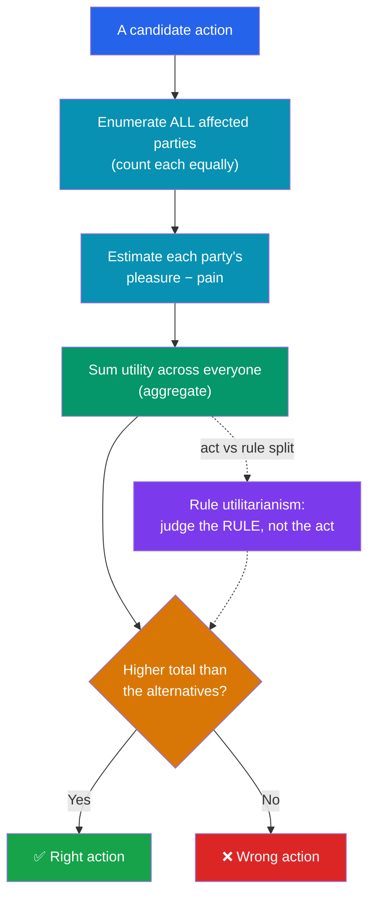

# ⚖️ Consequentialism and Utilitarianism

> [!abstract] TL;DR
> **Consequentialism** holds that the rightness of an act depends only on its outcomes; **utilitarianism** is the version that identifies the good outcome as the greatest aggregate well-being. **Jeremy Bentham** proposed a quantitative *hedonic calculus* summing pleasures and pains; **John Stuart Mill** refined it by distinguishing *higher* (intellectual) from *lower* (bodily) pleasures. The theory splits into **act** utilitarianism (maximize utility in *this* choice) and **rule** utilitarianism (follow the *rules* whose general adoption maximizes utility). The **trolley problem** exposes both its appeal and its clash with rights. Major objections — the **utility monster**, **demandingness**, the trampling of **rights**, and the **separateness of persons** — target aggregation itself.

## Intuition — analogy first

Think of a consequentialist as a **portfolio manager for the world's well-being**.

A good fund manager doesn't care about the *story* behind a trade, who made it, or whether it "feels" loyal to a favorite stock. There is exactly one metric: did the total return go up? Every decision is justified purely by its effect on the bottom line. If dropping a beloved but underperforming holding raises the portfolio's value, sentiment is irrelevant — you sell.

Utilitarianism treats *happiness* as that bottom line and *everyone* as an account in the fund. An action is a "good trade" if and only if it raises the total balance of well-being across all affected parties, counting each person's welfare equally. The moral genius of this view is its impartiality — your happiness counts, but so does a stranger's, exactly the same. Its notoriety comes from the same source: like the fund manager, it will sacrifice an individual "position" whenever the aggregate improves.

---

## How It Works — From Outcomes to a Verdict

## Key Concepts

### The Core Commitments

Consequentialism has three moving parts:

1. **Consequentialism** — only *outcomes* determine rightness (not motives, rules, or character).
2. **Welfarism** — the outcome that matters is *well-being* (utilitarianism's specific claim).
3. **Aggregation + impartiality** — sum well-being across all persons, each counting for one and no one for more than one.

### Bentham and the Hedonic Calculus

**Jeremy Bentham** (1789) was a *hedonist* about value: pleasure is the only good, pain the only evil. He proposed the **hedonic (felicific) calculus** to make morality quasi-mathematical, scoring each pleasure or pain along dimensions:

| Dimension | What it measures |
|---|---|
| **Intensity** | How strong is the pleasure/pain? |
| **Duration** | How long does it last? |
| **Certainty** | How likely is it to occur? |
| **Propinquity** | How soon will it occur? |
| **Fecundity** | Will it be followed by more of the same? |
| **Purity** | Will it be followed by its opposite? |
| **Extent** | How many people are affected? |

For Bentham all pleasures are commensurable: *"the quantity of pleasure being equal, push-pin is as good as poetry."* A simple parlor game and great literature differ only in how much pleasure they produce, not in kind.

### Mill and Higher vs Lower Pleasures

**John Stuart Mill** (1863) found pure quantity too crude — it seemed to reduce humans to "swine." He introduced a *qualitative* distinction: **higher pleasures** (intellectual, aesthetic, moral) are superior *in kind* to **lower pleasures** (bodily). His test: a pleasure is higher if people **competently acquainted with both** reliably prefer it, even at a cost in quantity. Hence his famous line: *"It is better to be a human being dissatisfied than a pig satisfied; better to be Socrates dissatisfied than a fool satisfied."* Critics note this seems to smuggle a *non-utilitarian* standard of value into the theory.

### Act vs Rule Utilitarianism

| | **Act Utilitarianism** | **Rule Utilitarianism** |
|---|---|---|
| Unit of evaluation | The individual act | The general rule/practice |
| Test | Does *this act* maximize utility? | Does the *rule whose general adoption* maximizes utility? |
| Strength | Perfectly flexible, never rule-bound | Protects promises, honesty, rights as reliable practices |
| Weakness | Can justify one-off atrocities; unpredictable | Can collapse into act utilitarianism, or ossify into "rule worship" |

Rule utilitarianism answers many stock objections: framing an innocent may maximize utility *this time*, but a *rule* permitting officials to frame innocents would, if generally adopted, erode trust and produce worse outcomes overall — so it's forbidden.

### The Trolley Problem

Introduced by **Philippa Foot** (1967) and developed by **Judith Jarvis Thomson** (1976):

- **Switch case**: a runaway trolley will kill five; you can divert it to a side track where it kills one. Most people say *divert* — and utilitarianism agrees (5 > 1).
- **Footbridge case**: the only way to stop the trolley is to push a large bystander off a bridge onto the tracks, killing him to save five. Most people say *don't* — yet the utilitarian arithmetic is identical.

The asymmetry is the point. Our intuitions track *how* the harm is brought about (using someone as a mere means, doing vs allowing), which a pure "5 > 1" calculus cannot see. This is a central data point for [[Deontology_and_Kantian_Ethics]] and reappears in self-driving cars (see [[Applied_Ethics]]).

### The Major Objections

- **The utility monster** (Robert Nozick): a being that derives enormously more pleasure from resources than anyone else. Strict aggregation demands we feed it *everything*, starving the many for the one — a *reductio* of pure summation.
- **Demandingness** (Bernard Williams, Peter Singer's own drowning-child logic): if every spare dollar could do more good donated than spent on yourself, morality seems to require near-total self-sacrifice, leaving no room for personal projects.
- **Rights and justice**: utilitarianism has no built-in barrier against sacrificing an innocent (organ-harvesting one patient to save five) when the numbers favor it. It treats rights as, at best, useful rules of thumb.
- **The separateness of persons** (Rawls, Nozick): aggregation treats humanity as one giant vessel of utility, letting one person's loss be "compensated" by another's gain. But there is no single subject who experiences the net benefit — the sacrificed person gains nothing. Utilitarianism, the charge goes, "does not take seriously the distinction between persons."

## Arguments & Examples

**Why the theory is attractive.** Consider triage after a disaster: with limited medics, treating those you can actually save rather than the unsalvageable is obviously right, and utilitarianism explains *why* cleanly — maximize lives saved, impartially. Public health, cost-benefit regulation, and pandemic vaccine allocation all lean on broadly consequentialist reasoning. Its impartiality also underwrote historically radical conclusions: Bentham condemned slavery and cruelty to animals ("the question is not, Can they *reason*? nor, Can they *talk*? but, Can they *suffer*?") precisely because *all* suffering counts equally.

**Where the arithmetic bites.** The **transplant surgeon**: five patients need five different organs; one healthy person walks in for a checkup. Act utilitarianism's naive verdict — harvest the one to save five — is monstrous, and nearly everyone rejects it. The rule utilitarian escapes (a rule licensing surgeons to murder patients would destroy medicine), but the act utilitarian must either bite the bullet or add epicycles. This case, structurally identical to the trolley footbridge, is the strongest intuitive evidence that *outcomes are not all that matter*.

**Rule worship.** Suppose the utility-maximizing rule is "keep promises," and one day breaking a trivial promise would clearly produce more happiness with no side effects. The rule utilitarian who still keeps it looks irrational — worshipping the rule over the good it was meant to serve. Push hard enough and rule utilitarianism seems to collapse back into act utilitarianism; this instability is a live problem for the view.

## Common Pitfalls / Misconceptions

- **"Utilitarianism = selfish pleasure-seeking."** The opposite: it is radically *impartial*, weighting your own pleasure no more than a stranger's. It is often *too* self-sacrificing (demandingness), not too selfish.
- **Confusing consequentialism with utilitarianism.** Utilitarianism is one consequentialism (welfare-maximizing). Others count different goods — preference-satisfaction, or plural objective goods (perfectionism).
- **Ignoring the act/rule distinction.** Many "gotcha" objections (framing the innocent) hit *act* utilitarianism but are deflected by *rule* utilitarianism.
- **Assuming utility is easily measurable.** Interpersonal comparison and prediction of consequences are genuinely hard; critics argue the calculus is often a fig leaf for guesswork.
- **Thinking the trolley problem "proves" utilitarianism false.** It shows a *tension* with intuition; a committed utilitarian can bite the bullet and reject the intuition as bias (see the debate with [[Cognitive_Biases]]).

## Related Concepts

- [[_MOC_Ethics|↑ Section MOC]]
- [[What_Is_Ethics]] — Where consequentialism sits among the normative traditions
- [[Deontology_and_Kantian_Ethics]] — The chief rival: duty and rights over outcomes; the trolley footbridge is its home turf
- [[Virtue_Ethics]] — Focuses on character rather than act-evaluation altogether
- [[Applied_Ethics]] — Utilitarian reasoning in bioethics, animal ethics, and self-driving cars
- [[Metaethics]] — Whether "well-being is the only good" is objectively true
- Cross-vault: [[_MOC_Game_Theory_Master]] — aggregation, cooperation, and social-welfare functions; [[Cognitive_Biases]] — whether footbridge intuitions are trustworthy signals or artifacts

## Review Questions

1. Explain how **rule** utilitarianism handles the "frame an innocent man to prevent a riot" objection that troubles **act** utilitarianism. Then explain the "rule worship" charge that this move invites.
2. The trolley *switch* and *footbridge* cases have identical body counts (kill 1, save 5), yet most people judge them differently. What morally relevant difference are ordinary intuitions tracking, and why can't a pure hedonic calculus represent it?
3. State the "separateness of persons" objection (Rawls/Nozick). Why is it considered a deeper criticism than the mere claim that utilitarianism is hard to calculate?

## Sources

- Bentham, J. (1789). *An Introduction to the Principles of Morals and Legislation*.
- Mill, J.S. (1863). *Utilitarianism*.
- Foot, P. (1967). "The Problem of Abortion and the Doctrine of the Double Effect." *Oxford Review* 5; Thomson, J.J. (1985). "The Trolley Problem." *Yale Law Journal* 94.
- Smart, J.J.C. & Williams, B. (1973). *Utilitarianism: For and Against*. Cambridge University Press.

#philosophy #ethics #utilitarianism #consequentialism #trolley-problem
