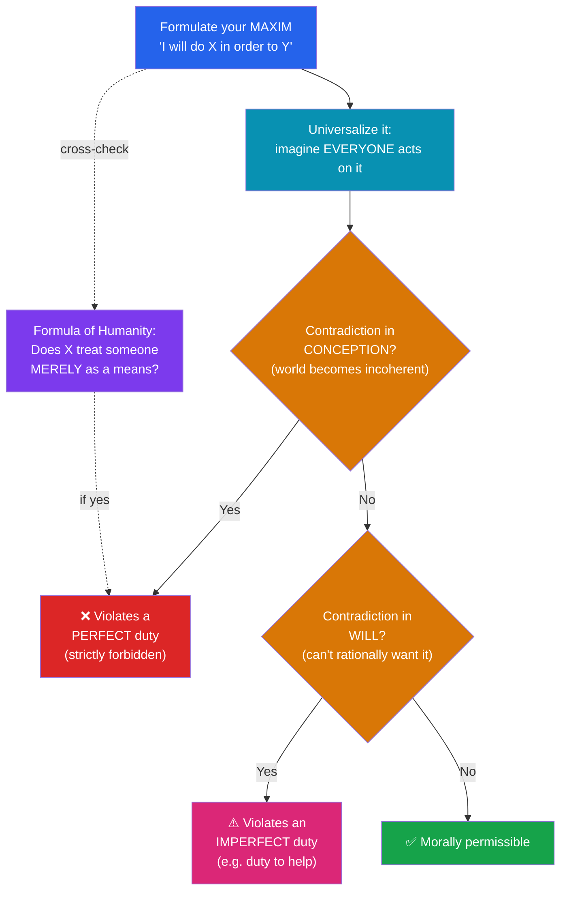

# 🪧 Deontology and Kantian Ethics

> [!abstract] TL;DR
> **Deontology** locates rightness in *duty* and in the *nature of the act itself*, not in its consequences: some actions (lying, killing the innocent, using people as tools) are forbidden even when they would produce better outcomes. Its towering figure is **Immanuel Kant**, who grounds morality in reason alone. Only a **good will** — acting *from duty* — has unconditional worth. The supreme principle is the **categorical imperative**, expressed in two key formulas: the **Formula of Universal Law** (act only on a maxim you could will as a universal law) and the **Formula of Humanity** (treat humanity always as an *end*, never *merely* as a means). Morality flows from rational **autonomy**. **Rights-based deontologies** extend the "persons as ends" idea into inviolable claims. Classic objections: **conflicting duties** and Kant's own uncompromising answer to the **inquiring murderer**.

## Intuition — analogy first

Think of deontology as **constitutional rights versus a cost-benefit spreadsheet**.

A utilitarian city planner might calculate that bulldozing one family's home raises total welfare — more parking for thousands. A constitution says: *no.* Certain protections are **side constraints**, not quantities to be traded away. It doesn't matter how large the aggregate benefit is; you may not seize the home without due process, because the family has a *right* that functions as a hard wall around them, not a weight on a scale.

Deontology treats *persons* the way a constitution treats rights: as bearers of a dignity that cannot be overridden by adding up other people's gains. Where the utilitarian asks "what maximizes the total?", the deontologist asks "what may I do *to this person*, consistent with respecting them as a rational agent?" The wall comes first; the arithmetic is not even allowed to run.

---

## How It Works — The Kantian Test for a Maxim

## Key Concepts

### The Good Will and Acting From Duty

Kant opens the *Groundwork* (1785) with a striking claim: *"Nothing in the world can be conceived as good without qualification except a good will."* Intelligence, courage, even happiness can be used for evil; only the good will is unconditionally good. Its worth lies not in what it achieves but in its **willing** — acting *from duty* rather than from inclination.

Kant's famous, contested example: a shopkeeper who deals honestly *because* it's good for business acts *in accordance with* duty but not *from* it. The person who is naturally kind gets no *moral* credit either — they follow inclination. Moral worth shows most clearly in the person who helps others *despite* feeling no warmth, purely because duty requires it. (Critics find this cold; defenders reply Kant is isolating what makes an act specifically *moral*, not denying that warmth is good.)

### Categorical vs Hypothetical Imperatives

- A **hypothetical imperative** commands conditionally: *"If* you want to be healthy, exercise." Its force depends on your desires.
- A **categorical imperative** commands unconditionally: *"Do not lie"* — binding on all rational agents regardless of what they want. Morality, Kant argues, must be categorical; otherwise it would collapse into mere prudence.

### The Categorical Imperative — Two Key Formulas

Kant gives several formulations of what he insists is *one* principle:

| Formula | Statement | What it tests |
|---|---|---|
| **Universal Law** (FUL) | "Act only on that maxim you can at the same time will to become a universal law." | Whether your policy could be **coherently universalized** without self-defeat |
| **Humanity as End** (FH) | "Act so as to treat humanity, whether in your own person or another's, always as an end and never *merely* as a means." | Whether you **respect rational agency** — using someone without their possible consent |
| **Kingdom of Ends** | "Act as a legislating member of a kingdom in which all are ends in themselves." | Whether your maxim fits a community of mutually respecting rational agents |

The word **merely** in FH is crucial. We use people as means constantly — the barista serves you coffee. That is permissible because the transaction respects them as a rational agent who consents. The wrong is treating someone *merely* as a tool — deception and coercion are the paradigm cases, because they bypass the other's rational consent.

### Perfect vs Imperfect Duties

- **Perfect duties** admit no exceptions and correspond to *contradictions in conception* — e.g., the duty *not* to make a lying promise. A world where everyone made lying promises would destroy the institution of promising, so the maxim can't even be conceived as universal.
- **Imperfect duties** allow latitude in how and when we fulfill them, and correspond to *contradictions in will* — e.g., the duty to develop talents or help others. You *can* imagine a world of universal indifference, but you cannot rationally *will* it, since as a needy rational agent you'd want others' help.

### Autonomy

Kant's deepest idea: in obeying the moral law, the rational agent is **not** submitting to an external authority but to a law it gives *itself* through reason. This is **autonomy** (self-legislation), opposed to **heteronomy** (being governed by desire, custom, or command). This is Kant's answer to the Euthyphro problem (see [[What_Is_Ethics]]): morality is neither arbitrary fiat nor an external Platonic fact, but the necessary structure of rational agency. It also grounds **human dignity** — because we are self-legislating, we have a worth beyond price. Kant's "Copernican turn" placing the rational subject at the center of philosophy runs through his ethics as well as his epistemology (see [[Kant_and_the_Copernican_Turn]]).

### Rights-Based Deontology

Not all deontology is Kantian. **Rights-based** theories (e.g., Robert Nozick, and in different form W.D. Ross) treat persons as bearers of **claim-rights** that act as **side constraints** on how others may treat them. Nozick's slogan: individuals are ends, so there are things "no person or group may do to them (without violating their rights)." **W.D. Ross** (1930) offered a pluralist alternative: a set of ***prima facie* duties** (fidelity, reparation, gratitude, justice, beneficence, non-maleficence, self-improvement) that can conflict and be outweighed, with no master formula — practical wisdom decides which is *actual* in a given case. Ross's view softens Kant's rigidity while keeping the anti-consequentialist core.

## Arguments & Examples

**The lying promise, worked through.** Your maxim: "I'll make a promise I intend to break whenever it gets me out of a jam." Universalize it: everyone makes insincere promises freely. Then promising itself becomes worthless — no one would believe a promise, so the very institution you're exploiting evaporates. The maxim is **self-defeating**: it can only work if it is *not* universal. That contradiction in conception marks lying promises as violating a **perfect duty**, forbidden with no cost-benefit exception. Notice how differently this reasons from [[Consequentialism_and_Utilitarianism]]: no consequences are tallied at all.

**The footbridge, deontologically.** In the trolley footbridge case, pushing the large man *uses him merely as a means* — his body is the tool that stops the trolley; without him you gain nothing. That's why deontology forbids it even to save five, and why most people's intuitions (which recoil from the footbridge but permit the switch) look *deontological* rather than utilitarian. The switch case is different: the one death is a *foreseen side effect* of diverting the threat, not a *means* — the Doctrine of Double Effect.

**The inquiring murderer — the hardest objection.** In a notorious 1797 essay, Kant argues you may **not** lie even to a murderer who asks where your friend is hiding. Because the perfect duty not to lie is exceptionless, Kant bites an extraordinary bullet. Critics find this a *reductio* of strict universalism. Responses: (a) Kantians distinguish *lying* from *refusing to answer* or misleading without asserting a falsehood; (b) contemporary Kantians (Korsgaard) argue that a murderer's coercive question forfeits the conditions of honest dialogue, so ordinary duties don't straightforwardly apply. The case remains the standard pressure test for absolutism.

## Common Pitfalls / Misconceptions

- **"Deontology means never using anyone."** No — it forbids using someone *merely* as a means. Consensual, respectful transactions are fine.
- **Reading the categorical imperative as the Golden Rule.** The Golden Rule ("do unto others…") indexes to *your* preferences; the CI is a formal *consistency* test on universalized maxims, and Kant explicitly distinguished them.
- **Thinking universalizability just means "what if everyone did that?" as a consequence check.** It is a test of *logical/rational coherence* of the maxim, not a prediction of bad outcomes — that would smuggle in consequentialism.
- **Assuming duties can't conflict.** Kant thought genuine perfect duties never truly conflict; Ross built his whole system around admitting they do, resolving them by *prima facie* weighting.
- **Equating "acting from duty" with joyless obligation.** Kant's point is about the *source* of moral worth, not that virtuous people must be miserable.

## Related Concepts

- [[_MOC_Ethics|↑ Section MOC]]
- [[What_Is_Ethics]] — Deontology's place among the normative traditions; the Euthyphro problem Kant's autonomy answers
- [[Consequentialism_and_Utilitarianism]] — The rival it defines itself against; the trolley footbridge is the shared battleground
- [[Virtue_Ethics]] — Criticizes both for reducing ethics to a rule/procedure
- [[Metaethics]] — Whether the categorical imperative is a rational *truth* or a construction
- [[Applied_Ethics]] — Rights, consent, and "dignity" in bioethics and AI
- Cross-vault: [[Kant_and_the_Copernican_Turn]] — Kant's reorientation of philosophy around the rational subject, the root of his ethics; [[Stoicism]] — an earlier duty-and-reason tradition

## Review Questions

1. Explain the difference between acting *in accordance with* duty and acting *from* duty, using Kant's honest-shopkeeper example. Why does Kant think only the latter has moral worth, and what is the main objection to this?
2. Take the maxim "borrow money on a promise I don't intend to keep." Show precisely how it generates a *contradiction in conception* under the Formula of Universal Law, and explain why this makes it a *perfect* rather than *imperfect* duty.
3. State the inquiring-murderer objection. Give one way a modern Kantian tries to avoid the conclusion that you must tell the truth to the murderer, and assess whether it succeeds.

## Sources

- Kant, I. (1785). *Groundwork of the Metaphysics of Morals*. Trans. M. Gregor, Cambridge University Press.
- Kant, I. (1797). "On a Supposed Right to Lie from Philanthropy."
- Ross, W.D. (1930). *The Right and the Good*. Oxford University Press.
- Korsgaard, C. (1996). *Creating the Kingdom of Ends*. Cambridge University Press.

#philosophy #ethics #kant #deontology #categorical-imperative
