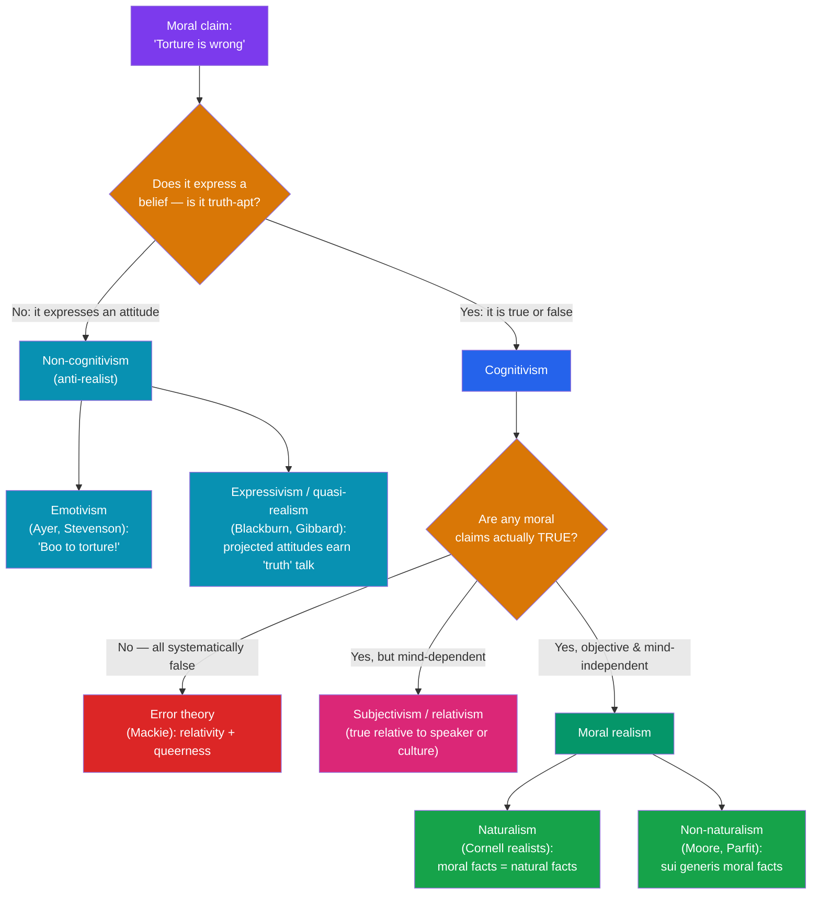

# 🪞 Metaethics

> [!abstract] TL;DR
> Metaethics does not ask *what* is right; it asks what we are *doing* when we call something right. It has three linked questions — **semantics** (what moral sentences mean), **ontology** (whether moral facts exist), and **epistemology** (how we could know them). The master axis is **moral realism** (there are objective, mind-independent moral facts) versus **anti-realism**. It is cross-cut by **cognitivism** (moral claims express beliefs and are true or false) versus **non-cognitivism** (they express attitudes — emotivism's "*boo/hooray*", and its sophisticated heir, **expressivism**). **J.L. Mackie's error theory** is cognitivist but says all moral claims are *false*, arguing from **relativity** and **queerness**. Underneath sit two classic obstacles to reducing morality to plain facts: **Hume's is–ought gap** and **G.E. Moore's open-question argument**.

## Intuition — analogy first

When you say **"chocolate ice cream is delicious,"** what are you doing?

Three answers compete. (a) You're **reporting a fact** about the ice cream — its deliciousness is out there to be discovered. (b) You're merely **venting a preference** — "yum!" dressed up as a statement, with no fact of the matter. (c) You *intend* to state an objective fact, but you're **systematically mistaken**, because there simply is no property of mind-independent "deliciousness" for your claim to be true of.

Metaethics asks *exactly this* about **"torture is wrong."** Notice that the debate is **not** whether torture is wrong — a realist and an anti-realist can agree it is monstrous. The debate is about what *kind of thing* that judgment is: a description of moral reality, an expression of attitude, or a well-meaning error. It is the difference between arguing over a chess move (that's *normative* ethics) and arguing over whether the pieces and "checkmate" refer to anything real (that's *metaethics*). The colour case is the deepest analogy: is "the tomato is red" a fact about the tomato, or a projection of our visual system onto a colourless world? Realism vs anti-realism about *value* runs precisely parallel.

---

## How It Works — The Map of Positions

## Key Concepts

### The Three Questions

Metaethics is defined by *stepping back* from first-order ethics to ask:

- **Semantics** — What do moral sentences *mean*? Do they state facts (and so can be true/false) or perform some other function (expressing feeling, commanding)?
- **Ontology / metaphysics** — Are there moral *facts* or *properties*, and if so, are they part of the natural world, mind-independent, or reducible to something else?
- **Epistemology** — If there are moral facts, *how could we know them*? By reason, perception, intuition, or empirical inquiry?

### Realism vs Anti-Realism

**Moral realism** holds that there are objective moral facts, true independently of what anyone thinks or feels — "gratuitous cruelty is wrong" would be true even if everyone approved of it. Realism splits into **naturalism** (moral facts just *are* natural facts, discoverable like other facts — the **Cornell realists**: Boyd, Brink, Railton) and **non-naturalism** (moral facts are real but *sui generis*, not reducible to natural properties — **Moore**, and in our time **Derek Parfit**). **Anti-realism** denies mind-independent moral facts, and comes in cognitivist (error theory, subjectivism) and non-cognitivist (emotivism, expressivism) flavours.

### Cognitivism vs Non-Cognitivism

This is a claim about **semantics**: what *mental state* a moral utterance expresses. Cognitivists say it expresses a **belief** (a representation that can be true or false); non-cognitivists say it expresses a **conative attitude** (desire, approval, a plan). The two axes together produce the standard grid:

| Position | Cognitivist? | Moral facts exist? | Are moral claims *true*? |
|---|---|---|---|
| **Non-naturalist realism** (Moore) | Yes | Yes (non-natural) | Some are objectively true |
| **Naturalist realism** (Railton) | Yes | Yes (natural) | Some are objectively true |
| **Subjectivism / relativism** | Yes | Mind-dependent | True *relative to* speaker/culture |
| **Error theory** (Mackie) | Yes | **No** | **All false** (they presuppose facts that don't exist) |
| **Emotivism** (Ayer) | **No** | No | Neither true nor false |
| **Expressivism** (Blackburn) | **No** (but earns truth-talk) | No | "True" only in a deflated, quasi-realist sense |

### Emotivism and Expressivism

**Emotivism** — the "boo/hooray" theory — was A.J. **Ayer**'s logical-positivist verdict (*Language, Truth and Logic*, 1936): since "you acted wrongly" can't be verified empirically or by logic, it states *no fact*; it merely **evinces feeling** and seeks to arouse it in others. C.L. **Stevenson** added that moral language is also *dynamic* — it aims to influence attitudes and behaviour. **Expressivism** (Simon **Blackburn**'s *quasi-realism*, Allan **Gibbard**'s norm-expressivism) is the sophisticated descendant: it agrees moral claims express attitudes rather than describe facts, but tries to *earn back* the ordinary features of moral talk — that we treat moral claims as true, argue over them, and embed them in logical inferences — without positing moral facts.

### Mackie's Error Theory

**J.L. Mackie** (*Ethics: Inventing Right and Wrong*, 1977) opens with the bold thesis: **"There are no objective values."** He is a cognitivist (ordinary moral discourse really does *purport* to describe objective prescriptive facts) but argues that discourse rests on a false presupposition, so *all* positive moral claims are false — an **error theory**, structurally like atheism about God-talk. Two arguments:

- **The argument from relativity (disagreement):** deep, persistent moral variation across cultures and eras is better explained by people *reflecting different ways of life* than by their differentially *perceiving* a single objective moral reality.
- **The argument from queerness:** objective values would have to be entities "of a very strange sort, utterly different from anything else in the universe" — intrinsically *action-guiding* (to know them would be to be motivated), and knowable only by "some special faculty of moral perception or intuition." Both the metaphysics and the epistemology are, Mackie argues, too weird to accept.

### Naturalism and the Open-Question Argument

Can we simply *identify* goodness with a natural property (pleasure, desire-satisfaction, evolutionary fitness)? **G.E. Moore** (*Principia Ethica*, 1903) said no, via the **open-question argument**: for any proposed definition "good = N," the question "This is N, but is it *good*?" remains **open** and intelligible — a competent speaker isn't contradicting themselves by asking it, as they would be with "This is a bachelor, but is he unmarried?" Hence *good* cannot mean N; treating a natural property *as if* it were goodness is the **naturalistic fallacy**. Moore concluded goodness is a **simple, non-natural** property known by intuition. (Later realists reply that Moore assumes definitions must be *analytic*; **synthetic** identities like "water = H₂O" are informative and open-question-passing, so naturalist realism survives.)

### The Is–Ought Problem

**David Hume** (*A Treatise of Human Nature*, 1739, Book III) noticed that moralists slide, without warning, from premises joined by **"is"** to conclusions joined by **"ought"** — and that this transition "seems altogether inconceivable" without explanation. The point (the **is–ought gap**): a valid deductive argument cannot yield a normative conclusion from purely descriptive premises unless a normative premise is smuggled in. This is *related to but distinct from* Moore's naturalistic fallacy: Hume's is a **logical** gap about inference; Moore's is a **semantic** claim about the meaning of "good." Together they set the terms for every subsequent attempt to found ethics on facts.

## Arguments & Examples

**The Frege–Geach problem** is the deepest technical objection to non-cognitivism. Take a valid argument: *"If lying is wrong, then getting your little brother to lie is wrong. Lying is wrong. Therefore getting your brother to lie is wrong."* In the second premise "lying is wrong" is *asserted* — on emotivism, an expression of disapproval. But in the first premise the very same clause appears **unasserted**, inside the antecedent of a conditional, where you are plainly *not* disapproving of anything. If the phrase means something different in the two places, the argument equivocates and *modus ponens* fails. Yet the inference is obviously valid — so moral sentences seem to have a stable, *belief-like* content after all. Expressivists (Blackburn, Gibbard) have spent decades building "logics of attitudes" to answer this; whether they succeed is a live debate.

**Why the disagreement argument cuts both ways.** Mackie treats pervasive moral disagreement as evidence *against* objective values. Realists reply that (i) much apparent moral disagreement is really disagreement about *non-moral facts* (e.g., whether a fetus is a person, what a policy will actually do), and (ii) disagreement is rife in areas we still take to be objective (theoretical physics, the interpretation of history), so disagreement alone doesn't refute realism. The force of the argument depends on how much *irreducible* moral disagreement there really is.

**Companions in guilt.** A common defence of realism runs: moral facts are no queerer than other normative facts we can't do without — the facts about what we have **epistemic reason** to believe, or the necessary truths of **mathematics**. If Mackie's queerness argument would also debunk logic and epistemic normativity (which we can't abandon), then it proves too much.

## Common Pitfalls / Misconceptions

- **Confusing metaethics with normative ethics.** A *metaethical* anti-realist can be a fierce first-order moralist; asserting "morality is objective" is not the same as knowing *which* acts are right. Keep the levels apart.
- **"Anti-realism means anything goes."** No. An expressivist still condemns cruelty with full force; an error theorist can adopt **moral fictionalism** and go on using moral talk as a useful fiction. Denying that torture is *objectively* wrong is not endorsing it.
- **Merging the naturalistic fallacy with the is–ought gap.** They point in the same direction but are different claims — Moore's is *semantic* (about the word "good"), Hume's is *logical* (about deductive inference). Do not treat them as one argument.
- **Thinking realism needs a "Platonic heaven."** Naturalist realists locate moral facts *within* the natural world (e.g., facts about flourishing), so realism does not commit you to Moore's spooky non-natural properties.
- **Reading emotivism as "morality is just emotions, therefore unimportant."** The claim is about the *semantics* of moral sentences, not a devaluation of morality; Stevenson stressed how *powerfully* such language shapes action.

## Related Concepts

- [[_MOC_Ethics|↑ Section MOC]]
- [[What_Is_Ethics]] — The distinction between normative ethics and metaethics; the naturalistic fallacy in outline
- [[Consequentialism_and_Utilitarianism]] — A *normative* theory whose foundational claim ("well-being is the only good") metaethics evaluates for truth-aptness
- [[Deontology_and_Kantian_Ethics]] — Kant's attempt to ground morality in pure reason is a realist rival to Mackie's error theory
- [[Virtue_Ethics]] — Naturalist virtue theory (Foot, Hursthouse) is one way to make moral realism concrete
- [[Applied_Ethics]] — Why metaethical skepticism need not paralyze real-world moral reasoning
- Cross-vault: [[_MOC_Epistemology|Epistemology]] — moral epistemology parallels debates over perception, intuition, and a priori knowledge

## Review Questions

1. Distinguish **cognitivism/non-cognitivism** from **realism/anti-realism**, and place *emotivism*, *error theory*, and *naturalist realism* correctly on both axes. Why can't the two distinctions be collapsed into one?
2. State Mackie's **argument from queerness** in full (both the metaphysical and epistemological horns). Then give the **"companions in guilt"** reply and explain why it is meant to be a *reductio* of the argument.
3. Explain the **Frege–Geach problem**. Why does the unasserted occurrence of a moral clause inside a conditional threaten emotivism, and what must an expressivist provide to rescue the validity of *modus ponens*?

## Sources

- Hume, D. (1739). *A Treatise of Human Nature*, Book III, Part I (the is–ought passage).
- Moore, G.E. (1903). *Principia Ethica* (the open-question argument and naturalistic fallacy).
- Ayer, A.J. (1936). *Language, Truth and Logic*, ch. 6 (emotivism).
- Mackie, J.L. (1977). *Ethics: Inventing Right and Wrong*. Penguin (error theory, relativity & queerness).

#philosophy #ethics #metaethics #moral-realism #error-theory
