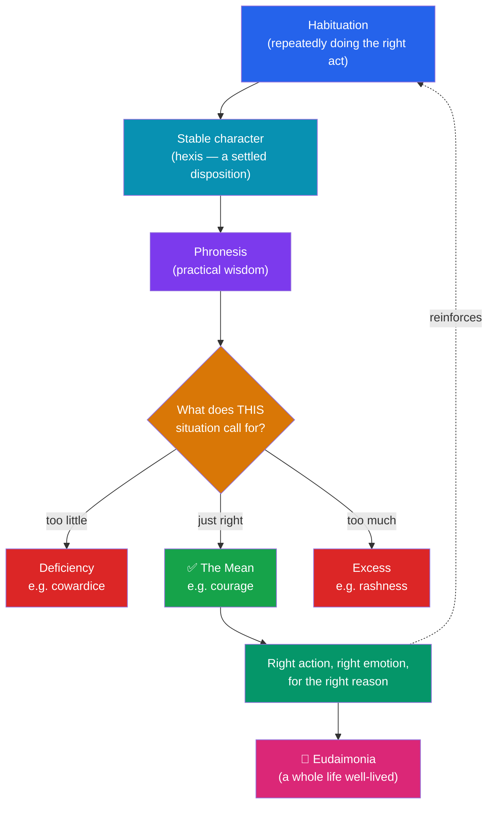

# 🌱 Virtue Ethics

> [!abstract] TL;DR
> Where consequentialism judges *acts* by outcomes and deontology judges them by conformity to *duty*, **virtue ethics** shifts the question from "What should I *do*?" to "What sort of person should I *be*?" Its founder, **Aristotle**, holds that the human good is *eudaimonia* (flourishing), reached by cultivating the **virtues** — stable traits of character, each a **mean** between two vices of excess and deficiency — under the guidance of *phronesis* (practical wisdom). Dormant for centuries, the view was revived by **G.E.M. Anscombe** (1958) and **Alasdair MacIntyre**'s *After Virtue* (1981), and echoed in the relational **care ethics** of **Gilligan** and **Noddings**. Its sharpest modern challenge is the **situationist critique**: experimental psychology suggests stable global character traits may not exist at all.

## Intuition — analogy first

Think of becoming a good person the way you'd think of becoming a **great jazz musician**.

No rulebook makes you a jazz player. You drill scales and standards for years until the right notes come *without deliberation*, and then — crucially — you can **read the room**: you improvise the phrase this particular moment calls for, something no rule could have specified in advance. A beginner who mechanically follows theory sounds stiff; a master has internalized the theory so deeply it has become perception and instinct.

Aristotle says moral goodness works the same way. You become just or courageous not by memorizing rules but by **repeatedly acting** justly and courageously until doing so becomes second nature (a settled *disposition*). The truly virtuous person doesn't consult a moral formula; they *see* what generosity or honesty requires here, now, with these people — and they feel the right emotions while doing it. That trained perception is *phronesis*, practical wisdom, and it is exactly the jazz musician's ear.

---

## How It Works — From Habit to Flourishing

## Key Concepts

### Eudaimonia — the Human Good

**Aristotle** (*Nicomachean Ethics*, c. 340 BCE) begins from the observation that every activity aims at some good, and the *highest* good — the one we pursue for its own sake and never for the sake of anything else — is **eudaimonia**. The word is poorly translated as "happiness"; it is closer to *flourishing* or *living well*. It is not a feeling but an **activity**: the exercise of our characteristic human capacity (reason) in accordance with virtue, over a *complete life*. Eudaimonia is objective and holistic — a momentary pleasure or a single good deed does not make it, "for one swallow does not make a summer."

### The Doctrine of the Mean

Each **virtue of character** is a disposition to feel and act in a way that hits the **mean** between two vices — one of **excess**, one of **deficiency** — *relative to us* and the situation. The mean is not a bland average but the *right* amount: right object, right time, right degree, right reason.

| Sphere of feeling/action | Deficiency (vice) | **Mean (virtue)** | Excess (vice) |
|---|---|---|---|
| Fear & confidence | Cowardice | **Courage** | Rashness |
| Giving money | Stinginess | **Generosity** | Prodigality |
| Anger | Spiritlessness | **Good temper** | Irascibility |
| Pleasure (bodily) | Insensibility | **Temperance** | Self-indulgence |
| Self-regard | Undue humility | **Proper pride** | Vanity |

Crucially, the mean is **not** a mechanical midpoint. Some acts (murder, adultery, envy) admit no mean — they are wrong in *any* amount. Locating the mean is a matter of perception, not calculation, which is why the theory needs *phronesis*.

### Phronesis and the Unity of the Virtues

**Phronesis** (practical wisdom) is the intellectual virtue that governs the moral ones: the capacity to deliberate well about what conduces to living well *as a whole*, and to perceive the morally salient features of a concrete situation. Without it, "courage" degenerates into recklessness and "generosity" into being a soft touch. Aristotle argues for the **reciprocity (or unity) of the virtues**: because they all depend on the single capacity of *phronesis*, you cannot fully possess one virtue while lacking the others — a "courageous" torturer has a counterfeit of courage, not the real thing.

### Character over Rules — the Contrast with Modern Theory

Virtue ethics is **agent-centred** rather than act-centred. Its primary bearer of value is the *person* and their character, not the isolated action or its outcome.

| | Consequentialism | Deontology | **Virtue Ethics** |
|---|---|---|---|
| Central question | What maximizes good outcomes? | What does duty require? | What would a person of good character do? |
| Locus of evaluation | The act's *consequences* | The act's *conformity to rules* | The agent's *character* |
| Guiding notion | Utility | The moral law / duty | *Eudaimonia* & the virtues |
| Role of emotion | Instrumental (a source of utility) | Suspect (duty over inclination) | **Constitutive** — feeling rightly *is* part of virtue |
| Action guidance | A decision procedure | A decision procedure | *Do what the virtuous person would do* |

### MacIntyre and the Modern Revival

**G.E.M. Anscombe**'s "Modern Moral Philosophy" (1958) lit the fuse: she argued that concepts of moral "obligation" and "law" are unintelligible without the theological framework that once grounded them, and urged a return to Aristotelian ethics of character. **Alasdair MacIntyre**'s *After Virtue* (1981) developed this into a diagnosis of modern moral discourse as fragmented and interminable ("emotivism" in practice). He reconstructed virtue around three ideas: **practices** (cooperative activities with internal goods, like medicine or chess), the **narrative unity** of a human life, and a living **tradition**. **Philippa Foot** and **Rosalind Hursthouse** further argued that virtue can be grounded *naturalistically* — in facts about characteristic human flourishing, much as we assess a good oak or a good wolf.

### Care Ethics — a Relational Cousin

Growing out of feminist philosophy, **care ethics** shares virtue ethics' focus on character and relationships but centres the virtue of **care**. **Carol Gilligan** (*In a Different Voice*, 1982) argued that dominant "justice" models of moral development (Kohlberg) undervalued an equally mature **ethic of care** — reasoning through responsibilities within relationships rather than abstract rights. **Nel Noddings** (*Caring*, 1984) built this into a full ethical theory rooted in the concrete relation between "the one-caring" and "the cared-for," rejecting impartial, principle-first approaches as ill-suited to the moral realities of family and dependence.

## Arguments & Examples

**Why the view is attractive.** It captures features other theories miss. *Moral education*: we actually raise children by cultivating traits and pointing to exemplars, not by teaching them to run a hedonic calculus. *Moral emotions*: virtue ethics alone treats compassion, indignation, and remorse as *part* of acting well, not as noise. *Moral perception*: much of ethics is noticing what matters (that a friend needs help before they ask), which a rule cannot do for you. And it answers "why be moral?" by tying morality to *your own flourishing* rather than to external commands.

**The self-effacement / circularity worry.** The stock objection is that virtue ethics gives no *action guidance*: "do what the virtuous person would do" seems circular if the virtuous person is defined as one who does the right thing. Hursthouse's reply: the virtues generate concrete **v-rules** ("be honest," "do not be cruel"), and the appeal to the virtuous agent is no more circular than consequentialism's appeal to the impartial calculator or deontology's to the rational legislator.

**The situationist critique.** **Gilbert Harman** (1999) and **John Doris** (*Lack of Character*, 2002) marshalled social psychology against the very existence of *global* character traits. Milgram's obedience studies, the Stanford prison experiment, and especially the small-cause experiments — the **Good Samaritan study** (Darley & Batson, 1973: seminary students hurrying past a slumped victim if merely told they were "late") and the **dime-in-the-phone-booth study** (Isen & Levin, 1972: finding a coin dramatically raised helping) — suggest behaviour is driven far more by trivial *situational* factors than by stable virtues. **Reply**: defenders (Kamtekar, Annas) argue Aristotelian virtue was never the situation-insensitive, one-track trait the experiments refute; genuine virtue is precisely the rare, unified achievement, guided by *phronesis*, that most people *lack* — which is why most of us fail these tests.

## Common Pitfalls / Misconceptions

- **"Virtue ethics can't tell you what to do."** It offers guidance through the virtues and their v-rules; it simply denies that ethics reduces to a mechanical decision procedure. That is a feature (it respects moral complexity), not merely a bug.
- **"The mean means moderation in all things."** No. The mean is the *appropriate* response, which can be extreme — maximal indignation at atrocity is the mean, not a lukewarm middle. And some actions have no mean.
- **Confusing virtue ethics with a checklist of virtues.** Listing virtues you should "follow" quietly turns it back into rule-following. The theory is about acquired *dispositions* and trained judgment, not obeying "be brave" as a command.
- **Assuming virtues are culturally arbitrary.** Critics note virtue lists vary across cultures (Homeric vs Christian vs Confucian). Neo-Aristotelians respond that the *core* virtues track universal features of the human condition (mortality, scarcity, sociality), even if their expression is culturally shaped.
- **Reading eudaimonia as a subjective feeling.** It is an *objective* mode of living well, not "whatever makes you feel happy" — a contented fool is not, on this view, flourishing.

## Related Concepts

- [[_MOC_Ethics|↑ Section MOC]]
- [[What_Is_Ethics]] — Where virtue ethics sits among the normative traditions and the shift from act to agent
- [[Aristotle]] — The primary source: the *Nicomachean Ethics*, the function argument, and *phronesis* in full
- [[Consequentialism_and_Utilitarianism]] — Act-and-outcome rival; virtue ethics rejects its impartial aggregation
- [[Deontology_and_Kantian_Ethics]] — Duty-based rival; both are act-centred where virtue ethics is agent-centred
- [[Metaethics]] — Whether claims like "courage is a virtue" can be objectively true (naturalist grounding of virtue)
- Cross-vault: [[Stoicism]] — a rival ancient virtue tradition making virtue *sufficient* for the good life; [[Cognitive_Biases]] — the situationist evidence that behaviour tracks situations more than character

## Review Questions

1. Explain the **doctrine of the mean** using a specific virtue, and show why the mean is *not* simply a midpoint or "moderation." Then explain why the doctrine requires *phronesis* rather than a formula.
2. State the **circularity / self-effacement objection** to virtue ethics ("do what the virtuous person would do"). How does Hursthouse's appeal to *v-rules* attempt to answer it, and why is the objection no worse for virtue ethics than for its rivals?
3. Describe the **situationist critique** with one concrete experiment (e.g. the Good Samaritan or dime-in-the-phone-booth study). How can an Aristotelian reply without denying the data?

## Sources

- Aristotle (c. 340 BCE). *Nicomachean Ethics* (esp. Books I–II, VI).
- Anscombe, G.E.M. (1958). "Modern Moral Philosophy." *Philosophy* 33(124), 1–19.
- MacIntyre, A. (1981). *After Virtue: A Study in Moral Theory*. University of Notre Dame Press.
- Hursthouse, R. (1999). *On Virtue Ethics*. Oxford University Press; Doris, J. (2002). *Lack of Character*. Cambridge University Press.

#philosophy #ethics #virtue-ethics #aristotle #eudaimonia
