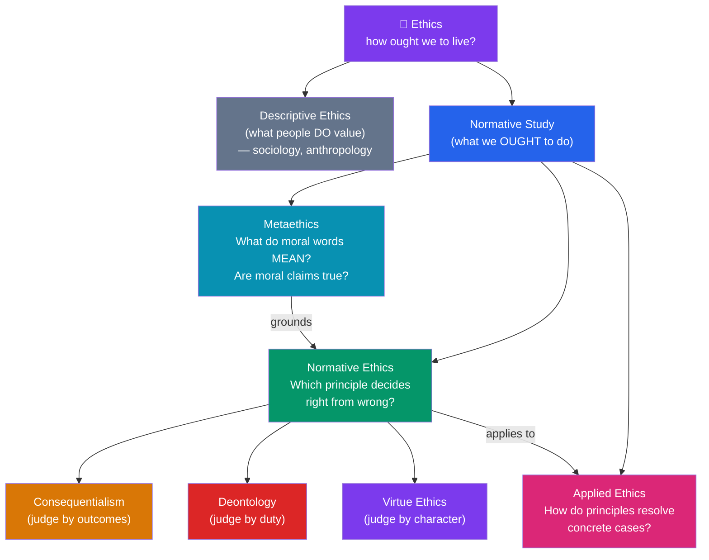

# 🧭 What Is Ethics

> [!abstract] TL;DR
> Ethics is the systematic, rational study of how we ought to live and act — of what is good, right, and virtuous. It divides into three branches: **metaethics** (what moral claims *mean* and whether they are true), **normative ethics** (which general principles tell us what to do), and **applied ethics** (how those principles resolve concrete problems). Ethics is *normative*, not merely *descriptive*: it asks what people *should* do, not just what they in fact value. Two classic problems frame the whole field — the **Euthyphro dilemma** (does authority make things good, or recognize a goodness that is already there?) and the question "**why be moral at all?**" Contemporary method leans on **reflective equilibrium**: adjusting principles and intuitions against each other until they cohere.

## Intuition — analogy first

Think of ethics as the difference between a **map of where people actually walk** and a **plan for where the paths *should* go**.

An anthropologist can survey a campus and chart the "desire paths" worn into the grass — the shortcuts people really take. That is a *descriptive* project: it records behavior without judging it. But a landscape architect asks a different question: *given* how people move, where *ought* the paved paths to be, and which shortcuts should be blocked because they trample the flowerbeds? That is a *normative* project. It cannot be settled by more surveying alone, because no amount of data about where people *do* walk tells you where they *should*.

Ethics is that second project applied to conduct. Sociology and psychology map our moral behavior — what cultures praise, what the brain does when we judge. Ethics asks whether those judgments are *correct*, and by what standard. The whole field lives in the gap between "is" and "ought."

---

## How It Works — The Structure of Moral Philosophy

## Key Concepts

### The Descriptive / Normative Distinction

**Descriptive ethics** reports the moral beliefs people actually hold — that most cultures condemn gratuitous cruelty, that honor codes vary across societies. It is a branch of the social sciences and makes no claim about who is *right*.

**Normative ethics** (and philosophy generally) asks the evaluative question: *which* of those beliefs are justified? The move from "is" to "ought" cannot be made by observation alone — a point sharpened into the **is–ought problem** by David Hume and the closely related **naturalistic fallacy** by G. E. Moore (see [[Metaethics]]). Discovering that a practice is *natural* or *widespread* never by itself shows that it is *good*.

### The Three Branches

| Branch | Central Question | Sample Question | Key Figures |
|---|---|---|---|
| **Metaethics** | What is the *status* of moral claims? | "Is 'torture is wrong' true, or just an expression of feeling?" | Moore, Mackie, Ayer, Hare |
| **Normative Ethics** | What *general standard* makes acts right? | "Should I judge this act by its consequences or my duty?" | Bentham, Mill, Kant, Aristotle |
| **Applied Ethics** | How does a standard *decide a case*? | "Is voluntary euthanasia permissible?" | Singer, Thomson, Foot |

These nest: metaethics grounds normative ethics, which in turn is deployed in applied ethics. You cannot fully settle whether euthanasia is permissible (applied) without a normative theory, and defending that theory eventually raises metaethical questions about whether *any* moral claim can be true.

### The Three Normative Traditions

Western normative ethics is dominated by three rival answers to "what makes an act right?":

- **Consequentialism** — an act is right if it produces the best outcomes (see [[Consequentialism_and_Utilitarianism]]).
- **Deontology** — an act is right if it conforms to duty and respects persons, regardless of outcome (see [[Deontology_and_Kantian_Ethics]]).
- **Virtue ethics** — the primary question is not "what should I *do*?" but "what kind of *person* should I be?" (see [[Virtue_Ethics]]).

### The Euthyphro Dilemma

In Plato's *Euthyphro*, Socrates asks: **"Is the pious loved by the gods because it is pious, or is it pious because it is loved by the gods?"** Generalized, this is the deepest question about the *source* of moral authority:

1. **Horn 1 — goodness is prior.** If God (or reason, or society) commands the good *because* it is good, then goodness is independent of the authority, and the authority is not its source — we could in principle know right from wrong without it.
2. **Horn 2 — the command constitutes the good.** If things are good *because* they are commanded, then morality is arbitrary: had the authority commanded cruelty, cruelty would have been good. This "**divine command theory**" appears to make morality a matter of brute power.

The dilemma is not just about religion. It targets *any* theory that grounds morality in the say-so of some authority (a culture, a majority, a strongman). Either the authority tracks an independent standard, or morality collapses into arbitrary fiat.

### "Why Be Moral?"

Even granting that some acts are wrong, why should *I* refrain when I could profit and escape detection? Plato's *Republic* poses this through the **Ring of Gyges**, which makes its wearer invisible: would a person with perfect impunity have any reason to be just? Major answers:

- **Prudential** — morality pays off in the long run (reputation, cooperation, trust). Powerful but incomplete: it can't explain why to be moral when injustice genuinely pays.
- **Constitutive** — being just is part of living well; the unjust soul is disordered (Plato, and the virtue tradition — see [[Virtue_Ethics]]).
- **Rational** — immorality involves a kind of inconsistency or free-riding a rational agent cannot endorse (Kant — see [[Deontology_and_Kantian_Ethics]]).

### Moral Intuitions and Reflective Equilibrium

We don't reason from nowhere. We begin with **considered moral intuitions** — firm judgments like "gratuitous cruelty is wrong" — and with candidate **principles**. **Reflective equilibrium** (named by John Rawls, 1971) is the method of moving back and forth: when a principle clashes with a strong intuition, we revise one or the other, iterating until principles and judgments cohere. Neither intuitions nor principles are treated as infallible; the goal is a mutually supporting web. This is why the trolley problem and similar cases matter — they are *stress tests* that force principles and intuitions into productive conflict.

## Arguments & Examples

**Euthyphro applied to cultural relativism.** Suppose someone says "an act is right if my society approves it." Run the dilemma: is the act right *because* society approves, or does society approve because it is right? If the former, then a society that approved slavery made slavery right — and reformers like the abolitionists were, by definition, *wrong* to oppose their own culture. That conclusion is a *reductio*: because we're confident the reformers were right, we should reject the theory that makes approval the source of rightness. The same structure refutes crude divine command and crude "might makes right."

**Reflective equilibrium in action.** Start with the principle "always maximize happiness" and the intuition "it's wrong to frame an innocent person even to prevent a riot." They conflict. Reflective equilibrium lets you respond three ways: (a) reject the intuition as sentimental, (b) reject the principle as too permissive, or (c) refine the principle (e.g., to *rule* utilitarianism — see [[Consequentialism_and_Utilitarianism]]). No option is forced; the discipline is to make the trade explicit and keep the whole web coherent.

**The is–ought gap as a diagnostic.** A politician argues: "Humans have always formed hierarchies, so hierarchy is good and just." Spot the fallacy — a purely descriptive premise ("always formed hierarchies") cannot by itself yield an evaluative conclusion ("hierarchy is good"). A hidden normative premise ("what is natural is good") is doing the real work, and it is precisely what needs defending.

## Common Pitfalls / Misconceptions

- **"Ethics is just opinion."** This confuses *disagreement* with *arbitrariness*. People disagree about history and physics too; disagreement doesn't show there's no fact of the matter. Whether morality is objective is the metaethical question — it can't be settled by shrugging.
- **Conflating ethics with law, religion, or etiquette.** Something can be legal but immoral (historic slavery), or immoral but legal (cruel speech). Ethics evaluates all three from outside.
- **Assuming "descriptive" data settles "normative" questions.** That people evolved to favor kin, or that a majority approves, are facts about the *is*; they don't close the *ought* question.
- **Treating the branches as isolated.** Applied debates almost always smuggle in normative and metaethical commitments; naming them clarifies the disagreement.
- **Reading the Euthyphro dilemma as merely anti-religious.** It is a general challenge to *any* authority-based account of moral grounding, secular ones included.

## Related Concepts

- [[_MOC_Ethics|↑ Section MOC]]
- [[Consequentialism_and_Utilitarianism]] — The first great normative tradition: right = best outcomes
- [[Deontology_and_Kantian_Ethics]] — Rightness as duty, independent of outcome
- [[Virtue_Ethics]] — Shifts the question from acts to character
- [[Metaethics]] — Whether any of these moral claims can be *true*; the is–ought problem in depth
- [[Applied_Ethics]] — The branches deployed on real dilemmas
- Cross-vault: [[Stoicism]] — an ancient tradition answering "how ought we to live?"; [[Cognitive_Biases]] — how moral intuitions can systematically mislead

## Review Questions

1. Distinguish descriptive from normative ethics, then explain why the sentence "most cultures condemn theft, therefore theft is wrong" commits the is–ought fallacy. What hidden premise would the argument need?
2. State both horns of the Euthyphro dilemma. Explain why the dilemma is a problem for *secular* authority-based theories (like "right = whatever my society approves"), not only for divine command theory.
3. What is reflective equilibrium, and how does it treat the relationship between moral principles and particular intuitions? Why does it reject taking either one as infallible?

## Sources

- Plato. *Euthyphro* and *Republic* (Book II, the Ring of Gyges). Trans. G.M.A. Grube, Hackett.
- Rawls, J. (1971). *A Theory of Justice*. Harvard University Press (reflective equilibrium).
- Hume, D. (1739). *A Treatise of Human Nature*, Book III (the is–ought passage).
- Rachels, J. & Rachels, S. (2019). *The Elements of Moral Philosophy* (9th ed.). McGraw-Hill.

#philosophy #ethics #metaethics #normative-ethics #euthyphro
