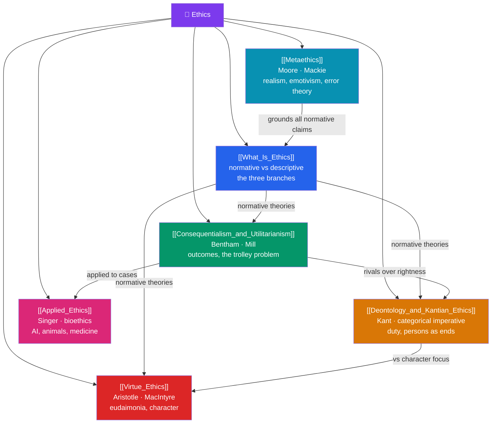

# 🗺️ Ethics — Map of Content

> [!abstract] What This Section Covers
> Ethics is the systematic study of how we ought to live and act. **What Is Ethics** maps the field into its normative, metaethical, and applied branches and distinguishes the moral from the merely descriptive; **Consequentialism and Utilitarianism** judges actions by their outcomes, from Bentham's hedonic calculus and Mill's higher pleasures to act/rule variants and the trolley problem; **Deontology and Kantian Ethics** locates morality in duty and the categorical imperative, treating persons as ends in themselves; **Virtue Ethics** revives Aristotle's focus on character, *eudaimonia*, and the practically wise agent, renewed by MacIntyre; **Metaethics** steps back to ask whether moral claims are true at all — realism, anti-realism, emotivism, and error theory; and **Applied Ethics** brings theory to bioethics, animal ethics, and the ethics of AI. Six notes spanning the "what is good?" to the concrete dilemmas of the present.

## Concept Map

## Learning Path

1. [[What_Is_Ethics]] — Normative vs descriptive vs metaethics, the branches of moral philosophy, moral reasoning, and the naturalistic fallacy.
2. [[Consequentialism_and_Utilitarianism]] — Bentham's calculus, Mill's higher pleasures, act vs rule utilitarianism, and the trolley problem.
3. [[Deontology_and_Kantian_Ethics]] — The categorical imperative, universalizability, humanity as an end, duty vs inclination, and rights.
4. [[Virtue_Ethics]] — Aristotle's *eudaimonia*, the doctrine of the mean, *phronesis*, and MacIntyre's modern revival.
5. [[Metaethics]] — Moral realism vs anti-realism, cognitivism, emotivism, Mackie's error theory, and the is–ought gap.
6. [[Applied_Ethics]] — Bioethics, animal ethics (Singer), and the ethics of artificial intelligence.

## All Notes at a Glance

| Note | Difficulty | What You'll Learn |
|------|------------|-------------------|
| [[What_Is_Ethics]] | Beginner | Normative/descriptive/metaethics, moral reasoning, the branches, the naturalistic fallacy |
| [[Consequentialism_and_Utilitarianism]] | Beginner → Intermediate | Hedonic calculus, higher/lower pleasures, act vs rule, the trolley problem, demandingness |
| [[Deontology_and_Kantian_Ethics]] | Intermediate | Categorical imperative, universalizability, ends-in-themselves, perfect/imperfect duties, rights |
| [[Virtue_Ethics]] | Intermediate | Eudaimonia, the golden mean, phronesis, character, MacIntyre's *After Virtue* |
| [[Metaethics]] | Advanced | Moral realism, anti-realism, cognitivism/non-cognitivism, emotivism, error theory, is–ought |
| [[Applied_Ethics]] | Intermediate | Bioethics, euthanasia, animal ethics, AI ethics, alignment and moral status |

## Key Questions This Section Answers

- Is an action right because of its consequences, its conformity to duty, or the character it expresses?
- Should you pull the lever to kill one and save five?
- What does Kant mean by treating people as ends and never merely as means?
- Are moral claims objectively true, or expressions of feeling and convention?
- How should ethical theory guide decisions in medicine, animal welfare, and AI?

## Related Sections

- [[_MOC_Philosophy_Master|↑ Philosophy Master MOC]]
- [[_MOC_Epistemology|← Epistemology]]
- [[_MOC_Philosophy_of_Mind|→ Philosophy of Mind]]
- Cross-vault: [[_MOC_AI_ML_Master]] (AI ethics & alignment), [[_MOC_Game_Theory_Master]] (cooperation), [[Stoicism]] (virtue tradition)

#MOC #Philosophy #Ethics
