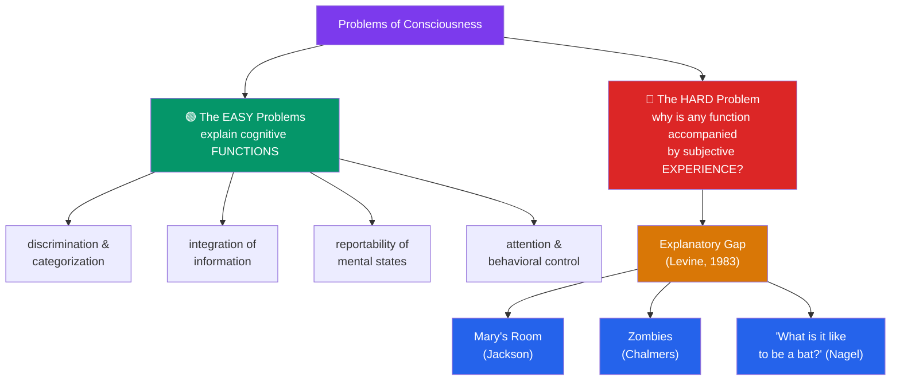

# 🌈 Consciousness and the Hard Problem

> [!abstract] TL;DR
> Some questions about consciousness are, in **David Chalmers'** phrase, *easy* — hard in practice but conceptually tractable: how the brain discriminates stimuli, integrates information, reports its states, and controls behavior. Solve them and you have explained a set of *functions*. The **hard problem** is what remains standing: **why is any of that functioning accompanied by experience at all?** Why is there *something it is like* to see red, to feel pain, to taste coffee — rather than all that processing going on "in the dark"? The felt qualities of experience — **qualia** — seem to resist every functional story, opening an **explanatory gap** (Levine) between physical description and subjective feel. Three thought experiments dramatize the gap: **Nagel's bat** (objective science can't capture the bat's point of view), **Jackson's Mary** (a super-scientist who knows every physical fact still learns something on first seeing color), and **Chalmers' zombies** (a being physically identical to you but with no inner life seems conceivable). Whether these show that physicalism is *false*, merely *incomplete*, or that our concepts are misleading is the central battleground of modern philosophy of mind.

## Intuition — analogy first

Imagine the most complete science of wine ever written: every ester, tannin, and sugar quantified; the exact fluid dynamics of the pour; a full neurophysiology of the tongue and olfactory bulb; a millisecond-by-millisecond map of the drinker's cortex as the sip lands. Hand that treatise to someone who has never tasted anything, and they could predict every measurable fact about what happens when the wine is drunk.

And yet the treatise never once tells them **what the wine tastes like**. The taste — the specific, felt, first-person *flavor* of it — seems to slip through the net of even a perfect third-person description. You could know all the physics and all the biology and still be missing something, and that something is exactly the part that matters to the drinker.

That leftover is the hard problem. The easy problems ask *how the machinery works*; you answer them with mechanisms and functions. The hard problem asks *why the machinery is accompanied by a taste, a color, a felt ache at all* — and no amount of mechanism seems to add up to an answer, because a mechanism is precisely the kind of thing you can fully describe without ever mentioning how it feels from the inside.

---

## How It Works — Splitting Easy from Hard

Chalmers' key move (1995) is not to offer a theory of consciousness but to **carve the territory**. The "easy" problems are all problems of *function* — they ask what a system *does*. The hard problem is the residue that survives after every function is explained.

The diagram's asymmetry is the whole point: no arrow runs from the green box to the red one. You can complete every easy problem and the hard problem stands exactly where it did — because "why is this function *felt*?" is not itself a question about function.

## Key Concepts / Details

### The Easy Problems vs the Hard Problem

The **easy problems** (Chalmers, 1995) concern phenomena definable in functional or behavioral terms: the ability to categorize stimuli, integrate information, report internal states, focus attention, and control action. "Easy" is a term of art — solving them may take a century — but we at least know what a solution would *look like*: a mechanism.

The **hard problem** is: *why is the performance of these functions accompanied by subjective experience?* A functional explanation answers "what does it do?"; the hard problem asks "why is there something it is like to do it?" The gap between those two questions is what makes the problem hard, and arguably *different in kind* from every other problem in science.

### Qualia and the Explanatory Gap

**Qualia** (singular *quale*) are the introspectible qualitative characters of experience: the particular *redness* of red, the *sharpness* of a pain, the *bitterness* of quinine. They are the raw feels — what is left over once you subtract all the causal and functional facts.

**Joseph Levine** (1983) named the **explanatory gap**: even a complete neuroscience of pain (say, "pain = C-fibre firing") would leave it *intelligible to ask* why *that* physical state should feel *like that*, rather than like something else or like nothing at all. The identity, if true, seems **brute** — we cannot *see why* it must hold. Levine was careful: the gap may be merely **epistemic** (a limit on our understanding) rather than **ontological** (a gap in reality itself). Deciding which is precisely what is at stake.

### Nagel's Bat: The Subjective Point of View

**Thomas Nagel's** "What Is It Like to Be a Bat?" (1974) supplies the canonical gloss on consciousness: an organism is conscious if and only if *there is something it is like to be that organism*. A bat navigates by echolocation — a sensory modality we lack. We can describe the physics of sonar and the bat's neural wiring completely, yet we still cannot know **what it is like**, from the inside, to perceive the world that way. Nagel's conclusion is that consciousness has an essentially **first-person, subjective ontology**, and that objective, third-person science, however complete, systematically leaves the point of view out.

### The Two Anti-Physicalist Arguments and Nagel's Challenge

| Argument | Champion | Form | Conclusion urged | Leading reply |
|---|---|---|---|---|
| **Knowledge argument** (Mary) | Frank Jackson (1982) | Epistemic → metaphysical | Physical facts don't exhaust all the facts; qualia are non-physical | Ability hypothesis (Lewis/Nemirow); phenomenal-concepts strategy |
| **Conceivability of zombies** | David Chalmers (1996) | Modal | Consciousness does not *logically supervene* on the physical | Zombies aren't ideally conceivable; conceivability ≠ possibility (a posteriori identities) |
| **Explanatory gap** | Joseph Levine (1983) | Epistemic | We cannot see *why* physical P yields experience Q | The gap is epistemic, not a gap in reality |
| **"What is it like to be a bat?"** | Thomas Nagel (1974) | Epistemic | Objective science omits the subjective point of view | New "objective phenomenology" may narrow it |

### Access vs Phenomenal Consciousness

**Ned Block** (1995) draws a crucial distinction that keeps the debate honest. **Access consciousness (A-consciousness)** is information being *poised* for use in reasoning, reporting, and behavior control — a functional notion, squarely among the easy problems. **Phenomenal consciousness (P-consciousness)** is the raw felt quality — the hard-problem notion. Empirical cases (e.g. **blindsight**, where patients respond to stimuli they report not consciously seeing) suggest the two can come apart, which is why simply pointing at neural "correlates of consciousness" does not yet touch the hard problem: a *correlate of access* is not thereby an *explanation of feel*.

## Arguments & Examples

**Mary's Room (Jackson's knowledge argument).**
1. Mary is a brilliant scientist confined to a black-and-white room who learns, via black-and-white monitors, *all the physical facts* about colour vision — every wavelength, every neural pathway, every functional detail.
2. On release, seeing a ripe tomato, she learns *something new*: **what it is like to see red**.
3. So there was a fact she did not previously know, despite knowing all the physical facts.
4. Therefore not all facts are physical facts — physicalism is incomplete.
*Standard replies:* the **ability hypothesis** (Lewis, Nemirow) says Mary gains a new *know-how* (abilities to imagine, recognize, remember red), not a new fact; the **phenomenal-concepts strategy** says she gains a new *concept* of an old, physical fact, not a new fact. Notably, **Jackson himself later recanted** and became a physicalist, judging the argument's intuitive pull to be misleading.

**The zombie argument (Chalmers).**
1. A **philosophical zombie** — a being physically and functionally identical to me but with *no* inner experience whatsoever — is (ideally, rationally) conceivable.
2. What is ideally conceivable is metaphysically possible.
3. If a physical duplicate of me could lack consciousness, then consciousness does not *logically supervene* on the physical.
4. Therefore physicalism is false; Chalmers concludes a *naturalistic (property) dualism*.
*Standard replies:* **type-B materialists** reject premise 2 — conceivability need not entail possibility, just as one can conceive "water is not H₂O" while the a posteriori identity holds necessarily. **Dennett** rejects premise 1 — once you genuinely hold *all* the functional facts fixed, you are no longer coherently conceiving a zombie; you are just failing to imagine hard enough.

**A concrete empirical wedge — blindsight.** A patient with damage to primary visual cortex sincerely reports seeing nothing in part of the visual field, yet "guesses" the location or orientation of stimuli there far above chance. Function (discrimination) is partly preserved while phenomenal experience is (reportedly) absent — a real-world dissociation that sharpens Block's A/P distinction and shows why explaining the function does not automatically explain the feel.

## Common Pitfalls / Misconceptions

- **"The hard problem is just an easy problem we haven't cracked yet."** This mistakes the *type* of the question. Every easy-problem solution is a mechanism; the hard problem asks why any mechanism is *felt*. Adding more mechanism cannot, by its own logic, close a gap that is about the presence of feeling as such.
- **"Neural correlates of consciousness solve it."** Finding *which* brain activity accompanies experience (a correlate of access) is the *data* of the hard problem, not its solution — it still leaves open *why* that activity is accompanied by any experience.
- **"Mary's Room proves dualism."** It is deeply contested, and even its author abandoned it. At most it shows a tension; the ability and phenomenal-concept replies are live.
- **"Zombies are obviously possible / obviously impossible."** Both sides beg the question if stated flatly. The load-bearing issue is the inference from *conceivability* to *metaphysical possibility* — that is where the real argument lives.
- **Treating the hard problem as identical to the mind-body problem.** It is the *sharpest sub-problem* of it — specifically about phenomenal experience — not the whole thing. (See [[The_Mind_Body_Problem]].)
- **Ignoring the deflationary option.** **Illusionists** (Dennett, Frankish) hold that qualia, as usually conceived, do not exist — the hard problem is an artefact of a seductive but confused way of thinking. Dismissing this as obviously absurd is itself a pitfall; it is a serious, if minority, position.

## Related Concepts

- [[_MOC_Philosophy_of_Mind|↑ Section MOC]]
- [[The_Mind_Body_Problem]] — The general puzzle of which the hard problem is the sharpest instance
- [[Dualism_vs_Physicalism]] — The zombie and knowledge arguments are the leading modern cases *against* physicalism
- [[Functionalism_and_Machine_Minds]] — Functionalism explains the *easy* problems well; the absent/inverted-qualia worries are the hard problem striking back
- [[Intentionality_and_Mental_Content]] — The *other* hallmark of mind; representationalists try to reduce qualia *to* intentional content
- Cross-section: [[Personal_Identity]] (Metaphysics) — What persists as *you* if consciousness is the essence of mind?
- Cross-vault: [[_MOC_AI_ML_Master]] — Could an artificial system be phenomenally conscious, or only functionally so?
- Cross-vault: [[_MOC_Cognitive_Psychology]] — The empirical search for the neural correlates of consciousness

## Review Questions

1. State precisely what makes the "easy" problems easy and the hard problem hard, in Chalmers' sense. Why does solving *all* the easy problems leave the hard problem untouched — and why is that not merely a claim that the hard problem is *very difficult*?
2. Reconstruct Jackson's knowledge argument as a numbered argument. Then explain the **ability hypothesis** and the **phenomenal-concepts strategy** as two different ways of resisting the conclusion. Which premise does each target?
3. The zombie argument turns on the step from *conceivability* to *metaphysical possibility*. Explain how the analogy with a posteriori necessities (e.g. "water = H₂O") is used by type-B materialists to block that step, and how a defender of the argument might reply.

## Sources

- Nagel, T. (1974). "What Is It Like to Be a Bat?" *The Philosophical Review*, 83(4), 435–450.
- Jackson, F. (1982). "Epiphenomenal Qualia." *The Philosophical Quarterly*, 32(127), 127–136.
- Chalmers, D. (1995). "Facing Up to the Problem of Consciousness." *Journal of Consciousness Studies*, 2(3); expanded in *The Conscious Mind* (OUP, 1996).
- Levine, J. (1983). "Materialism and Qualia: The Explanatory Gap." *Pacific Philosophical Quarterly*, 64(4), 354–361.

#philosophy #philosophy-of-mind #consciousness #qualia #hard-problem
