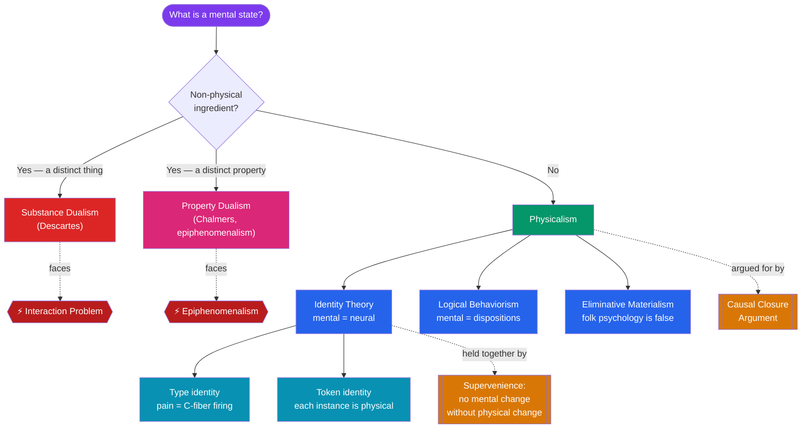

# ⚖️ Dualism vs Physicalism

> [!abstract] TL;DR
> This is the central battle over what minds are made of. **Dualism** holds the mental is not fully physical, in two grades: **substance dualism** (mind is a distinct thing) and the more modern **property dualism** (one physical substance bearing irreducibly non-physical properties). Both face the **interaction problem** and, for property dualism, the threat of **epiphenomenalism**. **Physicalism** holds the mental is nothing over and above the physical, and comes in several flavors: the **identity theory** (mental states *are* brain states — in **type** or weaker **token** form), **logical behaviorism** (mental talk is talk about behavioral dispositions), and **eliminative materialism** (folk-psychological states like beliefs simply do not exist). The subtle glue of contemporary physicalism is **supervenience**: no mental difference without a physical difference. The strongest positive argument for physicalism is the **causal-closure argument**: since physics is causally complete and minds do cause behavior, minds had better be physical.

## Intuition — analogy first

Ask what a **hurricane** is. A dualist about hurricanes would say the storm is one thing and the air molecules are another, mysteriously coupled. That sounds silly: a hurricane just *is* a certain organized pattern of moving air — nothing extra, no "storm-stuff" floating above the molecules. Point to all the air doing all its swirling, and you have pointed to the hurricane. This is the **physicalist** instinct: the mind is what the brain is *doing*, described at a higher level.

But now notice something the analogy also concedes. You cannot see the *hurricane-ness* by inspecting a single molecule; it lives in the organization. And when you feel a searing pain, the physicalist owes you a story about why *this* organized brain activity comes with a *felt* quality at all — a demand the hurricane never makes on us, because nobody thinks there is something it is like to be a storm. That residue is exactly where the **dualist** digs in: grant that pain depends on the brain, they say, and you *still* have not said why it feels like anything. The debate is a tug-of-war between the elegance of "nothing over and above" and the stubbornness of that felt residue.

---

## How It Works — Two Families, Many Branches

Both camps subdivide. The diagram traces the main positions from most anti-physical (top) to most austerely physical (bottom), with the two pressure points that drive the debate marked in red.

## Key Concepts / Details

### Dualism in Two Grades

**Substance dualism** posits a distinct mental substance (see [[The_Mind_Body_Problem]] for Descartes). Few philosophers defend it today, mainly because of the **interaction problem** and its friction with physics.

**Property dualism** is the live modern form. It grants there is only *one* kind of substance — physical — but insists that some of its properties (specifically *phenomenal* properties, the felt qualities of experience) are **not** physical properties and are not reducible to them. **David Chalmers** is its most prominent defender. Property dualism keeps the appeal of a unified physical world while honoring the felt residue.

- **Epiphenomenalism** is property dualism's most consistent (and most disturbing) form: mental properties are caused by physical brain events but themselves cause *nothing*. Consciousness is a by-product, like the smoke above a train that does no work pulling it. **T.H. Huxley** defended a version. The cost: it seems to make my *feeling* of pain irrelevant to my crying out, which strains credulity.

### The Identity Theory

The **mind-brain identity theory** (**U.T. Place**, 1956; **J.J.C. Smart**, 1959; **Herbert Feigl**) holds that mental states literally *are* physical brain states — the way *water is H₂O* or *lightning is electrical discharge*. It is an *a posteriori* identity discovered by science, not a definition. Two grades:

- **Type identity**: each *type* of mental state is identical to a *type* of physical state (e.g. *pain* = *C-fiber firing*). Strong and reductive.
- **Token identity**: each particular *instance* (token) of a mental state is some physical state or other, but the *same* mental type may be different physical types on different occasions or in different creatures. Weaker, and the natural retreat once **multiple realizability** (see [[Functionalism_and_Machine_Minds]]) threatens type identity.

### Logical (Analytical) Behaviorism

**Gilbert Ryle** (*The Concept of Mind*, 1949) and **Carl Hempel** argued that talk of mental states is really shorthand for **behavioral dispositions**. To say someone "believes it will rain" is to say they are disposed to carry an umbrella, agree it looks like rain, and so on. Ryle attacked the "**ghost in the machine**" — the Cartesian picture — as a **category mistake** (like the tourist who, after seeing all the colleges, asks "but where is the University?").
*Fatal objection:* dispositions must be spelled out in terms of *other* mental states (I only take the umbrella *if* I want to stay dry *and* believe it will rain), so behavior cannot be defined without circular reference to the mental. Behaviorism also seems to leave out the inner feel entirely.

### Eliminative Materialism

**Paul and Patricia Churchland** argue the boldest line: our everyday "folk psychology" of beliefs, desires, and pains is a *theory* — and a false, stagnant one, destined to be replaced by mature neuroscience the way phlogiston and demonic possession were replaced. Strictly, there *are no* beliefs; the concept fails to refer.
*Standard objections:* the view seems self-refuting (to *assert* eliminativism is to express a belief), and folk psychology is predictively powerful, not obviously failing.

### Supervenience — The Minimal Physicalist Commitment

**Supervenience** is the thesis that **there can be no difference in mental properties without a difference in physical properties** — fix all the physical facts and you thereby fix all the mental facts. Any two things physically identical (a molecule-for-molecule duplicate) must be mentally identical. It captures "the mental depends on and is determined by the physical" *without* asserting the stronger claim that mental properties *reduce to* physical ones — which is why even some non-reductive physicalists and property dualists accept (natural/nomological) supervenience while disagreeing about reduction.

| Physicalist option | Claim | Reductive? | Signature problem |
|---|---|---|---|
| **Type identity** | Mental type = physical type | Yes | Multiple realizability |
| **Token identity** | Each mental token is physical | Partly | What unifies a mental *type*? |
| **Behaviorism** | Mental = behavioral disposition | Yes (analytic) | Circularity; omits inner feel |
| **Functionalism** | Mental = causal role | Non-reductive-friendly | Absent/inverted qualia |
| **Eliminativism** | Mental terms don't refer | Eliminates, not reduces | Self-refutation worry |
| **Non-reductive physicalism** | Mental *supervenes*, doesn't reduce | No | Causal exclusion (Kim) |

### The Causal-Closure Argument for Physicalism

The strongest positive case, sharpened by **Jaegwon Kim**:

1. **Causal closure**: every physical event that has a cause has a *sufficient physical cause*.
2. **Mental causation**: mental events cause physical events (deciding to wave causes waving).
3. **No systematic overdetermination**: waves are not routinely caused *twice over* by an independent mental cause and a sufficient physical cause.
4. Therefore the mental cause must *be* (or be realized by) the physical cause — the mental is physical.

This is why closure is the fulcrum of the whole debate: deny (1) and dualist interaction becomes possible but physics looks violated; accept (1) and non-physical minds are pushed toward epiphenomenalism.

## Arguments & Examples

**Water is H₂O (for identity theory).** Before chemistry, "water" and "H₂O" seemed to pick out different things; science discovered they are one. Smart argued *pain = C-fiber firing* is the same kind of empirical identity. The lesson: apparent distinctness of *concepts* (mental vs physical) does not entail distinctness of *properties*.

**Kim's causal exclusion argument (against non-reductive physicalism).** Suppose a mental property M supervenes on a physical base P, and M appears to cause behavior B. But B has a *sufficient physical cause* — P's own effect, or the physical realizer of the next mental state. So what work is left for M? Either M is *identical* to a physical property (collapse into reductive physicalism) or M is excluded from causing B (collapse into epiphenomenalism). Non-reductive physicalism is thus squeezed from both sides — a mirror image of the dualist's dilemma.

**A worked contrast — the octopus in pain.** A human in pain and an octopus in pain plausibly share the mental *type* (pain) while having very different neural hardware (no C-fibers in the octopus). *Type* identity says they cannot both literally be "pain" if pain = C-fiber firing. This is the **multiple realizability** wedge that drove many physicalists from type identity toward **functionalism** or token identity — showing how the internal logic of physicalism itself generated its dominant modern form.

## Common Pitfalls / Misconceptions

- **"Physicalism = the identity theory."** The identity theory is one physicalism among several; functionalism, token physicalism, and eliminativism are all physicalist yet reject strict type identity.
- **"Supervenience explains consciousness."** Supervenience is a *dependence* relation, not an *explanation*. It states *that* the mental co-varies with the physical; it does not say *why* or *how* — the explanatory gap survives supervenience untouched (see [[Consciousness_and_the_Hard_Problem]]).
- **"Behaviorism is obviously dead, so ignore it."** Its *fatal* flaw (circularity) is precisely what motivated functionalism, which keeps the behaviorist emphasis on causal/behavioral role while adding internal states. Understanding behaviorism explains where functionalism came from.
- **Treating epiphenomenalism as a knock-down against dualism.** It is a *cost*, not a contradiction; committed property dualists can and do bite the bullet.
- **Assuming "reduction" and "supervenience" are the same.** Reduction is stronger. You can accept supervenience (dependence) while denying reduction (identity) — that space is exactly where non-reductive physicalism lives.

## Related Concepts

- [[_MOC_Philosophy_of_Mind|↑ Section MOC]]
- [[The_Mind_Body_Problem]] — The problem these positions are competing to solve; source of the interaction problem
- [[Consciousness_and_the_Hard_Problem]] — Why phenomenal properties are the hardest case for physicalism, motivating property dualism
- [[Functionalism_and_Machine_Minds]] — The physicalist-friendly heir to behaviorism and token identity; multiple realizability in detail
- [[Intentionality_and_Mental_Content]] — Whether "aboutness" can be given a physicalist reduction
- Cross-vault: [[_MOC_Cognitive_Psychology]] — Behaviorism's rise and fall as a scientific research program

## Review Questions

1. Distinguish **type identity** from **token identity**. Explain how the multiple realizability of pain (human vs octopus) pressures the type theory but is compatible with token identity.
2. State the **causal-closure argument** for physicalism as a numbered argument. Then explain Kim's **causal exclusion argument** and show why it forms a "dilemma" that squeezes non-reductive physicalism from both sides.
3. Why did **logical behaviorism** collapse, and in what specific sense is **functionalism** its successor rather than its refutation? Reference the circularity objection in your answer.

## Sources

- Smart, J.J.C. (1959). "Sensations and Brain Processes." *The Philosophical Review*, 68(2), 141–156.
- Ryle, G. (1949). *The Concept of Mind*. Hutchinson.
- Kim, J. (2005). *Physicalism, or Something Near Enough*. Princeton University Press.
- Stoljar, D. (2024). "Physicalism." *Stanford Encyclopedia of Philosophy*.

#philosophy #philosophy-of-mind #physicalism #identity-theory #supervenience
