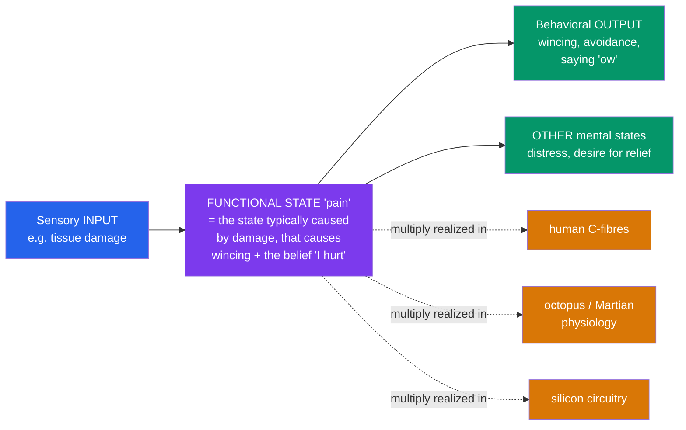

# 🤖 Functionalism and Machine Minds

> [!abstract] TL;DR
> **Functionalism** is the most influential theory of mind of the last sixty years: a mental state *is* whatever plays a certain **causal role** — defined by its typical *inputs*, its relations to *other mental states*, and its *behavioral outputs* — regardless of what it is physically made of. Pain is *the state* caused by tissue damage that produces wincing and the desire for relief; anything that plays that role is pain. This yields **multiple realizability** (Putnam): the same mental state could be realized in human neurons, octopus ganglia, or silicon, just as the same program runs on different hardware. Functionalism is the philosophical engine of the **computational theory of mind** and of the ambition of Artificial Intelligence. It also frames the two great tests of machine minds: **Alan Turing's** behavioral *imitation game* (the **Turing Test**), and **John Searle's Chinese Room**, which argues that running the right program — pure symbol manipulation, *syntax* — can never be sufficient for genuine understanding, or *semantics*. The debate turns on a deceptively simple question: is thinking something a system *does*, or something it *is*?

## Intuition — analogy first

Think about what makes something a **key**. Not the material — keys are cut from brass, steel, aluminium; a hotel "key" is a magnetized plastic card, and a modern one is a pattern of bits in your phone. What makes all of them keys is a *role*: the thing that, when presented to the right lock, opens it. Ask "what is a key made of?" and there is no single answer. Ask "what does a key *do*?" and you have said everything essential.

Functionalism says minds are like that. A belief, a pain, a desire is not defined by the stuff it is made of but by the *job it does* in the system's economy of inputs, internal states, and outputs. And if a mental state is a role, then the substrate is negotiable: the very same chess-playing "mind" could run on silicon, on a Victorian mechanical computer, or — in principle — on a billion people passing notes. What makes it *playing chess* is the pattern of operations, not the matter carrying them.

That liberating thought is also the provocation: if the mind is software, then the right program on *any* hardware would have a mind. Turing embraced the consequence; Searle spent a career trying to show it is a mirage.

---

## How It Works — Role, Realization, and the Machine

Functionalism defines a mental state by triangulating three things: what tends to *cause* it, what it tends to *cause*, and how it relates to *other* mental states. Because that definition never mentions physical make-up, the same role can be **realized** in wildly different materials.

The dashed arrows carry the whole force of the view: the box in the middle is defined *entirely* by the solid arrows (its causal role), so *any* of the substrates at the bottom counts as pain provided it occupies that role.

## Key Concepts / Details

### Functionalism and Its Rivals

**Functionalism** (Hilary Putnam, 1960s; later Jerry Fodor, David Lewis) holds that mental states are **functional states** — individuated by causal role, not by intrinsic nature. It was crafted to fix the flaws of its predecessors:

- Against **behaviorism**, it *keeps internal states*: a functional state relates to *other inner states*, not just to behavior, so it escapes the behaviorist's inability to handle a person who feels pain but hides it.
- Against the **type-identity theory** ("pain = C-fibre firing"), it allows **multiple realizability**: since an octopus or an alien could feel pain without C-fibres, pain cannot *be identical* to any one physical type.

### Multiple Realizability

**Putnam's** argument (1967): if a mental state type could be realized by many *different* physical types across species and machines, it cannot be *identical* to any single physical type. The mind is therefore better described at the *functional* level of abstraction — the level of software, not hardware. This decoupling of mind from substrate is exactly what makes machine minds conceptually possible.

### The Computational Theory of Mind (CTM)

If mental states are functional states, the natural model of the mind is a **computer**: cognition is **computation** — rule-governed manipulation of internal **representations**. Putnam's early *machine-state functionalism* modeled the mind on a Turing machine; **Fodor's** Representational Theory of Mind adds a **Language of Thought** ("Mentalese") over which computations are defined. CTM gives functionalism a concrete research program and underwrites the founding bet of classical AI: *get the program right and you get the mind*.

### The Turing Test

**Alan Turing** (1950) sidestepped the metaphysical question "can machines think?" as too ill-defined, and replaced it with an operational one — the **imitation game**: if a human interrogator, communicating only by text, cannot reliably tell a machine from a human, the machine passes. The test is deliberately **behavioral** and *substrate-blind*, and it fits functionalism's spirit. Note two limits, though: passing is proposed as a *sufficient* signal of intelligence, not a definition; and the **ELIZA effect** shows humans over-attribute understanding to shallow systems, so the test may be easier to *game* than to *pass honestly*.

### Searle's Chinese Room — Syntax Is Not Semantics

**John Searle** (1980) targets what he calls **strong AI** — the thesis that *the right program just is a mind*. Imagine Searle, who knows no Chinese, locked in a room with a giant rule-book. Chinese symbols come in; following the rules purely by *shape*, he sends other Chinese symbols out. To outsiders he passes a Chinese Turing Test — yet he understands *nothing*. His slogan: **syntax (symbol manipulation) is not sufficient for semantics (meaning/understanding)**. Since a digital computer is *only* running syntax, no amount of programming yields genuine understanding. Searle grants **weak AI** — the computer as a powerful *tool and model* for studying the mind — but denies that running a program constitutes having a mind.

| System | What it does | Searle's verdict |
|---|---|---|
| **Strong AI** | The programmed computer *literally understands* / has mental states | **False** — it manipulates syntax with no semantics |
| **Weak AI** | The computer is a *simulation and tool* for studying the mind | **True** — legitimate and valuable |

### The Standard Replies to the Chinese Room

| Reply | Claim | Searle's response |
|---|---|---|
| **Systems reply** | The man doesn't understand, but the *whole system* (man + rule-book + room) does | Let the man *internalize* the entire system (memorize the rules); he still understands no Chinese |
| **Robot reply** | Embed the program in a robot with sensors and effectors; causal contact with the world grounds meaning | Put the room *inside* the robot's head — the symbol-shuffler still attaches no meaning to the symbols |
| **Brain simulator reply** | Have the program simulate the actual neuron-by-neuron firing of a Chinese speaker | Simulating the *formal structure* of neural firing omits the *causal powers* of real biology that (Searle claims) produce understanding |
| **Other minds reply** | You attribute understanding to other people on behavioral grounds too | The question is *what understanding is*, not *how we know* others have it |

## Arguments & Examples

**The core Chinese Room argument (as a syllogism).**
1. Programs are formal (**syntactic**) — defined purely over symbol shapes.
2. Minds have mental **contents** (**semantics**) — their states are *about* things (see [[Intentionality_and_Mental_Content]]).
3. Syntax is neither constitutive of, nor sufficient for, semantics.
4. Therefore running a program is neither constitutive of, nor sufficient for, having a mind.
*The debate lives at premise 3.* Defenders of AI argue that the *right kind* of syntactic organization, suitably causally embedded and grounded in the world, *does* give rise to semantics — that Searle has quietly assumed the conclusion.

**Block's "Blockhead" (against pure behaviorism about the test).** Imagine a machine that passes any finite Turing Test by consulting a colossal *look-up table* pre-storing a canned reply to every possible conversation. Intuitively it does not think — it has the intelligence of a jukebox. This shows *behavior alone* is not sufficient for mind, and it is *why* functionalism insists on the right internal *causal organization*, not merely the right outputs. It thus supports functionalism against behaviorism while warning against a naive reading of the Turing Test.

**Block's "Chinese Nation" (against functionalism about qualia).** Suppose the billion people of a nation implement, by passing signals on radios, exactly your brain's functional organization for one hour. Functionalism implies the *nation* would then have your mental states, *including your experiences*. Many find it incredible that a group so organized would *feel* anything — an **absent-qualia** intuition suggesting functionalism captures the *easy* problems but may miss phenomenal consciousness (see [[Consciousness_and_the_Hard_Problem]]).

## Common Pitfalls / Misconceptions

- **Confusing functionalism with behaviorism.** Behaviorism defines the mental purely by input-output dispositions; functionalism crucially adds *internal states and their causal relations to one another*. Blockhead is the clean case that separates them.
- **Thinking the Turing Test *defines* thinking.** Turing offered it as an operational sufficient sign to replace a fuzzy question — not as a theory of what thought *is*. Passing may be neither necessary (a mute genius) nor clearly sufficient (Blockhead, ELIZA effect).
- **"The Chinese Room refutes all AI."** It targets **strong AI** and the sufficiency of *pure symbol manipulation*. It does not show that no physical system can think — Searle himself holds that *brains* think *because of their causal powers*, and leaves open that a machine with the right causal powers could too.
- **Conflating simulation with duplication.** Searle's sharpest line: a computer simulation of a rainstorm leaves you dry, and a simulation of digestion digests nothing. Why assume a simulation of understanding *understands*? Critics reply that cognition, unlike digestion, may be *the very kind of thing* that a formal process can constitute.
- **Assuming functionalism explains consciousness.** It handles the causal/functional aspects of mind well, but the **absent-** and **inverted-qualia** worries (Chinese Nation; a spectrum inversion that preserves all functional roles) suggest it may leave *felt* experience untouched.

## Related Concepts

- [[_MOC_Philosophy_of_Mind|↑ Section MOC]]
- [[The_Mind_Body_Problem]] — Functionalism is the leading *physicalist-friendly* answer to the core puzzle
- [[Dualism_vs_Physicalism]] — Multiple realizability is the classic argument *against* type-identity physicalism
- [[Consciousness_and_the_Hard_Problem]] — Absent/inverted qualia are the hard problem pressing back on functionalism
- [[Intentionality_and_Mental_Content]] — The Chinese Room turns on *semantics*; where do a machine's symbols get their *meaning*?
- Cross-vault: [[_MOC_AI_ML_Master]] — Do today's large language models "understand," or are they the Chinese Room at scale?
- Cross-vault: [[_MOC_Cognitive_Psychology]] — The mind-as-information-processor paradigm that CTM formalizes

## Review Questions

1. Explain **multiple realizability** and show, step by step, how it is used to argue *against* the type-identity theory ("pain = C-fibre firing") and *in favor of* functionalism. What must be true of pain across species for the argument to work?
2. Present the **Chinese Room** argument as a numbered syllogism, then explain the **systems reply** and Searle's rejoinder to it. Which premise of the argument is the systems reply really attacking?
3. Both **Blockhead** and the **Chinese Nation** are thought experiments about functionalism, but they cut in opposite directions. Explain what each is designed to show, and why together they suggest functionalism may succeed for cognition while struggling with consciousness.

## Sources

- Turing, A. M. (1950). "Computing Machinery and Intelligence." *Mind*, 59(236), 433–460.
- Putnam, H. (1967). "The Nature of Mental States" (orig. "Psychological Predicates"). In *Art, Mind, and Religion*.
- Searle, J. R. (1980). "Minds, Brains, and Programs." *Behavioral and Brain Sciences*, 3(3), 417–457.
- Block, N. (1978). "Troubles with Functionalism." *Minnesota Studies in the Philosophy of Science*, 9, 261–325.

#philosophy #philosophy-of-mind #functionalism #chinese-room #artificial-intelligence
