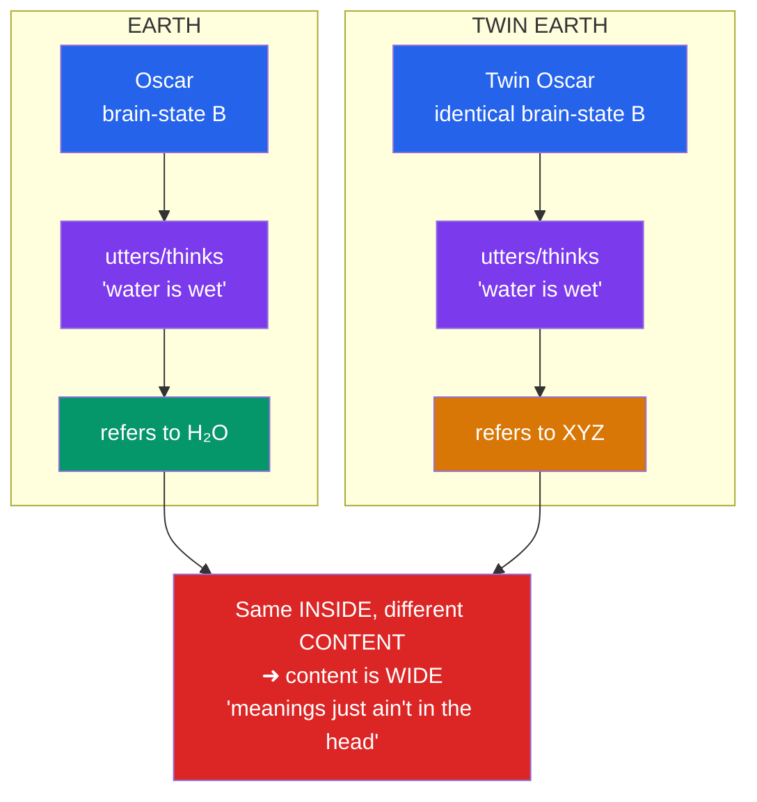

# 🎯 Intentionality and Mental Content

> [!abstract] TL;DR
> **Intentionality** is the mind's power of **aboutness** — the way a thought, belief, hope, or perception is *directed at* or *about* something beyond itself. Your fear is *of* the dog; your belief is *that* it will rain; your desire is *for* coffee. **Franz Brentano** (1874) proposed that this directedness is the very **mark of the mental** — every mental state exhibits it and no purely physical state does — making intentionality, alongside consciousness, one of the two great puzzles about mind. Two questions follow. First, **how do mental states get their content?** — answered by theories of *informational/causal covariation* (Dretske, Fodor), *teleosemantics* (Millikan), and *conceptual role*. Second, **where is content fixed — inside the head or partly out in the world?** This is the **internalism vs externalism** debate, dramatized by **Hilary Putnam's Twin Earth** ("meanings just ain't in the head") and **Tyler Burge's** social externalism. The stakes reach into AI's *symbol-grounding problem*: how could any system's inner symbols come to be *about* anything at all?

## Intuition — analogy first

A photograph of your grandmother is, physically, just a thin film of pigment on paper — a flat array of coloured dots. Yet it is *about her*: point to it and you have pointed, in a sense, across years and miles to a particular person. The pigment "reaches beyond itself." That reaching-beyond is aboutness.

But notice a crucial catch. The photograph is only *about* your grandmother because *minds* take it that way — cut every observer out of the universe and the pigment is about nothing; it is just chemistry on a card. Its aboutness is **borrowed** — philosophers call it **derived intentionality**. The same goes for words, maps, and road signs: they mean what they mean only because we interpret them.

Your *thought* of your grandmother is different. It is about her *all by itself* — no external interpreter is needed to make it so. That underived, self-standing aboutness is **original intentionality**, and explaining how a lump of grey matter could have it — how a physical brain-state could be *about* something the way no photograph intrinsically is — is the heart of this topic.

---

## How It Works — Twin Earth and the Location of Meaning

Once you ask *where* content is fixed, a famous thought experiment splits the field. **Putnam's Twin Earth** imagines a planet identical to ours except that its lakes and taps hold not H₂O but a look-alike, taste-alike substance with a different chemistry, **XYZ**. Oscar on Earth and his molecular twin on Twin Earth are, before modern chemistry, *internally identical*. Do their thoughts mean the same?

The two blue boxes are *identical* by stipulation; the two content boxes *differ*. If content can vary while the inside stays fixed, then content is not fixed by the inside alone — the moral Putnam drew as semantic **externalism**.

## Key Concepts / Details

### Brentano's Thesis — Aboutness as the Mark of the Mental

**Franz Brentano** (1874) revived a scholastic idea: every mental phenomenon is characterized by *the intentional (or mental) inexistence of an object* — its being *directed upon* a content. In love there is something loved, in judgment something judged, in desire something desired. Crucially, the object need not *exist*: you can think about **Pegasus**, dread a war that never comes, or hope for a lottery win you will never get. This **intentional inexistence** is exactly what no rock, star, or (arguably) physical state possesses on its own — which is why Brentano offered intentionality as the **defining mark of the mental** and doubted it could be reduced to the physical.

### Original vs Derived Intentionality

A distinction (sharpened by **Searle** and **Haugeland**) that organizes the whole field:

- **Original (intrinsic) intentionality** — the underived aboutness of *thoughts and experiences*. Your belief is about the world with no help from an interpreter.
- **Derived intentionality** — the *borrowed* aboutness of *words, maps, pictures, and computer symbols*, which mean things only because minds with original intentionality assign them meaning.

This distinction is the pivot of Searle's Chinese Room (see [[Functionalism_and_Machine_Minds]]): a program's symbols have at best *derived* content, so — Searle argues — no program *thereby* has a mind.

### Theories of Content — How States Come to Mean

The naturalist's project is to explain original intentionality *without* magic, in physical/causal terms. The leading programs:

| Theory | Core idea | Champion | Main problem |
|---|---|---|---|
| **Informational / causal covariation** | A state means *what it reliably tracks / is caused by* under normal conditions | Dretske, early Fodor | **Misrepresentation** and the **disjunction problem** |
| **Asymmetric dependence** | "Cow" means *cow* because mistaken (non-cow) tokenings causally *depend on* cow-tokenings, not vice versa | Fodor | Ad hoc; hard to specify precisely |
| **Teleosemantics** | A state means *what it is the biological function (selection history) to indicate* | Millikan, Papineau | **Indeterminacy** (frog: "fly" or "small dark moving thing"?) |
| **Conceptual / functional role** | Content is fixed by a state's *inferential role* in cognition | Block, Harman | Content **holism**; how do two people share a thought? |
| **Interpretationism** | Content is *what an ideal interpreter would ascribe* (the "intentional stance") | Dennett, Davidson | Threatens **realism** about content |

### The Misrepresentation / Disjunction Problem

The sharpest obstacle for tracking theories. A frog's neural detector fires at flies — but also at passing **BB pellets**. If content is *whatever causes the state*, its content is the disjunction "fly-or-pellet," and the frog can then never *mis*represent (a pellet just satisfies the disjunction). But representation *requires* the possibility of error. Solving this — saying *why* the state means **fly** and *misfires* on pellets — is what motivates Fodor's asymmetric dependence and Millikan's appeal to what the mechanism was *selected to* do.

### Internalism vs Externalism (Narrow vs Wide Content)

- **Internalism / individualism**: content **supervenes on** the subject's intrinsic physical state. Two internal duplicates *must* share all mental content — content is **narrow**.
- **Externalism**: content depends partly on the subject's **environment and social community** — content is **wide**. Twin Earth (physical environment) and Burge's cases (linguistic community) are the two classic drivers.
- **Two-factor theories** try to have both: a **narrow** component (in the head, doing the causal/psychological work — Fodor's *methodological solipsism*) plus a **wide** component (fixing reference and truth-conditions).

## Arguments & Examples

**Putnam's Twin Earth (semantic externalism).**
1. Oscar (Earth) and Twin Oscar (Twin Earth) are, pre-chemistry, molecule-for-molecule *internal duplicates*.
2. Oscar's word/thought "water" refers to **H₂O**; Twin Oscar's refers to **XYZ** — because the *substances in their environments differ*.
3. So the *content* of "water" differs between them.
4. Therefore content does not supervene on internal state alone: **"meanings just ain't in the head."**
*Upshot:* meaning is fixed partly by *causal-historical contact* with the actual stuff one is embedded among — a thesis with deep ties to the causal theory of reference.

**Burge's arthritis case (social externalism).** A man believes, falsely, that he has "arthritis in his thigh" (arthritis is by definition a joint disease). Now hold *him* physically fixed but change his *linguistic community* to one where "arthritis" *does* cover thigh ailments. Burge (1979) argues the content of his thought now differs — same individual, different community, different content. So content depends on **social/linguistic** facts, not just the environment's chemistry. Externalism thus comes in *physical* (Putnam) and *social* (Burge) flavors.

**Brentano vs Quine — is content even determinate?** Brentano held intentional idioms are *irreducible* to physical science. **Quine** pushed the opposite, radical line: his **indeterminacy of translation** argues there is *no fact of the matter* fixing a unique content ("gavagai" could mean *rabbit*, *undetached rabbit part*, or *rabbit-stage*, with no behavioral fact deciding). If Quine is right, the naturalist's search for *the* content of a state may be chasing something that isn't there — the challenge every theory in the table above must answer.

## Common Pitfalls / Misconceptions

- **Confusing "intentionality" with "intention."** *Intentions* (plans, purposes) are just one species. **Intentionality** is the far broader property of *aboutness* — beliefs, fears, perceptions, and even hopes about nothing that exists all have it. A perception can be intentional without being intentional-in-the-planning sense.
- **Thinking aboutness requires an existing object.** By Brentano's **intentional inexistence**, you can think about Pegasus, Sherlock Holmes, or a round square. The object of thought need not be real — a fact any theory of content must accommodate.
- **Assuming all content is linguistic or conceptual.** Perceptual and emotional states carry **nonconceptual content** too; a creature without language still represents its environment.
- **Reading externalism as "the inside doesn't matter."** Narrow/two-factor theories preserve a genuine causal-psychological role for internal states (Fodor's methodological solipsism); externalism constrains *reference and truth-conditions*, not *all* psychological explanation.
- **Collapsing original and derived intentionality.** Words and computer symbols have only *borrowed* meaning; thoughts (arguably) have it intrinsically. Forgetting this is exactly the slip Searle accuses strong AI of making (see [[Functionalism_and_Machine_Minds]]).
- **Assuming intentionality and consciousness are the same problem.** They are the *two* marks of the mental and can be prised apart — **representationalists** even try to *reduce* qualia to a species of intentional content (see [[Consciousness_and_the_Hard_Problem]]).

## Related Concepts

- [[_MOC_Philosophy_of_Mind|↑ Section MOC]]
- [[The_Mind_Body_Problem]] — Aboutness is one of the core features that makes the mental look non-physical
- [[Consciousness_and_the_Hard_Problem]] — The *other* mark of the mental; representationalism tries to unify the two
- [[Functionalism_and_Machine_Minds]] — The Chinese Room turns on semantics; original vs derived intentionality is its crux
- [[Dualism_vs_Physicalism]] — Can a physical/naturalistic theory of content vindicate physicalism about the mental?
- Cross-vault: [[_MOC_AI_ML_Master]] — The **symbol-grounding problem**: how could an AI's internal representations be *about* the world?
- Cross-vault: [[_MOC_NLP_Master]] — Distributional semantics ("meaning is use") as an engineering stance on content
- Cross-vault: [[_MOC_Cognitive_Psychology]] — Mental representation as the working posit of the cognitive sciences

## Review Questions

1. Explain **Brentano's thesis** that intentionality is the *mark of the mental*, and use the notion of **intentional inexistence** to show why thoughts about Pegasus are not a counterexample but a central case. Why did Brentano think this made the mental irreducible?
2. Reconstruct **Putnam's Twin Earth** argument as numbered premises and state its conclusion. Then explain how **Burge's arthritis case** extends externalism in a *different* direction, and what each shows content depends on.
3. State the **disjunction (misrepresentation) problem** for informational theories of content, using the frog-and-pellet example. Explain how **teleosemantics** and Fodor's **asymmetric dependence** each try to solve it, and one difficulty each faces.

## Sources

- Brentano, F. (1874). *Psychology from an Empirical Standpoint*. (Trans. Rancurello, Terrell & McAlister, 1973.)
- Putnam, H. (1975). "The Meaning of 'Meaning'." *Minnesota Studies in the Philosophy of Science*, 7, 131–193.
- Burge, T. (1979). "Individualism and the Mental." *Midwest Studies in Philosophy*, 4, 73–121.
- Fodor, J. A. (1987). *Psychosemantics: The Problem of Meaning in the Philosophy of Mind*. MIT Press.

#philosophy #philosophy-of-mind #intentionality #mental-content #externalism
