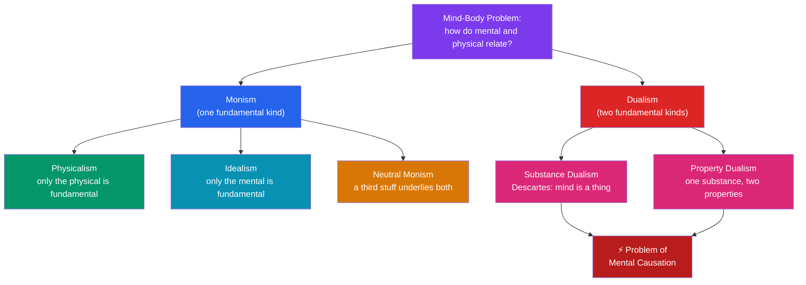

# 🧠 The Mind-Body Problem

> [!abstract] TL;DR
> The mind-body problem is the question of how mental states — thoughts, sensations, beliefs, pains — relate to physical states of the body and brain. Mental states seem to have features (subjectivity, aboutness, felt quality) that no arrangement of matter obviously possesses, yet mind and body plainly interact: a stubbed toe causes pain, and an intention to raise your arm raises it. **René Descartes** made the problem sharp by treating mind and body as two distinct *substances* — thinking stuff and extended stuff — which immediately raised the puzzle of **mental causation**: how can an immaterial mind push around a physical brain? The main answers form a map: **dualism** (mind and body are distinct), **physicalism** (the mental is nothing over and above the physical), **idealism** (only the mental is fundamental), and **neutral monism** (both derive from a more basic third thing). Every position pays a price somewhere.

## Intuition — analogy first

Imagine a **film projected onto a screen**. The moving image on the screen is vivid, colorful, full of drama — yet it seems made of a completely different kind of stuff than the whirring machine, the celluloid, and the beam of light behind it. Someone who had only ever studied the projector's gears could give you a flawless account of its mechanics and still not have said one word about the *story* on the screen.

That is the shape of the mind-body problem. The brain is the machinery: neurons, electrochemical signals, three pounds of tissue you could weigh and dissect. The mind is the projected image: the redness you see, the ache you feel, the meaning of the thought "I should call my mother." The unnerving question is whether the image is *nothing but* the machinery seen from a peculiar angle, or whether it is a genuinely additional thing that the machinery somehow throws off — and if the latter, how a beam of light could ever push back on the projector.

The analogy also flags the danger. A projected image cannot reach back and turn the projector's crank. But your *decision* to keep reading clearly did move your eyes. So either the mind is not merely a projection, or our sense that mental events cause physical ones needs a careful re-reading.

---

## How It Works — Mapping the Positions

The mind-body problem is not one question but a branching set of commitments. The first fork asks how many *kinds* of fundamental stuff exist; later forks ask how the mental and physical are related.

## Key Concepts / Details

### What Makes the Mental Look Different

The problem gets its grip from a cluster of features that mental states *seem* to have and physical states *seem* to lack:

- **Subjectivity / privacy** — there is something it is like to feel your pain, accessible to you in a way it is not to a neurosurgeon watching your scan. (See [[Consciousness_and_the_Hard_Problem]].)
- **Intentionality** — thoughts are *about* things; a belief points beyond itself at the world in a way a rock never does. (See [[Intentionality_and_Mental_Content]].)
- **Qualitative character (qualia)** — the specific redness of red, the sharpness of a pain.
- **Apparent non-spatiality** — your desire for coffee does not seem to be located three centimeters behind your left eye, even if the neural correlate is.

Physical states, by contrast, look objective, publicly measurable, spatially located, and describable in the third person. The problem is to reconcile these two profiles for what is presumably *one* person.

### Descartes' Substance Dualism

**René Descartes** (1596–1650), in the *Meditations* (1641), argued that the mind is a **thinking, non-extended substance** (*res cogitans*) and the body a **non-thinking, extended substance** (*res extensa*). His central argument is one of **conceivability**: he can clearly and distinctly conceive of his mind existing without his body, so mind and body must be really distinct (since God could create them apart). He also noted the body is *divisible* while the mind seems *indivisible* — you cannot cut off half a thought.

Crucially, Descartes was an **interactionist**: the two substances causally influence each other, meeting (he speculated) at the **pineal gland**. Sensory input moves the body and produces mental sensations; volitions in the mind move the body.

### The Problem of Mental Causation

This is the pressure point of dualism. **Princess Elisabeth of Bohemia**, in her 1643 correspondence with Descartes, pressed the decisive objection: how can something *wholly non-physical and unextended* move a physical body? All the physical causation we understand works by contact and motion — one extended thing pushing another. An immaterial mind has no surface to push with. Descartes never gave a satisfying answer.

The worry sharpens into a modern dilemma using the **causal closure of the physical**: every physical event that has a cause has a *sufficient physical* cause. If so, either the mind's contribution is redundant (overdetermination) or the mind does no causal work at all (**epiphenomenalism**), which conflicts with the obvious fact that deciding to speak makes you speak. (Developed in [[Dualism_vs_Physicalism]].)

### The Map of Positions

| Position | Fundamental stuff | Mind is… | Key figure | Chief liability |
|---|---|---|---|---|
| **Substance dualism** | Mental + physical | A distinct thinking substance | Descartes | Mental causation / interaction |
| **Property dualism** | One substance, two properties | Non-physical properties of a physical thing | Chalmers | Epiphenomenalism |
| **Physicalism (identity)** | Physical only | Identical to brain states | Place, Smart | Explaining qualia / multiple realizability |
| **Functionalism** | Physical (usually) | A causal-functional role | Putnam | The absent/inverted qualia worries |
| **Eliminative materialism** | Physical only | A folk-theoretic fiction | Churchland | Denies the obvious (belief, pain) |
| **Idealism** | Mental only | The only reality; matter is idea | Berkeley | Explaining a stable public world |
| **Neutral monism** | One neutral stuff | An arrangement of neutral elements | Spinoza, Russell | What is the "neutral" stuff? |

### Idealism and Neutral Monism

- **Idealism** (**George Berkeley**, 1685–1753): matter as an independent substance is incoherent; *esse est percipi* ("to be is to be perceived"). There is no mind-body *gap* because there is no mind-*independent* body. It dissolves the problem by denying one of its terms — at the cost of a strained account of the shared, law-governed physical world.
- **Neutral monism** (**Baruch Spinoza**; later **Bertrand Russell**, **Ernst Mach**): mind and matter are not two substances but two *aspects* or *arrangements* of a single underlying stuff that is itself neither mental nor physical. Spinoza's *dual-aspect* view holds thought and extension are two attributes of one substance (God/Nature). The challenge is saying anything positive about the "neutral" base.

## Arguments & Examples

**The conceivability argument (for dualism).**
1. I can clearly and distinctly conceive of my mind existing without my body.
2. Whatever I can clearly and distinctly conceive is metaphysically possible.
3. If mind and body were identical, it would be impossible for one to exist without the other.
4. Therefore mind and body are not identical.
*Critics target premise 2:* conceivability may not track genuine possibility (Arnauld's objection — one can conceive of a right triangle without conceiving that a²+b²=c², yet the theorem holds necessarily).

**The interaction problem (against dualism).** Elisabeth's challenge, in modern dress: neuroscience finds no gap in the physical causal chain where a non-physical push enters. Every muscle twitch traces back to motor neurons, traced back to physical antecedents. A dualist mind seems to have no room to act — unless it *violates* physics (unobserved) or is *epiphenomenal* (causally idle).

**A concrete case — phantom limb pain.** An amputee feels vivid pain in a hand that no longer exists. The physicalist reads this as decisive evidence that the *pain* tracks the brain, not the body part: manipulate cortical maps and you manipulate the experience. The dualist grants the correlation but insists correlation is not identity — the felt quality still seems left out of the neural story. The case does not settle the debate; it shows how the same data are absorbed by rival maps.

## Common Pitfalls / Misconceptions

- **"Neuroscience has already solved it."** Discovering that a mental state *correlates with* or *depends on* brain activity establishes dependence, not identity, and says nothing yet about *why* the activity is accompanied by experience. Correlation is the starting data of the problem, not its solution.
- **"Dualism is just religion; physicalism is just science."** Both are metaphysical positions. Substance dualism has serious secular defenders' arguments to answer, and physicalism makes substantive claims (e.g. causal closure) that are philosophical, not laboratory results.
- **"The mind is in the brain, so the problem is dissolved."** *Where* mental states occur is a separate question from *what* they are. Locating pain in the brain does not tell you whether the felt pain is identical to, caused by, or a distinct property of the neural firing.
- **Confusing the mind-body problem with the free-will problem.** They interact but are distinct: you can hold physicalism and still debate determinism and freedom.
- **Treating "physical" as obvious.** *Hempel's dilemma*: if "physical" means current physics, physicalism is likely false (physics is incomplete); if it means "whatever future physics posits," the thesis risks becoming empty. Defining the terms is part of the problem.

## Related Concepts

- [[_MOC_Philosophy_of_Mind|↑ Section MOC]]
- [[Dualism_vs_Physicalism]] — The two leading families of answers, worked out in detail with the causal-closure argument
- [[Consciousness_and_the_Hard_Problem]] — Why subjective experience is the hardest feature of mind to place on the physical map
- [[Functionalism_and_Machine_Minds]] — The most influential physicalist-friendly account of what minds are
- [[Intentionality_and_Mental_Content]] — "Aboutness," the second feature that makes the mental look non-physical
- Cross-section: [[Personal_Identity]] (Metaphysics) — If the mind is not the body, what makes you *you* over time?
- Cross-vault: [[_MOC_Cognitive_Psychology]] — The empirical science that studies the mind as an information processor

## Review Questions

1. Reconstruct Descartes' conceivability argument for substance dualism as a numbered argument, then state Arnauld's objection to it. Which premise does the objection target, and why is that premise doing the heavy lifting?
2. Explain the problem of mental causation. Why does the *causal closure of the physical* turn it into a dilemma for the dualist, and what are the two unattractive horns?
3. Idealism and eliminative materialism both try to *dissolve* the mind-body problem rather than solve it. Explain how each does so by denying one of the problem's terms, and identify the chief cost of each move.

## Sources

- Descartes, R. (1641). *Meditations on First Philosophy*. (See esp. Meditations II and VI.)
- Descartes, R. & Elisabeth of Bohemia (1643). *The Correspondence between Princess Elisabeth of Bohemia and René Descartes* (Shapiro, ed., 2007).
- Kim, J. (2011). *Philosophy of Mind* (3rd ed.). Westview Press. (Ch. 2–3 on the problem and mental causation.)
- Robinson, H. (2023). "Dualism." *Stanford Encyclopedia of Philosophy*.

#philosophy #philosophy-of-mind #dualism #mental-causation #descartes
