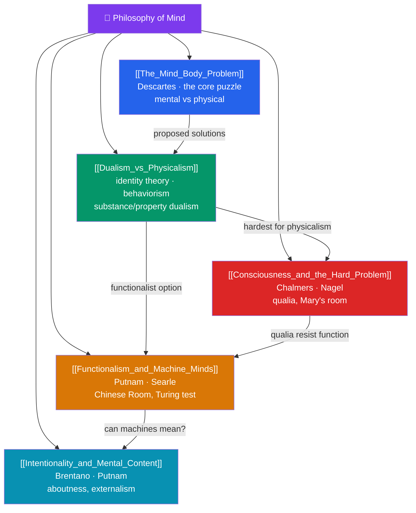

# 🗺️ Philosophy of Mind — Map of Content

> [!abstract] What This Section Covers
> How can conscious experience arise from physical matter? **The Mind-Body Problem** states the core puzzle — the apparent gulf between subjective mental states and the objective brain; **Dualism vs Physicalism** surveys the major answers, from Cartesian substance dualism and property dualism to the identity theory, behaviorism, and reductive physicalism; **Consciousness and the Hard Problem** isolates the deepest difficulty — Chalmers' distinction between "easy" problems and the hard problem of *why* there is something it is like to see red, dramatized by qualia, the explanatory gap, and Mary's room; **Functionalism and Machine Minds** defines mental states by their causal roles, opening the door to multiple realizability, the Turing test, and Searle's Chinese Room objection; and **Intentionality and Mental Content** asks how thoughts can be *about* things, from Brentano's mark of the mental to externalism about content. Five notes on the hardest thing in the universe to explain — the mind.

## Concept Map

## Learning Path

1. [[The_Mind_Body_Problem]] — The core puzzle, mental vs physical properties, and why the relation resists easy explanation.
2. [[Dualism_vs_Physicalism]] — Substance and property dualism, epiphenomenalism, the identity theory, behaviorism, and eliminativism.
3. [[Consciousness_and_the_Hard_Problem]] — Chalmers' easy vs hard problems, qualia, the explanatory gap, Nagel's bat, and Mary's room.
4. [[Functionalism_and_Machine_Minds]] — Causal-role functionalism, multiple realizability, the Turing test, and Searle's Chinese Room.
5. [[Intentionality_and_Mental_Content]] — Brentano's thesis, aboutness, internalism vs externalism, and Putnam's Twin Earth.

## All Notes at a Glance

| Note | Difficulty | What You'll Learn |
|------|------------|-------------------|
| [[The_Mind_Body_Problem]] | Beginner → Intermediate | The core puzzle, interaction, mental causation, the explanatory challenge |
| [[Dualism_vs_Physicalism]] | Intermediate | Substance/property dualism, epiphenomenalism, identity theory, behaviorism, eliminativism |
| [[Consciousness_and_the_Hard_Problem]] | Intermediate → Advanced | Easy vs hard problem, qualia, explanatory gap, Nagel's bat, Mary's room, zombies |
| [[Functionalism_and_Machine_Minds]] | Intermediate → Advanced | Functionalism, multiple realizability, Turing test, Chinese Room, strong vs weak AI |
| [[Intentionality_and_Mental_Content]] | Advanced | Brentano's mark of the mental, aboutness, narrow/wide content, externalism, Twin Earth |

## Key Questions This Section Answers

- How can subjective experience arise from objective physical processes?
- Is the mind a separate substance, or is it identical to the brain?
- Why is there something it is like to be conscious — the "hard problem"?
- Could a machine that passes the Turing test genuinely understand, or only simulate?
- How can a mental state be *about* something in the world?

## Related Sections

- [[_MOC_Philosophy_Master|↑ Philosophy Master MOC]]
- [[_MOC_Ethics|← Ethics]]
- [[_MOC_Political_Philosophy|→ Political Philosophy]]
- Cross-section: [[Personal_Identity]] (Metaphysics)
- Cross-vault: [[_MOC_AI_ML_Master]] (machine minds, LLM cognition), [[_MOC_Cognitive_Psychology]] (mind as information processor)

#MOC #Philosophy #PhilMind
