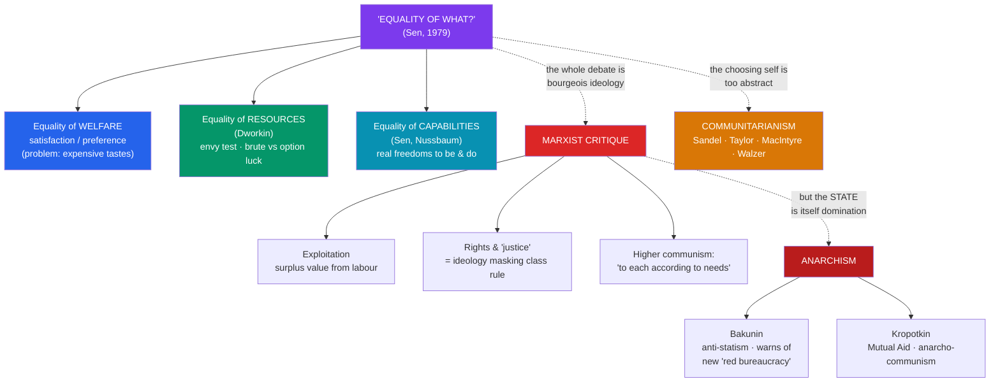

# ✊ Equality, Marxism, and Anarchism

> [!abstract] TL;DR
> Once you agree that justice requires **equality** in *some* respect, the hard question — **Amartya Sen's** 1979 lecture title — is **"Equality of what?"** Equality of **welfare**? Of **resources** (**Ronald Dworkin**)? Of **capabilities** — real freedoms to be and do (**Sen**)? Each metric picks out different winners and losers. Standing to the left of this liberal debate is the **Marxist** critique: for **Marx**, liberal justice and the "rights of man" are **ideology** — a superstructure that dignifies capitalist exploitation, in which surplus value is extracted from wage labour, and "equal right" under capitalism is a bourgeois illusion that will be transcended, not perfected, in communism ("from each according to his ability, to each according to his needs"). To the left of Marx stands **anarchism**: **Bakunin** breaks with Marx over the state, warning that a "**dictatorship of the proletariat**" would breed a new ruling class; **Kropotkin's** *Mutual Aid* (1902) argues cooperation, not competition, is the deeper factor in evolution and the basis for a stateless communism. Finally, the **liberalism–communitarianism** debate (**Sandel, Taylor, MacIntyre, Walzer**) charges that liberal justice rests on an abstract, "unencumbered" self and neglects the community that gives values meaning.

## Intuition — analogy first

Imagine three runners about to race, and you have been asked to make the race **fair**. What does "fair" require?

You might make sure everyone gets an **equal share of the prize money regardless of result** (equality of *outcome/welfare*). Or you might hand each runner an **identical pair of shoes and the same lane** and let the fastest win (equality of *resources*). Or you might notice that one runner uses a wheelchair, another has never been coached, and a third trains full-time — and conclude that identical shoes are a hollow "equality," because what people can actually *do* with the same resources differs wildly (equality of *capabilities*). Each answer is defensible; each defines fairness differently; each is somebody's idea of equality.

Now a fourth person walks up and says: **you are all arguing about how to run a rigged race.** The track was built by the winners, the rules were written to favour those who already own the stadium, and calling the contest "fair" is exactly how the owners keep everyone competing instead of asking who owns the stadium. That is the **Marxist** intervention. And a fifth voice adds: *even the referee is the problem* — any authority with the power to enforce the rules will become a new owner. Abolish the referee and let the runners organise the race themselves. That is the **anarchist**. This note is the argument among all five voices.

---

## How It Works — Metrics of Equality and their Radical Critics

Liberal egalitarians argue *within* the frame of distributive justice about the right **metric** ("equality of what?"). Marxists and anarchists attack the frame itself — the first by exposing class power beneath talk of justice, the second by rejecting the state that enforces any distribution.

## Key Concepts

### "Equality of What?" — The Metric Problem

**Amartya Sen's** 1979 Tanner Lecture "Equality of What?" reframed egalitarian debate: every plausible political theory is **egalitarian in *some* space** (equal utility, equal rights, equal resources) and inegalitarian in others, so the substantive question is *which* variable justice should equalise. Three answers structure the field:

- **Equality of welfare** (utility, preference-satisfaction, or happiness). The intuitive target — surely what matters is how well people's lives *go*. But it drowns in the **expensive-tastes** objection (Dworkin): someone who cultivates a need for vintage claret and plovers' eggs would be *owed more* resources to reach the same welfare, which seems perverse. It also cannot say no to the **"utility monster"** or to adaptive preferences (the contented slave).
- **Equality of resources** (**Ronald Dworkin**, 1981). Equalise the *means* people have, then hold them responsible for what they make of them. Dworkin models fair shares with a hypothetical **auction** subject to an **envy test** (no one prefers another's bundle) and a hypothetical **insurance market** to handle disabilities and unequal talents. His key distinction is **brute luck** vs. **option luck**: inequalities from gambles one chose to take (option luck) are fair; inequalities from unchosen circumstance (brute luck — disability, the talent lottery) call for compensation. The view is **"ambition-sensitive but endowment-insensitive."**
- **Equality of capabilities** (**Sen**, developed with **Martha Nussbaum**). What matters is neither subjective welfare nor mere resources but **capabilities** — the real, effective freedoms a person has to achieve valuable **functionings** (being nourished, literate, healthy, able to participate in community). The same bicycle (a resource) yields very different mobility (a functioning) to an able-bodied and a disabled person. Capability theory thus captures how equal resources can leave people **unequally free**, and it grounds much modern development economics (the Human Development Index).

| Metric | Equalise... | Signature strength | Signature problem |
|---|---|---|---|
| **Welfare** | Satisfaction / preferences | Tracks how life actually *goes* | Expensive tastes; adaptive preferences |
| **Resources** (Dworkin) | Means + responsibility | Respects choice (option luck) | Where does "circumstance" end and "choice" begin? |
| **Primary goods** ([[Justice_and_Rawls|Rawls]]) | All-purpose means | Workable public index | "Fetishism of goods" — ignores conversion (Sen) |
| **Capabilities** (Sen) | Real freedoms to function | Captures conversion & disability | Hard to measure; which capabilities count? |

This family of "responsibility-sensitive" views is often called **luck egalitarianism** (a term from **Elizabeth Anderson**, who criticised it): neutralise the effects of *brute luck*, hold people to account for *choices*. Its critics (Anderson's "What Is the Point of Equality?", 1999) argue it humiliates the badly-off by forcing them to prove they are blameless victims, and misses that equality is fundamentally a **relational/social** ideal — standing as equals — not just a distributive one.

### The Marxist Critique of Liberal Justice and Rights

**Karl Marx** does not offer a rival *theory of justice* so much as a critique of the whole enterprise. Several strands (see [[Marx_and_Critical_Theory]] for the fuller treatment):

- **Historical materialism** and **base/superstructure**: the economic **base** (forces and relations of production) conditions the legal, political, and ideological **superstructure**. Law and morality are not autonomous; they reflect and stabilise the prevailing mode of production.
- **Exploitation and surplus value**: under capitalism the worker sells **labour-power** and is paid its value (subsistence), but produces *more* value than that in the working day; the difference — **surplus value** — is appropriated by the capitalist. Crucially, this can occur even when every exchange is "**fair**" by the market's own standards: exploitation is structural, not a matter of cheating.
- **Rights as ideology**: in "On the Jewish Question" (1843), Marx argues the celebrated **rights of man** are the rights of the **egoistic individual** — man "separated from other men and from the community" — and that political emancipation (equal legal rights) leaves untouched the real domination of civil society. "Liberty, equality, property, and Bentham" reign at the marketplace door; behind it lies the hidden abode of production and command. Talk of **justice** and **equal right**, on this view, is largely **ideology**: it presents historically specific, class-serving arrangements as neutral and eternal.
- **"Equal right" is still bourgeois right** (*Critique of the Gotha Programme*, 1875). Even in the **first phase** of communism, distribution "**to each according to his contribution**" applies an *equal standard* to *unequal individuals* — and so, Marx says, "**this equal right is... a right of inequality, in its content, like every right.**" Only in the **higher phase**, when labour has become "life's prime want" and abundance overflows the "narrow horizon of bourgeois right," can society inscribe on its banner: "**From each according to his ability, to each according to his needs!**" Justice, for Marx, is a **juridical** category tied to scarcity and class — to be *transcended*, not perfected.

> [!note] Was Marx a theorist of justice? (The Wood–Cohen debate)
> Analytical Marxists dispute whether Marx *condemned* capitalism as **unjust**. **Allen Wood** argues Marx thought capitalist exploitation was *not* unjust *by capitalism's own standards* — justice is internal to a mode of production, so there is no transhistorical standard by which to indict it. **G. A. Cohen** and others reply that Marx's language of "robbery" and "theft" only makes sense if he *is* deploying a standard of justice, however implicitly. The dispute matters: it asks whether the critique of capitalism is *moral* or *scientific*.

### Anarchism — Against the State Itself

Anarchism agrees with much of the socialist critique of inequality but breaks decisively on the **state**. Where Marx envisaged the state "withering away" *after* a transitional proletarian dictatorship, anarchists insist the state can never be a tool of liberation — see [[The_State_and_Political_Authority]].

- **Mikhail Bakunin** (collectivist anarchism). Marx's great antagonist in the **First International**. In *Statism and Anarchy* (1873) he warned with striking prescience that a "**dictatorship of the proletariat**" would not dissolve but **entrench** power: a new class of "**red bureaucrats**," ex-workers turned rulers, would look down on the masses "from the heights of the state." His slogan: authority corrupts; **freedom without socialism is privilege, socialism without freedom is slavery**. Bakunin favoured a federation of self-governing collectives built from below.
- **Peter Kropotkin** (anarcho-communism). His *Mutual Aid: A Factor of Evolution* (1902) marshalled biology and history against the Social-Darwinist reading of "survival of the fittest," arguing that **cooperation** — mutual aid within species and human communities (guilds, villages, unions) — is at least as powerful an evolutionary and social force as competition. This grounds an optimistic case that a **stateless, propertyless** society organised by voluntary cooperation is feasible, not utopian. (**Proudhon's** earlier mutualism and the slogan "**property is theft**" stand behind this tradition.)

### The Liberalism–Communitarianism Debate

A distinct challenge to [[Justice_and_Rawls|Rawlsian]] liberalism came in the 1980s from **communitarians**, who target liberalism's picture of the *self* and the *priority of the right over the good*:

- **Michael Sandel** (*Liberalism and the Limits of Justice*, 1982) argues the party behind the veil of ignorance is an **"unencumbered self"** — a chooser abstracted from the very attachments (family, faith, nation) that constitute identity — and that no real agent is prior to their ends in this way.
- **Charles Taylor** attacks **atomism**: the liberal individual is not self-sufficient but formed by, and indebted to, a community and its language of value.
- **Alasdair MacIntyre** (*After Virtue*, 1981) argues moral reasoning is unintelligible outside a tradition and a shared **telos**, which liberal individualism has dissolved.
- **Michael Walzer** (*Spheres of Justice*, 1983) defends **complex equality**: different social goods (money, office, health care, honour) have distinct **social meanings** and belong to distinct **spheres**; injustice is **domination** — when success in one sphere (money) illegitimately buys goods in another (political office, justice). Distribution should respect these shared meanings, which are **community-relative**.

Liberals reply (Rawls' own *Political Liberalism* is partly a response) that the veil is a **device of representation**, not a metaphysics of the self, and that a liberal order is precisely what lets diverse communities pursue their own conceptions of the good. The debate reshaped both camps and pushed liberalism toward greater attention to culture, membership, and stability.

## Arguments & Examples

**Sen's bicycle and the conversion problem.** Give two people an identical bicycle — an equal *resource*. An able-bodied cyclist gains real mobility; a person with a mobility impairment may gain almost none. Equal resources have produced **unequal freedom**. Sen's point is that justice should track the **capability** (what you can actually do), not just the commodity, and that Rawls' index of **primary goods** commits a kind of "fetishism" by focusing on the means while ignoring the varying rates at which people **convert** means into functionings.

**Brute luck vs. option luck at the casino and the clinic.** Two people end up poor. One lost a fortune at roulette (an *option-luck* gamble freely chosen); the other was born with a costly congenital illness (*brute luck*, unchosen). Dworkin's resource egalitarianism says justice compensates the second but not the first — capturing a widespread intuition that we owe redress for unchosen misfortune but not for the downside of voluntary bets. Anderson's critique bites here: to receive aid the ill person must present themselves as a pitiable victim of nature, which she argues is degrading and misconstrues equality as a relation among citizens.

**Exploitation without cheating.** A worker signs a voluntary contract at the going wage and is paid it in full; no fraud, no breach. Marx's claim is that exploitation persists *anyway*, because the wage buys **labour-power** for a day while the day's labour produces more value than the wage — the surplus flowing to the owner of the means of production. This is why Marx thinks a critique pitched purely in terms of "**fair exchange**" and "**equal rights**" cannot reach the phenomenon: the injustice, if it is one, is in the **relations of production**, not in any individual transaction.

**Bakunin's prophecy and the twentieth century.** Bakunin's warning that a workers' state would install a new bureaucratic ruling class is often read against the actual history of twentieth-century state socialism. Whatever one concludes about the causes, the episode is a standing challenge to any theory (including some readings of Marx) that treats the **state** as a neutral instrument that the right class can simply pick up and use — and a vindication of the anarchist insistence that the *form* of power matters as much as who holds it.

## Common Pitfalls / Misconceptions

- **"Egalitarians all want equal outcomes."** The whole point of "equality of what?" is that egalitarians disagree sharply. Resource and capability egalitarians deliberately allow **unequal outcomes** that flow from people's own choices (option luck); what they neutralise is **unchosen disadvantage**.
- **"Marx had a theory of distributive justice."** Contested at best. Marx is largely *critical* of justice-talk as bourgeois ideology and juridical illusion; "to each according to his needs" is a description of a post-scarcity society *beyond* the "narrow horizon of bourgeois right," not a distributive principle to be enforced by a just state. Reading Marx as "Rawls plus more redistribution" misses the critique of the frame.
- **"Marxism and anarchism are the same thing."** They share enemies (capitalism, inequality) but split over the **state**: Marx accepts a transitional proletarian state expected to wither away; Bakunin and Kropotkin reject *any* state as inherently dominating. The Marx–Bakunin split in the First International (1872) was foundational, not a footnote.
- **"Kropotkin denied competition / Darwin."** *Mutual Aid* does not deny natural selection; it argues **cooperation** is a major, under-recognised factor *within* it, correcting the Social-Darwinist gloss that read nature as pure ruthless struggle. It is a supplement to and correction of a *reading* of Darwin, not a rejection of evolution.
- **"Capabilities give a single agreed list."** Sen deliberately declines to fix a canonical list, leaving it to public reasoning; **Nussbaum** *does* propose a list of central capabilities. Treating "the capability approach" as one settled doctrine flattens a real internal disagreement.
- **"Communitarians reject rights and liberty."** Most do not reject liberty; they reject a particular *metaphysics of the self* and the claim that the **right** is fully prior to the **good**. Walzer and Taylor are defenders of a rich, if community-anchored, freedom — see [[Liberty_and_Rights]].

## Related Concepts

- [[_MOC_Political_Philosophy|↑ Section MOC]]
- [[Justice_and_Rawls]] — The liberal theory these critics target: Sen and Dworkin dispute Rawls' primary-goods metric; communitarians dispute the unencumbered self; Marxists dispute the frame
- [[The_State_and_Political_Authority]] — Anarchism's rejection of the state; the legitimacy and obligation problems that Bakunin and Kropotkin answer by abolishing authority
- [[Liberty_and_Rights]] — Marx's critique of the "rights of man" as egoistic, and the communitarian rethinking of individual freedom
- [[The_Social_Contract]] — The contractarian tradition Marx charges with masking class domination behind a fiction of consent
- Cross-vault: [[Marx_and_Critical_Theory]] (historical materialism, ideology, the Frankfurt School), [[_MOC_History_Master]] (socialism, the First International, twentieth-century state socialism), [[_MOC_Microeconomics_Master]] (welfare economics, inequality measurement)

## Review Questions

1. Explain Sen's question **"Equality of what?"** by comparing equality of **welfare**, **resources**, and **capabilities**. Use the bicycle example to show why equal resources can leave people unequally free, and state one objection to each metric.
2. Reconstruct Marx's claim that **liberal justice and the "rights of man" are ideology**. Why does he think a critique framed in terms of "fair exchange" and "equal right" *cannot* reach capitalist **exploitation**? What does the *Critique of the Gotha Programme* mean by calling "equal right" a "right of inequality"?
3. On what central point do **Marx** and **Bakunin** diverge, and how does **Kropotkin's** *Mutual Aid* try to make a stateless society plausible? Why does Bakunin predict that a "dictatorship of the proletariat" would create a new ruling class?

## Sources

- Sen, A. (1979). "Equality of What?" The Tanner Lecture on Human Values, Stanford University
- Dworkin, R. (1981). "What Is Equality? Part 2: Equality of Resources." *Philosophy & Public Affairs*, 10(4)
- Marx, K. (1875). *Critique of the Gotha Programme*; and (1843) "On the Jewish Question," in *Marx: Early Writings* (Penguin, 1975)
- Kropotkin, P. (1902). *Mutual Aid: A Factor of Evolution*; Kymlicka, W. (2002). *Contemporary Political Philosophy* (2nd ed.), chs. 3, 5–6. Oxford University Press

#philosophy #political-philosophy #equality #marxism #anarchism #distributive-justice
