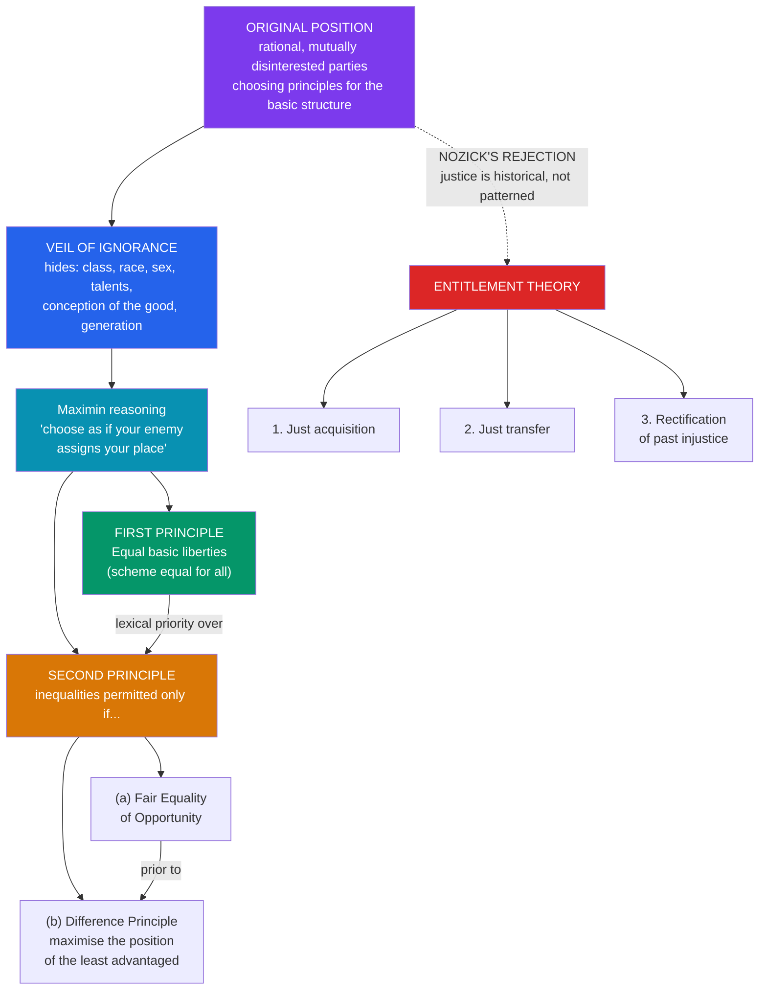

# ⚖️ Justice and Rawls

> [!abstract] TL;DR
> **John Rawls'** *A Theory of Justice* (1971) revived social contract thinking to answer a single question: what principles for the basic structure of society would free and equal people choose if they had to agree unanimously and in advance? Rawls stages a thought experiment — the **original position** — in which parties choose behind a **veil of ignorance** that hides their race, class, sex, talents, and even their conception of the good. Not knowing where they will land, rational choosers avoid gambling and select two principles, in strict priority: (1) **equal basic liberties** for all, and (2) social and economic inequalities are permitted only if they attach to positions open under **fair equality of opportunity** *and* work to the greatest benefit of the **least advantaged** (the **difference principle**). This is **"justice as fairness."** The most influential reply, **Robert Nozick's** *Anarchy, State, and Utopia* (1974), rejects the whole project: justice is **historical**, not patterned. His **entitlement theory** holds that a distribution is just if it arose through just acquisition and just transfer; the **Wilt Chamberlain** argument shows that any preferred pattern is upset by voluntary exchanges; and redistributive taxation is, provocatively, **"on a par with forced labor."**

## Intuition — analogy first

Imagine you must cut a cake for a room full of strangers, but with one twist: **you will not know which slice is yours until everyone else has taken theirs.** You get the last piece by default.

Suddenly your incentives change. You will not carve one enormous slice and a pile of crumbs, because you might end up with the crumbs. Nor will you insist on perfectly equal slices if letting one slice be slightly bigger somehow makes the *smallest* slice bigger too (say, a bigger slice motivates someone to bake more cake for everyone). What you *will* refuse to gamble on is going hungry — you protect the worst-off position because that position might be yours.

That is the engine of Rawls' theory. The **veil of ignorance** forces you to choose the rules of society as if you might be *anyone* in it — the CEO or the cleaner, the healthy heir or the disabled orphan. Justice, for Rawls, is simply whatever fair-minded people would agree to when they cannot rig the rules in their own favour. Nozick's rejoinder is that this whole picture treats society's goods as a **cake to be distributed** by some central cutter — when in reality goods come into the world already attached to the people who made, found, or were given them. There is no cake; there are only slices, each already someone's.

---

## How It Works — From the Original Position to the Two Principles

Rawls' argument is a derivation: fair *conditions of choice* (the original position) are engineered so that whatever is chosen under them is, by construction, fair. Nozick attacks not the math of the choice but its starting assumption — that distribution is the right frame at all.

## Key Concepts

### The Original Position and the Veil of Ignorance

Rawls updates the [[The_Social_Contract|social contract]] from a story about escaping the state of nature into a **device of representation**: a hypothetical choosing situation designed to model fairness. The parties are **rational** (they pursue their interests effectively) and **mutually disinterested** (neither altruistic nor envious). They are tasked with choosing, unanimously, the principles that will govern the **basic structure** — the major institutions distributing rights, opportunities, and income.

The crucial constraint is the **veil of ignorance**. Behind it, no party knows:

- their **social class**, **race**, **sex**, or ethnicity;
- their **natural talents** (intelligence, strength) — which Rawls calls **morally arbitrary**, since no one *earns* their genetic endowment;
- their **conception of the good** (their religion, values, life plan);
- even the **generation** to which they belong.

They do know general facts about economics, psychology, and society. Stripped of knowledge that would let them tailor principles to their own advantage, the parties cannot bargain from strength — so the agreement they reach is fair. This is why Rawls calls his theory **"justice as fairness"**: fairness is built into the *procedure*, and justice is whatever emerges from it.

### The Two Principles of Justice

Rawls argues the parties would adopt **maximin** reasoning — under conditions of deep uncertainty where the worst outcome would be intolerable, you rank options by their *worst possible result* and choose the option whose worst outcome is best ("maximise the minimum"). This yields two principles, in **lexical (strict) priority order**:

1. **The Liberty Principle**: "Each person is to have an equal right to the most extensive total system of equal basic liberties compatible with a similar system of liberty for all." (Later restated in *Political Liberalism* as a **fully adequate scheme** of equal basic liberties.) These include political liberty, freedom of speech and conscience, and the rule of law — see [[Liberty_and_Rights]].

2. **The second principle** governs social and economic inequalities, which are just only if they satisfy two conditions:
   - **(a) Fair Equality of Opportunity (FEO)**: positions must be open to all, and people with the same talents and willingness to use them should have the same prospects regardless of their starting class.
   - **(b) The Difference Principle**: inequalities are permissible *only if* they work to the **greatest benefit of the least-advantaged** members of society.

The **priority rules** are essential and often forgotten: the first principle takes absolute (**lexical**) priority over the second — you cannot trade basic liberties for economic gain. Within the second, **FEO takes priority over the difference principle**.

> [!note] The Difference Principle is not strict equality
> Rawls does **not** demand equal shares. He allows inequality — even large inequality — *provided* it lifts the floor. If paying surgeons more produces better healthcare for the poorest, the inequality is just. What is ruled out is inequality that leaves the worst-off worse than they would be under a more equal arrangement. This is why Rawls is often read as offering a principled middle path between laissez-faire and strict egalitarianism.

### Supporting Machinery

- **Primary goods**: the all-purpose means any rational person wants whatever else they want — rights and liberties, opportunities, income and wealth, and the **social bases of self-respect**. Rawls uses these (not happiness or preference-satisfaction) as the *metric* of who counts as "least advantaged." This choice is later challenged by Sen and Dworkin — see [[Equality_Marxism_and_Anarchism]].
- **Reflective equilibrium**: the method of justifying principles by adjusting them against our considered moral judgments (e.g. "slavery is unjust") until principles and intuitions cohere. Justification is not derivation from self-evident axioms but mutual adjustment.
- **The natural lottery**: the distribution of talents is a "natural lottery" that is **neither just nor unjust** — but a just society treats the resulting endowments as, in a sense, a **common asset**, so that the fortunate gain only on terms that also help the unfortunate.

### Nozick's Entitlement Theory (*Anarchy, State, and Utopia*, 1974)

**Robert Nozick** launches the most cited libertarian reply. His core move is a distinction between kinds of theory:

- **End-state / patterned theories** (like Rawls', or "distribute according to need/merit/IQ") judge a distribution just by whether it fits a **structural pattern** at a time-slice.
- **Historical theories** judge a distribution by **how it came about**.

Nozick defends a historical, procedural theory — the **entitlement theory** — with three principles:

1. **Justice in acquisition**: how unowned things may first come to be owned (Nozick offers a weakened Lockean proviso — appropriation is legitimate if it does not worsen others' position).
2. **Justice in transfer**: holdings acquired by voluntary exchange or gift from a legitimate owner are just.
3. **Rectification**: how to correct past violations of (1) and (2) — a principle Nozick admits is underdeveloped, and which has large implications for historic injustices such as theft or slavery.

If your holdings arose through just acquisition and just transfer (or rectification), they are yours **by right**, full stop — regardless of the overall pattern.

| Dimension | **Rawls (justice as fairness)** | **Nozick (entitlement)** |
|---|---|---|
| Type of theory | Patterned / end-state | Historical / procedural |
| Central question | Is the *distribution* fair? | Did the holdings arise *justly*? |
| Role of the state | Redistributive, guarantees FEO + difference principle | Minimal "night-watchman" state only |
| View of talents | Morally arbitrary; a common asset | Yours; you are entitled to what they produce |
| Taxation for redistribution | Required by justice | "On a par with forced labor" |
| Liberty and equality | Equal liberty first, then regulated inequality | Liberty upsets patterns — and that is fine |
| Political heir | Egalitarian liberalism, welfare state | Libertarianism, minimal state |

## Arguments & Examples

**The Wilt Chamberlain argument.** Nozick's most famous thought experiment. Start from *any* distribution you consider perfectly just — call it D1 (make it Rawls' own if you like). Now suppose a million fans each freely choose to drop 25 cents into a box to watch the basketball star Wilt Chamberlain play. He ends up with \$250,000 — far more than anyone else — producing distribution D2. **Is D2 unjust?** Each transfer was voluntary, starting from a just baseline; no one was wronged. Yet D2 violates the original pattern. Nozick's conclusion: **"liberty upsets patterns."** To *maintain* any end-state pattern, the state must "continuously interfere" with people's free choices. The argument is meant to show that patterned theories are incompatible with liberty. (Rawlsians reply that the difference principle governs the **basic structure** — the background rules — not every individual transaction, so isolated exchanges need not be blocked; the pattern is maintained through taxation, not by policing each ticket sale.)

**"Taxation as forced labor."** Nozick argues: "Taxation of earnings from labor is on a par with forced labor." If the state takes *n* hours' worth of your wages, it is as if it has appropriated *n* hours of your labour — making you work, in part, for others' purposes without your consent. The rhetorical force is real, but critics note the analogy strains: taxpayers retain choice over *what* work to do and benefit from the public goods (courts, roads, defence) that make their earnings possible in the first place.

**Why maximin, and why not gamble?** A standard objection (from **John Harsanyi**) is that rational choosers behind the veil should be **average utility maximisers** — treating each identity as equally probable and maximising *expected* welfare, which could license large inequalities. Rawls' defence of maximin rests on special features of the choice: the parties cannot estimate probabilities, the stakes involve their whole life prospects, and the worst outcomes (grinding poverty, subjection) are intolerable. Whether Rawls is entitled to *rule out* gambling is one of the deepest disputes in the literature.

**Reflective equilibrium in action.** Suppose a principle you find attractive implies that punishing an innocent person to deter crime is just. That clashes with a firm considered judgment. Reflective equilibrium tells you to revise *either* the principle *or*, occasionally, the judgment — moving back and forth until they cohere. This is how Rawls thinks moral theories are actually justified, and it distinguishes his method from both intuitionism and strict deductivism.

## Common Pitfalls / Misconceptions

- **"The difference principle demands equality."** No — it *permits* inequality, sometimes substantial, so long as the inequality benefits the least advantaged. It is a principle about the *floor*, not the *gap*. Treating Rawls as a strict egalitarian misreads him.
- **"The veil of ignorance is meant to be historically real."** Like the classic [[The_Social_Contract|social contract]], the original position is a **hypothetical device**, not an event. Its job is to model fair conditions of choice, not to report a past agreement.
- **"Rawls ranks equality above liberty."** The opposite: the **liberty principle has lexical priority**. Basic liberties cannot be sacrificed for economic gains, even large ones. Rawls is a *liberal* egalitarian, with liberty first.
- **"Nozick is an anarchist."** No — he argues (against the [[The_State_and_Political_Authority|anarchist]]) that a **minimal state** can arise from a state of nature *without* violating anyone's rights, via a "dominant protective agency," through an "invisible-hand" process. He defends the minimal state and rejects anything more extensive.
- **"Nozick has no concern for the poor."** His theory does contain a **rectification principle**; and some argue that a serious accounting of historically unjust acquisitions (conquest, slavery, expropriation) could require large-scale redistribution even on entitlement grounds. Nozick himself left rectification underspecified.
- **"Behind the veil you know you are risk-averse."** The parties' psychology is thin: Rawls' argument for maximin depends on the *structure* of the choice (no probabilities, whole-life stakes), not on assuming the parties are temperamentally cautious.

## Related Concepts

- [[_MOC_Political_Philosophy|↑ Section MOC]]
- [[The_Social_Contract]] — The contractarian tradition Rawls revives; the original position is hypothetical consent, not historical consent
- [[Liberty_and_Rights]] — The basic liberties protected by Rawls' first principle, and the negative/positive liberty distinction his framework presupposes
- [[The_State_and_Political_Authority]] — What legitimates the coercive institutions Rawls' principles are meant to govern; Nozick's minimal state answers the anarchist
- [[Equality_Marxism_and_Anarchism]] — Sen's and Dworkin's "equality of what?" challenge to Rawls' primary-goods metric, and the Marxist charge that liberal justice masks class power
- Cross-vault: [[_MOC_Game_Theory_Master]] (maximin, decision under uncertainty, bargaining), [[_MOC_Microeconomics_Master]] (welfare economics, distribution)

## Review Questions

1. Explain how the **veil of ignorance** is supposed to guarantee that the principles chosen in the original position are *fair*. Why does Rawls think rational parties would use **maximin** reasoning rather than maximise expected utility (as Harsanyi argues)?
2. State the **difference principle** precisely and explain why it *permits* rather than prohibits inequality. Give an example of an inequality it would allow and one it would forbid.
3. Reconstruct the **Wilt Chamberlain argument** and explain the claim that "liberty upsets patterns." How might a Rawlsian respond by distinguishing the **basic structure** from individual transactions?

## Sources

- Rawls, J. (1971). *A Theory of Justice*. Harvard University Press. (Revised ed. 1999)
- Nozick, R. (1974). *Anarchy, State, and Utopia*. Basic Books
- Rawls, J. (1993). *Political Liberalism*. Columbia University Press
- Kymlicka, W. (2002). *Contemporary Political Philosophy: An Introduction* (2nd ed.), chs. 3–4. Oxford University Press

#philosophy #political-philosophy #justice #rawls #nozick #veil-of-ignorance
