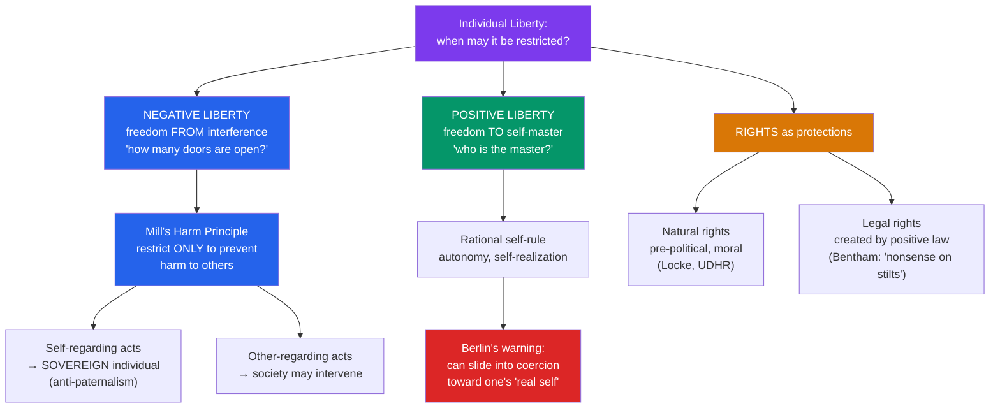

# 🕊️ Liberty and Rights

> [!abstract] TL;DR
> How much may a society legitimately restrict an individual? **Mill's** *On Liberty* (1859) answers with the **harm principle**: power may be exercised over someone against their will *only* to prevent harm to others — never merely for their own good (anti-paternalism) or because the majority is offended. **Isaiah Berlin** later distinguished **negative liberty** (freedom *from* interference — the absence of external obstacles) from **positive liberty** (freedom *to* be one's own master — self-realization or self-rule), warning that positive liberty can be twisted into coercing people toward their "real" selves. Rights come in two families: **natural rights** (pre-political, grounding a moral limit on the state) and **legal rights** (created and enforced by positive law). Together these ideas frame the perennial question of where the individual ends and the collective's authority begins.

## Intuition — analogy first

Think of liberty like the swing of your fist.

There is an old saying: "Your right to swing your fist ends where my nose begins." That single line captures Mill's whole project. In the open air, you may swing your arms freely — dance, exercise, gesture wildly — and no one may stop you, however foolish it looks. The moment your fist reaches someone else's face, society may intervene. The point is not that punching is *forbidden as such*, but that the **only** license for interference is the presence of a victim. Boredom, disapproval, or the desire to improve your character are not enough.

Now notice two very different things "freedom" could mean here. One is simply *no one grabbing your arm* — the physical absence of obstacles (**negative liberty**). The other is *being genuinely in command of yourself* — sober, undominated by compulsion, able to act on your considered goals (**positive liberty**). A heroin addict's arm is unrestrained (negatively free) yet enslaved to the drug (not positively free). Berlin's warning is that once we say freedom means being your "true" self, someone else may claim to know that self better than you do — and force you toward it.

---

## How It Works — Mapping Liberty and Rights

The domain splits along two axes: *which conception of freedom* is at stake, and *what justifies limiting it.*

## Key Concepts

### Mill and the Harm Principle (*On Liberty*, 1859)

**John Stuart Mill** states "one very simple principle": the "**sole end for which mankind are warranted, individually or collectively, in interfering with the liberty of action of any of their number, is self-protection.** ... the only purpose for which power can be rightfully exercised over any member of a civilized community, against his will, is to prevent harm to others. His own good, either physical or moral, is not a sufficient warrant."

- **Self-regarding vs. other-regarding conduct.** Over conduct that affects only oneself, "the individual is sovereign." Only conduct that harms others falls within society's legitimate jurisdiction.
- **Anti-paternalism.** The state may warn, persuade, and educate, but it may not coerce competent adults *for their own good*. Mill's example: you may stop a person from crossing an unsafe bridge only to warn them of the danger; if they understand the risk, they may cross.
- **The offense/harm distinction.** Mere offense, disgust, or moral disapproval is *not* harm. This blocks the "tyranny of the majority" — social pressure enforcing conformity — which Mill feared as much as legal tyranny.
- **Freedom of thought and discussion.** Even a universally held opinion may be silenced only at great cost: if the dissenter is right we lose the truth; if wrong, we lose the "clearer perception and livelier impression of truth produced by its collision with error." Suppressed truths become "dead dogma."
- **Foundations.** Mill is a *utilitarian*: liberty is defended not as a natural right but because it maximizes long-run human flourishing ("utility in the largest sense, grounded on the permanent interests of man as a progressive being"). The **individuality** that liberty protects is itself a component of well-being.

### Berlin's Two Concepts of Liberty (1958)

**Isaiah Berlin's** lecture "Two Concepts of Liberty" is the canonical map of what "freedom" can mean.

- **Negative liberty** answers: *"Over what area am I left to do as I want, without interference?"* It is the **absence of external obstacles** or coercion by others. More negative liberty = more open doors, regardless of whether you walk through them.
- **Positive liberty** answers: *"Who is master — what or who governs me?"* It is **self-mastery**: acting from one's own rational, autonomous self rather than being pushed by external forces or lower appetites. It underlies ideals of self-government and self-realization.
- **Berlin's warning.** Positive liberty is not bad in itself, but it is prone to a dangerous slide. Once we distinguish a person's "real" (rational, higher) self from their "empirical" (actual, desiring) self, a ruler or party can claim to liberate people by forcing them to conform to their "true" interests — "**forcing them to be free**" (Berlin explicitly reads Rousseau this way; see [[The_Social_Contract]]). Twentieth-century totalitarianisms, Berlin argues, spoke the language of positive liberty.
- **Value pluralism.** Berlin denies there is a single harmonious set of ideals; liberty, equality, and security can genuinely conflict, and gaining one may cost another. There is no formula that dissolves the trade-off — a direct challenge to the systematizing ambitions of [[Justice_and_Rawls|Rawls]].

### Natural vs. Legal Rights

A **right** is a justified claim that others (including the state) must respect. Two great families:

| Feature | **Natural / Moral Rights** | **Legal / Positive Rights** |
|---|---|---|
| Source | Human nature, reason, or moral status | Enactment by legislatures, courts, constitutions |
| Existence | Prior to and independent of any state | Only where positive law creates them |
| Function | A *moral limit* on what the state may do | Enforceable *within* a legal system |
| Example | "All humans have a right to life" | "Citizens over 18 have a right to vote" |
| Key defenders | Locke, natural-law tradition, UDHR (1948) | Legal positivists (Bentham, Austin, Hart) |
| Key critics | Bentham: natural rights are "nonsense upon stilts" | Critics: unjust laws can grant "rights" that ought not exist |

- **Hohfeld's analysis** (1919) refines "rights" into four positions — *claim-rights* (correlate to duties in others), *liberties/privileges* (freedom to act), *powers* (ability to alter legal relations), and *immunities* (protection from others' powers) — clarifying much loose talk about "rights."
- **Negative vs. positive rights** (distinct from Berlin's liberties): *negative rights* require others to refrain (a right against assault); *positive rights* require others to provide (a right to healthcare or education). Libertarians accept mainly negative rights; social-democratic theories affirm robust positive rights. See [[Equality_Marxism_and_Anarchism]].

### The Limits of State Coercion

Beyond Mill, later liberals debated exactly which restrictions are permissible. The **Hart–Devlin debate** (1960s) is the classic case: **Patrick Devlin** argued society may legislate to preserve its shared morality (legal moralism); **H.L.A. Hart**, extending Mill, replied that mere immorality without harm to others is not the law's business. **Joel Feinberg's** four-volume *The Moral Limits of the Criminal Law* maps the candidate justifications for coercion — the harm principle, the *offense* principle, *legal paternalism*, and *legal moralism* — and defends roughly the first two while rejecting the last two.

## Arguments & Examples

**Free speech and "dead dogma."** Mill's argument for open discussion is why liberal societies protect even offensive or false speech: silencing error deprives society of the vivid contest that keeps true beliefs alive. The same logic, however, does not obviously protect speech that *harms* — incitement, defamation, and threats fall on the other side of the harm line, which is why "harm" must be defined carefully.

**Seatbelt and helmet laws — the hard case for anti-paternalism.** Requiring adults to wear seatbelts looks like exactly what Mill forbids: coercion for one's own good. Defenders respond either (a) that the harm is not purely self-regarding (accident victims impose costs on public healthcare and traumatize others), or (b) that Mill's principle is too strict and "soft paternalism" (protecting people from choices that are not truly voluntary or fully informed) is defensible. The debate shows how rarely conduct is *purely* self-regarding.

**Negative liberty can coexist with domination.** A worker with no other job options may face no legal barrier to quitting (fully *negatively* free) yet be effectively at an employer's mercy. **Republican** theorists (Philip Pettit) add a third conception — **freedom as non-domination** — arguing that being subject to another's *arbitrary power* is a loss of liberty even if that power is never exercised. This reframes debates about workplaces, welfare, and colonialism.

**Rights as trumps.** Ronald Dworkin's image of rights as **"trumps"** captures their distinctive force: a genuine right (e.g., to free exercise of religion) cannot be overridden merely because doing so would produce marginally more aggregate welfare. This is the anti-utilitarian core that connects rights-talk to [[Justice_and_Rawls|Rawls']] insistence on the "inviolability" of each person.

## Common Pitfalls / Misconceptions

- **"The harm principle settles hard cases by itself."** It only relocates the debate onto the meaning of *harm*. Is economic competition that ruins a rival "harm"? Is deep offense a harm? Is second-hand risk? Mill's principle is a framework, not an algorithm.
- **"Negative liberty is real freedom and positive liberty is a trick."** Berlin defended value pluralism, not the abolition of positive liberty. Autonomy and self-rule are genuine goods; the warning is specifically against *coercion justified in their name*. Many liberals (and Berlin himself) valued both concepts.
- **"Mill was against all government intervention."** Mill supported compulsory education, public health measures, and even significant economic regulation. His principle constrains coercion aimed at *self-regarding* conduct, not the whole domain of policy.
- **"Natural rights and legal rights are rivals — you must pick one."** They do different jobs: natural (moral) rights *criticize* laws; legal rights *operate within* them. A theorist can affirm both, using moral rights to argue which legal rights ought to exist.
- **"More freedom is always better."** Liberties conflict (your liberty to build may destroy my liberty to enjoy quiet), and freedom trades off against equality and security. Berlin's pluralism insists these trade-offs are real and not dissolvable by definition.

## Related Concepts

- [[_MOC_Political_Philosophy|↑ Section MOC]]
- [[The_Social_Contract]] — Where natural rights originate and what "freedom" the contract is meant to secure (Hobbesian, Lockean, and Rousseauian liberty)
- [[Justice_and_Rawls]] — Rawls makes "equal basic liberties" his first and lexically prior principle; contrast with Berlin's pluralist doubts
- [[The_State_and_Political_Authority]] — The flip side: when the state's coercion is *legitimate*, and whether we are obligated to obey
- [[Equality_Marxism_and_Anarchism]] — Positive rights, freedom as non-domination, and the Marxist charge that "formal" liberty masks real unfreedom
- Cross-vault: [[_MOC_History_Master]] (the Enlightenment, abolition, civil rights movements), [[Utilitarianism]] (Mill's ethical foundation)

## Review Questions

1. State Mill's harm principle precisely and apply it to a contested case (e.g., mandatory motorcycle helmets, recreational drug use, or hate speech). Where exactly does the argument turn on the definition of "harm," and how might a defender of soft paternalism respond?
2. Distinguish Berlin's **negative** and **positive** liberty. Why does Berlin think positive liberty is especially prone to abuse, and how does his critique connect to Rousseau's "forced to be free"? Is his worry fair to defenders of autonomy?
3. Bentham called natural rights "nonsense upon stilts." Explain the disagreement between natural-rights theorists and legal positivists, and argue whether a purely *legal* conception of rights can do the critical work (condemning unjust laws) that we usually want rights-talk to do.

## Sources

- Mill, J.S. (1859). *On Liberty*. (Ed. Collini, Cambridge University Press, 1989)
- Berlin, I. (1958). "Two Concepts of Liberty." In *Four Essays on Liberty* (Oxford University Press, 1969)
- Feinberg, J. (1984–1988). *The Moral Limits of the Criminal Law* (4 vols.). Oxford University Press
- Pettit, P. (1997). *Republicanism: A Theory of Freedom and Government*. Oxford University Press

#philosophy #political-philosophy #liberty #rights #mill #berlin
