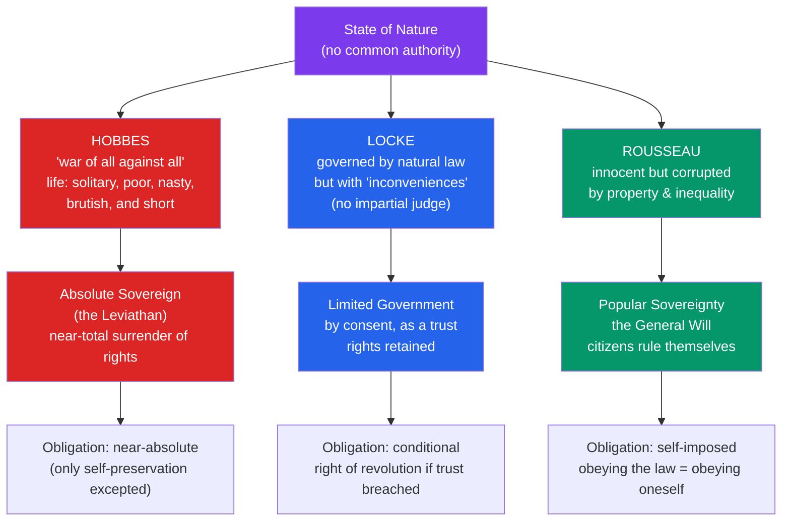

# 📜 The Social Contract

> [!abstract] TL;DR
> Social contract theory justifies political authority by imagining what life would be like *without* it — the **state of nature** — and then asking what rational people would agree to in order to escape it. **Hobbes** (1651) argues the state of nature is a war of all against all, so people surrender nearly all their rights to an absolute **sovereign** for security. **Locke** (1689) sees a milder state of nature governed by natural law and pre-political rights (life, liberty, property); government is a limited trust that may be dissolved by revolution if it violates those rights. **Rousseau** (1762) argues legitimate authority comes only from the **general will**, the collective sovereignty of the people themselves. The "contract" is not a historical event but a device for testing the legitimacy of authority: a state is justified only if free, rational agents *could* have consented to it.

## Intuition — analogy first

Think of the social contract like the terms of service you accept when joining a shared house.

Living alone, you have total freedom but no backup: if someone breaks in, no one helps; if the roof leaks, it's all on you. When people move in together, they draft house rules — quiet hours, shared chores, a lock on the front door — and each person gives up a slice of personal freedom (you can't blast music at 3 a.m.) in exchange for benefits no one could secure alone (security, cleanliness, cost-sharing). The rules only feel *legitimate* if they're the kind of terms a reasonable person would have agreed to.

Social contract theorists play this out at the scale of an entire society. They ask: starting from a "house" with no rules at all — the **state of nature** — what terms would rational people accept to move into political society? The disagreements among Hobbes, Locke, and Rousseau are really disagreements about *how bad the no-rules house is* and therefore *how much freedom it's reasonable to trade away.*

---

## How It Works — From State of Nature to Political Society

Each theorist follows the same argumentative skeleton — describe the pre-political condition, diagnose its problems, and derive the form of authority that solves them — but reaches strikingly different conclusions.

## Key Concepts

### Hobbes — Security Above All (*Leviathan*, 1651)

**Thomas Hobbes** wrote during the English Civil War, and the terror of social collapse shapes everything. In the state of nature, humans are roughly equal in strength and cunning (even the weakest can kill the strongest while they sleep), they compete for scarce goods, and there is no common power to keep them in awe. The result is a permanent condition of insecurity — the famous "**war of all against all**" (*bellum omnium contra omnes*), where life is **"solitary, poor, nasty, brutish, and short."**

- The **Laws of Nature** are rational precepts (seek peace, keep covenants) that reason discovers — but they oblige only *in foro interno* (in conscience) until a power exists to enforce them. Without enforcement, keeping your promise while others break theirs is suicidal.
- The exit is a **covenant** in which each person authorizes an absolute **sovereign** — the "**Leviathan**," a "mortal god" — transferring their right of self-governance in exchange for security. The sovereign is not itself a party to the contract, so it cannot breach it.
- Sovereign power must be **undivided and absolute**; divided sovereignty (as between king and parliament) re-creates the very conflict the contract was meant to end.
- The **one right retained**: self-preservation. No one can be obligated to let the sovereign kill them, because escaping violent death was the whole point of the contract.

### Locke — Government as a Trust (*Second Treatise*, 1689)

**John Locke** rejects Hobbes' pessimism. His state of nature is a state of **liberty but not license**, governed by a **natural law** knowable through reason: no one ought to harm another's "life, health, liberty, or possessions."

- **Natural rights** exist *before* government — they are not granted by the state but protected by it. Central is **property**, which Locke grounds in labour: mixing your labour with unowned nature ("the labour of his body and the work of his hands") makes it yours, subject to the **Lockean proviso** ("enough and as good left in common for others").
- The state of nature's problem is not war but **"inconveniences"**: there is no established law, no impartial judge, and no reliable power to execute judgments. People are biased in their own cases.
- Government arises by **consent** to remedy these defects and is held as a **trust** (a fiduciary relationship), not a Hobbesian transfer of rights. Political power is limited to what individuals could have delegated.
- **The right of revolution**: because government is a trust for the people's good, when it acts against that trust — becoming tyrannical or arbitrary — it **dissolves itself**, and power reverts to the people, who may institute new government. This argument directly influenced the American Declaration of Independence.
- **Consent** is expressed (explicit agreement) or **tacit** (enjoying the benefits of a state, e.g. using its roads or holding property). The adequacy of tacit consent is a major fault line — see [[The_State_and_Political_Authority]].

### Rousseau — The General Will (*The Social Contract*, 1762)

**Jean-Jacques Rousseau** opens with the era's most famous line: "Man is born free, and everywhere he is in chains." His state of nature features the solitary, self-sufficient "noble savage," peaceable and free; it is *society itself* — especially the invention of **private property** — that breeds inequality, dependence, and moral corruption (developed in the *Discourse on Inequality*).

- The problem the contract must solve: "to find a form of association which defends and protects... the person and goods of each associate, and by means of which each one, uniting with all, nevertheless obeys only himself and remains as free as before."
- The solution is total association: each person alienates all rights *to the whole community*, not to a ruler. Because everyone gives everything to everyone, no one is subject to any other individual — you obey only the collective of which you are an equal part.
- The **general will** (*volonté générale*) is the will of the citizen body aimed at the common good. It is distinct from the **"will of all"** (the mere sum of private interests). Legitimate law expresses the general will; obeying it is obeying oneself, which is why it preserves freedom.
- **Popular sovereignty** is inalienable and indivisible — it cannot be represented (a sharp break with Locke). Rousseau's notorious phrase that a dissenter may be **"forced to be free"** means being compelled to follow the general will, which is his own deeper (civic) will. Critics see here a seed of totalitarianism; defenders read it as a demanding ideal of self-government.

### The Three Traditions Compared

| Dimension | **Hobbes** | **Locke** | **Rousseau** |
|---|---|---|---|
| State of nature | War of all against all | Peaceful but insecure | Free and innocent |
| Human nature | Self-interested, fearful | Rational, mostly cooperative | Naturally good, socially corrupted |
| Rights before the state | None enforceable | Robust natural rights | Natural liberty |
| What is surrendered | Nearly all rights | Only the right to self-enforce | All rights, to the community |
| Locus of sovereignty | The absolute sovereign | Limited government (trust) | The people (general will) |
| Right to resist? | No (except self-preservation) | Yes — right of revolution | Sovereign people cannot be tyrannized by itself |
| Political heir | Modern realism, Schmitt | Liberalism, [[Justice_and_Rawls]] | Republicanism, democratic theory |

## Arguments & Examples

**The prisoner's-dilemma reading of Hobbes.** Modern game theory reconstructs the state of nature as a collective-action problem. Two people are each better off cooperating (keeping the peace), but each is individually tempted to defect (strike first) because a cooperator facing a defector fares worst of all. Without enforcement, mutual defection is the equilibrium — Hobbes' war. The sovereign changes the payoffs: by punishing defection it makes cooperation individually rational. This is why Hobbes is a founding figure for the analysis of [[_MOC_Game_Theory_Master|collective action]]. (The argument justifies *some* enforcing authority far more easily than it justifies an *absolute* one — a standard objection.)

**Locke and the American founding.** The Declaration of Independence's "life, liberty, and the pursuit of happiness" and its claim that governments derive "their just powers from the consent of the governed" — and may be altered when destructive of those ends — is Locke's trust-and-revolution argument turned into a founding document. The contract here is doing normative work: it licenses secession precisely because George III allegedly breached the trust.

**Rousseau and the French Revolution.** Rousseau's language of popular sovereignty and the general will pervaded revolutionary rhetoric and the *Declaration of the Rights of Man*. The same ideas' ambiguity — who *speaks* for the general will? — also illuminates how revolutionary regimes justified coercion in the people's name.

**The contract as a thought experiment, not history.** No theorist claims a literal signing ceremony occurred. The device asks a **normative** question: *could* rational agents in a fair starting position have agreed to these institutions? This is exactly the move [[Justice_and_Rawls|Rawls]] revives in the twentieth century with the original position — hypothetical consent, not historical consent, is what legitimates.

## Common Pitfalls / Misconceptions

- **"The social contract was a real historical event."** It is a philosophical device for evaluating legitimacy, not an anthropological claim. Hume's objection — that no such original contract ever existed and that appeals to *tacit* consent are fictions (you can't meaningfully consent by failing to emigrate) — targets the historical reading, not the hypothetical one.
- **"Hobbes defends the divine right of kings."** He does not. Hobbes' sovereign is justified from the *bottom up* by rational self-interest and consent, not by God's appointment — a radically modern, secular grounding, even though its conclusion (absolutism) is conservative.
- **"Locke's consent theory is unproblematic."** Tacit consent is notoriously weak: most people never explicitly agree to their government and cannot realistically leave. Whether merely benefiting from the state constitutes genuine consent is a central unresolved problem — see [[The_State_and_Political_Authority]].
- **"Rousseau's general will = majority rule."** The general will is not the majority vote (that is the "will of all"); it is what aims at the common good. A majority can be wrong about it. This gap is what makes "forced to be free" both interesting and dangerous.
- **"All three theorists mean the same thing by 'freedom.'"** Hobbesian liberty is the absence of external impediments; Lockean liberty is action within natural law; Rousseauian freedom is self-legislation. These map onto later distinctions between negative and positive liberty — see [[Liberty_and_Rights]].

## Related Concepts

- [[_MOC_Political_Philosophy|↑ Section MOC]]
- [[The_State_and_Political_Authority]] — What the contract is meant to justify: legitimacy, sovereignty, and the obligation to obey
- [[Liberty_and_Rights]] — The natural rights the contract protects, and the competing conceptions of freedom it presupposes
- [[Justice_and_Rawls]] — Rawls' twentieth-century revival of hypothetical consent behind the veil of ignorance
- [[Equality_Marxism_and_Anarchism]] — Marx's charge that the "contract" masks class domination, and anarchism's denial that any contract binds
- [[The_Enlightenment]] — The intellectual movement in which Locke and Rousseau reframed authority around reason and consent
- Cross-vault: [[_MOC_History_Master]] (English Civil War, American and French Revolutions), [[_MOC_Game_Theory_Master]] (the state of nature as a collective-action problem)

## Review Questions

1. Hobbes and Locke both begin from a state of nature and both derive government by consent, yet Hobbes concludes with an *absolute* sovereign while Locke concludes with a *limited* government subject to revolution. Explain how their differing descriptions of the state of nature drive this divergence.
2. What does Rousseau mean by the **general will**, and how does it differ from the "will of all"? Why does he claim that obeying the general will preserves rather than destroys freedom — and why do critics find the doctrine dangerous?
3. Hume objected that no historical social contract ever existed and that "tacit consent" is a fiction. Does this objection defeat social contract theory, or can the theory be defended as a *hypothetical* test of legitimacy? Reference how Rawls responds to this worry.

## Sources

- Hobbes, T. (1651). *Leviathan*. (Ed. Tuck, Cambridge University Press, 1996)
- Locke, J. (1689). *Two Treatises of Government*. (Ed. Laslett, Cambridge University Press, 1988)
- Rousseau, J.-J. (1762). *The Social Contract and Other Later Political Writings*. (Ed. Gourevitch, Cambridge University Press, 1997)
- Boucher, D. & Kelly, P. (eds.) (1994). *The Social Contract from Hobbes to Rawls*. Routledge

#philosophy #political-philosophy #social-contract #hobbes #locke #rousseau
