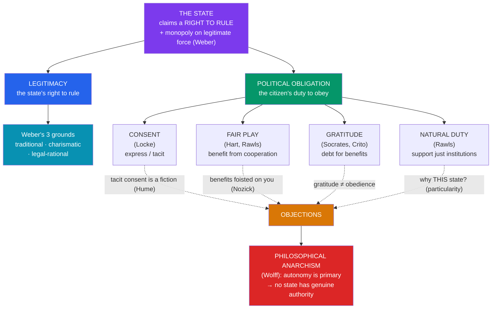

# 🏛️ The State and Political Authority

> [!abstract] TL;DR
> The state claims a remarkable power: the **right to rule**, to make laws and back them with force, and the correlative claim that we have a **duty to obey**. Political philosophy asks whether either claim can be justified. **Legitimacy** is the state's right to rule; **political obligation** is the citizen's moral duty to obey — and the two can come apart. **Max Weber** defined the modern state sociologically as the human community that "successfully claims the **monopoly of the legitimate use of physical force**" within a territory, and distinguished three grounds of legitimacy: **traditional, charismatic, and legal-rational**. The philosophical puzzle — the **problem of political obligation** — is to find a *moral* ground for the duty to obey. The leading candidates are **consent**, **fair play**, **gratitude**, and **natural duty**, each with well-known holes. Pressing hardest is **philosophical anarchism**: **Robert Paul Wolff's** *In Defense of Anarchism* (1970) argues that the individual's duty of **autonomy** — the Kantian duty to be one's own moral legislator — is flatly incompatible with the state's claim to authority, so **no state can be legitimate**. The anarchist need not counsel revolution; the claim is that authority as such cannot be justified.

## Intuition — analogy first

Think about the difference between a **mugger** and a **tax collector**. Both take your money under threat of force. What could possibly make the second one *legitimate* and the first one a crime?

It cannot just be that the state is stronger — might does not make right. It cannot just be that most people go along with it — a popular mugger is still a mugger. Something must convert the state's raw **power** (the ability to coerce) into genuine **authority** (the *right* to coerce, and your *duty* to comply). That "something" is what a theory of legitimacy tries to supply.

Now flip the question around. Suppose the state *is* legitimate. Does that automatically mean **you**, personally, have a duty to obey *this* law — including one you think is stupid or unjust? A referee can be the legitimate official of a game without every call being correct, and you might have signed up to play. But did you ever sign up for citizenship? You were simply born inside some borders. The mugger analogy exposes the **legitimacy** question; the "did I ever sign up?" question exposes the **political-obligation** problem. Philosophical anarchism is the unsettling suggestion that neither question has a good answer — that the mugger and the tax collector may differ in scale and manners but not, at bottom, in right.

---

## How It Works — Legitimacy, Obligation, and the Anarchist Challenge

Two distinct claims travel together but must be pried apart: the state's **right to rule** and the citizen's **duty to obey**. Theories of obligation try to ground the second; philosophical anarchism argues the whole edifice collapses on the duty of autonomy.

## Key Concepts

### Legitimacy vs. Political Obligation

These are the two halves of the puzzle, and conflating them is the most common error in the area.

- **Political legitimacy** concerns the **state**: does it have the *right* to issue commands and enforce them? A legitimate state has a (defeasible) permission to coerce and a standing to make law.
- **Political obligation** concerns the **citizen**: do I have a moral duty to obey the law *because it is the law* (a "content-independent" reason), quite apart from whether the act commanded is independently right?

The two can diverge. A state might be broadly legitimate yet issue a particular unjust law that I have no duty to obey (the ground of **civil disobedience**). Conversely, one might have prudential reasons to obey an illegitimate regime (self-preservation) without that regime having any *right* to one's obedience.

### Weber and the Monopoly on Legitimate Force

**Max Weber**, in "Politics as a Vocation" (1919), gives the classic *sociological* definition: the state is the organisation that "successfully claims the **monopoly of the legitimate use of physical force** within a given territory." Note the word **legitimate** — Weber is describing what the state *claims*, and studying which claims people *accept*, not certifying that the claim is morally sound (that is the philosopher's job). He identifies three **pure types of legitimate domination**:

| Type | Basis of legitimacy | Example |
|---|---|---|
| **Traditional** | "It has always been so" — custom, inherited status | Monarchy, patriarchal rule |
| **Charismatic** | Personal devotion to an exceptional leader | Prophets, revolutionary founders, demagogues |
| **Legal-rational** | Belief in the legality of enacted rules and the right of those in office to command | Modern bureaucratic state, rule of law |

Weber's descriptive account leaves open the *normative* question the rest of this note pursues: even where people *believe* a state legitimate, is that belief *justified*?

### Theories of Political Obligation

Four families of answer dominate. Each captures something real; each faces a serious objection.

1. **Consent theory** ([[The_Social_Contract|Locke]]). Obligation is *voluntarily undertaken*: by consenting, you bind yourself. This is morally the cleanest ground — self-imposed obligation respects autonomy. Its fatal weakness is **empirical**: almost no one has *expressly* consented. Locke's fallback, **tacit consent** (you consent by residing, using the roads, owning property), was demolished by **Hume**: a peasant who cannot speak the language and has no means to leave has not "consented" by failing to emigrate any more than a man carried aboard ship while asleep consents to the voyage.

2. **Fair-play (fairness) theory** (**H. L. A. Hart**, early **Rawls**). When people cooperate in a mutually beneficial, rule-governed scheme, those who accept the benefits owe it to the cooperators to bear their share of the burdens; **free-riding is unfair**. Obligation flows not from a promise but from fairness. **Nozick's objection**: benefits can be *foisted* on you without your acceptance. If neighbours set up a public-address entertainment system and assign you a day to run it, having merely *enjoyed* the broadcasts does not obligate you. Fair play may require that benefits be *voluntarily accepted*, not merely received — which narrows its reach dramatically.

3. **Gratitude theory** (as far back as **Socrates** in Plato's *Crito*, where the Laws of Athens argue Socrates owes them for his birth, upbringing, and education). Because the state confers great benefits, we owe it a debt discharged through obedience. Objection: gratitude for a benefit does not obviously translate into a duty of **obedience** specifically (I may owe a benefactor thanks or reciprocation without owing them my *compliance with their commands*), and benefits I never asked for generate weaker claims.

4. **Natural-duty theory** (later **Rawls**, in [[Justice_and_Rawls|*A Theory of Justice*]]). We have a **natural duty to support and comply with just institutions** that apply to us, a duty that does not depend on any voluntary act. This escapes the "no one consented" problem — but faces the **particularity problem**: a natural duty to support justice-in-general does not obviously explain why I owe allegiance to **this** state, my own, rather than to just institutions anywhere. **Ronald Dworkin's** *associative obligations* (duties that come with membership in a genuine community, like family ties) are one attempt to restore particularity.

### Philosophical Anarchism and the Autonomy Objection

**Robert Paul Wolff's** *In Defense of Anarchism* (1970) sharpens the challenge into a clean argument:

- The primary obligation of a person is **autonomy** — in the Kantian sense of being one's own moral legislator, taking responsibility for one's actions by acting only on judgments one has reached oneself.
- **Authority** is the *right to command and to be obeyed* — and to have authority is to have a right to obedience **regardless of the content** of the command (that is what distinguishes authority from mere persuasion).
- To submit to authority in this sense is to surrender one's autonomous judgment — to do a thing *because commanded*, not because one has judged it right.
- Therefore the duty of autonomy and the claim of authority are **strictly incompatible**. Since the autonomy duty is primary and cannot be waived, **no state can possess legitimate authority**. (Wolff allows one apparent exception — a **unanimous direct democracy** — but finds it practically impossible at scale.)

Crucially, this is **philosophical** anarchism, not revolutionary anarchism. Wolff does not say we should smash the state or that we have no reason to comply with good laws; he says the state has no *authority* — no content-independent right to our obedience. **A. John Simmons** later refined the position, distinguishing:

- **A priori** philosophical anarchism (no possible state could be legitimate) from **a posteriori** anarchism (no *actual* state has met the conditions, though one in principle could);
- and stressing that denying the state's authority is compatible with obeying it for ordinary moral reasons (not murdering, not stealing) and even supporting it prudentially.

This connects to the more sweeping social anarchism of Bakunin and Kropotkin, treated in [[Equality_Marxism_and_Anarchism]], which rejects the state on grounds of domination and inequality rather than autonomy alone.

## Arguments & Examples

**Civil disobedience as the test case.** Because **legitimacy** and **obligation** come apart, one can hold that a state is broadly legitimate while denying a duty to obey a *particular* unjust law. **Rawls** treats civil disobedience as a public, non-violent, conscientious breach of law aimed at appealing to the community's sense of justice — undertaken *within* fidelity to law (the disobedient accepts the legal penalty). Martin Luther King Jr.'s "Letter from Birmingham Jail" makes the classic case that "one has a moral responsibility to disobey unjust laws," distinguishing just from unjust laws by whether they accord with moral law and apply equally. The very intelligibility of principled disobedience shows obligation is not unconditional.

**The "which state?" (particularity) problem, concretely.** Suppose your only ground of obligation is a natural duty to support just institutions. A perfectly just Norway exists across the sea. Why do you owe *your* (also reasonably just) state allegiance rather than Norway? Consent and associative theories try to supply the missing *bond to this particular community*; pure natural-duty theories struggle to.

**Nozick's public-address system.** A vivid weapon against fair-play theory. Neighbours institute a rota to run a street entertainment system; you enjoy some broadcasts. On day 138 your turn comes. Are you *obligated* to spend the day running it merely because you listened? Intuitively no — you never *accepted* the scheme, the benefits were simply thrust upon you. Nozick concludes that fair play generates obligations only where benefits are *voluntarily accepted*, which most citizens never do with respect to the state.

**Weber's descriptive/normative gap in modern politics.** When a government's legitimacy is questioned after a contested election, notice the two registers: one asks whether people *accept* its authority (Weberian, sociological — is order maintained, are officials obeyed?), the other whether it *deserves* that acceptance (philosophical). Regimes can enjoy widespread belief in their legitimacy while failing the normative test (many stable authoritarian states), and vice versa.

## Common Pitfalls / Misconceptions

- **Conflating legitimacy with obligation.** They are distinct claims. A state can be legitimate yet issue a law you have no duty to obey; you can have prudential reason to comply with an illegitimate regime. Keeping the "right to rule" and the "duty to obey" separate is the single most important move in this topic.
- **"Philosophical anarchists want to abolish the state."** Wolff and Simmons argue the state lacks *authority*, not that we should overthrow it. Philosophical anarchism is a thesis about *the justification of obedience*, fully compatible with law-abiding behaviour for independent moral reasons. Do not confuse it with the revolutionary anarchism of [[Equality_Marxism_and_Anarchism|Bakunin]].
- **"Weber says the state is legitimate."** Weber offers a **sociological** definition and typology of what legitimacy *people accept*; he is bracketing, not answering, the normative question of whether that acceptance is warranted.
- **"Tacit consent solves the obligation problem."** Hume's objection stands: mere residence, given the costs of exit, is not meaningful consent. Most defenders of obligation have abandoned tacit consent for fair-play or natural-duty grounds.
- **"If there's no duty to obey, then anything goes."** Denying a *content-independent* duty to obey the law does not license wrongdoing: independent moral reasons still forbid theft and violence. What is denied is that "because it's the law" is, by itself, a sufficient reason.
- **"Legitimacy comes from democracy alone."** Democratic authorisation is one influential account, but it faces its own problems (the tyranny of the majority, the standing of dissenters and future generations) and does not by itself dissolve Wolff's autonomy objection — see [[Liberty_and_Rights]].

## Related Concepts

- [[_MOC_Political_Philosophy|↑ Section MOC]]
- [[The_Social_Contract]] — Consent as the classic ground of both legitimacy and obligation; Hobbes, Locke, and Rousseau on why we should obey the sovereign
- [[Justice_and_Rawls]] — Rawls' natural duty of justice as a ground of obligation, and Nozick's argument that a minimal state can arise without violating rights (answering the anarchist)
- [[Liberty_and_Rights]] — The limits of legitimate state coercion; the harm principle marks where authority may not reach
- [[Equality_Marxism_and_Anarchism]] — Social anarchism (Bakunin, Kropotkin) rejects the state on grounds of domination, and Marx treats the state as an instrument of class rule
- Cross-vault: [[_MOC_History_Master]] (state formation, revolutions, legitimacy crises), [[_MOC_Game_Theory_Master]] (coordination, conventions, and the state as a solution to collective-action problems)

## Review Questions

1. Distinguish **political legitimacy** from **political obligation** and explain, with an example, how a state could be legitimate while a citizen lacks a duty to obey a particular law. Why does this distinction make **civil disobedience** intelligible?
2. Set out the **fair-play** theory of political obligation and explain **Nozick's public-address-system** objection. Does requiring that benefits be *voluntarily accepted* rescue the theory or gut it?
3. Reconstruct **Wolff's autonomy argument** for philosophical anarchism as a series of steps. Why does Wolff think this shows *no* state can have genuine authority — and why is this claim compatible with obeying the law?

## Sources

- Wolff, R. P. (1970). *In Defense of Anarchism*. Harper & Row
- Weber, M. (1919). "Politics as a Vocation," in *From Max Weber: Essays in Sociology* (eds. Gerth & Mills, 1946)
- Simmons, A. J. (1979). *Moral Principles and Political Obligations*. Princeton University Press
- Horton, J. (2010). *Political Obligation* (2nd ed.). Palgrave Macmillan

#philosophy #political-philosophy #legitimacy #political-obligation #anarchism #weber
