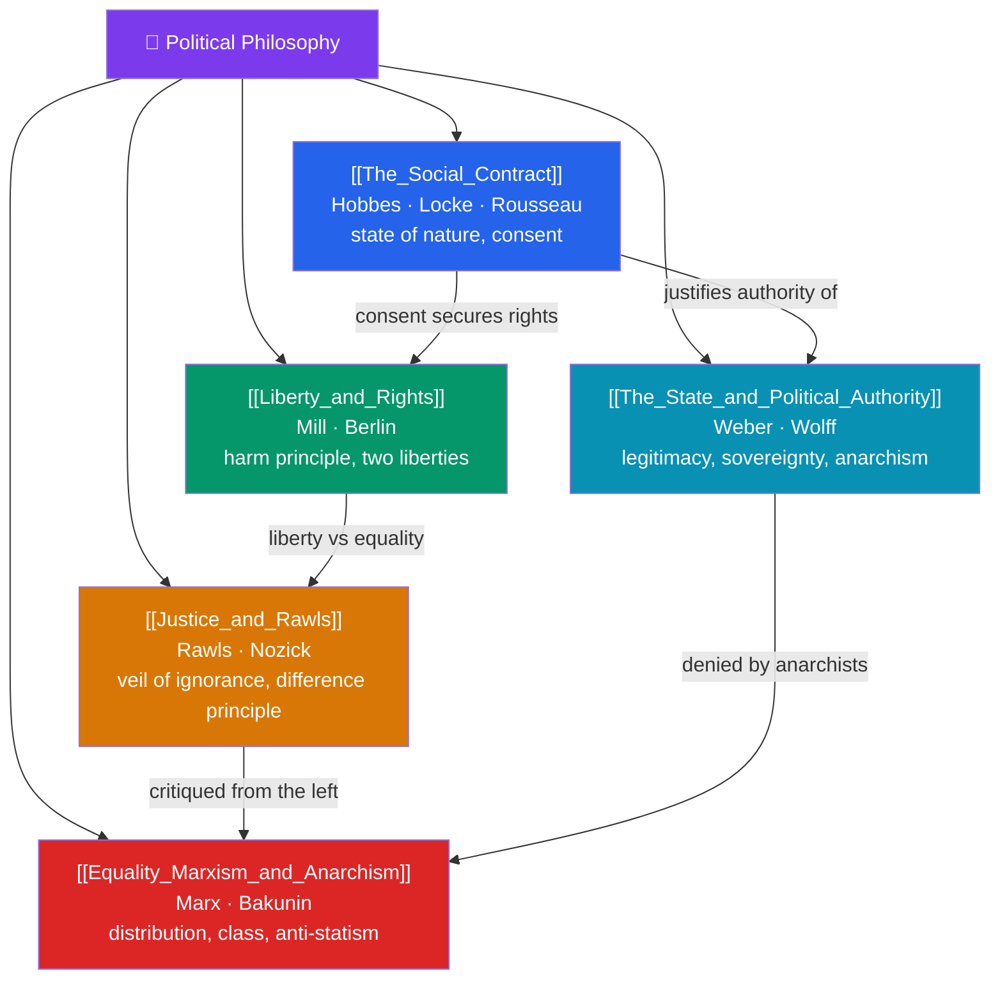

# 🗺️ Political Philosophy — Map of Content

> [!abstract] What This Section Covers
> Political philosophy asks how we ought to live together — what justifies the state, and what a just society requires. **The Social Contract** grounds political authority in a hypothetical agreement, running from Hobbes' Leviathan through Locke's consent to Rousseau's general will; **Liberty and Rights** examines the scope of individual freedom, Mill's harm principle, and Berlin's distinction between negative and positive liberty; **Justice and Rawls** rebuilds liberal theory from the original position behind the veil of ignorance, with the difference principle answered by Nozick's entitlement theory; **The State and Political Authority** probes legitimacy, sovereignty, political obligation, and the anarchist challenge that no authority is justified; and **Equality, Marxism, and Anarchism** explores distributive justice, Marx's critique of capitalism, and Bakunin's anti-statism. Five notes charting the perennial tension between liberty, equality, and authority.

## Concept Map

## Learning Path

1. [[The_Social_Contract]] — The state of nature, Hobbes' absolute sovereign, Locke's consent and property, and Rousseau's general will.
2. [[The_State_and_Political_Authority]] — Legitimacy, sovereignty, political obligation, Weber's monopoly on force, and philosophical anarchism.
3. [[Liberty_and_Rights]] — Mill's harm principle, negative vs positive liberty (Berlin), natural rights, and the limits of state power.
4. [[Justice_and_Rawls]] — The original position, the veil of ignorance, the two principles, the difference principle, and Nozick's libertarian reply.
5. [[Equality_Marxism_and_Anarchism]] — Distributive justice, Marx on exploitation and class, and anarchist visions from Bakunin to Kropotkin.

## All Notes at a Glance

| Note | Difficulty | What You'll Learn |
|------|------------|-------------------|
| [[The_Social_Contract]] | Beginner → Intermediate | State of nature, Hobbes, Locke, Rousseau, consent, the general will, tacit consent |
| [[Liberty_and_Rights]] | Intermediate | Mill's harm principle, negative/positive liberty, Berlin, natural and legal rights, paternalism |
| [[Justice_and_Rawls]] | Intermediate → Advanced | Original position, veil of ignorance, two principles, difference principle, Nozick, entitlement |
| [[The_State_and_Political_Authority]] | Intermediate | Legitimacy, sovereignty, political obligation, Weber, philosophical anarchism, civil disobedience |
| [[Equality_Marxism_and_Anarchism]] | Intermediate → Advanced | Distributive justice, exploitation, class, ideology, Bakunin, Kropotkin, mutual aid |

## Key Questions This Section Answers

- What, if anything, gives the state the right to rule and to coerce us?
- When may society legitimately restrict an individual's freedom?
- What would a perfectly just distribution of goods and liberties look like?
- Is there a genuine obligation to obey the law, or is all authority illegitimate?
- Do justice and freedom require equality — and at what cost to liberty?

## Related Sections

- [[_MOC_Philosophy_Master|↑ Philosophy Master MOC]]
- [[_MOC_Philosophy_of_Mind|← Philosophy of Mind]]
- [[_MOC_Philosophy_of_Science|→ Philosophy of Science]]
- Cross-vault: [[_MOC_History_Master]] (revolutions, ideologies), [[_MOC_Game_Theory_Master]] (collective action), [[Marx_and_Critical_Theory]]

#MOC #Philosophy #PolPhil
