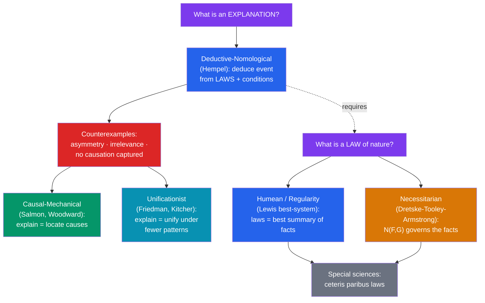

# ⚖️ Explanation and Laws of Nature

> [!abstract] TL;DR
> Two entangled questions. First, **what is it to explain something?** The classic answer is Carl **Hempel**'s **deductive-nomological (DN) or covering-law model**: to explain an event is to show it was to be *expected*, by deducing it from **laws of nature** plus initial conditions. The DN model faces devastating counterexamples — the **flagpole/shadow asymmetry**, **irrelevant** explainers, and cases where deduction runs the wrong causal way — which push philosophers toward **causal** (Salmon, Woodward) and **unificationist** (Friedman, Kitcher) theories. Second, **what makes a regularity a *law* rather than an accident?** The **Humean regularity view** (best-system account: Lewis) says laws are just especially good summaries of what actually happens; the **necessitarian view** (Dretske, Tooley, **Armstrong**) says laws are relations of *necessitation* between universals that *govern* the facts. Finally, the **special sciences** trade in **ceteris paribus** ("other things equal") laws that hold only under implicit provisos — raising the question whether such hedged generalizations are laws at all.

## Intuition — analogy first

Suppose your friend asks, "Why did the streetlight turn on at 6:47 p.m.?" Two very different answers show what is at stake.

Answer A: "Because a photosensor detected that ambient light dropped below a threshold, and there's a rule wired into the controller: *whenever light falls below the threshold, switch on*." This answer works by fitting the event under a **general rule** and the specific conditions — you now see the event *had* to happen given how the world is set up. That is the covering-law intuition: to explain is to subsume under law.

Answer B is more demanding. Your friend points out that the length of the light's *shadow* on the pavement also "fits a rule" relating shadow length, lamp height, and the sun's angle — yet no one thinks the shadow *explains* the lamp's height. The rule runs both ways as a piece of mathematics, but explanation runs *only one way*: the height explains the shadow, never the reverse. What that arrow tracks — **causation**, or **objective dependence** — is something the bare "fits a rule" story leaves out.

And behind both answers lurks a third question: what makes the "rule" a genuine **law** of nature and not a lucky coincidence, like "every coin in my pocket right now is a dime"? That is the metaphysics of laws.

---

## How It Works — Models of Explanation and Views of Law

Note the dashed dependency: Hempel's model of *explanation* leans on a prior notion of *law*, so the two debates are linked. If we cannot say what a law is (right side), the covering-law model of explanation (left side) is left standing on an unanalyzed primitive.

## Key Concepts

### The Deductive-Nomological (Covering-Law) Model

Hempel and Oppenheim (1948) proposed that a scientific explanation is a valid **deductive argument**:

- **Explanandum** (what is explained): a statement describing the event.
- **Explanans** (what does the explaining): premises comprising at least one **law of nature** *L* plus statements of particular **initial/antecedent conditions** *C*.

The adequacy conditions: the explanans must **logically entail** the explanandum, contain at least one law *essentially*, have **empirical content**, and be **true**. To explain is thus to show the event was **nomically expectable** — "the event occurred *because*, given these conditions and these laws, it *had* to."

Hempel extended this to statistical cases with the **inductive-statistical (IS)** model: the laws are probabilistic, and the explanans confers **high probability** on the explanandum. A deep tension immediately appears (see pitfalls): low-probability events also happen and seem explicable, yet the IS model, keyed to *expectability*, struggles with them.

A striking corollary Hempel embraced: the **symmetry thesis** — explanation and prediction have the *same logical structure*. Anything you can explain (after the fact) you could, with the same premises, have predicted (beforehand), and vice versa. The counterexamples below primarily attack *this* symmetry.

### The Classic Counterexamples to DN

| Problem | Case | What it shows |
|---------|------|---------------|
| **Explanatory asymmetry** | The height of a **flagpole** + sun's angle + optics *deductively entails* the length of its **shadow** — but the shadow's length equally entails the height. DN calls both "explanations." | Explanation is **asymmetric**; deduction is not. DN misses the *direction* of dependence. |
| **Irrelevance** | "This sample of salt dissolved because it was **hexed** (and all hexed salt placed in water dissolves)." Valid DN argument; absurd explanation. | A true law-plus-conditions deduction can cite **explanatorily irrelevant** factors. |
| **Barometer** | A falling barometer reading + a regularity linking it to storms lets us *predict/deduce* a storm — but the reading does not **explain** the storm. | Correlated law-like regularities that share a **common cause** are not explanatory. |
| **Low-probability events** | Someone with untreated syphilis develops paresis, which strikes only a *small* fraction of untreated cases. We explain the paresis by the syphilis, yet the explanans confers *low* probability. | The IS model, tied to high probability/expectability, cannot handle genuine low-probability explanations. |

The common diagnosis: DN captures *nomic expectability* but not **causal or explanatory relevance** and **asymmetry**. Something more than "fits under a law" is needed.

### Causal and Unificationist Theories

Two rival programs answer the counterexamples:

- **Causal-mechanical (Wesley Salmon):** to explain an event is to situate it in the **causal nexus** — to trace the **causal processes** (things that can transmit a mark/conserved quantity) and interactions producing it. This builds asymmetry in for free (causes precede and produce effects) and rejects the hexed-salt "explanation" because hexing is causally inert. **James Woodward**'s **interventionist** account refines this: X explains Y if *intervening* on X would change Y — explanation answers "**what-if-things-had-been-different**" (counterfactual) questions. The flagpole explains the shadow because wiggling the pole changes the shadow, but changing the shadow (say, by editing it) would not change the pole.
- **Unificationist (Michael Friedman, Philip Kitcher):** to explain is to **unify** — to reduce the number of independent phenomena we must accept by deriving many facts from a few **argument patterns**. Newton explained by unifying terrestrial and celestial motion under one scheme. Kitcher's "explanatory store" is the set of patterns that best systematizes our beliefs; asymmetries are supposed to fall out of which patterns do the most unifying. Critics doubt unification alone recovers the *causal* asymmetries.

### Laws of Nature: Humean Regularity vs. Necessitarian

The second great question. What separates a **law** ("all electrons have charge −e") from an **accidental generalization** ("all the coins in my pocket are dimes")? Both are true universal statements; only the first supports **counterfactuals** ("if this were an electron, it would have charge −e") and grounds explanation and induction.

- **Humean / Regularity view.** Following Hume's denial of *necessary connections in nature*, laws are just **regularities** — patterns in the "mosaic" of actual particular facts, with no extra governing power. The best version is David **Lewis's best-system analysis (MRL)**: the laws are the theorems of the deductive system that best balances **simplicity** and **strength** (informativeness). Being a law is being a regularity that earns a place in the best summary. Accidental generalizations don't earn that place. *Strength:* metaphysically economical; *cost:* laws don't *govern* — they only *describe* — so it is unclear how they *explain* or ground counterfactuals rather than merely record them.
- **Necessitarian view (Dretske–Tooley–Armstrong).** Laws are **relations of nomic necessitation between universals**, written $N(F,G)$: it is a *higher-order fact* that F-ness necessitates G-ness, and *this* is what makes the corresponding regularity hold and support counterfactuals. Laws **govern** the particular facts rather than summarizing them. *Strength:* explains lawhood, counterfactual support, and the law/accident distinction directly; *cost:* what is this mysterious relation $N$, and — the **"Inference Problem" (van Fraassen)** — how does a relation between *universals* entail anything about the *particulars* that instantiate them?

| Feature | Humean (Lewis best-system) | Necessitarian (Armstrong) |
|---------|----------------------------|---------------------------|
| What a law *is* | A regularity in the best simple-strong system | A necessitation relation $N(F,G)$ between universals |
| Do laws *govern*? | No — they only describe | Yes — they constrain the facts |
| Grounds counterfactuals? | Derivatively/awkwardly | Directly |
| Supports induction? | Only as good summary (Hume's worry persists) | Yes, if $N$ is real |
| Main objection | Laws that merely describe can't *explain* their instances | The mysterious nature of $N$ + the Inference Problem |

This is a live front in the [[Scientific_Realism]] debate — a realist about unobservables usually also wants realism about *laws* and *causal structure*, and the Humean/necessitarian split concerns exactly how robust that structure is. It also loops back to [[The_Problem_of_Induction]]: if there are governing laws (necessitarian), induction may be grounded; if laws are mere regularities (Humean), Hume's problem stands undiminished.

### Ceteris Paribus Laws in the Special Sciences

Outside fundamental physics, generalizations rarely hold universally. "Water boils at 100 °C" fails at altitude; economics' "demand falls as price rises" fails for Giffen goods. Such laws carry an implicit **ceteris paribus** ("other things being equal") clause.

- **The trivialization worry** (Lange, Earman & Roberts): "All Fs are Gs, *ceteris paribus*" threatens to mean only "all Fs are Gs *except when they aren't*," which is **untestable** and vacuous — you can never say in advance what the excepted conditions are.
- **Defenses:** *cp* laws are still explanatory and support policy and prediction *within a domain of normal conditions*; special-science laws (Fodor) pick out real, **multiply realizable** patterns (economic, biological, psychological) not reducible to physics, and their hedges are principled rather than escape hatches.
- The debate bears on whether the special sciences discover genuine **laws** at all, or only robust-but-exception-ridden tendencies — and thus on the unity (or disunity) of science.

## Arguments & Examples

**The flagpole, in full.** From (i) the law that light travels in straight lines, (ii) the sun's elevation angle θ, and (iii) the pole's height h, one deduces the shadow length s = h / tan θ. Equally, from the *same* optical law, θ, and s, one deduces h. Both are valid DN arguments, so DN blesses both as explanations. But *height explains shadow, never the reverse.* Woodward's fix: intervene. Change h (saw off the pole) and s changes; "change" s by any physical means available and h is untouched. Explanation tracks this **counterfactual/causal asymmetry**, which pure deduction lacks.

**Law vs. accident, and why it matters for induction.** Compare "All uranium spheres are less than a mile in diameter" (true, and *lawlike* — physics forbids a critical mass that large from persisting) with "All gold spheres are less than a mile in diameter" (true, but *accidental* — nothing forbids a giant gold sphere). Only the first licenses the counterfactual "if there were a uranium sphere here, it would be under a mile across," and only the first would justify projecting the pattern to unobserved cases. This is precisely the distinction a theory of laws must earn — and it is the hinge on which [[The_Problem_of_Induction]] turns.

**Bridge to physics.** The [[_MOC_Physics_Master|Physics vault]] treats laws like Newton's $F = ma$ and Maxwell's equations as expressing *how nature must behave*. Philosophy of science asks what that "must" amounts to: on the Humean reading it is a compact bookkeeping of what *does* happen; on the necessitarian reading it is a real constraint the world is under. Notably, many fundamental laws are **time-symmetric**, yet explanation and causation are stubbornly **asymmetric** in time — a puzzle (the arrow of causation vs. the arrow of time) that connects this note directly to statistical mechanics and thermodynamics in the physics vault.

## Common Pitfalls / Misconceptions

- **"Explaining just means predicting."** Hempel's symmetry thesis says so, but the flagpole and barometer cases show you can predict without explaining (barometer→storm) and that deduction lacks explanation's asymmetry. Prediction ≠ explanation.
- **"Any true law-plus-conditions deduction explains."** The hexed-salt case refutes this: the deduction is valid and the premises true, yet the "explanation" is worthless because the cited factor is **irrelevant**.
- **"High probability is necessary for statistical explanation."** The syphilis/paresis case shows we explain some events that were *unlikely*. Expectability and explanation come apart.
- **"Laws are just true universal generalizations."** Then accidental generalizations would be laws. The mark of a law is supporting **counterfactuals** and **induction** — which is exactly what needs analysis (Humean vs. necessitarian).
- **"The Humean and necessitarian views are merely verbal."** They differ substantively: whether laws **govern** or merely **describe** changes what explanation, counterfactuals, and induction rest on.
- **"Ceteris paribus laws are obviously fine (or obviously fake)."** Neither. The real work is stating cp clauses so they are **non-vacuous and testable** without listing infinitely many exceptions.

## Related Concepts

- [[_MOC_Philosophy_of_Science|↑ Section MOC]]
- [[The_Problem_of_Induction]] — The law/accident distinction is what lets *some* regularities be projected; necessitarian laws would ground induction, Humean ones leave Hume's problem intact
- [[Scientific_Realism]] — Realism about unobservables usually travels with realism about laws and causal structure; both lean on inference to the best explanation
- [[Popper_and_Falsification]] — Popper shares Hempel's *deductive* picture of the theory–evidence link (test statements deduced from theory + conditions)
- [[Kuhn_and_Scientific_Revolutions]] — What counts as a satisfying *explanation* is partly paradigm-relative, softening the idea of one timeless model
- Cross-vault: [[_MOC_Physics_Master]] — Newton's and Maxwell's laws, time-symmetry, and the arrow of causation as the concrete subject matter of this debate

## Review Questions

1. State the DN model precisely (explanans, explanandum, adequacy conditions). Then use the **flagpole** and **hexed-salt** cases to show that it captures *nomic expectability* but misses *causal relevance* and *asymmetry*. How does Woodward's interventionist account repair the asymmetry?
2. Explain the difference between a law of nature and an accidental generalization using the uranium-sphere vs. gold-sphere example. Why does only the lawlike statement support counterfactuals and induction?
3. Contrast the Humean best-system analysis of laws with the Dretske–Tooley–Armstrong necessitarian view. State one decisive objection to each (e.g., "descriptions can't explain" vs. the Inference Problem for $N(F,G)$), and say which better grounds inductive inference.

## Sources

- Hempel, C. G. & Oppenheim, P. (1948). "Studies in the Logic of Explanation," *Philosophy of Science* 15. (See also Hempel, *Aspects of Scientific Explanation*, 1965.)
- Salmon, W. (1984). *Scientific Explanation and the Causal Structure of the World*; Woodward, J. (2003). *Making Things Happen*.
- Armstrong, D. M. (1983). *What Is a Law of Nature?*; Lewis, D. (1973/1983) on the best-system analysis.
- Woodward, J. & Ross, L. (2021). "Scientific Explanation"; Carroll, J. (2020). "Laws of Nature." *Stanford Encyclopedia of Philosophy*.

#philosophy #philosophy-of-science #explanation #laws-of-nature #causation #hempel-armstrong
