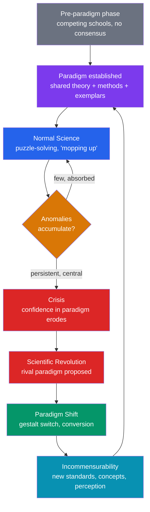

# 🔄 Kuhn and Scientific Revolutions

> [!abstract] TL;DR
> **Thomas Kuhn**'s *The Structure of Scientific Revolutions* (1962) recast science as a historical and social practice rather than a purely logical one. Most science is **normal science**: patient puzzle-solving within a shared **paradigm** — a constellation of theories, methods, exemplars, and standards that a community takes for granted. Anomalies accumulate, a **crisis** erupts, and a **revolution** replaces the old paradigm with a new one (Ptolemy → Copernicus, Newton → Einstein). Because rival paradigms carry different concepts, standards, and even perceptions, Kuhn argued they are **incommensurable** — not fully inter-translatable or rankable by a neutral measure. This "sociological turn" challenged the cumulative, purely rational picture defended by [[Popper_and_Falsification]]. **Lakatos** tried to rescue rationality with *research programmes*; **Feyerabend** pushed the other way with epistemological anarchism — "anything goes."

## Intuition — analogy first

Think of a paradigm as the *rules and pieces of a game* that a scientific community has agreed to play.

Under normal science everyone plays chess. The rules are settled, so effort goes into playing *well* — solving hard positions, refining openings, extending known theory. Nobody spends the afternoon questioning whether the bishop should move diagonally; that would not be "doing chess," it would be abandoning it. Puzzles that resist solution are treated as failures of the *player*, not of the *game*.

But suppose more and more positions arise that the rules cannot handle — pieces that seem to teleport, checkmates that don't count. At first these are dismissed as mistakes. Eventually they pile up into a crisis, and someone proposes a *different game entirely* — say, Go. Switching from chess to Go is not "better chess." The board, the pieces, the very meaning of "winning" have changed. You cannot score the two games on one scale, and a Go master and a chess master will, in a real sense, *see different things* when they look at the same board. That gestalt-switch, and the loss of a common scorecard, is Kuhn's revolution and his incommensurability.

---

## How It Works — The Cycle of Scientific Change

The picture is **cyclical and discontinuous**, not a smooth accumulation of truths. Progress *within* a paradigm is real and rapid; progress *across* paradigms is a rupture in which some old questions and achievements are lost even as new ones are gained. This is the exact opposite of the steady ratchet in [[Popper_and_Falsification]].

## Key Concepts

### Paradigm

Kuhn's most famous and most slippery term. Critics (notably Margaret Masterman) counted ~21 distinct uses. Two are central:

- **Disciplinary matrix:** the whole shared apparatus of a scientific community — symbolic generalizations (laws), models, values (accuracy, simplicity, scope, fruitfulness, consistency), and metaphysical commitments.
- **Exemplar:** the concrete, canonical *problem-solutions* students learn from textbooks (the inclined plane, the pendulum). Scientists learn a paradigm less by memorizing rules than by absorbing exemplars and reasoning by resemblance to them.

### Normal Science and Puzzle-Solving

**Normal science** is what scientists do 99% of the time: they take the paradigm as given and use it to solve **puzzles** — problems *guaranteed* to have solutions within the paradigm's framework. Failure to solve a puzzle reflects on the scientist, not the paradigm. This is precisely where Kuhn broke with Popper: normal scientists do **not** try to refute their theory. They *presuppose* it, and that dogmatism is *functional* — it lets a community drill deep instead of forever re-litigating foundations.

### Anomaly and Crisis

- An **anomaly** is a phenomenon the paradigm cannot accommodate. A few anomalies are tolerated indefinitely (shelved as unsolved puzzles).
- A **crisis** begins when anomalies become numerous, persistent, and strike at the paradigm's core, or block practically urgent problems. Confidence loosens; foundational debate (previously taboo) revives; *ad hoc* modifications proliferate.

### Revolution, Paradigm Shift, and Gestalt Switch

A **revolution** replaces one paradigm with an incompatible successor. Kuhn describes conversion in strikingly non-logical terms: a **gestalt switch** (the duck–rabbit figure), even a "conversion experience." Old scientists often never convert — Max Planck's grim remark that science advances "one funeral at a time" is Kuhn's kind of point. What tips the balance is a mix of the new paradigm's puzzle-solving promise and community persuasion, not a knockdown proof.

### Incommensurability

The most philosophically explosive claim. Rival paradigms are **incommensurable** — literally "no common measure." Kuhn distinguished strands:

| Strand | Meaning | Example |
|--------|---------|---------|
| **Methodological** | No paradigm-neutral standards or algorithm to rank theories | Whether "simplicity" outweighs "accuracy" is itself paradigm-relative |
| **Semantic** | Key terms shift meaning across paradigms; not fully inter-translatable | "**mass**" in Newton (invariant) ≠ "mass" in Einstein (frame/energy-dependent) |
| **Perceptual / observational** | Theory-ladenness: adherents literally *see* different things | Pre- and post-oxygen chemists "saw" different things when air was burned |

Incommensurability does **not** mean rivals cannot communicate at all — Kuhn later softened it to *local* incommensurability of a few interconnected terms, and compared paradigm change to radical translation. But it does deny a fully neutral, algorithmic comparison, which is why it threatens the idea of paradigm-independent progress toward truth — a direct pressure on [[Scientific_Realism]].

### The Sociological Turn and Kuhn's Discomfort

By locating theory choice in community judgment and shared values rather than in logic alone, Kuhn opened the door to the **sociology of scientific knowledge** (SSK) and the "Strong Programme" (Bloor, Barnes) — which treats scientific belief as explicable by social causes. Kuhn was uneasy with the relativist readings this invited. He insisted paradigms are chosen by *reasons* (the shared values above), even if those reasons underdetermine choice and function more like values than rules. He denied he had made science "a matter of mob psychology."

### Lakatos and Feyerabend — Two Reactions

- **Imre Lakatos** — *Research Programmes.* A middle path between Popper and Kuhn. A programme has a **hard core** (protected by decision) and a **protective belt** of auxiliary hypotheses that absorb refutations. A programme is **progressive** if it predicts novel facts, **degenerating** if it only accommodates known ones after the fact (e.g., pure *ad hoc* patching). Rationality is retained, but its verdicts are visible only over time — you may back a temporarily lagging programme and be rational.
- **Paul Feyerabend** — *Against Method* (1975). Epistemological anarchism: there is **no** fixed scientific method; every proposed rule has been violated in some great episode of progress ("**anything goes**"). Historical advances (Galileo's) required *breaking* the reigning methodological rules and using rhetoric and propaganda. Feyerabend defended **theoretical pluralism** and warned against science becoming a dogmatic, state-privileged ideology.

## Arguments & Examples

**The Copernican revolution.** Ptolemaic astronomy was a rich normal-science tradition; its anomalies (the drift of the equinoxes, ballooning epicycles needed for accuracy) accumulated over centuries into crisis. Copernicus's heliocentric proposal was *not* initially more accurate and demanded giving up the intuitive fixed Earth. Its triumph came with Kepler and Newton — a paradigm shift, not a single refuting datum.

**The chemical revolution (Kuhn's favorite).** Priestley, working in the **phlogiston** paradigm, produced oxygen but described it as "dephlogisticated air." Lavoisier, in the emerging **oxygen** paradigm, redescribed the very same experiment as combustion consuming oxygen. Same apparatus, incommensurable descriptions — Kuhn's textbook case of theory-laden perception.

**Newton to Einstein and the "mass" problem.** A realist wants to say relativity *corrected* Newton and preserved his truths as a limiting case. Kuhn resists: because "mass," "space," and "time" change meaning, Newtonian mechanics is not simply a special case *of* relativity — it is a different conceptual world that happens to yield near-identical numbers at low velocities. Whether the continuity is "real progress toward truth" or merely instrumental success is exactly the battleground of [[Scientific_Realism]]. This case also lives in the [[_MOC_Physics_Master|Physics vault]] as the classical-limit relationship.

## Common Pitfalls / Misconceptions

- **"Paradigm just means a theory."** It is much broader — theories *plus* methods, exemplars, values, and metaphysics shared by a community. This breadth is why it is hard to change.
- **"Incommensurable means totally incomparable / irrational."** Kuhn (especially post-1969) held rivals *can* be compared and rationally debated; what he denied is a fully neutral, algorithmic measure and complete inter-translatability. Later he limited it to *local* incommensurability.
- **"Kuhn proved science is just politics / mob psychology."** He explicitly rejected this. Theory choice is governed by shared epistemic *values* (accuracy, scope, simplicity, fruitfulness, consistency) that constrain but underdetermine choice.
- **"Revolutions are pure irrational conversions."** The gestalt/conversion language is real, but Kuhn also stresses the new paradigm's superior *puzzle-solving* record as the rational pull.
- **"Kuhn and Popper are trivially opposed."** They agree science is fallible and driven by problems; they disagree on whether working scientists *should* try to refute their framework (Popper: yes) or *presuppose* it (Kuhn: normal science requires that they do).

## Related Concepts

- [[_MOC_Philosophy_of_Science|↑ Section MOC]]
- [[Popper_and_Falsification]] — Kuhn's chief foil: falsificationism as a *norm* versus normal science as a *description*; Lakatos synthesizes the two
- [[Scientific_Realism]] — Incommensurability and revolutionary discontinuity feed the pessimistic meta-induction against realism
- [[The_Problem_of_Induction]] — Paradigms supply the background against which any regularity is even *seen* as projectible (theory-ladenness)
- [[Explanation_and_Laws_of_Nature]] — What counts as a satisfying explanation is itself partly paradigm-relative
- Cross-vault: [[_MOC_Physics_Master]] — Copernican and Einsteinian revolutions as historical case studies of paradigm shift

## Review Questions

1. Distinguish *normal science* from *revolutionary science*. Why does Kuhn think the dogmatism of normal science is functional, and how does this put him at odds with Popper's falsificationism?
2. Explain the three strands of incommensurability (methodological, semantic, perceptual) with an example of each. Why does incommensurability threaten the claim that science makes cumulative progress toward truth?
3. Compare Lakatos's *progressive vs. degenerating research programmes* with Feyerabend's *"anything goes."* Which better preserves the rationality of science, and at what cost?

## Sources

- Kuhn, T. S. (1962/1970). *The Structure of Scientific Revolutions*, 2nd ed. (incl. the 1969 "Postscript"). University of Chicago Press.
- Lakatos, I. (1970). "Falsification and the Methodology of Scientific Research Programmes," in Lakatos & Musgrave (eds.), *Criticism and the Growth of Knowledge*.
- Feyerabend, P. (1975). *Against Method*. New Left Books.
- Bird, A. (2022). "Thomas Kuhn." *Stanford Encyclopedia of Philosophy*.

#philosophy #philosophy-of-science #paradigms #kuhn #incommensurability #lakatos-feyerabend
