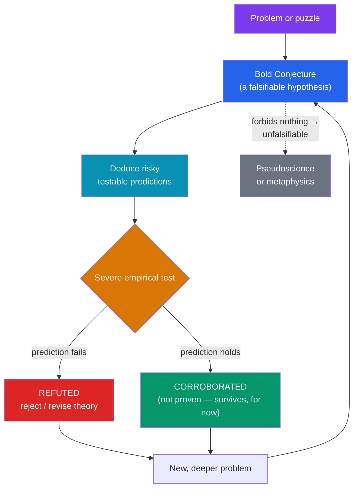

# 🎯 Popper and Falsification

> [!abstract] TL;DR
> **Karl Popper** proposed **falsifiability** as the solution to the **demarcation problem** — the question of what separates genuine science from pseudoscience and metaphysics. A theory is scientific not because it can be confirmed but because it *forbids* something: it makes risky predictions that could, in principle, be shown false. Science advances by **conjectures and refutations** — bold hypotheses ruthlessly tested and discarded when they fail. This sidesteps [[The_Problem_of_Induction]] by denying that science ever *confirms* theories at all; it only *corroborates* the survivors. Popper used this to indict Marxist history and Freudian psychoanalysis as "unfalsifiable" — able to explain any outcome. The chief technical objection is the **Duhem–Quine problem**: hypotheses are never tested in isolation, so a failed prediction never cleanly refutes one theory.

## Intuition — analogy first

Think of a scientific theory as a defendant in court, and evidence as the prosecution.

A weak theory is like a defendant who confesses to everything and denies nothing — "I might have been at the scene, or not; I might have done it, or not." Such a defendant can never be *convicted*, but that is exactly why the "trial" is worthless: no possible evidence counts against them. A strong theory is the opposite. It stakes out a bold, specific alibi — "I was in Paris at 9 p.m., in full view of a hundred people." That claim is *vulnerable*: one photograph of the defendant in London at 9 p.m. destroys it. And it is precisely that vulnerability that makes the alibi *informative*.

Popper's insight is that the mark of good science is the same courage to be proven wrong. A theory that "explains" every possible observation explains nothing. The theory worth having is the one that sticks its neck out, forbids specific outcomes, and survives our best attempts to behead it.

---

## How It Works — Conjectures and Refutations

The loop is deliberately **asymmetric**. A universal claim ("all swans are white") can never be verified by observation (you cannot check every swan) but can be *falsified* by a single counterexample (one black swan). Popper builds his whole epistemology on this logical asymmetry: science is a one-way ratchet driven by refutation, not accumulation. Corroboration is never proof — a corroborated theory has merely not yet been killed.

## Key Concepts

### The Demarcation Problem

The **demarcation problem** asks: what distinguishes *science* from *non-science* (pseudoscience, metaphysics, mathematics)? The **logical positivists** of the Vienna Circle answered with a **verifiability criterion of meaning**: a statement is meaningful (and scientific) only if it can be empirically verified. Popper rejected this on two grounds:

- **It is too strong:** universal laws ("all copper conducts electricity") can never be conclusively verified, so verificationism would expel the crown jewels of science.
- **It targets meaning, not science:** Popper insisted demarcation is about the *scientific status* of theories, not whether they are meaningful. Metaphysics can be meaningful and still not science.

Popper's replacement: **falsifiability** is the criterion of *demarcation* (not of meaning). A theory is scientific to the degree that it prohibits observable states of affairs.

### Falsifiability and Risky Predictions

A theory is **falsifiable** if there exists at least one **potential falsifier** — a logically possible observation that would contradict it. Key refinements:

- **Falsifiability is a property of statements/theories, not of scientists.** It concerns logical form, not whether anyone actually tries to refute the theory.
- **Boldness = high empirical content.** The more a theory forbids, the more falsifiable, the more it tells us. "It will rain somewhere next year" forbids almost nothing; "it will rain in Vienna at noon tomorrow" is bold and testable.
- **Corroboration** is Popper's deliberately non-inductive term for a theory that has withstood severe tests. It measures past performance under testing, **not** future reliability — Popper denies we can infer the latter.

> [!example] The Eddington eclipse (1919)
> Popper's paradigm case of good science. Einstein's general relativity predicted a *specific* deflection of starlight by the Sun (1.75 arcseconds) — a number that could have come out wrong and refuted the theory. Eddington's eclipse measurements matched. Popper contrasted this with theories that could accommodate *any* result and therefore risked nothing.

### The Critique of Verificationism, Marxism, and Psychoanalysis

Popper's formative observation (Vienna, 1919): Einstein's theory made him *nervous* because it could be refuted, whereas the followers of Marx, Freud, and Adler seemed to find *confirmations everywhere*.

- **Marxist theory of history:** early Marx made falsifiable predictions (e.g., about where revolution would occur). When they failed, Popper argued, adherents added **ad hoc** auxiliary hypotheses ("false consciousness," delayed contradictions) to rescue the theory — converting it from science into an **unfalsifiable** interpretive scheme.
- **Freudian psychoanalysis:** whatever a patient does, the theory accommodates it. A man who saves a drowning child *and* a man who drowns one can both be explained (sublimation vs. repression). A theory compatible with *every* behavior forbids none, and so, for Popper, is untestable.

> [!warning] "Unfalsifiable" is not an insult meaning "false"
> Popper's charge is not that Marxism or psychoanalysis is *false* — a false theory is at least testable. His charge is that in their guarded forms they are *not testable at all*, and therefore fall outside empirical science. They may still be meaningful, historically important, or even true.

### Naive vs. Sophisticated Falsificationism

| | **Naive falsificationism** | **Popper's actual (sophisticated) view** |
|---|---|---|
| A single failed prediction... | conclusively refutes the theory | is a *problem*; requires severe, repeatable, agreed tests |
| Auxiliary hypotheses | never allowed | allowed **if** they *increase* testability, banned if merely *ad hoc* rescues |
| Basic (observation) statements | certain, theory-free | conventionally accepted by agreement, themselves fallible |
| Status of theories | true or false | conjectural; the best are the boldest survivors |

Popper knew "one counterexample = refutation" is too crude. Anomalies are common and not always fatal; what matters is whether responses to them are **progressive** (open to new tests) or **degenerating** (ad hoc immunizing moves). This nuance is developed by Lakatos — see [[Kuhn_and_Scientific_Revolutions]].

### The Duhem–Quine Problem

The deepest technical objection. A theory *T* never entails an observation *O* by itself; it does so only together with **auxiliary assumptions** *A* (background theories, instrument calibration, boundary conditions):

$$ (T \wedge A) \rightarrow O $$

If we observe **not-*O***, logic tells us only that *T* **or** *A* is false — **not which**. So a failed prediction can always be blamed on an auxiliary rather than the core theory. This is the **Duhem–Quine thesis** (Pierre Duhem's holism about physics + W.V.O. Quine's "Two Dogmas," which argued *any* statement can be held true "come what may" if we revise enough elsewhere). Consequences:

- **Clean refutation is impossible in principle.** Falsification faces the same underdetermination that verification does.
- Historically vindicated: anomalies in Uranus's orbit were (correctly) blamed on an auxiliary — an unseen planet — leading to the **discovery of Neptune**, not the refutation of Newton. The *same* move applied to Mercury's perihelion failed, and there Newtonian gravity really did give way to relativity. Logic alone did not decide which case was which — judgment did.

## Arguments & Examples

**The logical asymmetry, formalized.** Let the theory be the universal claim $\forall x\, (Sx \rightarrow Wx)$ ("all swans are white"). No finite set of observations $Sa_1 \wedge Wa_1, \dots$ can prove it (that would require checking every swan, past and future). But a single instance $Sa \wedge \neg Wa$ (a black swan) yields a valid deductive refutation by **modus tollens**. Popper's science runs on this valid deduction — which is why he claims it needs no induction and thereby *dissolves* Hume's problem. Critics reply that treating survivors as better guides to action quietly reintroduces induction (see [[The_Problem_of_Induction]]).

**Astrology vs. astronomy.** Astrological forecasts are typically hedged ("a challenging period in relationships") so that no experience can contradict them — unfalsifiable, hence pseudoscience by Popper's lights. Astronomy predicts eclipse times to the second: bold, riskable, refutable.

**A progressive vs. a degenerating response.** When general relativity's prediction for Mercury succeeded where Newton failed, Newtonians *could* have posited yet another hidden mass. That move was available but *degenerating* — it bought agreement with data at the cost of new testable content. Choosing relativity instead was choosing the theory with more corroborated, independently testable predictions. This is the seed of Lakatos's **research programmes** (see [[Kuhn_and_Scientific_Revolutions]]).

## Common Pitfalls / Misconceptions

- **"Falsifiability means a theory has been falsified."** No — it means it *could* be, in principle. A well-corroborated theory is highly falsifiable *and* not (yet) falsified.
- **"Popper thinks science proves theories true."** The opposite. Popper is an anti-inductivist and a fallibilist: theories are never proven, only tentatively retained until refuted.
- **"Any observation against a theory refutes it."** That is *naive* falsificationism, which Popper himself rejected. The Duhem–Quine problem shows blame can fall on auxiliaries; refutation requires methodological judgment, not just logic.
- **"Unfalsifiable = meaningless / worthless."** Popper decoupled demarcation from meaning. Metaphysics can be meaningful and even fruitful; it is simply not empirical science.
- **"Falsificationism fully escapes Hume."** Contested. If corroboration gives us *any* reason to rely on a theory tomorrow, that reliance looks inductive. Popper's denial that it does is one of his most disputed claims.

## Related Concepts

- [[_MOC_Philosophy_of_Science|↑ Section MOC]]
- [[The_Problem_of_Induction]] — Popper's target: he claims falsification lets science avoid induction entirely; critics say corroboration smuggles it back
- [[Kuhn_and_Scientific_Revolutions]] — Kuhn's historical challenge: real scientists cling to paradigms through anomalies rather than instantly falsifying them; Lakatos and Feyerabend respond
- [[Scientific_Realism]] — Popper was a realist about theories; falsification bears on underdetermination and the growth of verisimilitude
- [[Explanation_and_Laws_of_Nature]] — Hempel's covering-law model shares Popper's deductive picture of theory–evidence relations
- Cross-vault: [[_MOC_Physics_Master]] — the Eddington eclipse and the Mercury perihelion as textbook conjecture-and-refutation

## Review Questions

1. State the demarcation problem and explain why Popper rejected the logical positivists' verifiability criterion. Why does he insist falsifiability is a criterion of *demarcation* rather than of *meaning*?
2. Explain the Duhem–Quine problem using the schema $(T \wedge A) \rightarrow O$. Use the Neptune-vs-Mercury contrast to show why logic alone cannot tell us whether to blame the core theory or an auxiliary.
3. Popper accuses Freudian psychoanalysis of being unfalsifiable. Reconstruct his argument, then state the strongest reply a defender of psychoanalysis could give (e.g., that specific psychoanalytic claims *do* make testable predictions).

## Sources

- Popper, K. (1959). *The Logic of Scientific Discovery*. (Orig. *Logik der Forschung*, 1934.)
- Popper, K. (1963). *Conjectures and Refutations: The Growth of Scientific Knowledge*, esp. Ch. 1.
- Duhem, P. (1906). *The Aim and Structure of Physical Theory*; Quine, W.V.O. (1951). "Two Dogmas of Empiricism," *Philosophical Review* 60.
- Thornton, S. (2023). "Karl Popper." *Stanford Encyclopedia of Philosophy*.

#philosophy #philosophy-of-science #falsification #demarcation #popper #duhem-quine
