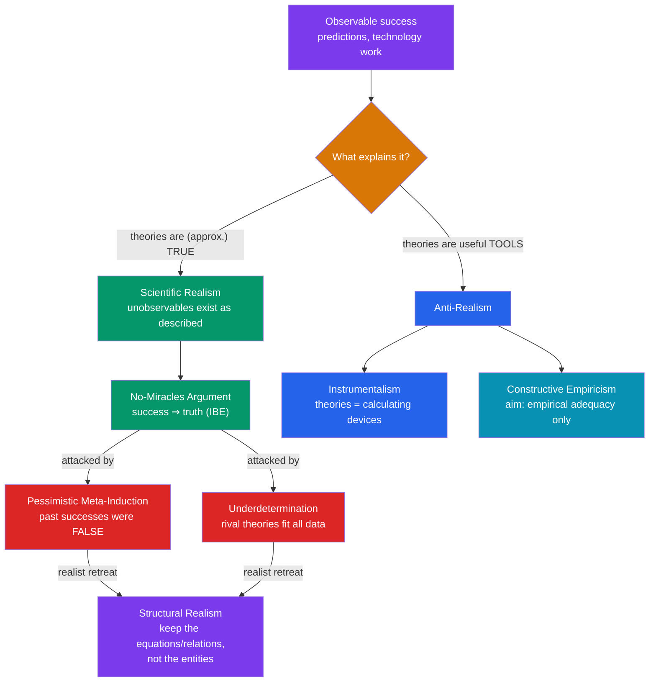

# 🔬 Scientific Realism

> [!abstract] TL;DR
> **Scientific realism** holds that our best scientific theories are (approximately) *true* and that the **unobservable** entities they posit — electrons, quarks, fields, genes — really exist and are largely as the theories describe. **Anti-realists** (instrumentalists, empiricists) hold that theories are at best useful tools for organizing and predicting observations; talk of unobservables is a calculating device we needn't believe literally. The headline argument *for* realism is the **no-miracles argument**: the predictive success of science would be a miracle unless its theories were latching onto reality. The headline argument *against* is the **pessimistic meta-induction**: the history of science is a graveyard of successful-but-false theories (phlogiston, caloric, the ether), so *our* successful theories are probably false too. Bas **van Fraassen**'s **constructive empiricism** offers a sophisticated middle: aim only at **empirical adequacy** — truth about observables — and stay agnostic about the rest. Underlying it all is the **underdetermination** of theory by evidence.

## Intuition — analogy first

Imagine a brilliant weather-forecasting machine sealed in a black box. You feed it today's readings; it prints tomorrow's weather, and it is right with astonishing regularity. Now a question splits the room.

The **realist** says: the box is so reliable that its inner workings must *mirror* the actual atmosphere — there must be little gears and dials inside that correspond to real fronts, pressures, and currents. Nothing else could explain success this good; to deny it is to believe in miracles.

The **anti-realist** says: I have opened many such boxes before, and their innards *never* matched reality — they were clever contraptions that happened to work, later replaced by wholly different contraptions that worked even better. The box's *outputs* are what earn my trust; its *guts* I take on faith at my peril. Maybe there are gears; maybe there is something utterly unlike gears. Success tells me the box is **empirically adequate**, not that its picture of the hidden machinery is *true*.

Both are looking at the same track record and drawing opposite lessons about what lies behind the observable dials. That is the realism debate.

---

## How It Works — The Structure of the Debate

The debate is a chain of **inferences to the best explanation** (IBE) and counter-inferences. Realists explain success by truth; anti-realists deny that success needs truth, and marshal history and logic to show truth is not the best (or only) explanation. Structural realism is the realist's fallback position under fire.

## Key Concepts

### What Realism Commits You To

Standard scientific realism combines three theses (Psillos):

- **Metaphysical:** there is a mind-independent world with a definite structure, including unobservables.
- **Semantic:** theoretical claims are to be taken **literally** — "there are electrons" means what it says and is true or false accordingly (contrast instrumentalism, which reinterprets it as shorthand for observable regularities).
- **Epistemic:** our mature, predictively successful theories are **approximately true**, so we are warranted in believing in the entities they posit.

The pivotal fault line is the **observable / unobservable** distinction. Everyone is a realist about tables and comets; the fight is over electrons, curved spacetime, and wavefunctions.

### The No-Miracles Argument (for realism)

Due to Putnam and Boyd, the **no-miracles argument** (NMA):

> Realism "is the only philosophy that does not make the success of science a miracle." The predictive and technological success of mature science — novel predictions confirmed, bridges that stand, chips that compute — is best explained by the approximate truth of the theories that produced it.

It is itself an **inference to the best explanation**, applied to science as a whole. Its persuasive core is **novel predictive success**: a theory predicting something *unexpected and previously unobserved* (the bending of starlight, the Higgs boson, the existence of Neptune) seems to require that the theory got something *right about the world*, not merely that it was curve-fitted to known data.

### The Pessimistic Meta-Induction (against realism)

Due to Laudan, the **pessimistic meta-induction** (PMI):

> The history of science is full of theories that were **empirically successful** in their day yet are now regarded as **false**, their central terms non-referring. Therefore, by induction on that track record, *today's* successful theories are probably also false.

Laudan's "graveyard" list includes the **crystalline spheres**, the **phlogiston** theory of combustion, the **caloric** theory of heat, the **luminiferous ether**, and the **effluvial** theory of static electricity. Each explained data and guided research; each was discarded. The PMI thus turns the realist's own IBE against them and connects directly to Kuhn's discontinuities (see [[Kuhn_and_Scientific_Revolutions]]). Note the irony: it uses *induction* to undercut realism, inheriting the fragility of [[The_Problem_of_Induction]].

**Realist replies to the PMI:**
- **Divide and conquer** (Kitcher, Psillos): distinguish the "working posits" genuinely responsible for a theory's success from idle parts. The parts doing the predictive work (e.g., Fresnel's *equations* of light) were often *retained* even when the ontology (the *ether*) was dropped.
- **Selective / structural realism** (see below): commit only to what survives theory change.
- **Not all successes are equal:** the PMI's historical cases often lacked genuine *novel* predictive success; the realist restricts commitment to *mature* theories with novel predictions.

### Van Fraassen's Constructive Empiricism

Bas van Fraassen (*The Scientific Image*, 1980) offers the most influential contemporary anti-realism — and crucially is **not** an instrumentalist about *meaning*:

- **Semantics:** theoretical claims are **literally true-or-false** (he agrees with realists here, against old instrumentalism).
- **Aim of science:** not truth but **empirical adequacy** — a theory is empirically adequate if what it says about *observable* things is true ("it saves the phenomena").
- **Epistemic attitude:** accepting a theory involves believing only that it is empirically adequate, plus a pragmatic commitment to use it — **agnosticism**, not denial, about unobservables. Believing *more* than the evidence about observables requires is epistemically reckless.
- He attacks the NMA by rejecting **IBE** as a rule that delivers truth: that our best available theory is the *likeliest true* one presupposes we have the true theory in our candidate pool at all ("the bad lot" objection).
- He defends the observable/unobservable line as *epistemically* significant (what *we*, as a certain kind of organism, could observe unaided) while granting it is not a joint in nature.

### Underdetermination of Theory by Evidence

The **underdetermination thesis (UTE):** for any body of observational evidence, there exist **rival theories**, incompatible with one another but **equally compatible with all the evidence** (even all possible evidence, in the strong version). If so, evidence alone cannot pick the true theory, undercutting the epistemic thesis of realism.

| Version | Claim | Realist response |
|---------|-------|------------------|
| **Weak (Duhem)** | Evidence never *deductively* forces one theory | Trivial; non-evidential virtues (simplicity, unification) break ties |
| **Strong (Quine)** | For any theory, an *empirically equivalent* rival exists | Alleged rivals are often notational variants, or the "rivals" are contrived and untestable |
| **Transient** | *Currently available* evidence underdetermines | Real but temporary; future evidence and theoretical virtues decide |

Realists typically concede weak/transient underdetermination but deny that genuine, non-contrived empirical equivalents are common, and insist **theoretical virtues** are truth-conducive, not merely pragmatic. This is the theory-level cousin of Goodman's grue and enumerative-induction gaps (see [[The_Problem_of_Induction]]).

### Structural Realism — the Fallback

**Structural realism** (Worrall, 1989; reviving Poincaré) tries to keep the NMA while surviving the PMI by committing only to the **mathematical structure** of theories, not their full ontology:

- **Epistemic structural realism (ESR):** we can know the *relations/structure* the world instantiates (preserved across theory change — Fresnel's equations survive into Maxwell's) but not the intrinsic natures of the relata.
- **Ontic structural realism (OSR):** more radical — *structure is all there is*; "objects" are nodes in a relational structure, a view some find congenial to quantum field theory, where particles are excitations of fields.

Structural realism is explicitly engineered as the **"best of both worlds"**: continuity of structure answers the PMI; the reality of that structure answers the NMA.

## Arguments & Examples

**Novel prediction as the realist's best evidence.** In 1846, perturbations in Uranus's orbit led Le Verrier to predict an unseen planet at a *specific location*; **Neptune** was found there within a degree. It is hard to see how a *merely instrumental* theory could deliver a brand-new object at brand-new coordinates. The realist says: the theory got the world right. (Contrast the *same era's* prediction of "Vulcan" inside Mercury's orbit — which did **not** exist; Mercury's anomaly instead required general relativity. Novel-prediction success is powerful but not infallible.) These cases sit in the [[_MOC_Physics_Master|Physics vault]].

**The ether: a PMI case study, dissected.** The 19th-century **luminiferous ether** was posited to carry light waves and underwrote real predictions via Fresnel's wave optics. The Michelson–Morley null result and special relativity dissolved the ether — yet **Fresnel's equations for reflection/refraction survived essentially intact into electromagnetism**. This is exactly the pattern structural realists exploit: the *entity* died, the *structure* lived. An entity-realist is embarrassed; a structural realist is vindicated.

**Empirical equivalence, real or contrived?** Newtonian mechanics in absolute space is empirically equivalent to a version with the whole cosmos in uniform motion — a textbook underdetermination. But note it looks like a *notational variant*, not two genuinely rival pictures of nature. Realists press this generally: most alleged empirical equivalents are either variants or gerrymandered (grue-like) constructions, not the serious rivals the strong UTE needs.

## Common Pitfalls / Misconceptions

- **"Realism = certainty that theories are exactly true."** No. Realists claim *approximate* truth and remain fallibilists. The claim is about warranted belief, not proof.
- **"Constructive empiricism denies unobservables exist / says theoretical terms are meaningless."** Wrong on both counts. Van Fraassen takes theories literally and stays *agnostic* about unobservables; he simply declines to *believe* more than empirical adequacy requires.
- **"The pessimistic meta-induction shows science doesn't work."** It shows past successful theories were false, not that science fails. It targets the inference *from success to truth*, not the success.
- **"Unobservable just means very small / far away."** The distinction is about what a suitably placed human could observe *unaided*; it is famously vague (microscopes? moons of Jupiter?) — which is itself a standard objection to van Fraassen.
- **"Structural realism is a free lunch."** Critics (Newman's objection) charge that "we know only structure" collapses into near-triviality unless the structure is more than a bare cardinality claim; specifying *which* structure is real is the hard part.
- **"The NMA is a knockdown proof."** It is an IBE about science, and so is vulnerable to the same anti-IBE worries (van Fraassen's "bad lot") and to the charge of being **circular** — using scientific-style reasoning to justify trusting scientific reasoning.

## Related Concepts

- [[_MOC_Philosophy_of_Science|↑ Section MOC]]
- [[The_Problem_of_Induction]] — The pessimistic meta-induction *is* an induction, and underdetermination is Goodman/enumerative slack at the theory level
- [[Kuhn_and_Scientific_Revolutions]] — Revolutionary discontinuity and incommensurability supply the historical fuel for the PMI
- [[Popper_and_Falsification]] — Popper was a realist (theories aim at truth/verisimilitude) yet an anti-inductivist; a useful contrast case
- [[Explanation_and_Laws_of_Nature]] — Realism about unobservables travels with realism about laws and causal structure; IBE is the shared engine
- Cross-vault: [[_MOC_Physics_Master]] — electrons, fields, the ether, Neptune/Vulcan: the concrete unobservables and predictions the debate is really about

## Review Questions

1. State the no-miracles argument and the pessimistic meta-induction. Explain precisely how they can *both* be inferences to the best explanation pointing in opposite directions, and evaluate the "divide and conquer" realist reply.
2. Van Fraassen accepts that theoretical statements are literally true or false yet declines to believe theories are true. Explain how empirical adequacy and *agnosticism* about unobservables let him hold this coherently, and state one objection to his observable/unobservable distinction.
3. Explain how *structural realism* is designed to survive both the PMI and the NMA, using the Fresnel-to-Maxwell case. What is the Newman objection, and does it undermine the position?

## Sources

- van Fraassen, B. C. (1980). *The Scientific Image*. Oxford University Press.
- Laudan, L. (1981). "A Confutation of Convergent Realism," *Philosophy of Science* 48(1).
- Psillos, S. (1999). *Scientific Realism: How Science Tracks Truth*. Routledge. (Includes the "divide and conquer" defense.)
- Worrall, J. (1989). "Structural Realism: The Best of Both Worlds?" *Dialectica* 43. / Chakravartty, A. (2017). "Scientific Realism," *Stanford Encyclopedia of Philosophy*.

#philosophy #philosophy-of-science #realism #instrumentalism #no-miracles #pessimistic-meta-induction
