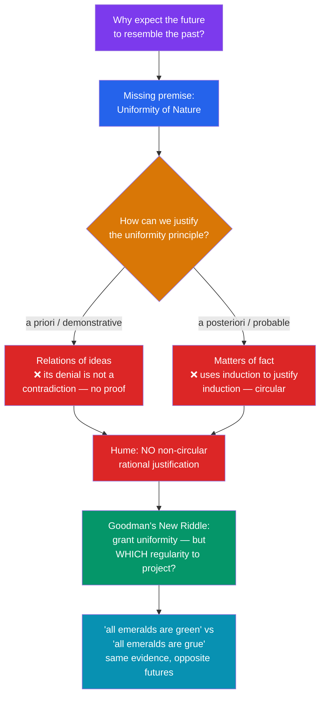

# 🌅 The Problem of Induction

> [!abstract] TL;DR
> Induction infers general conclusions or future predictions from finite past observations ("every raven so far has been black, so all ravens are black"). **David Hume** argued that no such inference can be *rationally justified*: any justification must either be deductive (but no amount of evidence deductively entails the next case) or itself inductive (which assumes the very principle — the uniformity of nature — that is in question, and so is circular). This is the **problem of induction**. **Nelson Goodman** then showed the problem is deeper than justification: even if we grant that the future resembles the past, we cannot say *which* regularities to project — his predicate "**grue**" fits all the same evidence as "green" yet yields the opposite prediction. Pragmatic, probabilistic (Bayesian), and reliabilist responses try to live with the problem rather than dissolve it.

## Intuition — analogy first

Imagine you have flipped a coin one thousand times and it has come up heads every time. What is the probability the next flip is heads?

Your gut says "very high." But notice what that confidence rests on: the assumption that *the way the world has behaved so far is a reliable guide to how it will behave next*. Call this the **uniformity of nature**. Now ask: how do you *know* nature is uniform? The only evidence you could offer is that it has been uniform in the past — but "it worked before, so it will work again" is *itself* an inductive inference. You are using induction to certify induction. It is like a witness whose only character reference is a signed statement from himself vouching for his own honesty.

That is Hume's trap in miniature. Induction may be indispensable — we could not cross a street or run an experiment without it — but "indispensable" is not the same as "rationally justified." The problem of induction is the discovery that our single most important tool for learning about the world rests on a foundation we cannot prove without already standing on it.

---

## How It Works — Hume's Fork and the Two Riddles

The diagram captures Hume's argument as a **dilemma (Hume's fork)**. Every possible justification of the uniformity principle falls into one of two categories, and each horn fails. Goodman's riddle then opens a *second*, independent problem on the right: even someone who simply *accepts* uniformity still faces the question of which of infinitely many patterns consistent with the data is the one nature will follow.

## Key Concepts

### Enumerative Induction and Its Limits

**Enumerative induction** reasons from "all observed Fs are G" to "all Fs are G" (or "the next F will be G"). Its logical gap is permanent, not a matter of collecting more data:

- **Deductive invalidity.** The premises can be true while the conclusion is false. No contradiction arises from "every observed raven was black, but the next raven is white." Contrast a valid deductive inference, where denying the conclusion while affirming the premises *is* a contradiction.
- **The turkey problem** (Bertrand Russell's illustration): a turkey fed every morning induces that it will always be fed — right up to Christmas Eve. More confirming instances raised the turkey's confidence while its danger grew.
- **Underdetermination in miniature.** Any finite data set is compatible with infinitely many general hypotheses that agree on the observed cases and diverge on unobserved ones. See [[Scientific_Realism]] for the theory-level version of this point.

### Hume's Argument, Step by Step

Hume (in the *Treatise* and *Enquiry*) is best read as a **destructive dilemma**:

| Step | Claim |
|------|-------|
| 1 | All reasoning about unobserved matters of fact relies on cause–effect, which we learn only from experience (constant conjunction). |
| 2 | Such reasoning needs a bridging premise: **the future will resemble the past** (uniformity of nature). |
| 3 | This premise cannot be established by **demonstrative reasoning** — its denial implies no contradiction, so it is not a truth of reason. |
| 4 | It cannot be established by **probable (empirical) reasoning** — that would *use* induction, presupposing the very premise, hence **circular**. |
| 5 | Therefore inductive inference has **no rational (non-circular) justification**. |

Crucially, Hume was **not** telling us to stop using induction. His conclusion is *skeptical* about justification, but he holds that induction is grounded in **custom or habit** — a psychological propensity nature has fitted us with. We infer causes and effects not because reason licenses it but because the mind is conditioned to. This descriptive naturalism sits alongside the normative skepticism. See [[Humes_Skepticism]].

### Goodman's New Riddle — "grue"

**Nelson Goodman** (*Fact, Fiction, and Forecast*, 1955) argued that solving Hume's problem would still leave a deeper one. Define the predicate:

> **grue**: applies to a thing if it is examined before some future time *t* and is **green**, or is not so examined and is **blue**.

Every emerald examined so far (all before *t*) is green — and therefore also grue. So our evidence confirms *both*:
- "All emeralds are **green**" → the next (unexamined) emerald will be green.
- "All emeralds are **grue**" → the next (unexamined) emerald will be blue.

Same evidence, contradictory predictions. The riddle is **not** "why trust induction?" but "**why project 'green' rather than 'grue'?**" Both are equally well confirmed by the data.

- Goodman's diagnosis: "green" is **projectible** and "grue" is not — but projectibility cannot be defined purely syntactically or by simplicity, because "grue"/"bleen" and "green"/"blue" are *inter-definable* (each pair looks simple in the other's language).
- His proposed solution: **entrenchment** — "green" has a long history of successful past projection in our linguistic practice; "grue" does not. This makes projectibility a fact about our *inductive habits*, echoing Hume's appeal to custom rather than pure logic.

### Responses to the Problem

| Response | Core move | Weakness |
|----------|-----------|----------|
| **Inductive justification** (Black, Braithwaite) | Use a *rule-circular* argument: induction has worked, so induction is reliable | Still circular; convinces only the already-convinced |
| **Pragmatic vindication** (Reichenbach) | Can't prove induction *true*, but *if any method works, induction will*; so it's the rational bet | Justifies a whole family of "asymptotic" rules, not induction specifically |
| **Probabilistic / Bayesian** | Conditionalize on evidence; priors + likelihoods yield rational credences | Needs justified priors; convergence theorems presuppose regularity — see [[Bayesian_Statistics]] |
| **Falsificationism** (Popper) | Deny that science uses induction at all — it *conjectures and refutes* | Many argue corroboration smuggles induction back in — see [[Popper_and_Falsification]] |
| **Reliabilism / naturalism** (Quine) | Justification is the wrong demand; ask whether induction is *reliable* as a natural process | Concedes Hume's point about rational justification |
| **Ordinary-language dissolution** (Strawson) | Asking induction to be justified *by deduction* misuses "rational"; being rational just *means* using induction | Critics: renames the problem rather than solving it |

## Arguments & Examples

**The circularity, made vivid.** Suppose you defend induction by saying: "Inductively-based predictions have usually turned out true, so induction is reliable." Lay out the inference:
- Premise: In the past, induction usually succeeded.
- Conclusion: In the future, induction will usually succeed.

The step from past to future *is an induction*. You have justified induction by an argument whose validity depends on induction. This is **rule-circularity**, and it is why Hume calls the reasoning question-begging.

**Old evidence, new prediction (grue in the lab).** Imagine two research programs measuring a physical constant. Both fit every data point collected before 2050 perfectly. One extrapolates a smooth "green"-style curve; the other a "grue"-style curve that kinks after 2050. No amount of pre-2050 data can decide between them, because they agree on all of it. Scientists in fact choose the smooth curve — but *why* is a philosophical question, not one the data settles. This is Goodman's riddle wearing lab clothes and is a cousin of **underdetermination of theory by evidence** (see [[Scientific_Realism]]).

**Where physics feels the bite.** Cosmology and the search for laws are induction-heavy: we generalize from local, recent measurements to all of space and time. The assumption that the laws of physics are the *same everywhere and everywhen* — a working posit in the [[_MOC_Physics_Master|Physics vault]] — is precisely the uniformity-of-nature premise Hume targeted. It is empirically fruitful and philosophically unprovable at once.

## Common Pitfalls / Misconceptions

- **"More data solves it."** No. The gap is logical: any finite sample underdetermines the universal claim. A million black ravens do not *entail* the next one is black.
- **"Hume told us to stop trusting science."** He did not. Hume thought induction is psychologically inevitable and practically indispensable; his target is the claim that it is *rationally demonstrable*.
- **"Probability dissolves it."** Assigning a high probability to the next case requires prior assumptions (priors, exchangeability, uniformity) that are themselves inductive commitments. Bayesianism *reorganizes* the problem; it does not make it vanish.
- **"Grue is just a trick word."** The point is structural: "grue" and "green" are inter-definable, so you cannot rule "grue" out by appeal to simplicity or naturalness without smuggling in a prior standard of what counts as a natural predicate.
- **"Falsificationism escapes Hume."** Only if corroboration carries no inductive weight. But treating a well-corroborated theory as a better bet for future action looks like induction under another name (see [[Popper_and_Falsification]]).

## Related Concepts

- [[_MOC_Philosophy_of_Science|↑ Section MOC]]
- [[Popper_and_Falsification]] — Popper's attempt to sidestep induction by making science purely deductive (conjecture + refutation)
- [[Scientific_Realism]] — Underdetermination and the pessimistic meta-induction inherit induction's structure at the level of whole theories
- [[Explanation_and_Laws_of_Nature]] — If there are genuine laws, they may *ground* induction; the Humean regularity view denies exactly this support
- [[Humes_Skepticism]] — The Early Modern source: Hume's fork, causation as constant conjunction, and custom as the real basis of belief
- Cross-vault: [[Bayesian_Statistics]] — The probabilistic framework most often offered as a "response" to induction; [[_MOC_Physics_Master]] — the uniformity-of-nature posit at work in physical law

## Review Questions

1. Reconstruct Hume's dilemma as a numbered argument. Identify precisely the point at which an attempted *empirical* justification of the uniformity principle becomes circular, and explain why a *deductive* justification is unavailable.
2. Define "grue" carefully, then explain why Goodman's riddle is a genuinely *different* problem from Hume's. Why can't we rule out "grue" simply by saying it is more complicated than "green"?
3. Reichenbach's pragmatic vindication claims induction is our best bet even if we cannot prove it true. State the argument, then explain the standard objection that it fails to single out induction over rival "asymptotic" rules.

## Sources

- Hume, D. (1748). *An Enquiry Concerning Human Understanding*, §§IV–V. (Also *A Treatise of Human Nature*, Book I, Part III.)
- Goodman, N. (1955). *Fact, Fiction, and Forecast*. Harvard University Press. (Ch. III–IV, "The New Riddle of Induction.")
- Vickers, J. (2022). "The Problem of Induction." *Stanford Encyclopedia of Philosophy*.
- Reichenbach, H. (1938). *Experience and Prediction*. University of Chicago Press. (The pragmatic vindication.)

#philosophy #philosophy-of-science #induction #hume #goodman #epistemology
