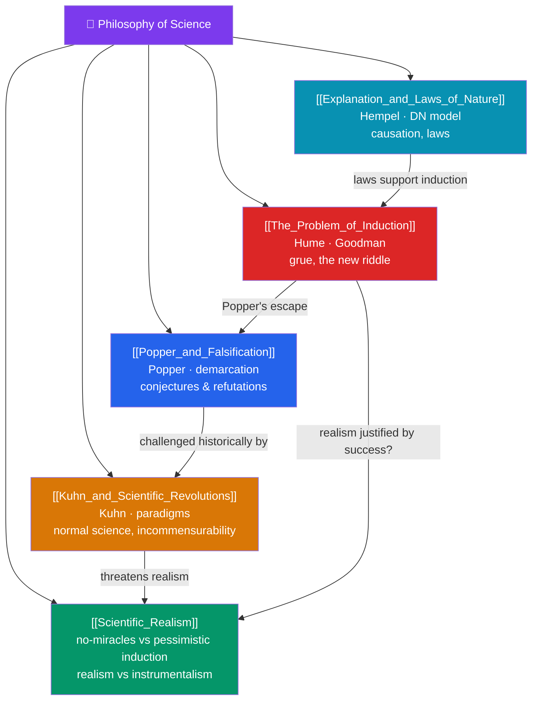

# 🗺️ Philosophy of Science — Map of Content

> [!abstract] What This Section Covers
> Science is our most successful mode of inquiry, yet its foundations raise deep philosophical puzzles. **The Problem of Induction** exposes Hume's challenge — no number of observations logically guarantees the next, sharpened by Goodman's "grue" new riddle; **Popper and Falsification** answers with the demarcation criterion: science advances by bold conjectures and ruthless refutations, not confirmation; **Kuhn and Scientific Revolutions** reframes science as a social practice of normal science punctuated by paradigm shifts and incommensurability; **Scientific Realism** debates whether our best theories are true or merely useful instruments, weighing the no-miracles argument against the pessimistic meta-induction; and **Explanation and Laws of Nature** asks what it is to explain a phenomenon — the deductive-nomological model, causation, and the status of natural laws. Five notes on what makes science work and whether it tells us the truth.

## Concept Map

## Learning Path

1. [[The_Problem_of_Induction]] — Hume's skeptical argument, the circularity of justifying induction, and Goodman's grue paradox.
2. [[Popper_and_Falsification]] — The demarcation problem, falsifiability, conjectures and refutations, and critiques of naive falsificationism.
3. [[Kuhn_and_Scientific_Revolutions]] — Normal science, anomalies, paradigm shifts, incommensurability, and the challenge to cumulative progress.
4. [[Scientific_Realism]] — Realism vs instrumentalism, the no-miracles argument, the pessimistic meta-induction, and structural realism.
5. [[Explanation_and_Laws_of_Nature]] — The deductive-nomological model, causal and statistical explanation, and what makes a regularity a law.

## All Notes at a Glance

| Note | Difficulty | What You'll Learn |
|------|------------|-------------------|
| [[The_Problem_of_Induction]] | Intermediate | Hume's problem, the circularity charge, Goodman's grue, the new riddle of induction |
| [[Popper_and_Falsification]] | Intermediate | Demarcation, falsifiability, conjectures and refutations, ad hoc rescue, Duhem–Quine |
| [[Kuhn_and_Scientific_Revolutions]] | Intermediate → Advanced | Paradigms, normal science, anomalies, crisis, revolutions, incommensurability |
| [[Scientific_Realism]] | Advanced | Realism, instrumentalism, no-miracles argument, pessimistic meta-induction, structural realism |
| [[Explanation_and_Laws_of_Nature]] | Intermediate → Advanced | DN model, causal explanation, the problem of laws, Humean vs necessitarian accounts |

## Key Questions This Section Answers

- Why are we justified in expecting the future to resemble the past?
- What distinguishes genuine science from pseudoscience?
- Is scientific progress cumulative, or a series of incommensurable paradigm shifts?
- Do successful theories describe unobservable reality, or just save the appearances?
- What does it mean to *explain* something, and what makes a law of nature a law?

## Related Sections

- [[_MOC_Philosophy_Master|↑ Philosophy Master MOC]]
- [[_MOC_Political_Philosophy|← Political Philosophy]]
- [[_MOC_Eastern_Philosophy|→ Eastern Philosophy]]
- Cross-vault: [[_MOC_Physics_Master]] (theory and evidence), [[The_Problem_of_Induction]] ↔ [[Humes_Skepticism]] (Early Modern), [[Bayesian_Inference]] (AI/ML)

#MOC #Philosophy #PhilScience
