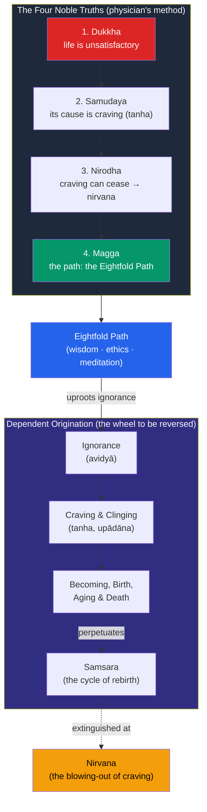

# ☸️ Buddhist Philosophy

> [!abstract] TL;DR
> Buddhist philosophy grows from the teaching of **Siddhartha Gautama, the Buddha** ("the awakened one," c. 5th century BCE), and treats a practical problem — the pervasiveness of *dukkha* (suffering, unsatisfactoriness) — as the entry point to a radical metaphysics. Its diagnostic core is the **Four Noble Truths**, whose cure is the **Eightfold Path**. Three interlocking doctrines underlie everything: **anicca** (impermanence — nothing is static), **anatta** (no-self — there is no permanent, independent soul), and **pratītyasamutpāda** (dependent origination — everything arises in dependence on conditions). The tradition splits broadly into **Theravada** ("the way of the elders") and **Mahayana** ("the great vehicle"); the Mahayana philosopher **Nagarjuna** develops the **Madhyamaka** "middle way," arguing that all things are **empty** (*śūnyatā*) of intrinsic essence. The goal is **nirvana**: the extinction of craving and the end of the cycle of rebirth (*samsara*).

## Intuition — analogy first

Consider a candle flame — or a river, or a whirlpool.

Point at "the flame." It looks like a single, persisting thing you could name and own. But there is no *stuff* that is the flame — only a continuous process of combustion, new gas igniting moment by moment, the "flame" of this instant causally continuous with but numerically different from the flame an instant ago. Blow it out and nothing was destroyed except a process that had no core substance to begin with. A whirlpool is the same: a stable-looking pattern in water that is never the same water twice.

This is the Buddhist analysis of the **self**. What you call "I" feels like a fixed, unified owner sitting behind your experiences. But look closely — the Buddha invites you to actually look — and you find only a flowing bundle of physical sensations, feelings, perceptions, mental formations, and awareness, each arising and passing, none of them a permanent self. The self is a *whirlpool*, not a *stone*: a process (**anicca**), causally conditioned (**dependent origination**), with no essence at its center (**anatta**). Suffering, on this view, comes from mistaking the whirlpool for a stone — clinging to what cannot last as though it could.

---

## How It Works — The Chain of Suffering and Its Reversal

The Four Noble Truths are structured like a physician's method: symptom, diagnosis, prognosis, prescription. The diagnosis rests on the twelve-linked chain of **dependent origination**, which the path *reverses* — remove ignorance and craving, and the whole chain of suffering unwinds.

The key structural insight: suffering is not a brute fact but a *conditioned* one. Because it arises from causes (ignorance and craving), removing the causes removes the effect. The path is the reversal of the wheel.

## Key Concepts

### The Four Noble Truths

1. **Dukkha** — existence is marked by suffering / unsatisfactoriness (from sickness, loss, and death to the subtle unease that even pleasures are impermanent).
2. **Samudaya** — the origin of *dukkha* is **craving/thirst** (*tanha*): grasping for pleasure, for existence, for non-existence.
3. **Nirodha** — the *cessation* of *dukkha* is possible: extinguish craving and suffering ends.
4. **Magga** — the way to cessation is the **Noble Eightfold Path**.

### The Noble Eightfold Path

The prescription, traditionally grouped into three trainings:

| Group | Path factors |
|---|---|
| **Wisdom (prajñā)** | Right View, Right Intention |
| **Ethical conduct (śīla)** | Right Speech, Right Action, Right Livelihood |
| **Mental discipline (samādhi)** | Right Effort, Right Mindfulness, Right Concentration |

It is called the **Middle Way** because it avoids both self-indulgence and extreme asceticism — the two dead ends Gautama personally tried before his awakening.

### The Three Marks of Existence

- **Anicca (impermanence)** — all conditioned phenomena are in constant flux; nothing conditioned endures.
- **Anatta (no-self)** — there is no permanent, unchanging, independent self or soul (*ātman*). The person is a stream of five aggregates (*skandhas*): form, feeling, perception, mental formations, and consciousness. This is Buddhism's most philosophically distinctive — and most contested — thesis, and it directly rejects the Upanishadic *Atman* (see [[Hindu_Philosophy_and_Vedanta]]).
- **Dukkha (unsatisfactoriness)** — because we cling to the impermanent and self-less as if permanent and self-owned, existence is unsatisfactory.

### Dependent Origination (Pratītyasamutpāda)

Nothing exists independently or from its own side; everything arises **in dependence on conditions**. The formula: *"When this is, that is; from the arising of this, that arises; when this is not, that is not; from the ceasing of this, that ceases."* This is the metaphysical engine behind both *anatta* (a "self" would have to be independent, but nothing is) and rebirth without a soul (a causal continuity, like one candle lighting another, carries on without any substance passing across).

### Theravada vs Mahayana

| | **Theravada** ("Way of the Elders") | **Mahayana** ("Great Vehicle") |
|---|---|---|
| Canon | Pali Canon (*Tipitaka*) | Pali + Sanskrit *sutras* (e.g. *Perfection of Wisdom*, *Lotus*) |
| Ideal | The **arhat** — one who attains nirvana | The **bodhisattva** — one who postpones final nirvana to liberate all beings |
| Emphasis | Individual liberation, monastic path | Universal compassion (*karunā*), skillful means, emptiness |
| Regions | Sri Lanka, Thailand, Myanmar, Cambodia | Tibet, China (Chan/Zen), Korea, Japan, Vietnam |
| Key later thought | Abhidharma analysis of *dharmas* | Madhyamaka (Nagarjuna), Yogācāra ("mind-only") |

### Nagarjuna and Emptiness (Śūnyatā) — the Madhyamaka

**Nagarjuna** (c. 150–250 CE), the most influential Mahayana philosopher, radicalizes dependent origination into the doctrine of **emptiness (śūnyatā)**: because everything arises dependently, nothing has **svabhāva** — intrinsic, independent essence or "own-being." Even the Buddhist categories (the aggregates, the Four Truths, nirvana itself) are empty of essence. His **Madhyamaka** ("Middle Way") threads between *eternalism* (things have permanent essence) and *nihilism* (nothing exists at all): things exist *conventionally* and function causally, but are *ultimately* empty of intrinsic nature. He introduces the **two truths** — conventional (*saṃvṛti*) and ultimate (*paramārtha*) — and deploys the **tetralemma (catuṣkoṭi)** to refuse all four positions (is / is not / both / neither) about ultimate essence.

### Nirvana

**Nirvana** literally means "blowing out" (as of a flame) — the extinction of the fires of greed, hatred, and delusion, and thus of craving and the suffering it drives. It is the cessation of *samsara*, the beginningless cycle of rebirth propelled by **karma**. It is described apophatically (by negation): unconditioned, deathless, not annihilation and not eternal existence of a soul — a characterization that follows directly from *anatta*.

## Arguments & Examples

- **The chariot argument for anatta.** In the *Milindapañha* (*The Questions of King Milinda*), the monk Nagasena argues that "the self" is like a "chariot": there is no chariot *over and above* the wheels, axle, frame, and pole assembled in a certain way; "chariot" is a useful designation for the assembly, not an extra thing. Likewise "self" is a convenient label for the five aggregates functioning together — real *as a process*, unreal *as a substance*. (This is a striking convergence with reductionist accounts of the self in Western philosophy; see [[Personal_Identity]] and Derek Parfit, who explicitly credited Buddhism.)

- **Rebirth without a soul.** A standard objection: if there is no self, *who* is reborn and who attains nirvana? The Buddhist answer uses dependent origination: rebirth is causal continuity, not the transmigration of a substance — "neither the same nor different," like a flame passed from candle to candle, or milk that becomes curds then butter. The *stream* continues; no unchanging soul travels it.

- **Nagarjuna's argument against essence.** Nagarjuna argues that intrinsic essence (*svabhāva*) would be, by definition, independent and unchanging — but everything we encounter is causally dependent and changing. So nothing has intrinsic essence: all is empty. Crucially, he insists emptiness is *not* nihilism: "For whom emptiness is possible, everything is possible" — precisely *because* things lack fixed essence, they can arise, change, and cease. Emptiness is the condition of a functioning, changing world, not its denial.

- **The two-truths defense.** How can the Buddha teach a "self" (as in "be a lamp unto yourself") while denying the self? The two-truths framework answers: *conventionally*, persons, tables, and paths are perfectly real and we speak of them; *ultimately*, they lack intrinsic essence. Confusing the levels generates pseudo-paradoxes.

- **The parable of the poisoned arrow.** Asked metaphysical questions the Buddha deemed unhelpful (is the world eternal? infinite?), he compared answering them to a man shot with a poisoned arrow refusing treatment until he knows the archer's caste, name, and bow. The point: Buddhist philosophy is soteriological — it pursues the questions whose answers *relieve suffering*, and sets aside speculation that does not.

## Common Pitfalls / Misconceptions

- **"Anatta means you don't exist."** It denies a *permanent, independent, unchanging* self — not that persons exist conventionally as causally continuous processes. You exist the way a river or flame exists.

- **"Nirvana is annihilation / a blissful heaven."** Buddhist orthodoxy rejects both. It is the extinction of *craving* and its suffering, described by negation; treating it as either the annihilation of a real self or the eternal survival of one reimports the very self-view *anatta* denies.

- **"Emptiness (śūnyatā) means nothing exists / nihilism."** Nagarjuna explicitly warns that misunderstanding emptiness "is like grasping a snake by the wrong end." Emptiness = absence of *intrinsic essence*, not absence of existence; it is what *allows* dependent, functioning existence.

- **"Buddhism is pessimistic."** The First Truth diagnoses suffering, but the whole point is the *Third* Truth — that suffering can end. The framing is therapeutic, not despairing.

- **"All Buddhism is the same / Zen = Theravada."** The traditions differ substantially in canon, ideal (arhat vs bodhisattva), and philosophy (Abhidharma vs Madhyamaka vs Yogācāra). Flattening them erases genuine philosophical debates *within* Buddhism.

## Related Concepts

- [[_MOC_Eastern_Philosophy|↑ Section MOC]]
- [[Hindu_Philosophy_and_Vedanta]] — Buddhism arose in the same Indian milieu and *rejects* the Upanishadic *Atman*/*Brahman*; *anatta* is the pivotal disagreement with Vedanta
- [[Daoism]] — In China, Mahayana emptiness fused with Daoist naturalness to produce **Chan / Zen**
- [[Comparative_Philosophy_East_and_West]] — No-self and emptiness set against the Western substantial self
- Cross-vault: [[Personal_Identity]] — The *anatta* / bundle theory converges with Hume's and Parfit's reductionist accounts of the self
- Cross-vault: [[_MOC_Mythology_Master]] — Buddhist cosmology, the life of the Buddha, and the wheel of *samsara*

## Review Questions

1. State the Four Noble Truths and explain how their structure mirrors a physician's method (symptom, cause, prognosis, cure). How does the Eightfold Path function as the "cure"?
2. If there is no permanent self (*anatta*), who or what is reborn and who attains nirvana? Answer using dependent origination and the flame-to-flame image, and explain why this is "neither the same nor different."
3. Explain Nagarjuna's doctrine of emptiness (*śūnyatā*). Why does he insist it is *not* nihilism, and how do the "two truths" defend the coherence of teaching both a conventional self and ultimate no-self?

## Sources

- *In the Buddha's Words*, ed. & trans. Bhikkhu Bodhi (Wisdom Publications)
- Nagarjuna, *Mūlamadhyamakakārikā* (*The Fundamental Wisdom of the Middle Way*), trans. Jay L. Garfield (Oxford University Press)
- Siderits, Mark (2007). *Buddhism as Philosophy: An Introduction*. Hackett
- Gethin, Rupert (1998). *The Foundations of Buddhism*. Oxford University Press

#philosophy #eastern-philosophy #buddhism #anatta #emptiness
