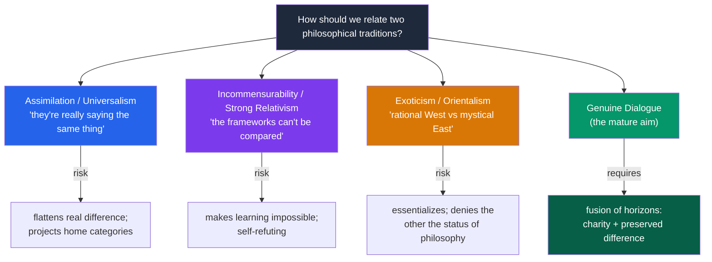

# 🌏 Comparative Philosophy East and West

> [!abstract] TL;DR
> **Comparative philosophy** puts distinct traditions — paradigmatically the Greek-descended "Western" line and the Chinese and Indian traditions — into genuine philosophical dialogue about shared problems. Done well it is illuminating; done badly it either *flattens* differences ("they were saying the same thing all along") or *exoticizes* them ("the mystical East vs the rational West"). Three substantive test cases recur: the **self** (the Western substantial, persisting self vs the Buddhist no-self and Vedantic Atman-Brahman); **ethics without a commanding creator God** (how Confucian, Daoist, and Buddhist ethics ground obligation without divine legislation); and **modes of thought** — a much-debated contrast between *correlative/relational* and *analytic/substance-based* reasoning. Framing it all is the polemical question **"is there philosophy outside the West?"** — long answered "no" by a Eurocentric canon, a verdict now widely and rightly criticized. The mature aim is neither assimilation nor essentialized contrast but *dialogue*: letting each tradition put real questions to the other.

## Intuition — analogy first

Comparing philosophical traditions is like translating poetry between languages with no shared root.

A clumsy translator does one of two bad things. Either they *domesticate* — forcing the foreign poem into familiar idioms until it reads like something already in your language, losing everything that made it worth translating ("*ren* just means 'virtue,' *Dao* just means 'God's plan'"). Or they *exoticize* — leaving it so strange and untouched that it becomes an ornament, admired for its foreignness and never actually understood ("the inscrutable wisdom of the mysterious East"). A good translator does the hard third thing: they find real points of contact *and* preserve the irreducible differences, producing something that genuinely speaks while remaining genuinely other.

Comparative philosophy faces exactly this fork. The lazy options are to say the traditions "really agree" (assimilation) or that they are "incommensurable" and cannot be compared at all (exoticism/relativism). The demanding option — real **dialogue** — holds a difference in view long enough to let it *challenge* your own assumptions: to let Buddhist no-self make you doubt that you obviously have a substantial self, or to let Confucian relational ethics make you notice how much your morality assumed an autonomous individual.

---

## How It Works — Four Stances Toward the "Other" Tradition

Meta-philosophical positions on cross-cultural comparison sort along two axes: how *similar* the traditions are taken to be, and whether comparison is held to be *possible* at all.

The target is the bottom-right: a **fusion of horizons** (Gadamer's phrase) in which each tradition is read charitably as making real claims, yet its distinctiveness is preserved so it can actually teach the other something.

## Key Concepts

### The Methods and Pitfalls of Comparison

Comparative philosophy inherits the hazards of any cross-cultural comparison (see [[The_Comparative_Method]]). The recurring failure modes:

| Pitfall | What it does | Example |
|---|---|---|
| **Projection / anachronism** | Reads home categories into the other tradition | Asking "what is the Confucian theory of *rights*?" when the framework is relational duties |
| **Assimilation ("perennialism")** | Declares all traditions secretly identical | "All mystics everywhere teach the same One" |
| **Exoticism / Orientalism** | Fixes the other as timeless, mystical, non-rational | "The East feels; the West thinks" |
| **Incommensurability** | Denies comparison is possible at all | "Their concepts are untranslatable, so silence" |
| **Cherry-picking** | Selects convenient fragments, ignores context | Quoting Zhuangzi as a proto-postmodernist |

The corrective is *methodological*: read texts in their own problem-context, translate key terms with care (often leaving *ren*, *Dao*, *anatta* untranslated), and treat similarity and difference as *conclusions* of inquiry, not premises.

### Test Case 1 — The Self

The single most fertile comparison. The mainstream Western tradition (Descartes, Locke, Kant) posits a **substantial, persisting self** — a subject or soul that owns experiences and endures through time (see [[Personal_Identity]]). Against this stand two very different non-Western analyses:

- **Buddhist anatta**: there is *no* permanent, independent self — only a causally continuous stream of aggregates (see [[Buddhist_Philosophy]]). Strikingly, this converges with the Western *minority* report of **Hume** ("bundle theory") and **Derek Parfit**, who credited Buddhism directly.
- **Vedantic Atman = Brahman**: there *is* an eternal self, but it is not the individual ego — it is identical with the one absolute (see [[Hindu_Philosophy_and_Vedanta]]).

So "the self" fractures three ways — substantial individual / no-self / universal Self — a genuinely three-cornered debate that no single tradition frames alone.

### Test Case 2 — Ethics Without a Creator God

Western moral philosophy long entangled *obligation* with *divine command* (see [[What_Is_Ethics]] and the Euthyphro problem). The Chinese and Buddhist traditions build robust ethics with **no legislating creator God**:

- **Confucian** ethics grounds obligation in the *roles and relationships* of the human world and the cultivation of character (*ren*, *li*) — closer to Aristotelian virtue ethics than to divine command (see [[Virtue_Ethics]]).
- **Daoist** ethics grounds value in accord with *natural spontaneity* (*ziran*), not a lawgiver's will.
- **Buddhist** ethics grounds it in the causal reality of *karma* and universal compassion arising from insight into no-self and interdependence.

These are live proofs that morality need not be theistically underwritten — a point of enormous interest to secular Western metaethics.

### Test Case 3 — Correlative vs Analytic Modes of Thought

A widely cited (and contested) hypothesis, associated with sinologists **A. C. Graham** and **David Hall & Roger Ames**, distinguishes:

- **Correlative / relational thinking** (said to characterize classical Chinese thought): reality understood through *complementary pairings and resonances* (yin/yang, part–whole harmonies), process over substance, patterns over essences.
- **Analytic / substance-based thinking** (said to characterize the Greek line): reality understood through *definition, essence, and the law of non-contradiction*, seeking what a thing fundamentally *is*.

Handled carefully this illuminates why Chinese texts prize situational appropriateness over universal rules. Handled carelessly it collapses into the exoticizing "East feels / West thinks" cliché — which is why many scholars treat it as a heuristic, not a fixed fact about civilizations.

### The "Is There Philosophy Outside the West?" Debate

The provocation, revived by Bryan Van Norden's *Taking Back Philosophy* (2017) and a widely read 2016 op-ed with Jay Garfield: mainstream Anglophone philosophy departments treat only the Greek-descended tradition as "philosophy," relegating Chinese and Indian thought to "religious studies" or "area studies." Van Norden argues this rests on a circular, Eurocentric definition of philosophy and a legacy of colonial-era prejudice (traceable to Kant's and Hegel's dismissals of non-Western thought). The **critique of this exclusion** points to the manifestly *philosophical* character of Nyaya logic, Buddhist epistemology, and Mohist argumentation, and calls either to teach non-Western traditions as philosophy or to honestly rename departments "Departments of European and American Philosophy."

## Arguments & Examples

- **Against strong incommensurability (the self-refutation point).** The claim "the traditions are so different they cannot be compared" is itself a *comparative* claim — it requires understanding both well enough to judge them incomparable, which presupposes the very comparison it denies. Moreover, successful translation and cross-tradition argument (Buddhists and Advaitins argued *with each other* for centuries; Parfit *learned* from Buddhism) are existence proofs that comparison works. Difference is real but not a wall.

- **The Parfit convergence as a model of good comparison.** Derek Parfit, arguing on independent Western grounds (fission thought experiments, the reductionist view) that personal identity "is not what matters," found he had reached the Buddhist *anatta* view — and said so. This is comparison done right: not assimilation imposed in advance, but *independent convergence* discovered through argument, with the differences (rebirth, soteriology) kept in view. It shows a non-Western tradition anticipating a cutting-edge Western position.

- **The projection trap illustrated.** Early Western readers asked whether Confucius had a theory of *individual rights* or whether the Dao was "God." Both questions smuggle in home categories and get distorted answers. The repair is to ask what problem the text is *actually* addressing (for Confucius, how to cultivate humane persons through relationships and ritual) before asking how it maps onto ours.

- **Ethics without God as a two-way challenge.** The comparison runs both directions. Confucian and Buddhist ethics show the West that theistic grounding is optional; conversely, Western analytic metaethics presses non-Western traditions to clarify *what grounds normativity* if not a God and not (per Hume) mere fact. Genuine dialogue lets each tradition ask the other its hardest question.

- **Hall and Ames on the "focus-field" self.** As a positive fruit of the correlative-thinking hypothesis, Hall and Ames read the Confucian self not as a bounded substance but as a *focus within a field of relationships* — a self constituted by its roles rather than one that "has" roles. Whether or not the sweeping East/West contrast holds, this reading genuinely illuminates the *Analects* and reframes Western debates about relational vs individualist selfhood.

## Common Pitfalls / Misconceptions

- **"The East is spiritual/intuitive; the West is rational/logical."** This is the master stereotype comparative philosophy exists to dismantle. India produced formal logic (Nyaya) and elaborate epistemology; China produced systematic argument (Mohism, Xunzi); and the West has deep mystical traditions (Plotinus, Eckhart). Both hemispheres contain both modes.

- **"Comparison means finding what's universal / the same."** Good comparison often *sharpens difference*: its value can lie precisely in showing that a "self-evident" Western assumption (the substantial self, divine grounding of morality) is a local option, not a human universal.

- **"If traditions differ deeply, comparison is impossible."** Strong incommensurability is self-undermining and empirically false; centuries of cross-tradition debate and successful translation refute it.

- **"'Eastern philosophy' is one thing."** It lumps together Confucianism, Daoism, several Buddhisms, and six-plus Indian schools that disagree with one another as sharply as any Western philosophers do. The category is a convenience, not a unity.

- **"Including non-Western philosophy is just political correctness."** Van Norden's argument is that the *exclusion* was the ideological move (rooted in colonial-era Eurocentrism); the rigor and argumentative sophistication of the traditions are the substantive case for inclusion.

## Related Concepts

- [[_MOC_Eastern_Philosophy|↑ Section MOC]]
- [[Confucianism]] — Test case for relational ethics and the "focus-field" self
- [[Daoism]] — Test case for correlative thinking and value grounded in naturalness
- [[Buddhist_Philosophy]] — The no-self thesis, the sharpest challenge to the Western substantial self
- [[Hindu_Philosophy_and_Vedanta]] — The Atman/Brahman self as the third pole of the self debate
- Cross-vault: [[The_Comparative_Method]] — The general methodology (and its pitfalls) that comparative philosophy specializes
- Cross-vault: [[What_Is_Philosophy]] — The definitional question underlying "is there philosophy outside the West?"
- Cross-vault: [[Personal_Identity]] · [[What_Is_Ethics]] · [[Virtue_Ethics]] — The Western positions the comparisons engage

## Review Questions

1. Distinguish *assimilation*, *exoticism*, and *incommensurability* as failure modes of cross-cultural comparison, and explain what "genuine dialogue" (a fusion of horizons) does instead. Give one concrete example of each failure mode.
2. The self fractures three ways across the traditions (substantial individual / Buddhist no-self / Vedantic universal Self). Lay out the three positions and explain why Derek Parfit's convergence with *anatta* is a model of comparison done well rather than assimilation.
3. Summarize the "is there philosophy outside the West?" debate. What is Van Norden's core argument, whose historical prejudices does he trace it to, and what evidence undercuts the claim that non-Western traditions are not "real philosophy"?

## Sources

- Van Norden, Bryan W. (2017). *Taking Back Philosophy: A Multicultural Manifesto*. Columbia University Press
- Hall, David L. & Ames, Roger T. (1987). *Thinking Through Confucius*. SUNY Press
- Graham, A. C. (1989). *Disputers of the Tao: Philosophical Argument in Ancient China*. Open Court
- Parfit, Derek (1984). *Reasons and Persons*, Part Three. Oxford University Press

#philosophy #eastern-philosophy #comparative-philosophy #cross-cultural #methodology
