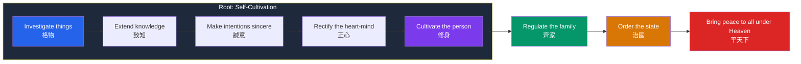

# 🧧 Confucianism

> [!abstract] TL;DR
> Confucianism (Chinese *Rujia*, "the school of the scholars") is the ethical and social philosophy that grew from the teachings of **Confucius** (Kongzi, 551–479 BCE), recorded by his followers in the *Analects* (*Lunyu*). Its aim is not abstract truth but the cultivation of moral character and a harmonious society. Its core is **ren** (benevolence/humaneness) expressed through **li** (ritual propriety) and embodied in the **junzi** (exemplary person). Ethics begins at home with **xiao** (filial piety) and radiates outward through concentric relationships; social order requires the **rectification of names** (*zhengming*). Confucius' two great successors split over human nature: **Mencius** held it innately good, **Xunzi** held it in need of deliberate cultivation. For over two millennia Confucianism was the moral grammar of Chinese, Korean, Japanese, and Vietnamese civilization.

## Intuition — analogy first

Think of becoming good the way you think of becoming a skilled musician.

You do not learn music by memorizing a rule ("play beautifully") and then applying it. You start by copying scales, etudes, and the phrasing of masters — forms that feel external and even artificial at first. Through years of disciplined repetition the forms sink beneath conscious control until, one day, you improvise with genuine feeling *through* the technique rather than despite it. The scaffolding becomes second nature; the rule becomes a disposition.

Confucian ethics works exactly this way. **Li** — the inherited rituals, manners, and roles of a culture — are the scales. You bow, you defer to elders, you observe the forms of mourning, and at first it may feel hollow. But practiced sincerely, ritual trains the emotions until outward propriety and inward **ren** (genuine care) fuse. The **junzi** is the "virtuoso" of humaneness: someone in whom correct action and correct feeling have become one, who at seventy could, as Confucius said of himself, "follow what my heart desired without overstepping the bounds." Morality is a craft, learned by apprenticeship to a tradition, not a theorem deduced from first principles.

---

## How It Works — Concentric Cultivation

Confucian ethics is *relational* and *radiating*: self-cultivation is the root, and moral order grows outward from the cultivated person through family, state, and world. The classic sequence comes from the *Great Learning* (*Daxue*).

The diagram encodes the tradition's central bet: you cannot reform society top-down by law alone. Order flows from cultivated persons outward, and a ruler governs by moral example (*de*, virtue-as-charisma) far more than by punishment. "Govern them by virtue," says the *Analects*, "and they will keep their self-respect and come to you of their own accord."

## Key Concepts

### Ren — Benevolence / Humaneness (仁)

**Ren** is the supreme Confucian virtue: the quality of a fully realized human being, often translated benevolence, humaneness, or co-humanity. The character combines "person" and "two," suggesting that to be fully human is to stand rightly in relation to others. Confucius refused to define *ren* abstractly, instead describing it situationally — to one student it is "to love others," to another "to overcome the self and return to *li*." Its nearest operational rule is the **Confucian golden rule (shu, reciprocity)**, stated negatively: *"Do not impose on others what you yourself do not desire"* (*Analects* 15.24).

### Li — Ritual Propriety (禮)

**Li** covers ritual, ceremony, etiquette, and the proper forms of conduct for every social role and occasion. It is the outward, learnable structure through which inner virtue is expressed and cultivated. Confucius insisted the forms are empty without feeling — "A man without *ren*, what has he to do with ritual?" — yet also that unformed feeling is crude without ritual. *Li* and *ren* are two faces of one achievement: inner disposition and outer form perfected together.

### The Junzi — The Exemplary Person (君子)

Originally meaning "son of a lord," Confucius **redefined junzi morally**: nobility is a matter of character and cultivation, not birth. The *junzi* (exemplary/superior person) is contrasted with the *xiaoren* (petty person). This democratization of virtue — anyone can become noble through learning and effort — was revolutionary and underwrites the later meritocratic ideal of the scholar-official.

### Xiao — Filial Piety (孝)

**Xiao**, devotion and respect toward parents and ancestors, is the seedbed of all virtue: "Filial piety and fraternal respect — are they not the root of *ren*?" (*Analects* 1.2). Because moral feeling is first learned in the family, the well-ordered family is the training ground for the well-ordered state, and loyalty to a ruler is modeled on devotion to a parent.

### The Rectification of Names (Zhengming, 正名)

Asked what he would do first if given power, Confucius answered: **rectify the names**. Social terms — *father*, *ruler*, *friend* — carry normative content: a ruler who does not act as a ruler ought has forfeited the name. "Let the ruler be a ruler, the minister a minister, the father a father, the son a son" (*Analects* 12.11). Aligning conduct with the proper meaning of roles is the precondition of a truthful, functioning society.

### Mencius vs Xunzi on Human Nature

The two great Confucians of the following centuries diverged sharply over the raw material of moral cultivation.

| | **Mencius** (Mengzi, c. 372–289 BCE) | **Xunzi** (c. 310–235 BCE) |
|---|---|---|
| Human nature (*xing*) | **Innately good** | **Bad / crooked** — self-interested by nature |
| Core image | The "**four sprouts**" (*siduan*): innate seeds of the four virtues | Warped wood that must be steamed and bent straight |
| Famous thought experiment | Anyone who sees a child about to fall into a well feels alarm — proof of innate compassion | A hungry person defers to elders only because ritual trains them to |
| Role of cultivation | Nourish and grow what is already there | Deliberately reshape (*wei*) a resistant nature through *li* |
| Role of ritual (*li*) | Expresses natural feeling | Constrains and civilizes raw desire |
| Later influence | Became Confucian orthodoxy (esp. via Neo-Confucianism) | Rehabilitated in modern scholarship; influenced Legalism via his students |

Both agreed on the *destination* — a society of cultivated persons ordered by *ren* and *li* — but disagreed on the starting point, which changes how urgently and coercively cultivation must proceed.

## Arguments & Examples

- **The empty ritual objection and its answer.** A recurring worry: is *li* mere hollow formalism, a training in hypocrisy? Confucius' reply is that ritual done *sincerely* reshapes the heart. The three-year mourning period is his test case (*Analects* 17.21): a student proposes shortening it; Confucius asks whether he would then "feel at ease." Ritual is defensible only when it answers to, and cultivates, genuine feeling.

- **Government by virtue, not by law.** Confucius contrasts two modes of order (*Analects* 2.3): "Lead them by laws and regulate them by punishments, and the people will avoid wrongdoing but have no sense of shame. Lead them by virtue and regulate them by *li*, and they will have a sense of shame and moreover become good." This is the Confucian answer to Legalism — moral internalization beats external coercion. It also frames a live debate with Xunzi's more institutional emphasis.

- **The Mencian sprout argument.** Mencius' inference from the well-child intuition is a genuine philosophical argument: the *spontaneous, disinterested* alarm we feel (not calculated, not for reputation) is evidence of an innate moral endowment. The "sprouts" of compassion, shame, courtesy, and moral discernment can wither from neglect but are natively present — hence education *develops* virtue rather than *installing* it.

- **Graded love, not impartial love.** Confucians insist love is properly *graded* — you owe more to parents than to strangers. This is the point of the famous clash with the Mohist school, which argued for **impartial concern (jian'ai)** for all equally. Mencius attacked impartial love as denying the special claim of one's father; the Confucian counter is that a morality ignoring natural partiality is both psychologically false and socially corrosive. (Contrast this with Western impartialist ethics; see [[Comparative_Philosophy_East_and_West]].)

- **Civilizational reach.** From the Han dynasty's adoption of Confucianism as state doctrine (2nd c. BCE) through the imperial **examination system** (which tested mastery of the Confucian classics), the tradition shaped law, family structure, gender roles, bureaucracy, and education across East Asia. Its legacy is double-edged: an ethic of learning, self-cultivation, and social responsibility, but also, in institutionalized form, rigid hierarchy and the subordination of women and the young.

## Common Pitfalls / Misconceptions

- **"Confucianism is a religion."** It is primarily an ethical-social philosophy. Confucius was famously reticent about gods and the afterlife ("Not yet understanding life, how could you understand death?"). Ancestor veneration and reverence for *Tian* (Heaven) have religious dimensions, but the tradition's focus is this-worldly conduct, not salvation.

- **"Li is just etiquette / empty manners."** *Li* ranges from table manners to state ceremony to the whole moral shape of a role; and Confucius explicitly condemns ritual performed without inner sincerity. Reducing it to politeness misses that it is a *technology of character formation*.

- **"Filial piety means blind obedience."** The *Analects* and *Xiaojing* both allow — even require — remonstrating with a parent (or ruler) who errs, though respectfully. Confucian loyalty is not unconditional; a minister should withdraw from a corrupt ruler.

- **"Confucius invented these ideas from scratch."** He described himself as "a transmitter, not a maker," claiming to recover the way of the sage-kings of the early **Zhou dynasty**. The tradition is self-consciously conservative and text-centered.

- **"Mencius and Xunzi are opposites outside Confucianism."** Both are orthodox Confucians who share the framework; their dispute is *internal*, over human nature, not over the value of *ren*, *li*, or the *junzi*.

## Related Concepts

- [[_MOC_Eastern_Philosophy|↑ Section MOC]]
- [[Daoism]] — The great Chinese counterpoint: where Confucius cultivates social forms, Laozi and Zhuangzi counsel returning to spontaneous naturalness and distrust of ritual
- [[Buddhist_Philosophy]] — Entered China centuries later and fused with Confucian and Daoist thought (later Neo-Confucianism absorbs Buddhist metaphysics)
- [[Comparative_Philosophy_East_and_West]] — Confucian graded, relational, character-based ethics compared with Western rule- and principle-based ethics
- Cross-vault: [[Virtue_Ethics]] — Aristotelian character ethics is the closest Western parallel; both center *habituation* and the exemplary person over rules
- Cross-vault: [[_MOC_History_Master]] — The Zhou, Warring States, and Han contexts that shaped and institutionalized the tradition

## Review Questions

1. Explain the relationship between *ren* and *li*. Why does Confucius insist that neither is sufficient without the other, and how does the three-year mourning debate (*Analects* 17.21) illustrate the point?
2. Reconstruct Mencius' "sprouts" argument from the well-child example. What exactly is it meant to prove, and how would Xunzi respond while remaining a Confucian?
3. What is the rectification of names (*zhengming*), and how does it connect Confucian metaphysics of social roles to his theory of good government? Contrast government "by virtue" with government "by punishment."

## Sources

- Confucius, *The Analects* (*Lunyu*), trans. D. C. Lau (Penguin Classics)
- Mencius, *Mengzi*, trans. Bryan W. Van Norden (Hackett)
- Van Norden, B. W. (2011). *Introduction to Classical Chinese Philosophy*. Hackett
- Tu Wei-ming (1985). *Confucian Thought: Selfhood as Creative Transformation*. SUNY Press

#philosophy #eastern-philosophy #confucianism #ethics #ren-li-junzi
