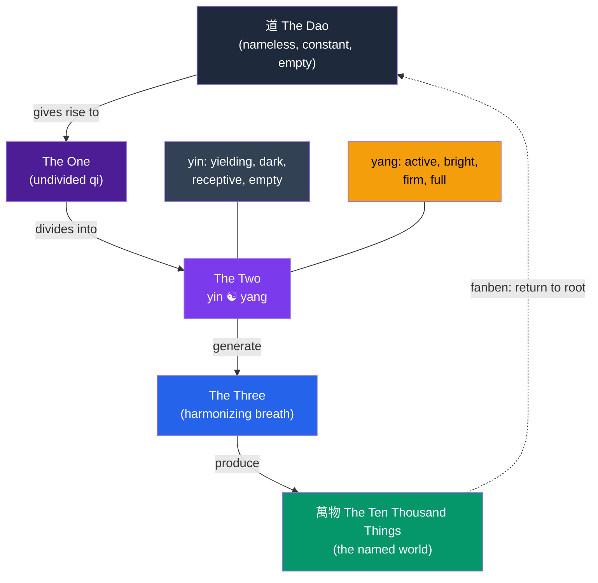

# 🌊 Daoism

> [!abstract] TL;DR
> Daoism (Taoism; Chinese *Daojia*) is the Chinese tradition oriented around the **Dao** — "the Way," the nameless, generative source and pattern of all things. Its two foundational texts are the *Dao De Jing* (attributed to **Laozi**) and the *Zhuangzi*. Its ethical-practical heart is **wu wei** — non-coercive, effortless action that follows the grain of things — and **ziran** (self-so-ness, spontaneity, naturalness). Where Confucians cultivate ritual and social role, Daoists suspect that striving, moralizing, and rigid categories distort our natural flourishing. **Zhuangzi** radicalizes this into a playful skepticism about fixed perspectives (the butterfly dream, the relativity of viewpoints, the usefulness of the useless). Daoism supplied Chinese thought its counter-melody: naturalness against convention, flow against force, emptiness against striving.

## Intuition — analogy first

Watch a skilled swimmer cross a violent river.

A novice fights the current — thrashing, exhausting themselves, and often drowning. The expert does something that looks almost like doing nothing: they read the water, enter where the current helps, go under where a wave would resist, and are carried across using the river's own force. Zhuangzi tells exactly this story (the swimmer at Lü-liang falls): asked his secret, the swimmer says he simply "goes in with the swirl and comes out with the flow, following the way of the water and not imposing myself on it."

That is **wu wei** — often mistranslated "doing nothing," but really *non-coercive, non-forcing action*. It is effort that has become so attuned to the situation's own tendencies (**ziran**, the way things are "of themselves") that it no longer feels like effort. The **Dao** is the river: the total pattern of how things spontaneously go. Wisdom is not conquering the river with a better plan; it is losing the anxious, grasping ego that fights the water, and moving with the Way.

---

## How It Works — Named and Nameless

The *Dao De Jing* opens with a paradox that structures all of Daoist metaphysics: the Dao that can be spoken is not the constant Dao. Reality has a nameless, undifferentiated source and a named, differentiated world of "ten thousand things," and wisdom means returning from grasping differentiation toward the receptive, empty source.

The dotted arrow — *fanben* / *fugui*, "returning to the root" — is the ethical arrow. The sage moves *against* the ordinary direction of grasping toward more distinctions and possessions, back toward the empty, uncarved simplicity (*pu*, the "uncarved block") from which spontaneity flows.

## Key Concepts

### The Dao — "the Way" (道)

The **Dao** is the source, pattern, and process of everything — prior to and greater than any name. It is described through paradox and negation: empty yet inexhaustible, weak yet overcoming the strong (like water, which "wears away rock"), doing nothing yet leaving nothing undone. It is not a personal creator God; it is an impersonal generative order that things participate in by being *ziran* — spontaneously themselves.

### Wu Wei — Effortless / Non-Coercive Action (無為)

**Wu wei** is action without forcing, striving, or artificial contrivance. It is not passivity or literal inaction but *acting in accord with the tendencies of things* so that the action seems effortless and leaves no trace. The sage-ruler governs by *wu wei* — creating conditions in which people flourish "of themselves," rather than micromanaging by law and moral exhortation. Its complement is **wu wei er wu bu wei**: "do nothing, and nothing is left undone."

### Ziran — Naturalness / Self-So-Ness (自然)

**Ziran** literally means "self-so" — the way things are of their own accord, without external compulsion. It is the value *wu wei* respects: let the horse be a horse, the valley be low, the water flow down. Contrivance (*wei*, deliberate artifice) and excessive civilization pull things away from *ziran*; the Daoist ideal is to restore spontaneity.

### Laozi and the *Dao De Jing*

The *Dao De Jing* ("Classic of the Way and Its Power," c. 4th century BCE), attributed to the semi-legendary **Laozi**, is 81 terse, aphoristic, often poetic chapters. Its themes: the ineffability of the Dao, the power of the soft and yielding over the hard, the wisdom of emptiness and non-contention, and a politics of the light-handed ruler. Its style is deliberately paradoxical, resisting the fixing of the Dao in doctrine.

### Zhuangzi and the Relativity of Perspectives

The *Zhuangzi* (attributed to **Zhuang Zhou**, c. 369–286 BCE) is philosophically the more radical text — witty, story-driven, skeptical. Three signature moves:

| Parable | What it dramatizes |
|---|---|
| **The butterfly dream** | Zhuang Zhou dreams he is a butterfly, then wakes unsure whether he is a man who dreamt he was a butterfly or a butterfly now dreaming it is a man. The fixity of the self and the sharp line between states are called into question — "the transformation of things." |
| **The debate on the "this/that" (shi/fei)** | Every judgment of "right/this" and "wrong/that" is made *from a perspective*; monkeys, fish, and humans find different things comfortable, beautiful, or true. There is no view from nowhere to adjudicate — so the sage "lodges in the ordinary" and does not cling to fixed distinctions. |
| **The useless tree** | A gnarled tree is spared the axe *because* it is useless for timber. What convention calls worthless can preserve life; the "usefulness of the useless" reframes value itself. |

Zhuangzi's target is the human addiction to rigid categories — useful/useless, right/wrong, life/death, self/other. Freedom comes from a fluid, unattached responsiveness he calls **free and easy wandering** (*xiaoyao you*).

### Yin and Yang

Not exclusively Daoist, but central to Daoist cosmology: **yin** (yielding, dark, receptive) and **yang** (active, bright, firm) are complementary, interdependent phases of *qi* (vital energy). They are not good-vs-evil but a dynamic polarity whose ceaseless alternation *is* the movement of the Dao. Health and wisdom lie in their balance, and each contains the seed of the other.

## Arguments & Examples

- **The politics of wu wei.** The *Dao De Jing* argues that the more prohibitions, laws, and clever schemes a ruler imposes, the more disorder and cunning evasion result (ch. 57). The sage-ruler "does nothing, and the people transform themselves." This is a direct polemic against both Confucian ritual-activism and Legalist coercion — order arises *bottom-up* from non-interference, not *top-down* from control.

- **The critique of Confucian virtue.** In a famously provocative passage (ch. 18–19), Laozi suggests that conspicuous talk of *ren* and righteousness is a *symptom of decline*: "When the great Dao declined, benevolence and righteousness arose." Where the Way is intact, no one needs to preach virtue; moralizing appears only once natural harmony is lost. This is the sharpest edge of the Daoist–Confucian contrast.

- **Skeptical relativism vs paralysis.** Zhuangzi argues that our value distinctions are perspective-relative, but he does *not* conclude "anything goes" or that we should stop acting. Rather, recognizing the partiality of every viewpoint frees us from anxious dogmatism, letting us respond flexibly — like the master butcher whose blade, after nineteen years, stays sharp because it moves *through the natural gaps* in the ox rather than hacking (the "Cook Ding" story, an image of skill as *wu wei*).

- **Death and the transformation of things.** When Zhuangzi's wife dies, a friend finds him drumming and singing. His explanation: death is one more transformation in the ceaseless flux of *qi*, no more to be grieved than the turn of the seasons. Reconciliation to change, not conquest of it, is the Daoist consolation.

- **Water as the master image.** Daoism repeatedly praises **water**: it benefits all things without contending, seeks the low places people disdain, is utterly soft yet wears down the hard. "The highest good is like water" (ch. 8). Softness overcoming hardness is Daoism's counterintuitive theory of real power.

## Common Pitfalls / Misconceptions

- **"Wu wei means doing nothing / being passive."** It means *non-forcing*, effortless attuned action. The Daoist sage acts constantly — but without strain, contrivance, or ego-driven striving. Cook Ding's blade is always moving.

- **"Daoism is anti-social escapism."** The *Dao De Jing* is in large part a manual for rulers, and Zhuangzi engages deeply with how to live *among* others. The tradition is skeptical of coercive convention, not of human life as such.

- **"Philosophical Daoism = the Daoist religion."** Scholars often distinguish *Daojia* (the philosophical tradition of the *Laozi* and *Zhuangzi*) from *Daojiao* (organized religious Daoism with deities, alchemy, ritual, and immortality practices), which developed later. They overlap and influence each other but are not identical.

- **"Yin is bad, yang is good."** Yin and yang are complementary, morally neutral polarities, each necessary and each containing the seed of the other. Neither is a force of evil.

- **"Laozi definitely wrote the *Dao De Jing*."** Laozi is a semi-legendary figure; most scholars regard the text as a compiled work of the Warring States period rather than the writing of a single historical author.

## Related Concepts

- [[_MOC_Eastern_Philosophy|↑ Section MOC]]
- [[Confucianism]] — The great Chinese counterpoint: ritual, role, and effortful cultivation vs naturalness, spontaneity, and *wu wei*
- [[Buddhist_Philosophy]] — When Buddhism entered China it fused with Daoist vocabulary; *emptiness* resonated with Daoist non-being, producing Chan (Zen)
- [[Comparative_Philosophy_East_and_West]] — Zhuangzi's perspectival skepticism compared with Western skepticism and relativism
- Cross-vault: [[Skepticism]] — Zhuangzi as a distinctively Chinese skeptic about fixed knowledge and value
- Cross-vault: [[_MOC_Mythology_Master]] — Daoist immortals, cosmology, and the mythic figure of Laozi

## Review Questions

1. Define *wu wei* precisely, and explain why translating it "doing nothing" is misleading. Use the Cook Ding or Lü-liang swimmer story to illustrate what non-coercive action actually looks like.
2. Reconstruct Zhuangzi's argument from the relativity of perspectives (the "this/that" debate and the butterfly dream). Does it lead to "anything goes"? Explain how Zhuangzi avoids that conclusion.
3. In *Dao De Jing* ch. 18–19, Laozi treats talk of benevolence and righteousness as a symptom of decline. Explain this critique and how it sharpens the contrast between Daoism and [[Confucianism]].

## Sources

- Laozi, *Dao De Jing*, trans. D. C. Lau (Penguin Classics)
- Zhuangzi, *The Complete Works of Zhuangzi*, trans. Burton Watson (Columbia University Press)
- Hansen, Chad (1992). *A Daoist Theory of Chinese Thought*. Oxford University Press
- Kohn, Livia (2009). *Introducing Daoism*. Routledge

#philosophy #eastern-philosophy #daoism #wu-wei #zhuangzi
