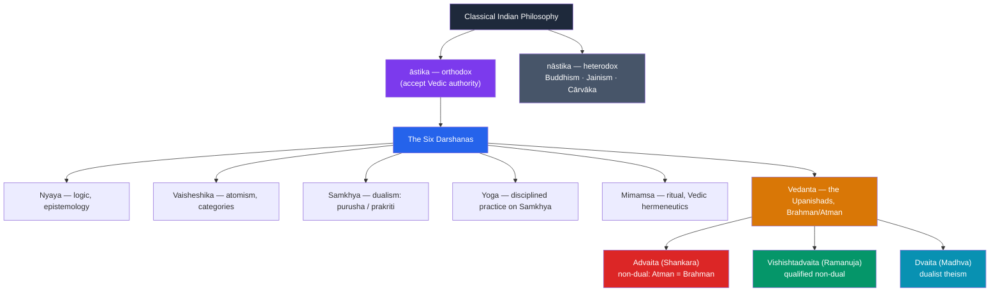

# 🕉️ Hindu Philosophy and Vedanta

> [!abstract] TL;DR
> "Hindu philosophy" names the classical Indian schools (*darśanas*, "viewpoints") that accept the authority of the **Vedas** — traditionally counted as **six orthodox schools**: **Nyaya** (logic/epistemology), **Vaisheshika** (atomistic metaphysics), **Samkhya** (dualist enumeration of reality), **Yoga** (disciplined practice), **Mimamsa** (ritual/hermeneutics), and **Vedanta** ("the end of the Vedas"). The most philosophically dominant is **Vedanta**, rooted in the **Upanishads**, which teaches that the ground of reality is **Brahman** (the absolute) and the innermost self is **Atman** — captured in the great saying *tat tvam asi*, "that thou art." Vedanta itself divides: **Shankara's Advaita** (non-dualism) holds Atman *is* Brahman, one without a second, the plural world being *māyā*; **Ramanuja's Vishishtadvaita** (qualified non-dualism) holds a real distinction of devoted selves within the one God. Overarching it all: **karma** (moral causation), **samsara** (the cycle of rebirth), and **moksha** (liberation) — the release the whole enterprise seeks.

## Intuition — analogy first

Imagine waves on the ocean asking, "What am I?"

A wave has a shape, a crest, a lifespan; it seems a distinct thing that rises, travels, and crashes. But its whole reality is *water* — there is not water *plus* a wave; the wave is just water in a temporary form. When the wave subsides, nothing is destroyed; the water was never anything but water the whole time. The wave's sense of being a separate, bounded individual was real *as an appearance* but mistaken *as ultimate*.

This is the intuition behind Advaita Vedanta. You experience yourself as a separate self (*jīva*), bounded by a body and a biography, striving and suffering. But your innermost reality — **Atman** — is not a separate droplet; it is identical with **Brahman**, the one ocean of pure being-consciousness that is all there ultimately is. Liberation (**moksha**) is not *becoming* Brahman (you already are it) but *waking up* to what was always the case, dispelling the ignorance (*avidyā*) that made the wave forget it was ocean. *Tat tvam asi* — "that thou art": the reality "out there" and the self "in here" are one.

---

## How It Works — The Landscape of the Darshanas

Indian philosophy is first sorted by attitude to the Vedas — **āstika** (orthodox, Veda-accepting) vs **nāstika** (heterodox: Buddhism, Jainism, Cārvāka materialism). Within the orthodox, six schools crystallized into three traditionally paired sets, with Vedanta itself branching into rival sub-schools.

## Key Concepts

### The Six Orthodox Darshanas

| Darshana | Core concern | Signature idea |
|---|---|---|
| **Nyaya** | Logic & epistemology | Theory of *pramāṇas* (valid means of knowledge): perception, inference, comparison, testimony; realist, God-inclusive |
| **Vaisheshika** | Metaphysics | Reality analyzed into categories (*padārtha*) and irreducible **atoms** (*aṇu*) — an early atomism |
| **Samkhya** | Metaphysical dualism | Two ultimate principles: **purusha** (pure consciousness, plural, inactive) and **prakriti** (unconscious primordial matter/nature); liberation = discriminating the two |
| **Yoga** | Disciplined practice | Patañjali's *Yoga Sutras*: the eight limbs (*ashtanga*) to still the mind (*citta-vṛtti-nirodha*) and realize *purusha*; shares Samkhya's metaphysics but adds *Ishvara* (a special God) |
| **Mimamsa** | Ritual & hermeneutics | Interpretation of Vedic ritual injunction; rigorous philosophy of language and *dharma* as duty |
| **Vedanta** | The Upanishads | Nature of **Brahman**, **Atman**, and their relation; the most influential school |

*(Samkhya and Yoga, and Nyaya and Vaisheshika, are the classic "allied pairs"; Mimamsa and Vedanta share a focus on Vedic texts — the earlier ritual portion vs the concluding wisdom portion.)*

### Brahman and Atman

- **Brahman** — the ultimate, unconditioned reality: the ground and source of all, often characterized as *sat-cit-ānanda* (being–consciousness–bliss). In its highest sense it is *nirguṇa* (without qualities), beyond all predication ("not this, not this" — *neti neti*).
- **Atman** — the innermost self, pure consciousness, the witness behind the changing body, senses, and thoughts.
- The **great sayings (mahāvākyas)** of the Upanishads assert their identity: *tat tvam asi* ("that thou art," *Chandogya*), *ayam ātmā brahma* ("this self is Brahman"), *aham brahmāsmi* ("I am Brahman").

### Karma, Samsara, and Moksha

- **Karma** — the moral law of cause and effect: intentional action leaves dispositions that bear fruit, shaping this and future lives.
- **Samsara** — the beginningless cycle of birth, death, and rebirth (*reincarnation*) driven by karma and ignorance.
- **Moksha** — liberation, the ultimate goal (*puruṣārtha*): release from *samsara* through knowledge (*jñāna*), devotion (*bhakti*), or disciplined action (*karma yoga*). For Advaita, *moksha* is the realization of one's identity with Brahman.

### Advaita vs Vishishtadvaita

| | **Advaita** (Shankara, c. 700 CE) | **Vishishtadvaita** (Ramanuja, c. 1017–1137) |
|---|---|---|
| Name | "Non-dualism" | "Qualified non-dualism" |
| Ultimate reality | *Nirguṇa* Brahman — one without a second; pure impersonal consciousness | *Saguṇa* Brahman — a personal God (Vishnu/Narayana) with real attributes |
| Status of the world | *Māyā* / *vivarta* — a real-seeming appearance superimposed on Brahman by ignorance | Fully **real**; the world and souls are the "body" of God |
| Self and God | Atman is *numerically identical* with Brahman; individuality is ultimately illusory | Selves are real, distinct **modes** (*prakāra*) of God — dependent but not identical |
| Path to *moksha* | **Knowledge** (*jñāna*): dispelling ignorance | **Devotion** (*bhakti*) and surrender (*prapatti*) to a loving God |
| Analogy | Rope mistaken for a snake; space in a jar vs infinite space | Body–soul unity; sparks of one fire |

**Madhva's Dvaita** (13th c.) pushes further to outright *dualism*: God, souls, and matter are all eternally, really distinct. The three schools form a spectrum from strict monism to theistic pluralism, all reading the same Upanishads.

### The Upanishads

The **Upanishads** (composed c. 800–200 BCE) are the concluding philosophical portions of the Vedas — hence *Vedānta*, "the end of the Vedas." Dialogical and aphoristic, they shift Indian thought from ritual sacrifice toward inward inquiry into the self and the absolute, supplying the raw material every Vedanta school interprets. With the *Bhagavad Gita* and the *Brahma Sutras* they form the "triple foundation" (*prasthānatrayī*) each Vedantic teacher must comment upon.

## Arguments & Examples

- **Shankara's rope-and-snake (the logic of superimposition).** In dim light you mistake a coiled rope for a snake and recoil in fear. The snake was never real — but the *error* had real effects until you saw clearly. Shankara argues the plural world of separate selves and objects is likewise a **superimposition (*adhyāsa*)** on the one Brahman, produced by *avidyā* (ignorance). Nothing is *created* and nothing *destroyed* at liberation; false perception is simply corrected. This defends non-dualism against the objection "but the world obviously exists" — it exists *conventionally* (like the seen snake), not *ultimately*.

- **The two-level (vyāvahārika / pāramārthika) response.** To the charge that Advaita cannot explain everyday life, Shankara distinguishes the **empirical level** (*vyāvahārika*), where the world, God as creator (*saguṇa* Brahman/*Ishvara*), and ordinary causation are all valid, from the **absolute level** (*pāramārthika*), where only *nirguṇa* Brahman is real. Both are affirmed at their proper level. (Compare the Buddhist two truths in [[Buddhist_Philosophy]].)

- **Ramanuja's critique of *māyā*.** Ramanuja objects that treating the world and the self's individuality as illusory is both scripturally strained and devotionally fatal: if the worshipper is ultimately identical with God, love and grace lose their object. He reads *tat tvam asi* as asserting *inseparability* (soul as God's body), not identity — preserving a real God who can be loved and a real self who can love. This grounds the whole *bhakti* devotional tradition.

- **The Samkhya argument for two principles.** Samkhya argues from the presence of experience: unconscious matter (*prakriti*) can be *arranged* but cannot *witness*; there must be a distinct principle of pure awareness (*purusha*) for which nature's transformations appear. Suffering arises from *purusha* wrongly identifying with *prakriti* (mistaking the witnessed for the witness); liberation is the discriminative knowledge that separates them. This dualism deeply shaped Yoga and, by contrast, sharpened Vedantic monism.

- **Nyaya's inference schema.** Nyaya formalized inference (*anumāna*) into a five-membered syllogism ("There is fire on the hill; because there is smoke; wherever smoke, there fire, as in a kitchen; this hill has smoke; therefore fire"), building one of the world's most sophisticated logical-epistemological traditions — evidence that "Eastern philosophy" includes rigorous analytic logic, not only mysticism.

## Common Pitfalls / Misconceptions

- **"Hinduism has one philosophy."** There is no single "Hindu philosophy": there are *six* orthodox schools that disagree sharply (dualist Samkhya vs monist Advaita vs pluralist Dvaita), plus heterodox rivals. "Hindu philosophy" is a family of debates, not a doctrine.

- **"Advaita and Buddhism are the same because both deny the individual self."** They are historic *rivals*. Advaita affirms a real, eternal Self (**Atman = Brahman**); Buddhism *denies* any permanent self (**anatta**). Shankara was sometimes accused of "crypto-Buddhism" precisely because opponents saw the resemblance — but the disagreement over Atman is fundamental. See [[Buddhist_Philosophy]].

- **"Māyā means the world is a hallucination that doesn't exist."** In Advaita, *māyā* / the world is *not* non-existent (that would be like a "barren woman's son"); it is *mithyā* — real-seeming and empirically valid, but not *ultimately* real. It has a middle status between the real and the utterly unreal.

- **"Karma is fate / punishment."** Karma is impersonal moral causation, not a cosmic judge doling out punishment, and it does not entail fatalism — action now shapes future outcomes, so it grounds moral responsibility rather than removing it.

- **"Vedanta is otherworldly quietism."** The *Bhagavad Gita*, a core Vedanta text, teaches **karma yoga** — disciplined action in the world performed without attachment to results — as itself a path to liberation.

## Related Concepts

- [[_MOC_Eastern_Philosophy|↑ Section MOC]]
- [[Buddhist_Philosophy]] — The great heterodox rival born in the same milieu; *anatta* directly denies the Vedantic *Atman*, making this the pivotal Indian debate
- [[Comparative_Philosophy_East_and_West]] — Brahman/Atman monism and the self set against Western substance metaphysics
- [[Daoism]] — Another non-Western monism of an impersonal absolute (the Dao), useful for comparison
- Cross-vault: [[_MOC_Mythology_Master]] — The Vedic and Puranic mythology, the deities, and the cosmology in which these ideas are embedded
- Cross-vault: [[Personal_Identity]] — The Atman as the persisting witness-self contrasts with Western and Buddhist accounts

## Review Questions

1. Name the six orthodox *darśanas* and give the core concern of each. Why is Vedanta the most philosophically influential, and what does "*Vedanta*" literally mean?
2. Explain *tat tvam asi* and how Shankara's Advaita interprets it. Use the rope-and-snake analogy and the two-level (empirical/absolute) distinction to show how Advaita can affirm the everyday world while denying its ultimate reality.
3. Contrast Advaita and Vishishtadvaita on the reality of the world, the relation of self to God, and the path to *moksha*. Why does Ramanuja think Shankara's *māyā* is fatal to devotion (*bhakti*)?

## Sources

- *The Principal Upanishads*, ed. & trans. S. Radhakrishnan (HarperCollins)
- Shankara, *Brahma Sutra Bhāṣya*, trans. Swami Gambhirananda (Advaita Ashrama)
- Hiriyanna, M. (1949/1995). *The Essentials of Indian Philosophy*. Motilal Banarsidass
- King, Richard (1999). *Indian Philosophy: An Introduction to Hindu and Buddhist Thought*. Edinburgh University Press

#philosophy #eastern-philosophy #hindu-philosophy #vedanta #brahman-atman
