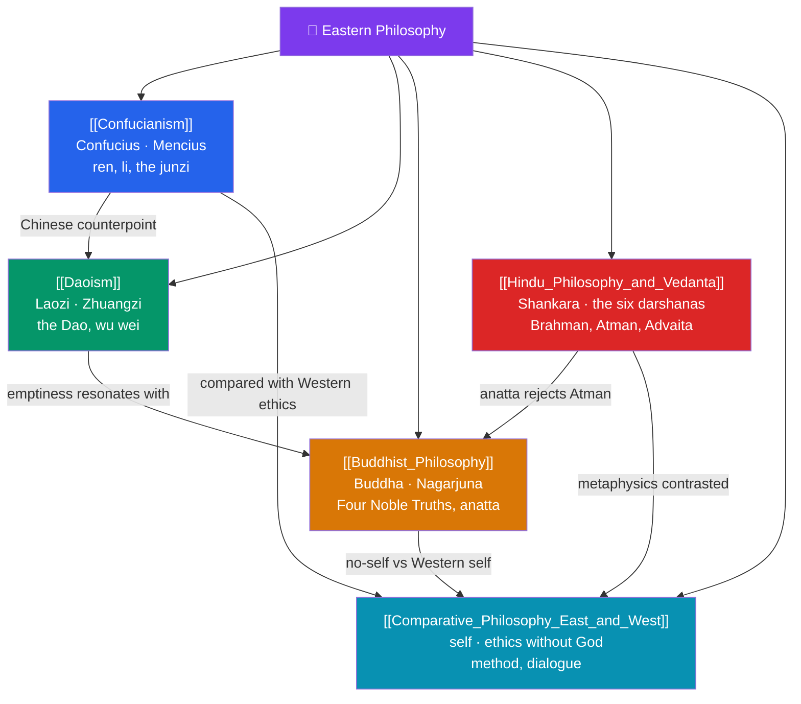

# 🗺️ Eastern Philosophy — Map of Content

> [!abstract] What This Section Covers
> The great philosophical traditions of Asia developed rigorous accounts of self, reality, and the good life largely independent of the Greek line. **Confucianism** builds an ethics of relationship and character around *ren* (humaneness), *li* (ritual propriety), and the *junzi* (exemplary person), extended by Mencius' claim that human nature is good; **Daoism** counsels harmony with the *Dao* and effortless action (*wu wei*), from the aphorisms of Laozi to the playful paradoxes of Zhuangzi; **Buddhist Philosophy** analyzes suffering through the Four Noble Truths, the doctrines of no-self (*anatta*) and dependent origination, and Nagarjuna's philosophy of emptiness; **Hindu Philosophy and Vedanta** surveys the six orthodox *darshanas* and the identity of *Atman* and *Brahman* in Advaita; and **Comparative Philosophy East and West** brings the traditions into dialogue on method, the self, and ethics without a commanding God. Five notes opening the conversation between hemispheres of thought.

## Concept Map

## Learning Path

1. [[Confucianism]] — *Ren*, *li*, filial piety, the rectification of names, the *junzi*, and Mencius on the goodness of human nature.
2. [[Daoism]] — The *Dao* that cannot be named, *wu wei*, naturalness (*ziran*), and Zhuangzi's relativizing parables.
3. [[Buddhist_Philosophy]] — The Four Noble Truths, the Eightfold Path, impermanence, *anatta*, dependent origination, and Nagarjuna's emptiness.
4. [[Hindu_Philosophy_and_Vedanta]] — The six *darshanas*, karma and *moksha*, *Brahman* and *Atman*, and Shankara's non-dual Advaita.
5. [[Comparative_Philosophy_East_and_West]] — Methods of inquiry, competing conceptions of the self, and ethics grounded without a legislating God.

## All Notes at a Glance

| Note | Difficulty | What You'll Learn |
|------|------------|-------------------|
| [[Confucianism]] | Beginner → Intermediate | Ren, li, filial piety, the junzi, rectification of names, Mencius vs Xunzi on human nature |
| [[Daoism]] | Beginner → Intermediate | The Dao, wu wei, ziran, the *Daodejing*, Zhuangzi's paradoxes, the butterfly dream |
| [[Buddhist_Philosophy]] | Intermediate | Four Noble Truths, Eightfold Path, anicca, anatta, dependent origination, Nagarjuna, emptiness |
| [[Hindu_Philosophy_and_Vedanta]] | Intermediate → Advanced | The six darshanas, karma, samsara, moksha, Brahman/Atman, Advaita non-dualism |
| [[Comparative_Philosophy_East_and_West]] | Intermediate | Cross-cultural method, the self, ethics without God, dialogue between traditions |

## Key Questions This Section Answers

- How does Confucian ethics locate the good life in relationships and ritual rather than rules alone?
- What is *wu wei*, and how can "effortless action" be a way of mastering life?
- If there is no permanent self (*anatta*), what is reborn and who attains liberation?
- What does it mean for Advaita Vedanta to say *Atman* is identical with *Brahman*?
- Can Eastern and Western philosophy be compared, or do their frameworks talk past each other?

## Related Sections

- [[_MOC_Philosophy_Master|↑ Philosophy Master MOC]]
- [[_MOC_Philosophy_of_Science|← Philosophy of Science]]
- Cross-vault: [[_MOC_Mythology_Master]] (Hindu, Buddhist, Daoist traditions), [[_MOC_History_Master]] (ancient China & India), [[Personal_Identity]] (no-self vs continuity)

#MOC #Philosophy #EasternPhil
