# 🦉 Philosophy — Master Map of Content

> [!abstract] About This Vault
> Philosophy is the polymath's **keystone** — the discipline that asks what the others assume. This vault covers **~67 notes across 13 sections**, organised three ways at once: a **historical** spine (ancient Greek → Hellenistic → medieval → early modern → 19th–20th century), the **core branches** (metaphysics, epistemology, ethics, philosophy of mind, political philosophy, philosophy of science), and the great **non-Western traditions** (Confucianism, Daoism, Buddhist and Hindu philosophy). It opens with a toolkit — arguments, logic, and fallacies — that pays off in every other vault. Cross-linked to [[_MOC_Psychology_Master]] (mind), [[_MOC_Mathematics_Master]] (logic), [[_MOC_Physics_Master]] (science & metaphysics), [[_MOC_History_Master]] (history of ideas), and [[_MOC_AI_ML_Master]] (minds, machines, ethics). Start with the toolkit, follow the historical arc, or dive into a branch.

> [!success] Vault complete
> All **13 sections** and **67 concept notes** are fully written — plus the master map and all 13 section maps. Every note is built from the `Technical_Concept` template with a Mermaid diagram, key positions and thinkers, arguments and objections, and review questions. Completed 2026-07-30. See [[_Vault_Expansion_Roadmap]].

## Vault Architecture

```mermaid
graph TD
    Master["🦉 Philosophy Master"]

    Master --> F["<b>FOUNDATIONS</b>"]
    Master --> H["<b>HISTORY</b>"]
    Master --> B["<b>CORE BRANCHES</b>"]
    Master --> T["<b>TRADITIONS</b>"]

    F --> S01["01 · Introduction & Logic"]

    H --> S02["02 · Ancient Greek"]
    H --> S03["03 · Hellenistic & Roman"]
    H --> S04["04 · Medieval"]
    H --> S05["05 · Early Modern"]
    H --> S06["06 · 19th–20th Century"]

    B --> S07["07 · Metaphysics"]
    B --> S08["08 · Epistemology"]
    B --> S09["09 · Ethics"]
    B --> S10["10 · Philosophy of Mind"]
    B --> S11["11 · Political Philosophy"]
    B --> S12["12 · Philosophy of Science"]

    T --> S13["13 · Eastern Philosophy"]

    style Master fill:#7c3aed,color:#fff
    style F fill:#2563eb,color:#fff
    style H fill:#b45309,color:#fff
    style B fill:#059669,color:#fff
    style T fill:#dc2626,color:#fff
```

## Sections at a Glance

| # | Section | Notes | Entry Point | Kind |
|---|---------|:-----:|-------------|------|
| 01 | Introduction & Logic | 5 | [[_MOC_Phil_Introduction]] | Toolkit |
| 02 | Ancient Greek Philosophy | 5 | [[_MOC_Ancient_Greek_Philosophy]] | History |
| 03 | Hellenistic & Roman | 4 | [[_MOC_Hellenistic_Roman_Philosophy]] | History |
| 04 | Medieval Philosophy | 5 | [[_MOC_Medieval_Philosophy]] | History |
| 05 | Early Modern Philosophy | 5 | [[_MOC_Early_Modern_Philosophy]] | History |
| 06 | 19th & 20th Century | 6 | [[_MOC_Modern_Contemporary_Philosophy]] | History |
| 07 | Metaphysics | 6 | [[_MOC_Metaphysics]] | Branch |
| 08 | Epistemology | 5 | [[_MOC_Epistemology]] | Branch |
| 09 | Ethics | 6 | [[_MOC_Ethics]] | Branch |
| 10 | Philosophy of Mind | 5 | [[_MOC_Philosophy_of_Mind]] | Branch |
| 11 | Political Philosophy | 5 | [[_MOC_Political_Philosophy]] | Branch |
| 12 | Philosophy of Science | 5 | [[_MOC_Philosophy_of_Science]] | Branch |
| 13 | Eastern Philosophy | 5 | [[_MOC_Eastern_Philosophy]] | Traditions |

---

## Learning Paths

### Path 1 — The Historical Arc

> Best for: seeing philosophy as a 2,500-year conversation, each thinker answering the last.

[[_MOC_Phil_Introduction]] → [[Socrates_and_the_Socratic_Method]] → [[Plato_and_the_Theory_of_Forms]] → [[Aristotle]] → [[Stoicism]] → [[Aquinas_and_Scholasticism]] → [[Descartes_and_Rationalism]] → [[British_Empiricism]] → [[Kant_and_the_Copernican_Turn]] → [[Nietzsche]] → [[Analytic_and_Continental_Philosophy]]

---

### Path 2 — The Big Questions (Core Branches)

> Best for: readers who want the problems, not the chronology — what can I know, what should I do, what is real?

[[What_Is_Knowledge]] → [[The_Gettier_Problem]] → [[What_Is_Metaphysics]] → [[Free_Will_and_Determinism]] → [[Personal_Identity]] → [[What_Is_Ethics]] → [[Consequentialism_and_Utilitarianism]] → [[Virtue_Ethics]] → [[The_Mind_Body_Problem]] → [[Consciousness_and_the_Hard_Problem]]

---

### Path 3 — Philosophy for Scientists & Engineers

> Best for: readers from the technical vaults — logic, scientific method, and the philosophy of mind behind AI.

[[Arguments_and_Logic]] → [[Logical_Fallacies]] → [[The_Problem_of_Induction]] → [[Popper_and_Falsification]] → [[Kuhn_and_Scientific_Revolutions]] → [[Scientific_Realism]] → [[Functionalism_and_Machine_Minds]] → [[Consciousness_and_the_Hard_Problem]] → [[Applied_Ethics]]

---

### Path 4 — Ethics & the Good Life

> Best for: the practical payoff — how to live, act, and organise a just society.

[[What_Is_Ethics]] → [[Virtue_Ethics]] → [[Stoicism]] → [[Consequentialism_and_Utilitarianism]] → [[Deontology_and_Kantian_Ethics]] → [[Metaethics]] → [[The_Social_Contract]] → [[Justice_and_Rawls]] → [[Confucianism]]

---

## Cross-Vault Links

- **[[_MOC_Psychology_Master]]** — [[The_Mind_Body_Problem]] and [[Consciousness_and_the_Hard_Problem]] are where philosophy of mind meets cognitive science; ethics meets [[Cognitive_Biases]].
- **[[_MOC_Mathematics_Master]]** — [[Arguments_and_Logic]] is the informal face of formal logic; philosophy of mathematics lives between the two.
- **[[_MOC_Physics_Master]]** — [[What_Is_Metaphysics]], [[Time_and_Existence]], and [[_MOC_Philosophy_of_Science|philosophy of science]] interpret what physics discovers.
- **[[_MOC_AI_ML_Master]]** — [[Functionalism_and_Machine_Minds]] and [[Applied_Ethics]] frame the deepest questions about artificial minds.
- **[[_MOC_History_Master]]** — [[_MOC_History_of_Science|history of science]] and the Enlightenment are the historical body to philosophy's ideas.
- **[[_MOC_Mythology_Master]]** — [[Jungian_Archetypes_and_Myth]] and Eastern philosophy meet in questions of meaning and the self.

---

## Section MOC Index

- [[_MOC_Phil_Introduction]] — The toolkit: what philosophy is, its branches, arguments, logic, and fallacies.
- [[_MOC_Ancient_Greek_Philosophy]] — The Presocratics, Socrates, Plato, and Aristotle.
- [[_MOC_Hellenistic_Roman_Philosophy]] — Stoicism, Epicureanism, Skepticism, and Neoplatonism.
- [[_MOC_Medieval_Philosophy]] — Augustine, Islamic and Jewish thought, Aquinas, and faith vs reason.
- [[_MOC_Early_Modern_Philosophy]] — Rationalists, empiricists, and Kant's synthesis.
- [[_MOC_Modern_Contemporary_Philosophy]] — Hegel to Nietzsche, pragmatism, and the analytic/continental split.
- [[_MOC_Metaphysics]] — Being, free will, personal identity, universals, time, and causation.
- [[_MOC_Epistemology]] — Knowledge, justification, Gettier, and skepticism.
- [[_MOC_Ethics]] — Consequentialism, deontology, virtue ethics, metaethics, and applied ethics.
- [[_MOC_Philosophy_of_Mind]] — The mind–body problem, consciousness, and machine minds.
- [[_MOC_Political_Philosophy]] — The social contract, liberty, justice, and the state.
- [[_MOC_Philosophy_of_Science]] — Induction, falsification, paradigms, and realism.
- [[_MOC_Eastern_Philosophy]] — Confucianism, Daoism, Buddhist and Hindu philosophy.

#MOC #Philosophy #MasterMOC
