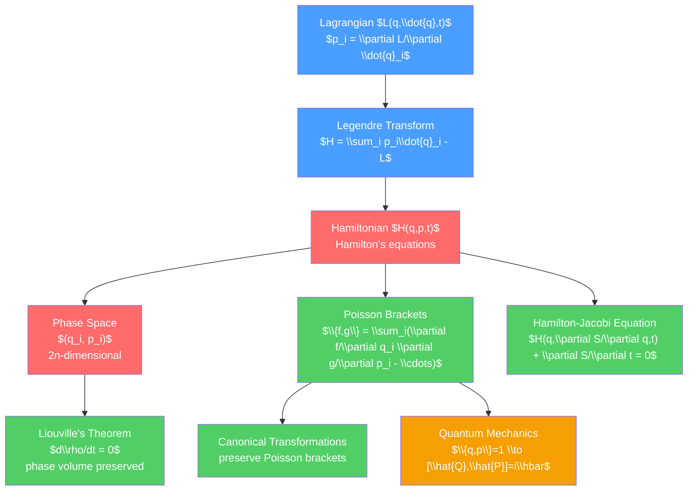

# 🌐 Hamiltonian Mechanics

> [!abstract] TL;DR
> Hamiltonian mechanics reformulates classical mechanics in phase space — the space of all positions $q$ and momenta $p$ — where dynamics becomes a flow generated by the Hamiltonian $H(q,p,t)$. Hamilton's equations ($\dot{q}_i = \partial H/\partial p_i$, $\dot{p}_i = -\partial H/\partial q_i$) encode the same physics as Euler-Lagrange but reveal deep geometric structure: phase space volume is conserved (Liouville's theorem), canonical transformations preserve the Poisson bracket algebra, and the Hamilton-Jacobi equation connects classical mechanics to wave optics — and directly to quantum mechanics through Dirac's quantization rule $\{q,p\} \to [\hat{Q},\hat{P}] = i\hbar$.

## Intuition — analogy FIRST

Think of the weather forecast. At any moment, the entire atmosphere is described by a point in a huge "state space" — temperature, pressure, humidity, wind speed at every location. The laws of fluid dynamics tell you how this point moves through state space over time. Two nearby points (slightly different initial weather) may diverge rapidly (weather chaos) or stay together (predictable fronts).

Hamiltonian mechanics does exactly this for mechanical systems. Phase space is the complete state space: a system of $N$ particles in 3D has a $6N$-dimensional phase space. Each point $(q_1,\ldots,q_n,p_1,\ldots,p_n)$ completely specifies the current state, and Hamilton's equations determine how this point flows through phase space — deterministically, like an incompressible fluid (Liouville's theorem).

---

## How It Works



---

## Key Concepts / Details

### Undergraduate Level

**Legendre Transform: Lagrangian to Hamiltonian**

Given $L(q_i, \dot{q}_i, t)$, define conjugate momenta:

$$p_i = \frac{\partial L}{\partial \dot{q}_i}$$

Invert to get $\dot{q}_i = \dot{q}_i(q, p, t)$. The Hamiltonian is:

$$H(q_i, p_i, t) = \sum_i p_i\dot{q}_i - L$$

For a natural system (kinetic energy quadratic in $\dot{q}$, potential $V(q)$ only): $H = T + V$ = total energy.

**Hamilton's Equations**

The equation of motion in phase space:

$$\dot{q}_i = \frac{\partial H}{\partial p_i}, \qquad \dot{p}_i = -\frac{\partial H}{\partial q_i}$$

These are $2n$ first-order ODEs (vs $n$ second-order Euler-Lagrange equations). The symmetry between $q$ and $p$ is striking.

**Energy Conservation**: if $H$ has no explicit $t$ dependence, $dH/dt = \partial H/\partial t = 0$: energy is conserved.

**Example: 1D Harmonic Oscillator**

$H = p^2/(2m) + \tfrac{1}{2}m\omega_0^2 q^2$

Hamilton's equations: $\dot{q} = p/m$, $\dot{p} = -m\omega_0^2 q$.

Phase space trajectories: ellipses $\dfrac{p^2}{2mE} + \dfrac{q^2}{2E/m\omega_0^2} = 1$.

**Example: Central Force Problem**

For $H = (p_r^2 + p_\theta^2/r^2 + p_\phi^2/r^2\sin^2\theta)/(2m) + V(r)$, $\phi$ is cyclic so $p_\phi = L_z$ is conserved. $\theta$ can be chosen in the equatorial plane ($\theta = \pi/2$, $p_\theta = 0$), reducing to 1D problem in $r$ with effective potential.

### Graduate Level

**Liouville's Theorem**

The phase space density $\rho(q,p,t)$ of an ensemble of systems obeys:

$$\frac{d\rho}{dt} = \frac{\partial\rho}{\partial t} + \{\rho, H\} = 0$$

Equivalently, phase space flow is incompressible: $\sum_i\left(\partial\dot{q}_i/\partial q_i + \partial\dot{p}_i/\partial p_i\right) = 0$ (since $\partial^2 H/\partial q_i\partial p_i = \partial^2 H/\partial p_i\partial q_i$).

Physical consequence: phase space volume elements are conserved under Hamiltonian flow. This is the mechanical underpinning of statistical mechanics — it justifies treating an ensemble of systems with equal probability in any region of equal phase space volume (microcanonical ensemble). See [[Classical_Statistical_Mechanics]].

**Poisson Brackets**

For any two functions $f(q,p)$ and $g(q,p)$:

$$\{f, g\} = \sum_i\left(\frac{\partial f}{\partial q_i}\frac{\partial g}{\partial p_i} - \frac{\partial f}{\partial p_i}\frac{\partial g}{\partial q_i}\right)$$

Key properties:
- Antisymmetry: $\{f,g\} = -\{g,f\}$
- Linearity: $\{af+bg, h\} = a\{f,h\} + b\{g,h\}$
- Leibniz rule: $\{fg, h\} = f\{g,h\} + g\{f,h\}$
- Jacobi identity: $\{f,\{g,h\}\} + \{g,\{h,f\}\} + \{h,\{f,g\}\} = 0$

Fundamental Poisson brackets: $\{q_i, p_j\} = \delta_{ij}$, $\{q_i, q_j\} = 0$, $\{p_i, p_j\} = 0$.

Time evolution: $\dot{f} = \partial f/\partial t + \{f, H\}$. A quantity $f$ is conserved iff $\{f, H\} = 0$ (and $f$ has no explicit $t$ dependence).

**Canonical Transformations**

A transformation $(q, p) \to (Q, P)$ is canonical if it preserves the Poisson bracket structure:

$$\{Q_i, P_j\}_{q,p} = \delta_{ij}$$

Equivalently, canonical transformations preserve the symplectic 2-form $\omega = \sum_i dq_i \wedge dp_i$.

**Generating Functions**: four types ($F_1(q,Q)$, $F_2(q,P)$, $F_3(p,Q)$, $F_4(p,P)$) relate old and new variables. The identity transformation uses $F_2 = \sum_i q_i P_i$.

**Action-Angle Variables**

For integrable systems (as many conserved quantities as degrees of freedom), choose canonical transformation to action-angle variables $(J_i, \theta_i)$ where:

$$J_i = \frac{1}{2\pi}\oint p_i\, dq_i \quad \text{(action)}$$

In these variables, $H = H(J)$ only, so $\dot{J}_i = 0$ (actions are conserved) and $\dot{\theta}_i = \partial H/\partial J_i = \omega_i(J)$ (angles increase linearly). The system is solved!

**Hamilton-Jacobi Equation**

The canonical transformation generated by Hamilton's principal function $S(q, \alpha, t)$ (where $\alpha_i$ are new constant momenta) satisfies:

$$H\left(q_i, \frac{\partial S}{\partial q_i}, t\right) + \frac{\partial S}{\partial t} = 0$$

This is the Hamilton-Jacobi equation — a first-order PDE. Its solution $S$ encodes the complete solution to the mechanical problem. For a time-independent $H$: $S = W(q) - Et$ where $W$ satisfies the time-independent HJ equation:

$$H\left(q_i, \frac{\partial W}{\partial q_i}\right) = E$$

**Connection to Quantum Mechanics (Dirac Quantization)**

The remarkable structural identity between Poisson brackets and quantum commutators:

$$\text{Classical: } \{f, g\} \longleftrightarrow \text{Quantum: } \frac{1}{i\hbar}[\hat{f}, \hat{g}]$$

Explicitly: $\{q_i, p_j\} = \delta_{ij} \implies [\hat{Q}_i, \hat{P}_j] = i\hbar\delta_{ij}$

This is Dirac's canonical quantization procedure. The Hamiltonian becomes the quantum Hamiltonian operator $\hat{H}$, and Hamilton's equations become Heisenberg's equations of motion.

**Symplectic Geometry**

Hamiltonian mechanics lives naturally on a *symplectic manifold*: a $2n$-dimensional manifold with a closed, non-degenerate 2-form $\omega = \sum_i dp_i \wedge dq_i$. Canonical transformations are symplectomorphisms (diffeomorphisms preserving $\omega$). This geometric perspective unifies Hamiltonian mechanics and connects to modern mathematical physics.

```python
import numpy as np
import matplotlib.pyplot as plt
from scipy.integrate import odeint

# Phase space portrait: 1D harmonic oscillator + pendulum comparison
omega0 = 1.0

def pendulum_rhs(state, t):
    q, p = state
    return [p, -np.sin(q)]  # H = p^2/2 - cos(q), using m=1

# Generate phase space trajectories
fig, (ax1, ax2) = plt.subplots(1, 2, figsize=(12, 5))

# Harmonic oscillator ellipses
for E in [0.5, 1.0, 2.0, 3.5]:
    theta = np.linspace(0, 2*np.pi, 300)
    q = np.sqrt(2*E) * np.cos(theta)
    p = np.sqrt(2*E) * np.sin(theta)
    ax1.plot(q, p, lw=1.5)
ax1.set_xlabel('q'), ax1.set_ylabel('p')
ax1.set_title('Harmonic Oscillator Phase Space')
ax1.set_aspect('equal')

# Pendulum: show separatrix and libration/rotation
q_arr = np.linspace(-4, 4, 400)
p_arr = np.linspace(-3, 3, 300)
Q, P = np.meshgrid(q_arr, p_arr)
H_pendulum = 0.5 * P**2 - np.cos(Q)
ax2.contour(Q, P, H_pendulum, levels=[-0.9, -0.5, 0, 0.5, 1.0, 2.0, 4.0],
            cmap='viridis')
# Separatrix at H=1
ax2.contour(Q, P, H_pendulum, levels=[1.0], colors='red', linewidths=2)
ax2.set_xlabel('q (angle)'), ax2.set_ylabel('p (angular momentum)')
ax2.set_title('Pendulum Phase Space (red = separatrix)')
ax2.set_aspect('equal')

plt.tight_layout()
plt.savefig('phase_space.png', dpi=150)
```

---

## Real-World Notes

- **Statistical mechanics**: Liouville's theorem is the cornerstone — it shows phase space "fluid" is incompressible, justifying uniform probability on energy shells (microcanonical ensemble). See [[Classical_Statistical_Mechanics]].
- **Accelerator physics**: canonical transformations (optics of charged beams) are described by symplectic matrices; phase space emittance (area of the beam's phase space cross-section) is conserved by Liouville's theorem.
- **Quantum chaos**: the transition from classical integrable to chaotic Hamiltonians has quantum signatures (level spacing statistics, scarring) studied via semiclassical mechanics (WKB, periodic orbit theory).
- **KAM theorem**: for nearly integrable Hamiltonians $H = H_0 + \epsilon H_1$, most invariant tori survive (Kolmogorov-Arnold-Moser theorem) — the foundation of orbital stability in the Solar System.
- **Optimal control (Pontryagin)**: the Pontryagin maximum principle is the Hamiltonian formulation of optimal control theory, used in aerospace, economics, and robotics.

---

## Common Pitfalls

1. **$H = T + V$ only for natural systems**: if constraints are time-dependent or the potential is velocity-dependent (e.g. EM), $H \neq T + V$ in general. Always compute via the Legendre transform $H = p_i\dot{q}_i - L$.
2. **Poisson bracket vs commutator**: Poisson brackets are for classical functions, commutators for quantum operators. The quantization map $\{,\} \to (1/i\hbar)[,]$ is only a correspondence, not an exact equality for all functions (ordering ambiguities).
3. **Action-angle variables require integrability**: they exist only for integrable systems. Most systems with $n \geq 3$ degrees of freedom are not fully integrable.
4. **Canonical transformations are not coordinate transformations**: they mix $q$'s and $p$'s — a canonical transformation can turn positions into momenta and vice versa.
5. **Phase space volume $\neq$ physical space volume**: a compact phase space trajectory (libration) doesn't mean the particle is spatially bounded in general. The pendulum separatrix in phase space marks the boundary between libration (bounded) and rotation (unbounded) in position space.

---

## Related Concepts

- [[_MOC_Classical_Mechanics|↑ Section MOC]]
- [[Lagrangian_Mechanics]] — prerequisite; the Legendre transform connects the two
- [[Classical_Statistical_Mechanics]] — Liouville's theorem is the bridge
- [[Work_Energy_and_Conservation]] — conservation laws via Poisson brackets
- [[Oscillations_and_SHM]] — harmonic oscillator is the paradigm example in phase space

---

## Review Questions

1. **Undergraduate**: For a particle in a central potential $V(r)$, write the Hamiltonian in spherical polar coordinates and identify all cyclic coordinates. What are the corresponding conserved quantities?
2. **Graduate**: Prove Liouville's theorem using Hamilton's equations. How does this justify the equal a priori probability postulate of statistical mechanics (equal probability for all accessible microstates on an energy shell)?
3. **PhD**: Derive the Hamilton-Jacobi equation from the canonical transformation generated by $S(q,\alpha,t)$. Solve it for the 1D harmonic oscillator to find the action-angle variables. Show that the action $J = E/\omega$ and use this to recover the Bohr quantization condition $J = n\hbar$.

---

## Sources

- Goldstein, Poole & Safko — *Classical Mechanics*, 3rd ed., Ch. 8–10 (Hamiltonian, canonical transformations, HJ equation)
- Landau & Lifshitz — *Mechanics*, §40–50
- Arnold — *Mathematical Methods of Classical Mechanics*, 2nd ed. (symplectic geometry)
- Dirac — *The Principles of Quantum Mechanics*, §21 (quantization)

#physics #classical-mechanics #Hamiltonian #PhaseSpace #LiouvilleTheorem #PoissonBrackets #HamiltonJacobi #symplectic #undergraduate #graduate
