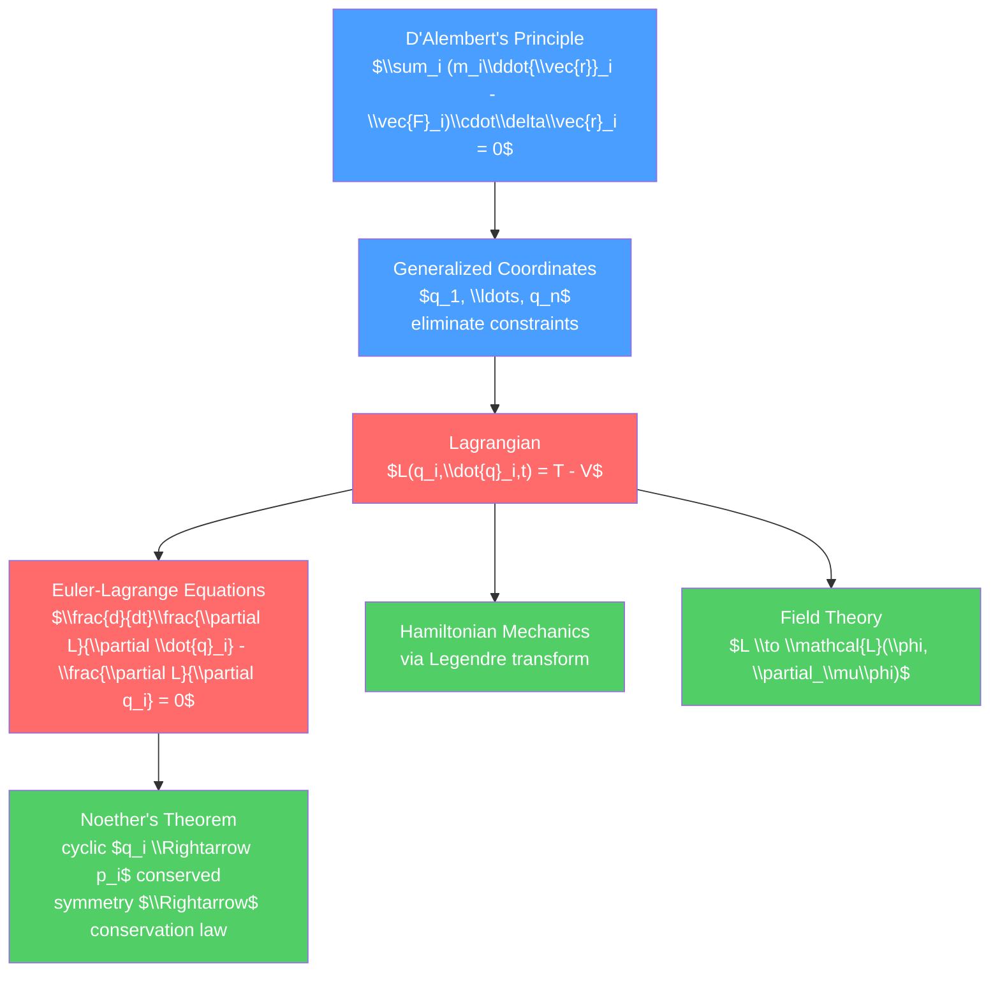

# 📐 Lagrangian Mechanics

> [!abstract] TL;DR
> Lagrangian mechanics reformulates Newton's laws using the variational principle: nature chooses the path that makes the action $S = \int L\, dt$ stationary. The Lagrangian $L = T - V$ (kinetic minus potential energy) and the Euler-Lagrange equations replace the vector force analysis with scalar algebra in any coordinate system. This power comes at no cost — Lagrangian mechanics is completely equivalent to Newton's laws for conservative systems, but dramatically simpler for constrained systems, and it directly generalizes to quantum mechanics, field theory, and general relativity.

## Intuition — analogy FIRST

Think of light choosing a path between two points. Among all the curves light could travel, it always takes the path that minimizes travel time (Fermat's principle). Lagrangian mechanics says nature applies a similar principle to mechanical systems: among all possible trajectories between two configurations, the real trajectory makes the action stationary.

A practical comparison: to analyze a double pendulum using Newton's laws, you must draw free-body diagrams for each rod, find tension forces, resolve components — a messy vector algebra problem with constraint forces. Using the Lagrangian approach, you simply write $L = T - V$ in terms of two angles, apply the Euler-Lagrange equations, and the equations of motion emerge automatically. The constraint forces never appear because they are absorbed into the generalized coordinates.

---

## How It Works



---

## Key Concepts / Details

### Secondary Level (Motivation)

Newton's laws work brilliantly for simple problems: a particle, two blocks connected by a string, a projectile. The difficulty arises with constraints — a bead restricted to slide along a wire, a pendulum bob that must stay at fixed length from the pivot, a marble rolling inside a bowl. In Newton's approach, constraint forces (tension, normal force) appear explicitly and must be found. Often we don't care what those forces are — we only want to know how the system moves.

Lagrangian mechanics eliminates this difficulty by choosing coordinates that automatically satisfy the constraints, so constraint forces never appear in the equations of motion.

### Undergraduate Level

**D'Alembert's Principle**

Starting point: for a system of particles in equilibrium under applied forces and constraint forces, the virtual work of constraint forces vanishes: $\sum_i \vec{F}^{(c)}_i \cdot \delta\vec{r}_i = 0$.

For dynamics, D'Alembert extended this:
$$\sum_i \left(\vec{F}_i - m_i\ddot{\vec{r}}_i\right) \cdot \delta\vec{r}_i = 0$$

**Generalized Coordinates**

For a system with $N$ particles subject to $k$ holonomic constraints, there are $n = 3N - k$ independent degrees of freedom. Choose $n$ generalized coordinates $q_1, \ldots, q_n$ to parameterize the configuration space. The Cartesian coordinates are functions: $\vec{r}_i = \vec{r}_i(q_1, \ldots, q_n, t)$.

*Holonomic constraint*: $f(\vec{r}_1, \ldots, \vec{r}_N, t) = 0$ (can be eliminated).
*Non-holonomic constraint*: velocity-dependent, e.g. rolling without slipping $v = R\omega$ — requires more care (Lagrange multipliers).

**The Euler-Lagrange Equations**

Define the Lagrangian:
$$L(q_i, \dot{q}_i, t) = T(q_i, \dot{q}_i, t) - V(q_i, t)$$

The principle of stationary action $\delta S = \delta\int_{t_1}^{t_2} L\, dt = 0$ gives the Euler-Lagrange equations:

$$\frac{d}{dt}\frac{\partial L}{\partial \dot{q}_i} - \frac{\partial L}{\partial q_i} = 0 \qquad (i = 1, \ldots, n)$$

The *generalized momentum* conjugate to $q_i$: $p_i \equiv \partial L/\partial \dot{q}_i$.

**Cyclic Coordinates and Conservation**

If $q_i$ does not appear in $L$ (only $\dot{q}_i$ does), then:
$$\frac{\partial L}{\partial q_i} = 0 \implies \frac{d}{dt}p_i = 0 \implies p_i = \text{const}$$

A cyclic coordinate immediately gives a conserved momentum. Example: if $L$ has no explicit $\phi$ dependence (azimuthal symmetry), then $p_\phi = \partial L/\partial\dot\phi$ (angular momentum about $z$-axis) is conserved.

**Worked Example: Double Pendulum**

Two masses $m_1, m_2$ on rods $l_1, l_2$. Generalized coordinates: angles $\theta_1, \theta_2$ from vertical.

$$T = \tfrac{1}{2}(m_1 + m_2)l_1^2\dot\theta_1^2 + \tfrac{1}{2}m_2 l_2^2\dot\theta_2^2 + m_2 l_1 l_2 \dot\theta_1\dot\theta_2\cos(\theta_1-\theta_2)$$
$$V = -(m_1+m_2)gl_1\cos\theta_1 - m_2 g l_2\cos\theta_2$$

Applying Euler-Lagrange gives coupled nonlinear ODEs. No constraint forces appear. This system is chaotic for large angles — a canonical example in nonlinear dynamics.

**Worked Example: Bead on a Rotating Wire**

A bead on a frictionless wire rotating at constant $\omega$ about the vertical. Single degree of freedom: $r$ (distance from pivot).

$$L = \tfrac{1}{2}m(\dot r^2 + r^2\omega^2) - mgr\sin\alpha$$

Euler-Lagrange: $m\ddot{r} = mr\omega^2 - mg\sin\alpha$. The $mr\omega^2$ term is the effective centrifugal force — it appears automatically.

### Graduate Level

**Noether's Theorem — Formal Derivation**

Consider a one-parameter family of transformations $q_i \to q_i + \epsilon\delta q_i(q, t)$ under which $L$ is invariant (up to a total derivative):

$$\delta L = \sum_i\left(\frac{\partial L}{\partial q_i}\delta q_i + \frac{\partial L}{\partial \dot{q}_i}\delta\dot{q}_i\right) = \frac{d}{dt}F(q, t)$$

Using the Euler-Lagrange equations, this implies the Noether charge is conserved:

$$Q = \sum_i \frac{\partial L}{\partial \dot{q}_i}\delta q_i - F = \text{const}$$

For time translation ($t \to t + \epsilon$, $\delta q_i = \dot{q}_i\epsilon$):

$$Q = \sum_i \frac{\partial L}{\partial \dot{q}_i}\dot{q}_i - L = H \text{ (the Hamiltonian = energy)}$$

This is why energy is conserved when $L$ has no explicit time dependence.

**Constraints via Lagrange Multipliers**

For non-holonomic constraints $\sum_j a_{kj}(q)\dot{q}_j = 0$, modify the Euler-Lagrange equations:

$$\frac{d}{dt}\frac{\partial L}{\partial \dot{q}_i} - \frac{\partial L}{\partial q_i} = \sum_k \lambda_k a_{ki}$$

The $\lambda_k$ are Lagrange multipliers and can be related to the constraint forces.

**Field Theory Lagrangians — Preview**

The continuum limit of the Lagrangian for $N$ particles on a string leads to a *Lagrangian density* $\mathcal{L}$:

$$S = \int \mathcal{L}(\phi, \partial_\mu\phi)\, d^4x$$

The Euler-Lagrange equations become:

$$\partial_\mu\frac{\partial\mathcal{L}}{\partial(\partial_\mu\phi)} - \frac{\partial\mathcal{L}}{\partial\phi} = 0$$

For a scalar field: $\mathcal{L} = \tfrac{1}{2}(\partial_\mu\phi)^2 - \tfrac{1}{2}m^2\phi^2$ gives the Klein-Gordon equation $(\square + m^2)\phi = 0$. The Standard Model of particle physics is defined by specifying its Lagrangian density.

```python
import numpy as np
from scipy.integrate import odeint
import matplotlib.pyplot as plt

# Double pendulum simulation via Lagrangian equations of motion
def double_pendulum(state, t, m1, m2, l1, l2, g):
    th1, w1, th2, w2 = state
    delta = th2 - th1
    denom1 = (m1 + m2) * l1 - m2 * l1 * np.cos(delta)**2
    denom2 = (l2 / l1) * denom1

    dw1 = (m2 * l1 * w1**2 * np.sin(delta) * np.cos(delta)
           + m2 * g * np.sin(th2) * np.cos(delta)
           + m2 * l2 * w2**2 * np.sin(delta)
           - (m1 + m2) * g * np.sin(th1)) / denom1

    dw2 = (- m2 * l2 * w2**2 * np.sin(delta) * np.cos(delta)
           + (m1 + m2) * g * np.sin(th1) * np.cos(delta)
           - (m1 + m2) * l1 * w1**2 * np.sin(delta)
           - (m1 + m2) * g * np.sin(th2)) / denom2

    return [w1, dw1, w2, dw2]

params = (1.0, 1.0, 1.0, 1.0, 9.81)  # m1, m2, l1, l2, g
t = np.linspace(0, 30, 3000)

# Two nearly identical initial conditions — demonstrates chaos
state1 = [np.pi/2, 0, np.pi/2, 0]
state2 = [np.pi/2 + 1e-5, 0, np.pi/2, 0]

sol1 = odeint(double_pendulum, state1, t, args=params)
sol2 = odeint(double_pendulum, state2, t, args=params)

plt.figure(figsize=(8, 4))
plt.plot(t, sol1[:, 0], label='Initial condition 1')
plt.plot(t, sol2[:, 0], '--', label='IC + 1e-5 perturbation')
plt.xlabel('Time (s)')
plt.ylabel(r'$\theta_1$ (rad)')
plt.title('Double Pendulum: Sensitivity to Initial Conditions (Chaos)')
plt.legend()
plt.tight_layout()
```

---

## Real-World Notes

- **Robotics**: robot arm kinematics and dynamics are routinely solved via the Lagrangian formalism — generalized coordinates map naturally to joint angles.
- **Molecular dynamics**: the Lagrangian for a collection of atoms with pairwise potentials is simulated computationally in drug discovery and materials science.
- **General Relativity**: Einstein's field equations derive from the Einstein-Hilbert action $S = \int R\sqrt{-g}\, d^4x$ — the Lagrangian of spacetime geometry itself.
- **Standard Model**: all fundamental interactions (electromagnetic, weak, strong) are described by a single Lagrangian density. Noether's theorem in this context gives charge conservation, baryon number conservation, etc.
- **Control theory**: the Euler-Lagrange equations and Hamiltonian formulation are used in optimal control (Pontryagin's maximum principle is the Hamiltonian approach to optimization).

---

## Common Pitfalls

1. **$L = T - V$ only for conservative systems**: for dissipative forces (friction), use Rayleigh dissipation function. For velocity-dependent potentials (e.g. charged particle in EM field: $V = q\phi - q\vec{v}\cdot\vec{A}$), $L = T - V$ still works with this generalized potential.
2. **Generalized force confusion**: if a force is not derivable from a potential, it appears as a generalized force $Q_i = \sum_j \vec{F}_j \cdot \partial\vec{r}_j/\partial q_i$ on the right side of the Euler-Lagrange equation.
3. **Holonomic constraint verification**: non-holonomic constraints (rolling, sliding) cannot be incorporated by simply reducing the number of generalized coordinates.
4. **Time-dependent constraints**: when constraints depend on time, the configuration space itself changes, and kinetic energy can depend explicitly on $t$.
5. **Conjugate momentum $\neq$ linear momentum**: $p_i = \partial L/\partial\dot{q}_i$ is the momentum conjugate to $q_i$; for angular coordinates, this is angular momentum, not linear momentum.

---

## Related Concepts

- [[_MOC_Classical_Mechanics|↑ Section MOC]]
- [[Newtons_Laws_and_Kinematics]] — what Lagrangian mechanics replaces/generalizes
- [[Hamiltonian_Mechanics]] — the Legendre transform of the Lagrangian approach
- [[Work_Energy_and_Conservation]] — Noether's theorem and conservation laws
- [[Rotational_Dynamics]] — Euler angles and spinning tops are natural Lagrangian problems
- [[Oscillations_and_SHM]] — normal mode analysis via Lagrangian

---

## Review Questions

1. **Secondary/Motivation**: A bead slides frictionlessly along a wire shaped as $y = x^2$. Why is setting up equations of motion easier with the Lagrangian approach (using $x$ as the single coordinate) than with Newton's laws (which requires finding the normal force from the wire)?
2. **Undergraduate**: Derive the equations of motion for a simple pendulum using the Lagrangian method. Identify the cyclic coordinate, if any. What is the conserved quantity corresponding to azimuthal symmetry for a spherical pendulum?
3. **Graduate**: Prove Noether's theorem for a Lagrangian system. Apply it to spatial translation invariance to show that linear momentum is conserved. Then show how Noether's theorem gives charge conservation in electrodynamics from the $U(1)$ phase invariance of the complex scalar field Lagrangian.

---

## Sources

- Goldstein, Poole & Safko — *Classical Mechanics*, 3rd ed., Ch. 1–2 (Lagrangian formalism)
- Landau & Lifshitz — *Mechanics*, §1–10 (elegant, minimal)
- Morin — *Introduction to Classical Mechanics*, Ch. 6
- Hand & Finch — *Analytical Mechanics*, Ch. 1–4

#physics #classical-mechanics #Lagrangian #EulerLagrange #NoethersTheorem #variational #generalized-coordinates #undergraduate #graduate
