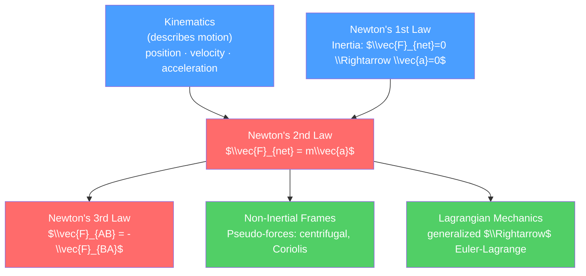

# 🍎 Newton's Laws and Kinematics

> [!abstract] TL;DR
> Newton's three laws describe how and why objects move: inertia resists change, net force causes acceleration ($\vec{F} = m\vec{a}$), and forces come in equal-and-opposite pairs. Kinematics gives the mathematical toolkit — position, velocity, acceleration — without asking why. Together they explain everything from a ball thrown into the air to the orbit of the Moon, with corrections needed only when speeds approach $c$ or scales shrink to atomic size.

## Intuition — analogy FIRST

Imagine pushing a shopping cart. An empty cart is easy to start and stop — it resists change only a little. A full cart is hard to get moving and hard to stop — it has more inertia. Once rolling on a smooth floor, the cart keeps going with no push needed: that is Newton's first law in action. When you push harder, it accelerates more: that is the second law. And the cart pushes back on your hands with exactly the force you exert on it: that is the third law.

Now throw a ball horizontally. Gravity pulls it down at the same rate it would fall if you simply dropped it — the horizontal and vertical motions are completely independent. This superposition is the heart of kinematics: motions in perpendicular directions do not interfere with each other.

---

## How It Works



---

## Key Concepts / Details

### Secondary Level

**Newton's Three Laws**

| Law | Statement | Math | Example |
|-----|-----------|------|---------|
| 1st (Inertia) | An object at rest stays at rest; an object in motion stays in motion unless acted on by a net external force | $\vec{F}_{net} = 0 \Rightarrow \vec{a} = 0$ | Hockey puck slides forever on frictionless ice |
| 2nd (F = ma) | Net force equals mass times acceleration | $\vec{F}_{net} = m\vec{a}$ | Harder push = larger acceleration |
| 3rd (Action-Reaction) | For every action there is an equal and opposite reaction | $\vec{F}_{12} = -\vec{F}_{21}$ | Rocket exhaust pushes down; rocket goes up |

**Kinematic Equations** (constant acceleration, 1D):

$$v = v_0 + at$$
$$x = x_0 + v_0 t + \tfrac{1}{2}at^2$$
$$v^2 = v_0^2 + 2a(x - x_0)$$

**Projectile Motion**: horizontal and vertical components are independent.
- Horizontal: $x = v_{0x}\, t$ (no acceleration, ignoring air resistance)
- Vertical: $y = v_{0y}\, t - \tfrac{1}{2}g t^2$

Range formula: $R = \dfrac{v_0^2 \sin 2\theta}{g}$, maximized at $\theta = 45°$.

**Circular Motion**: for an object moving in a circle at constant speed, the centripetal acceleration points inward:

$$a_c = \frac{v^2}{r} = \omega^2 r, \qquad F_c = \frac{mv^2}{r}$$

### Undergraduate Level

**Inertial Frames and Galilean Relativity**

An *inertial frame* is one where Newton's first law holds: a free particle moves in a straight line at constant velocity. All inertial frames are related by Galilean transformations:

$$\vec{r}' = \vec{r} - \vec{V}t, \qquad t' = t$$

The laws of mechanics are invariant (unchanged) under these transformations — the principle of Galilean relativity. Note this breaks down at speeds $v \sim c$ where Lorentz transformations replace Galilean ones.

**Non-Inertial Frames: Pseudo-Forces**

In a rotating frame with angular velocity $\vec{\omega}$, applying Newton's second law requires introducing fictitious forces:

$$m\vec{a}_{rot} = \vec{F}_{real} - m\vec{\omega} \times (\vec{\omega} \times \vec{r}) - 2m\vec{\omega} \times \vec{v}_{rot} - m\dot{\vec{\omega}} \times \vec{r}$$

The three pseudo-force terms are:
1. **Centrifugal force**: $-m\vec{\omega} \times (\vec{\omega} \times \vec{r})$, points outward from rotation axis
2. **Coriolis force**: $-2m\vec{\omega} \times \vec{v}_{rot}$, deflects moving objects (causes cyclones on Earth)
3. **Euler force**: $-m\dot{\vec{\omega}} \times \vec{r}$, appears when rotation rate changes

**Constraint Forces**

Real problems often involve constraints (bead on a wire, mass on a surface). Constraint forces (normal force, tension) do no work along the constrained path but complicate Newtonian analysis. This motivates the Lagrangian approach where constraints are absorbed into generalized coordinates — see [[Lagrangian_Mechanics]].

**Coupled ODEs in 2D**

$$m\ddot{x} = F_x(x, y, \dot{x}, \dot{y}, t)$$
$$m\ddot{y} = F_y(x, y, \dot{x}, \dot{y}, t)$$

For a charged particle in a magnetic field $\vec{B} = B\hat{z}$:

$$m\ddot{x} = qB\dot{y}, \qquad m\ddot{y} = -qB\dot{x}$$

Solution: circular motion (cyclotron) with frequency $\omega_c = qB/m$.

### Graduate Level

**Limitations of Newtonian Mechanics**

Newtonian mechanics fails in three regimes:
1. **High speeds** ($v \to c$): must use Special Relativity — see [[_MOC_Relativity]]
2. **Atomic/subatomic scales**: must use Quantum Mechanics — see [[_MOC_Quantum_Mechanics]]
3. **Strong gravitational fields**: must use General Relativity

**Connection to Lagrangian Formulation**

Newton's second law in generalized coordinates is not simply $F_i = m\ddot{q}_i$ — the metric of the configuration manifold contributes. D'Alembert's principle and the Euler-Lagrange equations provide a coordinate-free formulation valid in any generalized coordinate system. See [[Lagrangian_Mechanics]] for the full derivation.

**Continuum Mechanics Preview**

For extended bodies, Newton's laws become partial differential equations. For a fluid element:

$$\rho \frac{D\vec{v}}{Dt} = -\nabla P + \eta \nabla^2 \vec{v} + \vec{f}_{body}$$

This is the Navier-Stokes equation — the continuum limit of $F = ma$ for a fluid. The left side is mass × acceleration per unit volume (the material derivative), and the right side includes pressure gradient, viscous stress, and body forces.

```python
import numpy as np
import matplotlib.pyplot as plt

# Projectile motion simulation
g = 9.81  # m/s^2
v0 = 20.0  # initial speed m/s
angles = np.linspace(10, 80, 8)  # launch angles

fig, ax = plt.subplots(figsize=(8, 5))
for theta_deg in angles:
    theta = np.radians(theta_deg)
    t_flight = 2 * v0 * np.sin(theta) / g
    t = np.linspace(0, t_flight, 200)
    x = v0 * np.cos(theta) * t
    y = v0 * np.sin(theta) * t - 0.5 * g * t**2
    ax.plot(x, y, label=f'{theta_deg:.0f}°')

ax.set_xlabel('Range (m)')
ax.set_ylabel('Height (m)')
ax.set_title('Projectile Trajectories at Various Launch Angles')
ax.legend(ncol=2, fontsize=8)
ax.set_ylim(bottom=0)
plt.tight_layout()
plt.savefig('projectile_motion.png', dpi=150)
```

---

## Real-World Notes

- **GPS satellites**: corrections for both special relativity (speed) and general relativity (gravity) are essential — pure Newtonian mechanics would accumulate errors of ~10 km/day in GPS positioning.
- **Space mission design**: planetary slingshot maneuvers (gravity assists) use conservation of momentum and energy in the two-body problem, directly from Newton's laws.
- **Engineering vibrations**: machinery designers use Newton's second law for every rotating component — gyroscopic effects from [[Rotational_Dynamics]] matter for flywheels and turbines.
- **Meteorology**: Coriolis force (from non-inertial Earth frame) causes weather systems to rotate counterclockwise in the Northern Hemisphere, clockwise in the Southern.
- **Sports physics**: the curved trajectory of a spinning ball (Magnus effect) is Newtonian mechanics + fluid dynamics.

---

## Common Pitfalls

1. **Confusing mass and weight**: mass ($m$, kg) is intrinsic; weight ($W = mg$, N) depends on gravitational field strength $g$.
2. **Third law misconception**: the action-reaction pair always acts on *different* objects. A book on a table: Earth pulls book down (gravity), book pulls Earth up. Normal force from table on book is NOT the reaction to gravity — it is the reaction to the book pushing down on the table.
3. **Non-inertial frame errors**: applying $F = ma$ in a rotating frame without adding pseudo-forces gives wrong answers (e.g., Foucault pendulum, weather systems).
4. **Projectile air resistance neglect**: the range formula $R = v_0^2 \sin 2\theta / g$ assumes vacuum; at high speeds air resistance dramatically shortens range and shifts optimal angle below $45°$.
5. **Centripetal vs centrifugal**: centripetal force is the real inward force (tension, gravity, normal force) in an inertial frame. Centrifugal is a pseudo-force that appears only in the rotating frame.

---

## Related Concepts

- [[_MOC_Classical_Mechanics|↑ Section MOC]]
- [[Work_Energy_and_Conservation]] — energy perspective on the same physics
- [[Rotational_Dynamics]] — angular generalization of Newton's laws
- [[Lagrangian_Mechanics]] — elegant reformulation eliminating constraint forces
- [[Oscillations_and_SHM]] — Newton's second law applied to restoring forces
- [[_MOC_Relativity]] — what replaces Newton's laws at high speeds

---

## Review Questions

1. **Secondary**: A ball is kicked horizontally at 15 m/s from a cliff 45 m high. How far from the base of the cliff does it land? (Use $g = 10$ m/s².)
2. **Undergraduate**: Derive the equations of motion for a particle on a frictionless inclined plane using both the Newtonian (free-body diagram) and D'Alembert approaches. Show they give the same result.
3. **Graduate**: In a frame rotating with angular velocity $\vec{\omega}$, a particle is launched with velocity $\vec{v}_0$ in the equatorial plane. Write out all pseudo-force terms. Under what conditions does the Coriolis term dominate, and what is the order-of-magnitude deflection for a projectile launched at $v_0 = 100$ m/s on Earth's surface?

---

## Sources

- Goldstein, Poole & Safko — *Classical Mechanics*, 3rd ed., Ch. 1
- Morin — *Introduction to Classical Mechanics with Problems and Solutions*, Ch. 1–3
- Kleppner & Kolenkow — *An Introduction to Mechanics*, 2nd ed.
- Landau & Lifshitz — *Mechanics*, 3rd ed., §1–5

#physics #classical-mechanics #kinematics #NewtonsLaws #secondary #undergraduate #graduate
