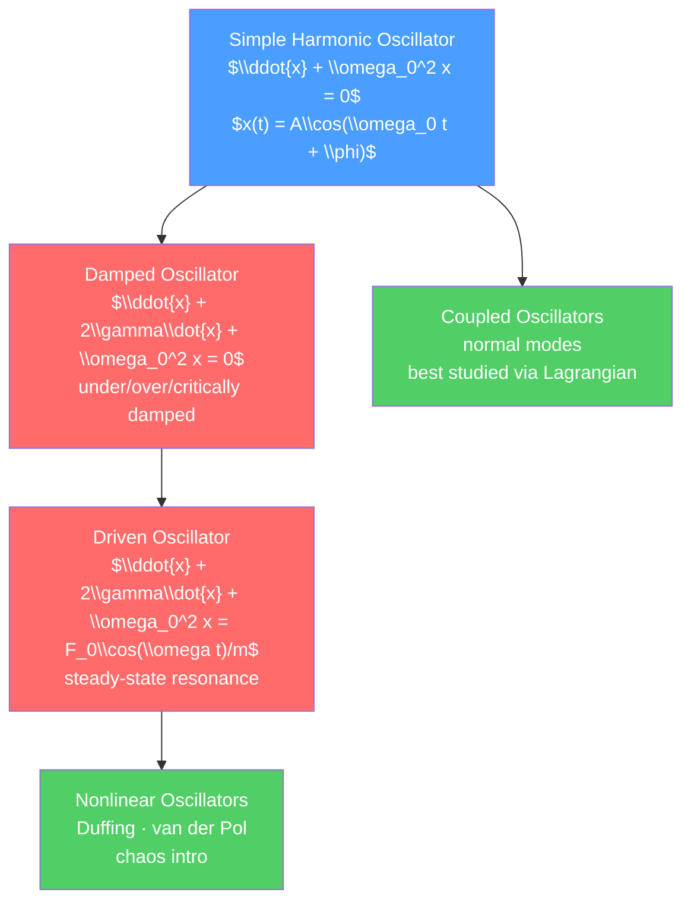

# 〰️ Oscillations and Simple Harmonic Motion

> [!abstract] TL;DR
> Simple harmonic motion — the oscillation of a mass on a spring, a pendulum, or any system near a stable equilibrium — is the most important oscillation in physics. Its equation ($\ddot{x} + \omega_0^2 x = 0$) and solutions ($x = A\cos(\omega_0 t + \phi)$) appear everywhere from molecular vibrations to electromagnetic fields. Adding damping and driving forces reveals resonance, the Q factor, and — at the graduate level — Green's function methods, coupled normal modes, and the transition to nonlinear dynamics and chaos.

## Intuition — analogy FIRST

Push a child on a swing and let go. The swing oscillates back and forth with a regular period that depends only on the length of the rope, not on how hard you pushed. Push it repeatedly at exactly the right rhythm — the natural frequency — and the amplitude builds up dramatically: this is resonance. Push at the wrong frequency and the swing barely responds.

This is the essence of driven oscillation and resonance. The Tacoma Narrows Bridge collapse (1940) and the Millennium Bridge wobble (2000) are spectacular engineering lessons about resonance: when an external forcing frequency matches the structure's natural frequency, amplitude can grow catastrophically without bound (in an undamped system).

---

## How It Works



---

## Key Concepts / Details

### Secondary Level

**Simple Harmonic Oscillator**

A mass on a spring with constant $k$: restoring force $F = -kx$.

Newton's second law: $m\ddot{x} = -kx \implies \ddot{x} + \omega_0^2 x = 0$ where $\omega_0 = \sqrt{k/m}$.

Solution: $x(t) = A\cos(\omega_0 t + \phi)$

- $A$ = amplitude, $\phi$ = initial phase (set by initial conditions)
- Period: $T = 2\pi/\omega_0 = 2\pi\sqrt{m/k}$
- Frequency: $f = 1/T = \omega_0/(2\pi)$

Energy oscillates between kinetic and potential:
$$E = \tfrac{1}{2}kA^2 = \tfrac{1}{2}m\omega_0^2 A^2 = \text{const}$$

**Simple Pendulum** (small angle, $\theta \ll 1$ rad):

$$\ddot{\theta} + \frac{g}{L}\theta = 0 \implies T = 2\pi\sqrt{\frac{L}{g}}$$

The period is independent of mass and amplitude (for small angles). For a 1 m pendulum: $T \approx 2.0$ s.

### Undergraduate Level

**Phase Space Portrait**

Plot $(x, \dot{x})$. For an undamped SHM, trajectories are ellipses. Phase space provides a global geometric picture of dynamics.

**Damped Oscillator**

Add damping force $F_{damp} = -b\dot{x}$:

$$m\ddot{x} + b\dot{x} + kx = 0 \implies \ddot{x} + 2\gamma\dot{x} + \omega_0^2 x = 0$$

where $\gamma = b/(2m)$ is the damping coefficient. The characteristic equation $r^2 + 2\gamma r + \omega_0^2 = 0$ gives $r = -\gamma \pm \sqrt{\gamma^2 - \omega_0^2}$.

| Regime | Condition | Solution | Behavior |
|--------|-----------|----------|----------|
| Underdamped | $\gamma < \omega_0$ | $x = Ae^{-\gamma t}\cos(\omega_d t + \phi)$ | Decaying oscillation, $\omega_d = \sqrt{\omega_0^2 - \gamma^2}$ |
| Critically damped | $\gamma = \omega_0$ | $x = (A + Bt)e^{-\omega_0 t}$ | Fastest return to equilibrium without oscillating |
| Overdamped | $\gamma > \omega_0$ | $x = Ae^{r_+ t} + Be^{r_- t}$, both $r < 0$ | Slow exponential decay |

**Driven (Forced) Oscillator and Resonance**

Drive with $F(t) = F_0\cos\omega t$:

$$m\ddot{x} + b\dot{x} + kx = F_0\cos\omega t$$

Steady-state solution: $x_{ss}(t) = \frac{F_0/m}{\sqrt{(\omega_0^2 - \omega^2)^2 + 4\gamma^2\omega^2}}\cos(\omega t - \delta)$

Amplitude resonance at $\omega_{res} = \sqrt{\omega_0^2 - 2\gamma^2}$ (slightly below $\omega_0$).

**Quality Factor (Q factor)**:

$$Q = \frac{\omega_0}{2\gamma} = \frac{\omega_0}{b/m}$$

Physically: $Q = 2\pi \times \frac{\text{energy stored}}{\text{energy lost per cycle}}$. High $Q$ = sharp resonance, slow energy decay. Examples:
- Quartz crystal oscillator: $Q \sim 10^5$–$10^6$
- Guitar string: $Q \sim 10^2$–$10^3$
- Shock absorbers (critical damping target): $Q \approx 0.5$

### Graduate Level

**Green's Function Approach**

For a driven oscillator with arbitrary force $f(t)$:

$$\ddot{x} + 2\gamma\dot{x} + \omega_0^2 x = f(t)/m$$

The Green's function $G(t - t')$ satisfies the equation with $f(t) = m\delta(t - t')$:

$$G(t - t') = \frac{1}{\omega_d}e^{-\gamma(t-t')}\sin[\omega_d(t-t')]\,\Theta(t-t')$$

where $\Theta$ is the Heaviside step function (causality). The particular solution is then:

$$x_p(t) = \int_{-\infty}^t G(t-t')f(t')/m\, dt'$$

This is a convolution — the system "remembers" all past forces weighted by the decaying response function. The Fourier transform of $G$ gives the frequency-domain transfer function (susceptibility), central to linear response theory.

**Coupled Oscillators and Normal Modes**

Two coupled oscillators (masses $m$ with springs $k$ and coupling spring $k_c$):

$$m\ddot{x}_1 = -kx_1 + k_c(x_2 - x_1)$$
$$m\ddot{x}_2 = -kx_2 - k_c(x_2 - x_1)$$

In matrix form: $m\ddot{\vec{x}} = -\mathbf{K}\vec{x}$. Normal modes are eigenvectors of $\mathbf{K}/m$:

| Mode | Motion | Frequency |
|------|--------|-----------|
| Symmetric (in-phase) | Both masses move together | $\omega_- = \sqrt{k/m}$ |
| Antisymmetric (out-of-phase) | Masses move opposite | $\omega_+ = \sqrt{(k+2k_c)/m}$ |

Normal mode decomposition: any motion is a superposition of normal modes. For $N$ coupled oscillators there are $N$ normal modes. This concept scales to crystals (phonons) and fields.

**Nonlinear Oscillators**

When the restoring force is not linear, SHM fails:

*Duffing oscillator*: $\ddot{x} + 2\gamma\dot{x} + \omega_0^2 x + \epsilon x^3 = F_0\cos\omega t$
- For $\epsilon > 0$ (hardening spring): resonance curve tilts right
- Exhibits bistability and jump phenomena
- Period-doubling route to chaos

*Van der Pol oscillator*: $\ddot{x} - \mu(1-x^2)\dot{x} + x = 0$
- Negative damping for small $|x|$, positive for large $|x|$
- Settles to a *limit cycle* (self-sustained oscillation)
- Models electronic oscillators, heartbeat, neural oscillations

**Chaos Introduction**

For the driven nonlinear pendulum $\ddot{\theta} + \gamma\dot{\theta} + \omega_0^2\sin\theta = F_0\cos\omega t$, the transition from regular to chaotic motion occurs via period-doubling bifurcations. The Lyapunov exponent $\lambda > 0$ quantifies sensitivity to initial conditions — the hallmark of chaos.

```python
import numpy as np
import matplotlib.pyplot as plt
from scipy.integrate import odeint

# Driven damped harmonic oscillator: frequency sweep to show resonance
def oscillator(state, t, gamma, omega0, F0, omega_drive):
    x, v = state
    return [v, -2*gamma*v - omega0**2*x + F0*np.cos(omega_drive*t)]

omega0 = 2.0  # natural frequency
gamma = 0.1   # damping
F0 = 1.0      # drive amplitude
drive_freqs = np.linspace(0.5, 3.5, 60)
amplitudes = []

for omega_d in drive_freqs:
    t = np.linspace(0, 200, 20000)
    sol = odeint(oscillator, [0, 0], t, args=(gamma, omega0, F0, omega_d))
    # steady-state amplitude = max of last quarter
    amp = np.max(np.abs(sol[15000:, 0]))
    amplitudes.append(amp)

# Analytic resonance curve
omega_arr = np.linspace(0.5, 3.5, 500)
amp_analytic = (F0/omega0**2) / np.sqrt((1 - (omega_arr/omega0)**2)**2 + (2*gamma*omega_arr/omega0**2)**2)

plt.figure(figsize=(7, 4))
plt.plot(drive_freqs, amplitudes, 'o', ms=4, label='Simulation')
plt.plot(omega_arr, amp_analytic, label='Analytic', lw=2)
plt.axvline(omega0, color='r', linestyle='--', alpha=0.5, label=r'$\omega_0$')
plt.xlabel(r'Drive frequency $\omega$ (rad/s)')
plt.ylabel('Steady-state amplitude (m)')
plt.title('Resonance Curve for Driven Damped Oscillator')
plt.legend()
plt.tight_layout()
```

---

## Real-World Notes

- **Quartz clocks**: quartz crystal resonates at precisely 32,768 Hz ($= 2^{15}$ Hz) — high $Q$ gives excellent frequency stability for timekeeping.
- **MRI machines**: nuclear magnetic resonance uses resonance of nuclear spins at the Larmor frequency in an applied magnetic field.
- **Atomic clocks**: cesium atom hyperfine transition (9,192,631,770 Hz) is the SI definition of the second.
- **Suspension bridges**: Tacoma Narrows collapse (1940) — driven at a resonant mode by wind-induced vortex shedding. Led to aeroelastic analysis of bridge design.
- **Lasers**: optical resonators (Fabry-Pérot cavity) are coupled-oscillator systems that select specific longitudinal modes.

---

## Common Pitfalls

1. **Small angle approximation**: the pendulum formula $T = 2\pi\sqrt{L/g}$ requires $\theta \ll 1$ rad. At $\theta_{max} = 45°$, the error is about 4%. At 90°, the real period is about 18% longer.
2. **Amplitude at resonance is NOT infinite**: for a damped oscillator, peak amplitude is $A_{res} = F_0/(2m\gamma\omega_d)$, finite for any $\gamma > 0$. It becomes infinite only for the undamped case.
3. **Natural vs resonant frequency**: $\omega_{res} = \sqrt{\omega_0^2 - 2\gamma^2} \neq \omega_0$ for amplitude resonance. (For velocity resonance, the peak is exactly at $\omega_0$.)
4. **Normal modes require specific initial conditions**: arbitrary initial conditions excite a superposition of all normal modes. Pure normal mode motion requires coordinated initial displacements/velocities.
5. **Q factor definitions**: different fields define $Q$ slightly differently (engineers: $Q = \omega_0/(2\gamma)$; power engineers use half-power bandwidth). Check convention in context.

---

## Related Concepts

- [[_MOC_Classical_Mechanics|↑ Section MOC]]
- [[Newtons_Laws_and_Kinematics]] — SHM is Newton's second law with a linear restoring force
- [[Wave_Motion_and_Properties]] — coupled oscillator chains lead to wave equations
- [[Lagrangian_Mechanics]] — elegant framework for coupled oscillators via normal mode analysis
- [[Quantum_Statistical_Mechanics]] — quantum harmonic oscillator is the building block of quantum field theory

---

## Review Questions

1. **Secondary**: A spring of $k = 400$ N/m is attached to a 1 kg mass. What is the natural frequency and period? If the amplitude is 5 cm, what is the maximum speed?
2. **Undergraduate**: For a driven damped oscillator with $\omega_0 = 5$ rad/s, $\gamma = 0.5$ rad/s, show that the amplitude resonance occurs at $\omega_{res} = \sqrt{\omega_0^2 - 2\gamma^2}$ and compute the resonant amplitude when $F_0/m = 10$ m/s².
3. **Graduate**: Derive the Green's function for the underdamped harmonic oscillator. Use it to find the response to an impulse at $t = 0$ and to a step function force $f(t) = F_0\Theta(t)$. What does the frequency-domain Green's function tell you about the susceptibility?

---

## Sources

- Goldstein, Poole & Safko — *Classical Mechanics*, 3rd ed., Ch. 6 (normal modes)
- Morin — *Introduction to Classical Mechanics*, Ch. 4
- French — *Vibrations and Waves*, MIT Introductory Physics Series
- Strogatz — *Nonlinear Dynamics and Chaos*, 2nd ed. (nonlinear oscillators, chaos)

#physics #classical-mechanics #SHM #oscillations #resonance #damping #coupledOscillators #chaos #secondary #undergraduate #graduate
