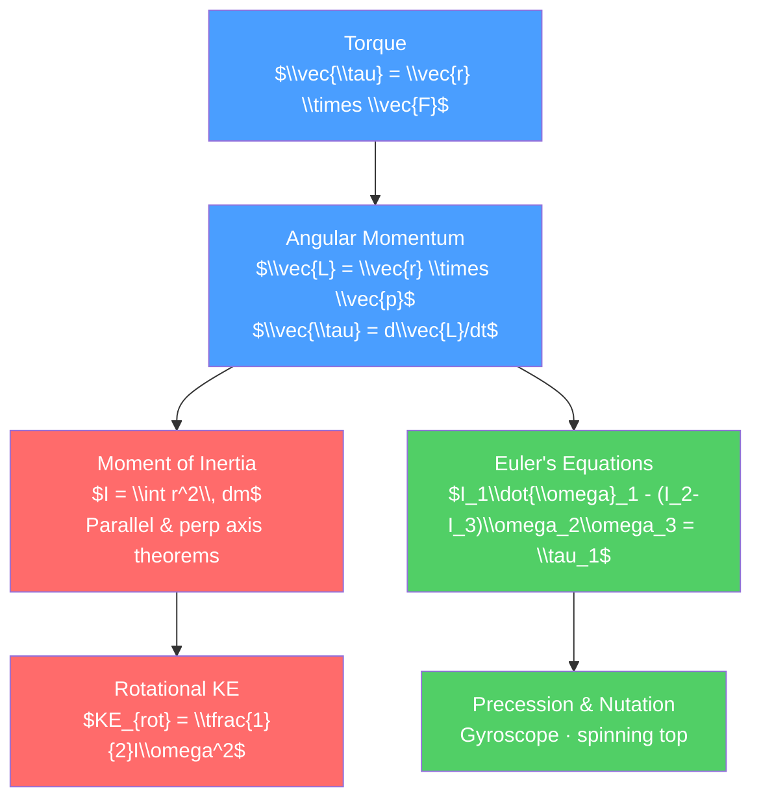

# 🌀 Rotational Dynamics

> [!abstract] TL;DR
> Rotational dynamics is the angular analog of linear mechanics: torque replaces force, moment of inertia replaces mass, and angular momentum ($\vec{L} = \vec{r} \times \vec{p}$) replaces linear momentum. Conservation of angular momentum — the spinning skater who pulls in their arms — is as fundamental as energy conservation. At the graduate level, the full richness of rigid body rotation unfolds through Euler's equations, the inertia tensor, and the spectacular dynamics of spinning tops (nutation, precession, and Euler angles).

## Intuition — analogy FIRST

Watch an ice skater spin. Arms extended, she rotates slowly. She pulls her arms in, and suddenly she spins much faster — dramatically, almost alarmingly. Nothing pushed her. No external torque acted on her. Angular momentum ($L = I\omega$) was conserved: as the moment of inertia $I$ decreased (arms closer to body), the angular velocity $\omega$ had to increase.

Now think about tightening a bolt. The same force applied farther from the bolt axis (longer wrench handle) produces a larger torque — a larger tendency to rotate. Torque is not just force; it is force times lever arm. This is why a door handle is far from the hinges, and why long wrenches give mechanical advantage.

---

## How It Works



---

## Key Concepts / Details

### Secondary Level

**Torque**

Torque is the rotational analog of force:

$$\tau = rF\sin\theta = r_\perp F$$

where $r_\perp$ is the perpendicular distance (lever arm) from the pivot. Vector form: $\vec{\tau} = \vec{r} \times \vec{F}$.

**Angular Momentum**

$$\vec{L} = \vec{r} \times \vec{p} = m(\vec{r} \times \vec{v})$$

Newton's second law for rotation: $\vec{\tau}_{net} = \dfrac{d\vec{L}}{dt}$

**Moment of Inertia**

Resistance to rotational acceleration, analogous to mass:

| Shape | Axis | $I$ |
|-------|------|-----|
| Solid disk | Through center | $\tfrac{1}{2}MR^2$ |
| Thin ring | Through center | $MR^2$ |
| Solid sphere | Through center | $\tfrac{2}{5}MR^2$ |
| Thin rod | Through center | $\tfrac{1}{12}ML^2$ |
| Thin rod | Through end | $\tfrac{1}{3}ML^2$ |

**Rotational Kinetic Energy**:
$$KE_{rot} = \tfrac{1}{2}I\omega^2$$

**Rolling Without Slipping**: total KE = translational + rotational:
$$KE_{total} = \tfrac{1}{2}Mv_{cm}^2 + \tfrac{1}{2}I\omega^2 = \tfrac{1}{2}Mv_{cm}^2\left(1 + \frac{I}{MR^2}\right)$$

A solid sphere rolls down a slope faster than a hollow sphere because its $I$ is smaller relative to $MR^2$.

### Undergraduate Level

**Parallel Axis Theorem**

$$I = I_{cm} + Md^2$$

The moment of inertia about any axis equals the CM moment of inertia plus $Md^2$, where $d$ is the distance between the axes.

**Perpendicular Axis Theorem** (flat laminas only):

$$I_z = I_x + I_y$$

**Gyroscopes and Precession**

A spinning gyroscope with angular momentum $\vec{L}$ subject to a gravitational torque $\vec{\tau} = \vec{r} \times M\vec{g}$ precesses:

$$\vec{\tau} = \frac{d\vec{L}}{dt} \implies \dot{\vec{L}} = \vec{\tau} \perp \vec{L}$$

Precession angular velocity:
$$\Omega_{prec} = \frac{\tau}{L} = \frac{Mgr}{I\omega_s}$$

The gyroscope doesn't fall because the torque continuously changes the *direction* of $\vec{L}$, not its magnitude.

**Conservation of Angular Momentum**

When $\vec{\tau}_{ext} = 0$: $\vec{L} = I\omega = $ constant.

Ice skater: $I_1\omega_1 = I_2\omega_2$. Earth's axis precesses slowly (~26,000 year cycle) due to gravitational torques from Sun and Moon.

### Graduate Level

**Inertia Tensor**

For a rigid body, angular momentum and angular velocity are related by the inertia tensor $\mathbf{I}$:

$$\vec{L} = \mathbf{I}\vec{\omega}$$

The inertia tensor components:
$$I_{ij} = \int \rho(\vec{r})\left(r^2\delta_{ij} - r_i r_j\right)d^3r$$

This is a real symmetric $3\times 3$ tensor. Its eigenvalues $I_1, I_2, I_3$ are the *principal moments of inertia*, and the eigenvectors define the *principal axes of inertia* (the body frame).

**Euler's Equations**

In the body frame (principal axes), Newton's second law for rotation becomes Euler's equations:

$$I_1\dot{\omega}_1 - (I_2 - I_3)\omega_2\omega_3 = \tau_1$$
$$I_2\dot{\omega}_2 - (I_3 - I_1)\omega_3\omega_1 = \tau_2$$
$$I_3\dot{\omega}_3 - (I_1 - I_2)\omega_1\omega_2 = \tau_3$$

For torque-free motion ($\tau_i = 0$): a symmetric top ($I_1 = I_2 \neq I_3$) undergoes *body-frame precession* (Euler wobble) at frequency:

$$\Omega_{body} = \frac{I_3 - I_1}{I_1}\omega_3$$

This explains the "Tennis Racket Theorem" (intermediate axis theorem): rotation about the intermediate principal axis is unstable.

**Euler Angles**

Three Euler angles $(\phi, \theta, \psi)$ parameterize the orientation of a rigid body:
- $\phi$: precession angle (rotation of line of nodes)
- $\theta$: nutation angle (tilt of body axis)
- $\psi$: spin angle (rotation about body axis)

The kinetic energy in Euler angles for a symmetric top:
$$T = \tfrac{1}{2}I_1\left(\dot{\phi}^2\sin^2\theta + \dot{\theta}^2\right) + \tfrac{1}{2}I_3(\dot{\psi} + \dot{\phi}\cos\theta)^2$$

**Nutation of a Spinning Top**

Under gravity, a heavy symmetric top exhibits both precession and nutation. The Lagrangian (with $I_1 = I_2$) yields three conserved quantities: energy, $p_\psi$ (spin angular momentum), and $p_\phi$ (vertical angular momentum). The nutation amplitude depends on initial conditions; for fast spin (gyroscopic limit) nutation is a small oscillation superimposed on smooth precession.

```python
import numpy as np
from scipy.integrate import odeint
import matplotlib.pyplot as plt

# Torque-free symmetric top: Euler's equations
I1, I2, I3 = 2.0, 2.0, 1.0  # principal moments (I1=I2, symmetric)

def euler_eqs(state, t):
    w1, w2, w3 = state
    dw1 = (I2 - I3) / I1 * w2 * w3
    dw2 = (I3 - I1) / I2 * w3 * w1
    dw3 = (I1 - I2) / I3 * w1 * w2
    return [dw1, dw2, dw3]

# Initial conditions: small wobble about symmetry axis
w0 = [0.1, 0.0, 5.0]  # rad/s
t = np.linspace(0, 10, 1000)
sol = odeint(euler_eqs, w0, t)

# Body frame precession frequency
Omega_body = (I3 - I1) / I1 * w0[2]
print(f"Body-frame precession frequency: {Omega_body:.3f} rad/s")
print(f"Simulated: period ~ {2*np.pi/abs(Omega_body):.3f} s")

plt.figure(figsize=(8, 4))
plt.plot(t, sol[:, 0], label=r'$\omega_1$')
plt.plot(t, sol[:, 1], label=r'$\omega_2$')
plt.plot(t, sol[:, 2], label=r'$\omega_3$')
plt.xlabel('Time (s)')
plt.ylabel('Angular velocity (rad/s)')
plt.title("Torque-free symmetric top: Euler's equations")
plt.legend()
plt.tight_layout()
```

---

## Real-World Notes

- **Satellite attitude control**: reaction wheels and gyroscopes use angular momentum conservation to orient spacecraft without expelling propellant.
- **Gyrocompasses**: a fast-spinning gyroscope aligns itself with Earth's rotation axis, pointing true North — used in submarines and ships where magnetic compasses fail.
- **Human gait and balance**: the angular momentum of swinging arms counteracts the angular momentum of the legs, making walking more efficient.
- **Earth's precession**: Earth's axis precesses with a ~25,772-year period due to the lunar and solar gravitational torques on Earth's equatorial bulge. This caused the "precession of the equinoxes" noticed by Hipparchus.
- **Flywheels for energy storage**: grid-scale flywheel energy storage systems store energy as $\tfrac{1}{2}I\omega^2$ in massive rotating disks.

---

## Common Pitfalls

1. **$\vec{L} = I\vec{\omega}$ is only valid about principal axes**: in general, $\vec{L} = \mathbf{I}\vec{\omega}$ with the full inertia tensor. $\vec{L}$ and $\vec{\omega}$ are not necessarily parallel.
2. **Torque about the right pivot**: always specify the pivot point; torque is defined with respect to a point, not a universal quantity.
3. **Rolling without slipping constraint**: $v_{cm} = R\omega$ only holds for rolling without slipping. Add friction analysis separately.
4. **Euler's equations are in the body frame**: $\omega_1, \omega_2, \omega_3$ are components in the rotating body frame, not the lab frame. Transforming back requires rotation matrices.
5. **Angular momentum vs angular velocity**: a symmetric top has $\vec{L}$ parallel to $\vec{\omega}$, but an asymmetric body does not. This confuses many students at the start.

---

## Related Concepts

- [[_MOC_Classical_Mechanics|↑ Section MOC]]
- [[Newtons_Laws_and_Kinematics]] — the linear mechanics from which rotation is generalized
- [[Work_Energy_and_Conservation]] — angular momentum conservation as Noether's theorem
- [[Lagrangian_Mechanics]] — Euler angles and the Lagrangian treatment of spinning tops
- [[Oscillations_and_SHM]] — small oscillations analysis applies to nutation

---

## Review Questions

1. **Secondary**: A figure skater has moment of inertia $I_1 = 4$ kg·m² with arms extended, spinning at $\omega_1 = 2$ rad/s. She pulls in to $I_2 = 1$ kg·m². What is her new angular velocity?
2. **Undergraduate**: A solid sphere, hollow sphere, and a ring (all of mass $M$ and radius $R$) race down an inclined plane starting from rest. Derive which one reaches the bottom first, and why (using energy conservation with rolling constraint).
3. **Graduate**: Derive Euler's equations from the torque-free equation $d\vec{L}/dt = 0$ in the lab frame, by expressing $\vec{L}$ in the body frame and accounting for the time derivative in a rotating frame. Show that rotation about the intermediate principal axis is unstable.

---

## Sources

- Goldstein, Poole & Safko — *Classical Mechanics*, 3rd ed., Ch. 4–5 (inertia tensor, Euler equations)
- Landau & Lifshitz — *Mechanics*, §32–37 (rigid body)
- Kleppner & Kolenkow — *An Introduction to Mechanics*, 2nd ed., Ch. 7
- Morin — *Introduction to Classical Mechanics*, Ch. 8–9

#physics #classical-mechanics #rotational-dynamics #angular-momentum #torque #EulerEquations #secondary #undergraduate #graduate
